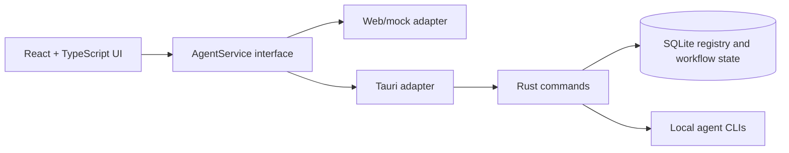

<div align="center">

[](README.md)
[](README.zh-CN.md)
<strong></strong>

</div>

# VaneHub AI

AI Coding Agent を管理し、切り替えるためのデスクトップ優先ワークスペース。

> それは最良の時代であり、最悪の時代でもある。それは AI の時代であり、bug の時代でもある。

> **特別な注意:** このプロジェクトのコードはすべて AI によって生成されます。手作業による古典的なプログラミングは禁止され、人間は方針を考える者、そして出力を検証する者に限られます。

[](package.json)
[](src-tauri/Cargo.toml)
[](package.json)
[](https://github.com/cdavid817/vanehub-ai/actions/workflows/package.yml)
[](LICENSE)

## 概要

VaneHub AI は、Claude Code、OpenCode、Codex CLI、Gemini CLI などの AI Coding Agent を調整するための、React UI を備えた Tauri デスクトップアプリケーションです。Agent のメタデータ、可用性、インタラクションモード、ワークフロー状態、セッション詳細を共通のサービス境界に置くことで、同じ UI をデスクトップランタイムとブラウザプレビューの両方で動作させます。

現在リポジトリで確認できる主な機能は次のとおりです。

- 安定 ID、Provider、起動メタデータ、 capability tag、対応インタラクションモードを持つ Agent カタログ。
- 選択または起動前のローカル CLI / native ツール可用性チェック。
- React の設定ページによるアクティブ Agent とインタラクションモードの切り替え。
- 同じ `AgentService` 契約の背後にある Browser、Native Desktop、CLI インタラクションモードのルーティング。
- Basic、Providers、SDK、MCP、Agents、Skills ページを備えた UCD 準拠の設定センター。
- フロントエンド local storage に永続化される `futuristic` / `minimal` ビジュアルスタイル切り替え。
- activity / group セッションナビゲーション、chat-first メインコンテンツ、折りたたみ可能な keep-alive 詳細パネルを備えた 3 ペインワークスペース。
- ワークスペース各ペインと各設定ページで独立した内部スクロールを行い、ナビゲーションレイアウトを安定させます。
- Windows、macOS、Linux 向けのローカルおよび GitHub Actions Tauri パッケージングスクリプト。

## アーキテクチャと技術スタック



主な技術スタック:

- Frontend: React 18、TypeScript、Vite、Tailwind CSS、lucide-react、Vitest。
- Desktop runtime: Tauri 2 と Rust。
- Local storage: `rusqlite` による SQLite。
- Browser automation: browser インタラクションワークフロー用の Playwright 設定が含まれています。
- CI packaging: `.github/workflows/package.yml` の GitHub Actions workflow。

React コンポーネントは、Tauri `invoke()` を直接呼び出すのではなく、`src/services/` のサービスインターフェースに依存する必要があります。

## 前提条件

- Node.js 22+ と npm。
- Rust stable と Cargo。
- 利用するプラットフォームに必要な Tauri システム依存関係。
- Windows デスクトップビルド: Microsoft C++ Build Tools、MSVC、Windows SDK、WebView2 Runtime。
- Linux デスクトップビルド: WebKitGTK と、パッケージング workflow で使用される関連 native packages。
- macOS デスクトップビルド: Xcode command line tools。

## インストール

```powershell
npm install
```

## クイックスタート

ブラウザプレビューを起動します。

```powershell
npm run dev -- --host 127.0.0.1
```

次を開きます。

```text
http://127.0.0.1:1420/
```

Tauri デスクトップアプリを起動します。

```powershell
$env:PATH="$env:USERPROFILE\.cargo\bin;$env:PATH"
npm run tauri -- dev
```

現在のホストプラットフォーム向けにデスクトップアプリをビルドしてパッケージ化します。

```powershell
npm run package
```

生成された Tauri bundle artifact は、`src-tauri/target/release/bundle/` またはターゲット別の `src-tauri/target/<rust-target>/release/bundle/` に出力されます。

## 設定

プロジェクト設定はリポジトリ内にあります。

- `package.json`: npm scripts、フロントエンド依存関係、package version `0.1.0`。
- `src-tauri/Cargo.toml`: Rust package メタデータと依存関係。
- `src-tauri/tauri.conf.json`: Tauri product name、app identifier、window settings、bundle settings、version `0.1.0`。
- `tailwind.config.ts` と `src/styles.css`: theme token と UI スタイル。
- `.github/workflows/package.yml`: 手動実行および tag push で実行されるデスクトップパッケージング workflow。

Tauri backend は、現在の作業ディレクトリに `.vanehub/vanehub.sqlite` を作成して runtime state を保存します。必須の環境変数はリポジトリ内で確認されませんでした。

## プロジェクト構成

```text
src/
  main-layout/          セッションサイドバー、チャットワークスペース、詳細パネルを含むメイン UI
  settings/             設定 shell とページ
  services/             AgentService 境界と runtime adapter
  theme/                Theme registry と provider
  types/                共有 TypeScript 型
src-tauri/
  src/                  Rust Tauri commands、SQLite registry、起動ルーティング
  tauri.conf.json       デスクトップアプリとパッケージング設定
openspec/
  specs/                現在の振る舞いの仕様
  changes/archive/      完了済み変更履歴とタスク証跡
.github/workflows/
  package.yml           デスクトップパッケージング workflow
ucd/
  futuristic/, minimal/ UCD 参照アセット
```

## Todolist / Roadmap

現在の環境には GitHub CLI がインストールされていないため、GitHub issue 一覧は確認できませんでした。以下のチェックリストは、コミット済みコード、OpenSpec specs、アーカイブ済みタスクリスト、リポジトリ設定に基づいています。今後の優先順位は確認が必要です。

### 実装済みのコア機能

- [x] Tauri + React + TypeScript デスクトップアプリケーションの scaffold。
- [x] SQLite ベースの Agent registry と永続化された workflow state。
- [x] Claude Code、OpenCode、Codex CLI、Gemini CLI の初期 Agent エントリ。
- [x] Agent 一覧、安定 ID lookup、capability filtering、可用性ステータス。
- [x] アクティブ Agent 選択と互換インタラクションモード検証。
- [x] Browser、Native Desktop、CLI インタラクションモードのライフサイクルルーティング。

### 設定と UI

- [x] UCD 準拠の設定センター shell。
- [x] Basic Configuration、Provider Management、SDK Dependencies、MCP Servers、Agents、Skills ページ。
- [x] `AgentService` を通した Agents ページ統合と、React から Tauri への直接呼び出しの回避。
- [x] local persistence 付きの `futuristic` / `minimal` テーマ切り替え。
- [x] activity / group セッションナビゲーション、chat-first コンテンツ領域、固定 composer、折りたたみ可能な詳細パネルを備えたメインワークスペース。
- [x] ワークスペース各ペインと設定ページコンテンツの独立した内部スクロール。

### パッケージングと検証

- [x] ホストおよびアーキテクチャ別 Tauri ビルド用のローカル package scripts。
- [x] Windows、macOS、Linux の x64 / ARM64 target を対象とする GitHub Actions packaging matrix。
- [x] registry / service 振る舞いの frontend unit tests と Rust tests。
- [x] 完了済み変更の OpenSpec validation 記録。

### 予定 / 確認が必要

- [ ] branch、test、review の方針を記載した `CONTRIBUTING.md` を追加する。
- [ ] release build を unsigned のままにするか、Windows signing と macOS notarization を追加するか決定する。
- [ ] 必要に応じて Providers、SDK、MCP、Skills ページの frontend-local demo data を実サービス境界に置き換える。
- [ ] GitHub issues またはプロジェクト計画に基づいて roadmap の優先順位を確認する。

## 開発

よく使う検証コマンド:

```powershell
npm run test
npm run build
$env:PATH="$env:USERPROFILE\.cargo\bin;$env:PATH"
cargo test --manifest-path src-tauri\Cargo.toml
cargo check --manifest-path src-tauri\Cargo.toml
```

OpenSpec がローカルにインストールされている場合:

```powershell
openspec validate --specs --strict
```

## コントリビューション

`CONTRIBUTING.md` はまだ存在しません。リポジトリの開発フロー、テストコマンド、review ルールを含めて生成するか確認が必要です。

それまでは、変更範囲を明確に保ち、該当する検証コマンドを実行し、React コンポーネントと runtime-specific backend の間にある `AgentService` 境界を維持してください。

## License

このプロジェクトは Apache License 2.0 の下でライセンスされています。全文は [LICENSE](LICENSE) を参照してください。
