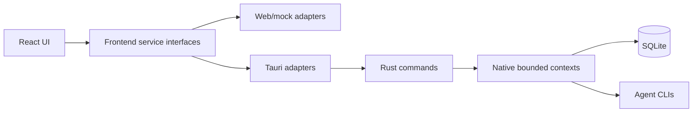

<div align="center">

[English](README.md)
· [简体中文](README.zh-CN.md)
· **日本語**

</div>

<!-- docs-section:hero -->

# VaneHub AI

単一の React インターフェースと明確な Web/mock・Tauri runtime 境界を通じて AI Coding Agent を管理する、デスクトップ優先のワークスペースです。

<!-- docs-fact:project-version value:0.1.0 -->
<!-- docs-fact:tauri-major value:2.x -->
<!-- docs-fact:react-major value:19.x -->

[](package.json)
[](src-tauri/Cargo.toml)
[](package.json)
[](https://github.com/cdavid817/vanehub-ai/actions/workflows/ci.yml)
[](LICENSE)

<!-- docs-section:overview -->

## 概要

VaneHub AI は Claude Code、OpenCode、Codex CLI、Gemini CLI を共有デスクトップワークスペースに統合します。React コンポーネントを native API に直接依存させず、CLI の可用性、セッション、ターミナル実行、プロジェクトと worktree、設定、ツール、可観測性、デスクトップ統合を管理します。

<!-- docs-section:feature-status -->

## 機能ステータス

<!-- feature:core-workspace status:delivered -->

- **提供済み:** CLI 管理、単一 Agent セッション、対話型 Agent ターミナル、セッション整理、プロジェクト/worktree と SSH ワークスペースツール、設定、MCP/SDK/Skills/Prompt Hooks/Extensions、IM Connector、scheduled task、通知、usage、統一された秘匿情報マスキング済みログ、クロスプラットフォームパッケージング。

<!-- feature:multi-agent-runtime status:preview -->

- **プレビュー:** マルチ Agent coordination には、検証済み依存グラフ、順序付き fallback、永続化、キャンセル、出力伝播を扱う native と Web/mock の service contract があります。

<!-- feature:multi-agent-ui status:planned -->

- **計画中:** 通常のセッション作成 UI では Multi Agent mode がまだ無効です。[ワークフローガイド](docs/user-guide/README.md)は、存在しない操作を提供済みとして扱いません。

<!-- feature:japanese-ui status:planned -->

- **計画中:** 日本語 runtime UI リソース。現在、日本語は README のみで、アプリケーション UI では利用できません。

<!-- docs-section:architecture -->

## アーキテクチャ



React コンポーネントは `src/services/` のサービスを呼び出します。Tauri 固有の `invoke()` は frontend Tauri adapter に限定し、SQLite、CLI process、filesystem access、desktop lifecycle は Rust に置きます。

<!-- docs-section:quick-start -->

## クイックスタート

<!-- docs-fact:node-minimum value:22+ -->

前提条件は Node.js 22+、npm、stable Rust、および各プラットフォームの [Tauri prerequisites](https://v2.tauri.app/start/prerequisites/) です。

プラットフォーム別 linker 要件、release profile の動作、worktree キャッシュの指針、ビルド計測結果については、[ネイティブビルド性能ガイド](docs/build-performance.md)を参照してください。

```powershell
npm ci
```

Web/mock preview を起動します。

```powershell
npm run dev -- --host 127.0.0.1
```

デスクトップアプリを起動します。

```powershell
$env:PATH="$env:USERPROFILE\.cargo\bin;$env:PATH"
npm run tauri -- dev
```

Web/mock は決定的なブラウザシミュレーションです。ローカル CLI 実行、SQLite 永続化、ファイル変更、OS side effect が発生したことを意味しません。

<!-- docs-section:documentation -->

## ドキュメント

- [ユーザーガイド — English / 简体中文](docs/user-guide/README.md)
- [開発者ガイドのソース](docs/developer-guide/src/index.md)
- [Native architecture inventory](src-tauri/ARCHITECTURE.md)
- [コントリビューションガイド](CONTRIBUTING.md)
- [ネイティブビルド性能ガイド](docs/build-performance.md)
- [リリース署名ガイド](docs/release-signing.md)

mdBook ガイドと Rustdoc reference をビルドします。

```powershell
npm run docs:check
npm run docs:test
npm run docs:build
```

ドキュメントビルドには `docs/toolchain.json` で固定された mdBook version が必要です。

<!-- docs-section:development -->

## 開発

```powershell
npm run lint
npm run test
npm run build
cargo test --manifest-path src-tauri/Cargo.toml
cargo check --manifest-path src-tauri/Cargo.toml
cargo clippy --manifest-path src-tauri/Cargo.toml --all-targets -- -D warnings
openspec validate --specs --strict
```

新機能とアーキテクチャ変更では、実装前に OpenSpec proposal が必要です。プロジェクトルールは [AGENTS.md](AGENTS.md) と [openspec/project.md](openspec/project.md) を参照してください。

<!-- docs-section:roadmap -->

## ロードマップ

提供済みの振る舞いと現在の contract は [OpenSpec main specifications](openspec/specs/) に記録されています。直近の方向性には、Multi-Agent coordination UI、永続的な Agent memory、custom Agent、plugin marketplace、ローカル OCR/音声機能の拡張があります。

<!-- docs-section:contributing -->

## コントリビューション

変更を始める前に [CONTRIBUTING.md](CONTRIBUTING.md) を確認してください。振る舞いを変更する場合は、ドキュメント、両 frontend runtime adapter、native contract、テスト、OpenSpec artifact を整合させます。

<!-- docs-section:license -->

## License

Apache License 2.0 でライセンスされています。詳細は [LICENSE](LICENSE) を参照してください。
