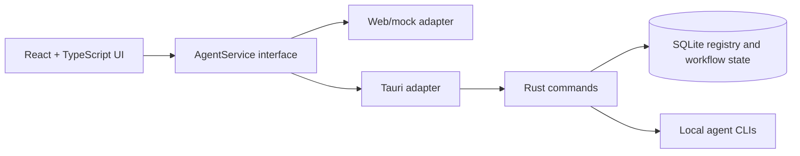

<div align="center">

[](README.md)
[](README.zh-CN.md)
<strong></strong>

</div>

# VaneHub AI

AI Coding Agent を管理し、切り替えるためのデスクトップ優先ワークスペース。

> それは最良の時代であり、最悪の時代でもある。それは AI の時代であり、bug の時代でもある。
>
> —— チャールズ・ディケンズ『二都物語』へのオマージュ

> **特別な注意:** このプロジェクトのコードはすべて AI によって生成されます。手作業による古典的なプログラミングは禁止され、人間は方針を考える者、そして出力を検証する者に限られます。

[](package.json)
[](src-tauri/Cargo.toml)
[](package.json)
[](https://github.com/cdavid817/vanehub-ai/actions/workflows/package.yml)
[](LICENSE)

## 概要

VaneHub AI は、Claude Code、OpenCode、Codex CLI、Gemini CLI などの AI Coding Agent を調整するための、React UI を備えた Tauri デスクトップアプリケーションです。Agent のメタデータ、可用性、インタラクションモード、ワークフロー状態、セッション詳細を共通のサービス境界に置くことで、同じ UI をデスクトップランタイムとブラウザプレビューの両方で動作させます。

## 実装済みの機能

- **複数 Agent の CLI 管理：**Claude Code、Codex CLI、Gemini CLI、OpenCode のインストールを検出し、バージョンと競合を表示します。npm 管理のインストールには安全なインストール、更新、削除フローを提供します。
- **Agent セッションとチャット：**セッションの作成、切り替え、ピン留め、アーカイブ、復元、削除を行い、状態を SQLite に永続化します。CLI チャット実行、ストリーミング出力、キャンセル、失敗処理は native runtime が担います。
- **開発ワークスペース：**アクティブセッションのチャット、terminal / shell、ファイル、ドキュメント、Git status と diff、ログ、レポート、構成可能なワークスペースタブを統合します。
- **ツールと統合の設定：**SDK 依存関係、Provider / モデル設定、CLI パラメーター、MCP Server（接続テストおよび import / export を含む）、スコープ付き Skills、ローカル Extensions を管理します。
- **デスクトップとコミュニケーション：**バックグラウンド対応の floating assistant、デスクトップ通知、scheduled task の入口、IM Connector の設定とルーティング、network proxy 設定を提供します。
- **運用と可観測性：**usage statistics、統一された秘匿情報マスキング済みログパイプライン、長時間操作のフィードバック、アプリ内通知を提供します。
- **一貫した UI / runtime アーキテクチャ：**React は service contract を介して Web/mock と Tauri の実装を利用します。`futuristic` と `minimal` のビジュアルスタイル、および英語・簡体字中国語の UI リソースを備えます。
- **パッケージング：**Windows、macOS、Linux 向けのローカルおよび GitHub Actions Tauri パッケージングフローを含みます。

## アーキテクチャと技術スタック



主な技術スタック:

- Frontend: React 18、TypeScript、Vite、Tailwind CSS、lucide-react、Vitest。
- Desktop runtime: Tauri 2 と Rust。
- Local storage: `rusqlite` による SQLite。
- Browser automation: browser インタラクションワークフロー用の Playwright 設定が含まれています。
- CI packaging: `.github/workflows/package.yml` の GitHub Actions workflow。

React コンポーネントは、Tauri `invoke()` を直接呼び出すのではなく、`src/services/` のサービスインターフェースに依存する必要があります。

## 前提条件

- Node.js 22+ と npm。
- Rust stable と Cargo。
- 利用するプラットフォームに必要な Tauri システム依存関係。
- Windows デスクトップビルド: Microsoft C++ Build Tools、MSVC、Windows SDK、WebView2 Runtime。
- Linux デスクトップビルド: WebKitGTK と、パッケージング workflow で使用される関連 native packages。
- macOS デスクトップビルド: Xcode command line tools。

## インストール

```powershell
npm install
```

## クイックスタート

ブラウザプレビューを起動します。

```powershell
npm run dev -- --host 127.0.0.1
```

次を開きます。

```text
http://127.0.0.1:1420/
```

Tauri デスクトップアプリを起動します。

```powershell
$env:PATH="$env:USERPROFILE\.cargo\bin;$env:PATH"
npm run tauri -- dev
```

現在のホストプラットフォーム向けにデスクトップアプリをビルドしてパッケージ化します。

```powershell
npm run package
```

生成された Tauri bundle artifact は、`src-tauri/target/release/bundle/` またはターゲット別の `src-tauri/target/<rust-target>/release/bundle/` に出力されます。

## 設定

プロジェクト設定はリポジトリ内にあります。

- `package.json`: npm scripts、フロントエンド依存関係、package version `0.1.0`。
- `src-tauri/Cargo.toml`: Rust package メタデータと依存関係。
- `src-tauri/tauri.conf.json`: Tauri product name、app identifier、window settings、bundle settings、version `0.1.0`。
- `tailwind.config.ts` と `src/styles.css`: theme token と UI スタイル。
- `.github/workflows/package.yml`: 手動実行および tag push で実行されるデスクトップパッケージング workflow。

Tauri backend は、現在の作業ディレクトリに `.vanehub/vanehub.sqlite` を作成して runtime state を保存します。必須の環境変数はリポジトリ内で確認されませんでした。

## プロジェクト構成

```text
src/
  main-layout/          セッションサイドバー、チャットワークスペース、詳細パネルを含むメイン UI
  settings/             設定 shell とページ
  services/             AgentService 境界と runtime adapter
  theme/                Theme registry と provider
  types/                共有 TypeScript 型
src-tauri/
  src/                  Rust Tauri commands、SQLite registry、起動ルーティング
  tauri.conf.json       デスクトップアプリとパッケージング設定
openspec/
  specs/                現在の振る舞いの仕様
  changes/archive/      完了済み変更履歴とタスク証跡
.github/workflows/
  package.yml           デスクトップパッケージング workflow
ucd/
  futuristic/, minimal/ UCD 参照アセット
```

## ロードマップ

### 提供済み

- [x] Tauri + React デスクトップアプリ、SQLite 永続状態、Web/mock と native adapter の service contract。
- [x] Claude Code、Codex CLI、Gemini CLI、OpenCode の CLI 環境検出とライフサイクル管理。
- [x] セッションライフサイクル管理、CLI チャット runtime、ストリーミング / キャンセル処理、複数タブの開発ワークスペース。
- [x] Agents、Providers、SDK、CLI パラメーター、MCP、Skills、Extensions、usage、proxy、IM Connector、floating assistant の設定。
- [x] 統一された秘匿情報マスキング済みログ、通知、デスクトップバックグラウンドライフサイクル、クロスプラットフォームのパッケージング workflow。

### 次のステップ

`openspec/changes/` に進行中の実装変更はありません。次は、確約済みの機能ではなくリポジトリ運用上のフォローアップです。

- [ ] branch、test、review の方針を記載した `CONTRIBUTING.md` を追加する。
- [ ] release artifact を unsigned のままにするか、Windows signing と macOS notarization を導入するか決定する。
- [ ] 日本語の製品ローカライズが必要な場合は runtime UI リソースを追加する。現時点で同梱される UI リソースは英語と簡体字中国語です。
- [ ] 次の機能 proposal を OpenSpec で公開・優先順位付けしてから実装に着手する。

## 開発

よく使う検証コマンド:

```powershell
npm run test
npm run build
$env:PATH="$env:USERPROFILE\.cargo\bin;$env:PATH"
cargo test --manifest-path src-tauri\Cargo.toml
cargo check --manifest-path src-tauri\Cargo.toml
```

OpenSpec がローカルにインストールされている場合:

```powershell
openspec validate --specs --strict
```

## コントリビューション

`CONTRIBUTING.md` はまだ存在しません。リポジトリの開発フロー、テストコマンド、review ルールを含めて生成するか確認が必要です。

それまでは、変更範囲を明確に保ち、該当する検証コマンドを実行し、React コンポーネントと runtime-specific backend の間にある `AgentService` 境界を維持してください。

## License

このプロジェクトは Apache License 2.0 の下でライセンスされています。全文は [LICENSE](LICENSE) を参照してください。
