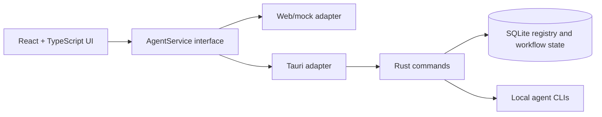

<div align="center">

[](README.md)
[](README.zh-CN.md)
<strong></strong>

</div>

# VaneHub AI

AI Coding Agent を管理し、切り替えるためのデスクトップ優先ワークスペース。

> それは最良の時代であり、最悪の時代でもある。それは AI の時代であり、bug の時代でもある。
>
> —— チャールズ・ディケンズ『二都物語』へのオマージュ

> **特別な注意:** このプロジェクトのコードはすべて AI によって生成されます。手作業による古典的なプログラミングは禁止され、人間は方針を考える者、そして出力を検証する者に限られます。

[](package.json)
[](src-tauri/Cargo.toml)
[](package.json)
[](https://github.com/cdavid817/vanehub-ai/actions/workflows/ci.yml)
[](https://github.com/cdavid817/vanehub-ai/actions/workflows/codeql.yml)
[](https://github.com/cdavid817/vanehub-ai/actions/workflows/package.yml)
[](LICENSE)

## 概要

VaneHub AI は、Claude Code、OpenCode、Codex CLI、Gemini CLI などの AI Coding Agent を調整するための、React UI を備えた Tauri デスクトップアプリケーションです。Agent のメタデータ、可用性、インタラクションモード、ワークフロー状態、セッション詳細を共通のサービス境界に置くことで、同じ UI をデスクトップランタイムとブラウザプレビューの両方で動作させます。

## 実装済みの機能

- **複数 Agent の CLI 管理：**Claude Code、Codex CLI、Gemini CLI、OpenCode を検出し、現在 / 最新バージョンと競合を表示し、ローカル環境のヘルスチェックを行い、npm 管理の CLI に安全なインストール・更新・削除を提供します。
- **Agent セッション：**セッションの作成、切り替え、ピン留め、アーカイブ、復元、削除、検索、分類を行い、JSON / Markdown へエクスポートし、クラッシュ復旧にも対応します。すべて SQLite に永続化されます。
- **CLI チャット runtime：**CLI 実行、ストリーミング出力、キャンセル、失敗処理を native runtime が担い、対話的な Agent ターミナルを備えます。
- **リッチなチャット体験：**構造化された Rich Block レンダリング、Mermaid 図、Markdown、tool-use / thinking ブロック。
- **開発ワークスペース：**セッションごとの terminal / shell、ファイル、ドキュメント、Git status と diff、ログ、レポートのタブに加え、ワークスペースアクティビティバーと「VS Code / エクスプローラー / terminal / Git Bash / IDE でフォルダーを開く」入口を提供します。
- **リモートワークスペース：**SSH 接続管理（パスワード / 鍵 / agent 認証、接続テスト、暗号化保存）と、セッションのリモート作業ディレクトリ。
- **設定センター：**SDK 依存関係、Provider / モデルと CLI パラメーター、MCP Server（接続テストと import / export を含む）、スコープ付き Skills、Prompt Hook、ローカル Extensions、GitHub プラグイン統合、usage statistics、network proxy、IM Connector、floating assistant、データ管理、About ページ。
- **デスクトップとコミュニケーション：**バックグラウンド対応の floating assistant、デスクトップ通知、起動コントロール、scheduled task（cron / interval / once）、IM Connector ルーティング。
- **運用と可観測性：**usage / token statistics、統一された秘匿情報マスキング済みログパイプライン、長時間操作のフィードバック、アプリ内通知。
- **一貫した UI / runtime アーキテクチャ：**React は Web/mock と Tauri の service contract を介して動作し、`futuristic` と `minimal` のビジュアルスタイル、英語 / 簡体字中国語の UI リソースを備えます。
- **パッケージングとサプライチェーン：**Windows、macOS、Linux 向けのローカルおよび GitHub Actions Tauri パッケージングに加え、CI、CodeQL、依存関係 / サプライチェーンのハードニング。

## アーキテクチャと技術スタック



主な技術スタック:

- Frontend: React 18、TypeScript、Vite、Tailwind CSS、lucide-react、Vitest。
- Desktop runtime: Tauri 2 と Rust。
- Local storage: `rusqlite` による SQLite。
- Browser automation: browser インタラクションワークフロー用の Playwright 設定が含まれています。
- CI packaging: `.github/workflows/package.yml` の GitHub Actions workflow。

React コンポーネントは、Tauri `invoke()` を直接呼び出すのではなく、`src/services/` のサービスインターフェースに依存する必要があります。

## 前提条件

- Node.js 22+ と npm。
- Rust stable と Cargo。
- 利用するプラットフォームに必要な Tauri システム依存関係。
- Windows デスクトップビルド: Microsoft C++ Build Tools、MSVC、Windows SDK、WebView2 Runtime。
- Linux デスクトップビルド: WebKitGTK と、パッケージング workflow で使用される関連 native packages。
- macOS デスクトップビルド: Xcode command line tools。

## インストール

```powershell
npm install
```

## クイックスタート

ブラウザプレビューを起動します。

```powershell
npm run dev -- --host 127.0.0.1
```

次を開きます。

```text
http://127.0.0.1:1420/
```

Tauri デスクトップアプリを起動します。

```powershell
$env:PATH="$env:USERPROFILE\.cargo\bin;$env:PATH"
npm run tauri -- dev
```

現在のホストプラットフォーム向けにデスクトップアプリをビルドしてパッケージ化します。

```powershell
npm run package
```

生成された Tauri bundle artifact は、`src-tauri/target/release/bundle/` またはターゲット別の `src-tauri/target/<rust-target>/release/bundle/` に出力されます。

## 設定

プロジェクト設定はリポジトリ内にあります。

- `package.json`: npm scripts、フロントエンド依存関係、package version `0.1.0`。
- `src-tauri/Cargo.toml`: Rust package メタデータと依存関係。
- `src-tauri/tauri.conf.json`: Tauri product name、app identifier、window settings、bundle settings、version `0.1.0`。
- `tailwind.config.ts` と `src/styles.css`: theme token と UI スタイル。
- `.github/workflows/package.yml`: 手動実行および tag push で実行されるデスクトップパッケージング workflow。
- `docs/release-signing.md`: リリース環境、署名、公証、チェックサム、SBOM、attestation のガイド。

Tauri backend は、現在の作業ディレクトリに `.vanehub/vanehub.sqlite` を作成して runtime state を保存します。必須の環境変数はリポジトリ内で確認されませんでした。

## プロジェクト構成

```text
src/
  main-layout/          セッションサイドバー、チャットワークスペース、詳細パネルを含むメイン UI
  settings/             設定 shell とページ
  services/             AgentService 境界と runtime adapter
  theme/                Theme registry と provider
  types/                共有 TypeScript 型
src-tauri/
  src/                  Rust Tauri commands、SQLite registry、起動ルーティング
  tauri.conf.json       デスクトップアプリとパッケージング設定
openspec/
  specs/                現在の振る舞いの仕様
  changes/archive/      完了済み変更履歴とタスク証跡
.github/workflows/
  package.yml           デスクトップパッケージング workflow
ucd/
  futuristic/, minimal/ UCD 参照アセット
```

## ロードマップ

### 提供済み

- [x] Tauri + React デスクトップアプリ、SQLite 永続状態、Web/mock + native の service contract adapter。
- [x] Claude Code、Codex CLI、Gemini CLI、OpenCode の CLI 環境検出、ヘルスチェック、ライフサイクル管理。
- [x] セッションのライフサイクル、検索、分類、エクスポート、クラッシュ復旧。ストリーミング / キャンセル対応の CLI チャット runtime と対話的な Agent ターミナル。
- [x] Rich Block + Mermaid のチャットレンダリングと、フォルダーオープナー付きの複数タブ開発ワークスペース。
- [x] SSH リモートワークスペースと接続管理。
- [x] Agents、Providers、SDK、CLI パラメーター、MCP、Skills、Prompt Hook、Extensions、GitHub プラグイン、usage、proxy、IM Connector、floating assistant の設定。
- [x] scheduled task、統一された秘匿情報マスキング済みログ、通知、デスクトップバックグラウンドライフサイクル、CI・CodeQL・サプライチェーンハードニングを含むクロスプラットフォームパッケージング。

### 計画中

- [ ] **マルチエージェントオーケストレーション** —— 複数 Agent 管理とマルチリポジトリ開発。
- [ ] **カスタム Agent** —— OnePiece（要件分解、設計、コーディング、テスト、レビュー、修正を担う Coding Multi-Agent）と Allmate（Q&A、オフィス作業、知識検索、ツール呼び出しを担う汎用アシスタント）。
- [ ] **Agent メモリ** —— セッションをまたぐ永続メモリ。
- [ ] **プラグインマーケットプレイス** —— Superpowers、OpenSpec、Oh My OpenCode などの Skill / プラグインのインストールと管理。
- [ ] **ローカル能力の拡張** —— Extension フレームワーク上に OCR、音声認識、音声合成を同梱。
- [ ] **SuperCLI**、アプリ内 **To-Do リスト**、チャットでの **@ファイル参照**とロール別セッションタグ、**loop-engineering** 自動化。
- [ ] **セキュリティと認可プロンプト**、および信頼性 / DFX テストのハードニング。
- [ ] 保護された `release` 環境で、信頼された macOS 署名 / 公証と Windows Authenticode を構成する。
- [ ] 日本語の runtime UI リソースを追加する（アプリは現在、英語と簡体字中国語の UI リソースを同梱）。

## 開発

よく使う検証コマンド:

```powershell
npm run test
npm run build
$env:PATH="$env:USERPROFILE\.cargo\bin;$env:PATH"
cargo test --manifest-path src-tauri\Cargo.toml
cargo check --manifest-path src-tauri\Cargo.toml
```

OpenSpec がローカルにインストールされている場合:

```powershell
openspec validate --specs --strict
```

## コントリビューション

ブランチ、OpenSpec、検証、レビュー、セキュリティに関する方針は [CONTRIBUTING.md](CONTRIBUTING.md) を参照してください。

## License

このプロジェクトは Apache License 2.0 の下でライセンスされています。全文は [LICENSE](LICENSE) を参照してください。
