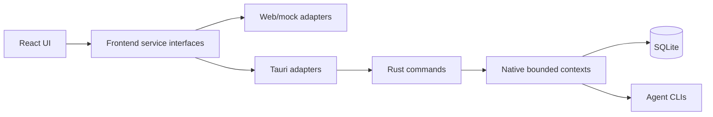

<div align="center">

[English](README.md)
· [简体中文](README.zh-CN.md)
· **日本語**

</div>

<!-- docs-section:hero -->

# VaneHub AI

<p align="center">
  
</p>

単一の React インターフェースと明確な Web/mock・Tauri runtime 境界を通じて AI Coding Agent を管理する、デスクトップ優先のワークスペースです。

<!-- docs-fact:project-version value:0.1.0-preview.1 -->
<!-- docs-fact:tauri-major value:2.x -->
<!-- docs-fact:react-major value:19.x -->

[](package.json)
[](src-tauri/Cargo.toml)
[](package.json)
[](https://github.com/cdavid817/vanehub-ai/actions/workflows/ci.yml)
[](LICENSE)

<!-- docs-section:overview -->

## 概要

VaneHub AI は Claude Code、OpenCode、Codex CLI、Gemini CLI、Antigravity CLI を共有デスクトップワークスペースに統合します。React コンポーネントを native API に直接依存させず、CLI の可用性、セッション、ターミナル実行、プロジェクトと worktree、設定、ツール、可観測性、デスクトップ統合を管理します。

### サポートする CLI

1 つ入れれば始められます。5 つすべてを揃える必要はありません。

| Agent | 提供元 | コマンド | モデルファミリ | アプリ内インストール | サードパーティモデルエンドポイント |
| --- | --- | --- | --- | --- | --- |
| Claude Code | Anthropic | `claude` | Anthropic | ✅ `@anthropic-ai/claude-code` | ✅ |
| Codex CLI | OpenAI | `codex` | OpenAI | ✅ `@openai/codex` | ✅ |
| OpenCode | OpenCode（オープンソース） | `opencode` | 不明 | ✅ `opencode-ai` | ✅ |
| Gemini CLI | Google | `gemini` | Google | ✅ `@google/gemini-cli` | ⚠️ エンドポイントは変更可だが、カタログには公式プリセットのみ |
| Antigravity CLI | Google | `agy` | Google | ❌ npm パッケージなし。公式インストーラースクリプトを使用 | ❌ Google サインインのみ |

- アプリ内インストールとは、設定 → CLI 管理から VaneHub AI がインストールとアップグレードを代行できるかどうかです。npm のみを経由するため、Homebrew・winget・scoop で入れたものは元のソースで更新してください。
- サードパーティモデルエンドポイントとは、設定 → Agent 設定から DeepSeek や OpenRouter などの互換エンドポイントに向けられるかどうかです。**各社のサブスクリプションログイン（OAuth）は必ずターミナルで行います**——VaneHub AI は仲介しません。
- OpenCode のモデルファミリが「不明」なのは記載漏れではありません：設定した任意のモデルを駆動するため固定の所属がなく、「レビュアーは別のモデルファミリから」といった方針は適用されません。
- Gemini CLI は Antigravity CLI に置き換えられつつあります。Google は 2026-06-18 より個人・無料アカウント向けに段階的な提供終了を開始しました。
- CLI を一切入れたくない場合、組み込みのネイティブ API Agent OnePiece がアプリ内で HTTP 経由でモデルを呼び出します。以下のユーザーガイドを参照してください。

### サポートするモデルプロバイダ

25 社の設定テンプレートを内蔵し、OnePiece と 3 つの CLI Agent が共有します。カタログにないものはカスタム互換エンドポイントとして追加できます。

| カテゴリ | プロバイダ |
| --- | --- |
| 公式 | Anthropic、OpenAI |
| アグリゲータ・クラウド基盤 | OpenRouter、SiliconFlow、Alibaba Bailian、Volcengine Ark、Together AI、Fireworks AI、NVIDIA NIM、ModelScope、PPIO、Qiniu AI |
| モデルベンダー | DeepSeek、Zhipu GLM、Kimi / Moonshot、xAI、Mistral AI、MiniMax、MiniMax Global、StepFun、Baichuan AI、Xiaomi MiMo、Z.AI |
| 推論アクセラレータ | Groq、Cerebras |

**どのプロバイダがどの Agent に使えるかは、提供するエンドポイントプロトコルで決まります**：Anthropic Messages に対応する 16 社は Claude Code に、OpenAI Chat Completions に対応する 24 社は Codex CLI と OpenCode に設定できます。

完全なカタログ（各社アイコン、エンドポイントプロトコル、デフォルトモデル、API キー取得先）は[組み込みモデルプロバイダカタログ](docs/model-providers.md)（簡体字中国語）にあります。

<!-- docs-section:download -->

## ダウンロード

ビルド済みのデスクトップパッケージは [Releases ページ](https://github.com/cdavid817/vanehub-ai/releases)で公開しています。Windows は `.exe` インストーラー、macOS は `.dmg`、Linux は `.deb` と AppImage です。`.msi` と `.rpm` は公開していません。

現在のビルドは署名なしのプレビューです。Windows と macOS は実行前に警告を表示します。プラットフォームごとの手順は release notes に記載しています。インストール前に、公開されている `SHA256SUMS` でダウンロードを検証してください。

<!-- docs-section:documentation -->

## ドキュメント

<!-- docs-locale-guides -->

### ユーザーガイド

| トピック | 入口 |
| --- | --- |
| クイックスタート | [CLI のインストールからワークスペース作業までの 5 ステップ](docs/user-guide/en/src/quick-start.md) |
| 基本設定 | [インターフェース言語、テーマ、フォントサイズ、デフォルト権限テンプレート、スタートアップ、ネットワークプロキシ、データディレクトリ、ログディレクトリ](docs/user-guide/en/src/user-interface.md#basic-configuration) |
| UI 概要 | [メインレイアウト、ナビゲーション、パネル切替、セッション/会話/ワークスペースタブ・情報パネル](docs/user-guide/en/src/user-interface.md) |
| セッションリスト | [グループ化/検索/フィルタ/一括操作/ドラッグ、コンテキストメニュー、フォーカスモード](docs/user-guide/en/src/user-interface.md#session-list) |
| フローティングアシスタント | [独立したフローティングウィンドウセッション、ステータスバッジ、メインアクションメニュー](docs/user-guide/en/src/user-interface.md#floating-assistant) |
| ループセンター | [Loop 実行コントロール、検証コマンド、タイムライン](docs/user-guide/en/src/loop-engineering.md) |
| プランセンター | [タスクグラフ生成、承認制約、実行と受け入れ](docs/user-guide/en/src/user-interface.md#plan-center) |
| ゴールセンター | [散らばった実行項目を一箇所で追跡](docs/user-guide/en/src/goal-management.md) |
| タスクボード | [作業項目のボードビューとステージ遷移](docs/user-guide/en/src/todo-board.md) |
| Agent 評価 | [同一タスクで複数の Agent を対戦させ、合格率・トークン・時間を比較](docs/user-guide/en/src/evaluation.md) |
| 通知センター | [ベル、未読数、すべて既読、クリア](docs/user-guide/en/src/user-interface.md#notifications) |
| システムトレイ | [メインウィンドウ表示/非表示、スタートアップ、通知連動](docs/user-guide/en/src/user-interface.md#system-tray) |
| CLI 管理・インストールと認証 | [2 種類のインストール方法、認証、インストール検出、競合診断、アップグレード](docs/user-guide/en/src/getting-started.md) |
| マルチ Agent グループチャット | [seat、`@` 引き渡し、ターン境界](docs/user-guide/en/src/multi-agent-workflow.md) |
| Git worktree | [1 つのリポジトリで並行変更を衝突なく進める](docs/user-guide/en/src/worktree.md) |
| コードレビュー | [レビューセンターとレビューフロー](docs/user-guide/en/src/code-review.md) |
| スラッシュコマンド | [セッション内コマンドエントリポイント](docs/user-guide/en/src/slash-commands.md) |
| メモリとコンテキスト | [セッション横断メモリとコンテキスト圧縮](docs/user-guide/en/src/memory-and-context.md) |
| コード索引 | [ワークスペースコード索引とそのプライバシー境界](docs/user-guide/en/src/code-indexing.md) |
| LSP コードインテリジェンス | [ライブ言語サーバーとその信頼モデル](docs/user-guide/en/src/lsp-code-intelligence.md) |
| OnePiece ネイティブ Agent | [CLI をインストールせずに使える組み込み API Agent](docs/user-guide/en/src/native-agent.md) |
| スケジュールタスク | [スケジュールタスクと使用量統計](docs/user-guide/en/src/automation.md) |
| リモートワークスペースと SSH 接続 | [SSH ワークスペース、保存済み接続、IM アクセス](docs/user-guide/en/src/remote-and-im.md) |
| CLI パラメータ | [CLI Agent 単位の起動パラメータと、CLI ごとのパラメータ早見表](docs/user-guide/en/src/tooling.md#cli-parameters) |
| 拡張機能 | [ローカル拡張のインストール/有効化/無効化](docs/user-guide/en/src/tooling.md#extension-capabilities) |
| プラグイン統合 | [組み込みプロダクト統合と readiness チェック](docs/user-guide/en/src/plugin-integration.md) |
| MCP サーバー | [MCP サーバー設定と Agent 単位のバインド](docs/user-guide/en/src/mcp.md) |
| Agent 設定 | [Agent ごとの provider、エンドポイント、モデル](docs/user-guide/en/src/tooling.md#agent-configurations) |
| エキスパートロール | [ロールフィールド、責務、レビュー方針](docs/user-guide/en/src/expert-roles.md) |
| Agent 権限ポリシー | [Agent 権限ポリシーと承認テンプレート設定](docs/user-guide/en/src/permissions.md) |
| パーソナライズ | [カスタム指示とセッション横断メモリ](docs/user-guide/en/src/personalization.md) |
| Skill 管理 | [Skill のインストールとバインド](docs/user-guide/en/src/skill-management.md) |
| Prompt Hook | [フック管理](docs/user-guide/en/src/prompt-hooks.md) |
| IM コネクタ | [IM コネクタ設定](docs/user-guide/en/src/remote-and-im.md#im-connectors) |
| 実行可観測性 | [実行トレースとログ収集方針](docs/user-guide/en/src/observability.md) |
| 使用統計 | [トークン使用量統計](docs/user-guide/en/src/automation.md) |
| バージョン情報 | [バージョン、更新チェック、changelog、リポジトリリンク](docs/user-guide/en/src/app-updates.md) |
| トラブルシューティング | [失敗時にまず確認](docs/user-guide/en/src/troubleshooting.md) |
| 問題の報告 | [どのエントリポイントを使うか、フォームに何が必要か、提出前の redaction 方法](docs/user-guide/en/src/reporting-issues.md) |

### 開発者ガイド

| トピック | 入口 |
| --- | --- |
| リポジトリ構成 | [リポジトリレイアウトとモジュール帰属](docs/developer-guide/src/repository-orientation.md) |
| ランタイム境界 | [フロントエンドサービス境界、Web/mock と Tauri アダプタ](docs/developer-guide/src/runtime-boundaries.md) |
| ボウンデッドコンテキスト | [21 の native bounded context が何を所有するか](docs/developer-guide/src/native-contexts.md) |
| Agent ライフサイクルと provider ランタイム | [登録 Agent 編集、安定 provider 解決、能力宣言](docs/developer-guide/src/agent-lifecycle.md) |
| ターミナルと PTY ランタイム | [セッション単位 Agent Terminal、自動起動/アタッチ、リモートターミナル](docs/developer-guide/src/terminal-runtime.md) |
| ツールレジストリと実行 | [固定ネイティブツールカタログ、interface_format 変換、マルチターンツールループ](docs/developer-guide/src/tool-registry.md) |
| 権限モデル | [統一決定点、明示 Deny 優先、承認ブローカ、CLI flag 投影、Claude Code フックブリッジ](docs/developer-guide/src/permission-model.md) |
| コンテキスト圧縮 | [token-aware トリガと文字数フォールバック、要約圧縮、直近ターン保持](docs/developer-guide/src/context-compaction.md) |
| 検索とベクトル検索 | [ホストレベル共有メモリプール、workspace コード索引、グレースフルデグレード](docs/developer-guide/src/retrieval.md) |
| Tree-sitter コード索引 | [文法解析、bounded chunk、シンボルメタデータ、grammar バージョン、redaction](docs/developer-guide/src/tree-sitter-code-indexing.md) |
| クロスセッションメモリ | [ホストレベル共有プール、provenance メタデータ、OnePiece ツールと CLI 自動抽出](docs/developer-guide/src/cross-session-memory.md) |
| セッション復旧 | [復旧ステータスはライフサイクルと直交、永続実行 ID と所有権](docs/developer-guide/src/session-recovery.md) |
| OnePiece ネイティブ Agent | [組み込み API Agent ID、Profile ライフサイクル、provider ディレクトリ](docs/developer-guide/src/onepiece-native-agent.md) |
| マルチ Agent グループチャット | [seat モデル、途中追加/削除、ターンルーティング、永続 presence](docs/developer-guide/src/multi-agent-group-chat.md) |
| Skill 管理 | [デュアルスコープ、SKILL.md 契約、ドリフト、組み込みシード/照合](docs/developer-guide/src/skill-management.md) |
| MCP ツールとクライアント | [トランスポートと設定モデル、ネイティブカタログの MCP ツール](docs/developer-guide/src/mcp-tools.md) |
| IM コネクタ | [5 つの組み込みコネクタ、初版ダイレクトメッセージ範囲、インバウンドルーティング](docs/developer-guide/src/im-connectors.md) |
| Loop と Plan ランタイム | [永続 Loop 定義、トポロジ認識直列サブタスクスケジューリング、Worker/Verifier 信頼](docs/developer-guide/src/loop-and-plan-runtime.md) |
| トークン使用量統計 | [報告トークンと推定文字の分離、時間範囲、Agent 単位の内訳](docs/developer-guide/src/usage-statistics.md) |
| LSP コードインテリジェンス | [セッション内 LSP 統合実装](docs/developer-guide/src/lsp-code-intelligence.md) |
| 永続化とログ | [SQLite 所有権と統一秘匿ログ](docs/developer-guide/src/persistence-and-logging.md) |
| テストとリリース | [テスト、パッケージング、リリースフロー](docs/developer-guide/src/testing-and-release.md) |
| OpenSpec ワークフロー | [提案→設計→delta spec→タスク→検証→アーカイブの変更フロー](docs/developer-guide/src/openspec-workflow.md) |
| Native API リファレンス | [Rustdoc 生成の内部契約と所有権ドキュメント](docs/developer-guide/src/native-api-reference.md) |
| アーキテクチャ決定 | [リポジトリレイアウトとモジュール指向、bounded context と呼び出し関係](docs/developer-guide/src/repository-orientation.md) |

ユーザーガイドは英語と簡体字中国語のみ提供されます。日本語、繁体字中国語、韓国語はアプリケーション UI のリソース言語としてのみ提供され、対応するユーザーガイドはありません。日本語のガイドは今後の変更で追加されるわけではなく、UI ロケールとガイドロケールの境界は仕様で固定されています。

<!-- /docs-locale-guides -->

<!-- docs-section:architecture -->

## アーキテクチャ


```mermaid
flowchart LR
  UI[React UI] --> Service[Frontend service interfaces]
  Service --> Web[Web/mock adapters]
  Service --> Tauri[Tauri adapters]
  Tauri --> Commands[Rust commands]
  Commands --> Contexts[Native bounded contexts]
  Contexts --> SQLite[(SQLite)]
  Contexts --> CLI[Agent CLIs]
```

React コンポーネントは `src/services/` のサービスを呼び出します。Tauri 固有の `invoke()` は frontend Tauri adapter に限定し、SQLite、CLI process、filesystem access、desktop lifecycle は Rust に置きます。

<!-- docs-section:quick-start -->

## ソースから実行

<!-- docs-fact:node-minimum value:22+ -->

前提条件は Node.js 22+、npm、stable Rust、および各プラットフォームの [Tauri prerequisites](https://v2.tauri.app/start/prerequisites/) です。

プラットフォーム別 linker 要件、release profile の動作、worktree キャッシュの指針、ビルド計測結果については、[ネイティブビルド性能ガイド](docs/build-performance.md)を参照してください。

```powershell
npm ci
```

Web/mock preview を起動します。

```powershell
npm run dev -- --host 127.0.0.1
```

デスクトップアプリを起動します。

```powershell
$env:PATH="$env:USERPROFILE\.cargo\bin;$env:PATH"
npm run tauri -- dev
```

Web/mock は決定的なブラウザシミュレーションです。ローカル CLI 実行、SQLite 永続化、ファイル変更、OS side effect が発生したことを意味しません。

<!-- docs-section:development -->

## 開発

変更を提出する前に、AGENTS.md の「校验命令」セクションにあるすべてのコマンドをそのまま実行してください。このリストが CI と整合する唯一の情報源です。

新機能とアーキテクチャ変更では、実装前に OpenSpec proposal が必要です。プロジェクトルールは [AGENTS.md](AGENTS.md) と [openspec/project.md](openspec/project.md) を参照してください。

### Agent 基盤技術ドキュメント

| トピック | エントリ |
| --- | --- |
| MCP | [プロトコルモデルと三役アーキテクチャ、トランスポート、コアプリミティブ、ライフサイクル、認可とセキュリティ](docs/agent-infrastructure/mcp-architecture.md) |
| Function Calling | [呼び出しループと制約デコード、Anthropic と OpenAI の API 差異、並列呼び出しとストリーム組み立て、構造化出力](docs/agent-infrastructure/function-calling-architecture.md) |
| LSP | [プロトコル階層とライフサイクル、能力ネゴシエーション、テキスト同期モデル、言語およびワークスペース機能](docs/agent-infrastructure/lsp-architecture.md) |
| A2A | [AgentCard/Task/Message/Artifact データモデル、タスク状態機械、発見機構、非同期更新チャネル](docs/agent-infrastructure/a2a-architecture.md) |
| マルチ Agent システム | [オーケストレーション位相と役割フレームワーク、通信と協調、コンテキスト管理、実行分離、失敗モード](docs/agent-infrastructure/multi-agent-architecture.md) |
| Agent Skills | [オープン仕様とファイル形式、漸進的開示ローディング、トリガーと実行、MCP/Prompt との位置づけ比較](docs/agent-infrastructure/agent-skills-architecture.md) |
| AI コーディング CLI パラメータ完全リファレンス | [5 種類の CLI のパラメータ族を網羅し、ホストが各 CLI へ投影するマッピング行列](docs/agent-infrastructure/builtin-cli-reference.md) |
| RAG | [インデックスと検索パイプライン、セマンティック検索とキーワード検索の取捨、ハイブリッド検索と再ランキング、評価手法](docs/agent-infrastructure/rag-architecture.md) |
| Tree-sitter | [GLR 増分解析、文法ツールチェーンと ABI、クエリシステム、構造化コード分割と Repo Map](docs/agent-infrastructure/tree-sitter-architecture.md) |
| OpenSpec | [仕様駆動開発の知識モデル、変更パッケージの成果物チェーン、opsx コマンド族、Delta 仕様のマージ](docs/agent-infrastructure/openspec-architecture.md) |

リファレンス：[native architecture inventory](src-tauri/ARCHITECTURE.md) · [コントリビューション](CONTRIBUTING.md) · [ネイティブビルド性能](docs/build-performance.md) · [リリース署名](docs/release-signing.md)

mdBook ガイドと Rustdoc reference をビルドします。

```powershell
npm run docs:check
npm run docs:test
npm run docs:build
```

ドキュメントビルドには `docs/toolchain.json` で固定された mdBook version が必要です。

<!-- docs-section:roadmap -->

## ロードマップ

実装済みの振る舞いと現在の contract は [OpenSpec main specifications](openspec/specs/) に記録されています。直近の方向性には、custom Agent、plugin marketplace、ローカル OCR/音声機能の拡張があります。

<!-- docs-section:contributing -->

## コントリビューション

変更を始める前に [CONTRIBUTING.md](CONTRIBUTING.md) を確認してください。振る舞いを変更する場合は、ドキュメント、両 frontend runtime adapter、native contract、テスト、OpenSpec artifact を整合させます。

<!-- docs-section:license -->

## License

Apache License 2.0 でライセンスされています。詳細は [LICENSE](LICENSE) を参照してください。
