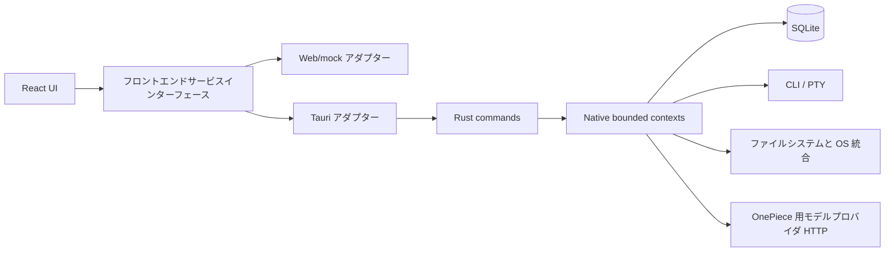

<div align="center">

[English](README.md)
· [简体中文](README.zh-CN.md)
· **日本語**

</div>

<!-- docs-section:hero -->

# VaneHub AI

<p align="center">
  
</p>

デスクトップ優先の AI コーディングエージェントワークベンチ。OnePiece、Claude Code、Codex CLI、OpenCode、Gemini CLI、Antigravity CLI を統一インターフェースで利用・管理します。

<!-- docs-fact:project-version value:1.4.0 -->
<!-- docs-fact:tauri-major value:2.x -->
<!-- docs-fact:react-major value:19.x -->

[](package.json)
[](src-tauri/Cargo.toml)
[](package.json)
[](https://github.com/cdavid817/vanehub-ai/actions/workflows/ci.yml)
[](LICENSE)

[ダウンロード](https://github.com/cdavid817/vanehub-ai/releases) · [クイックスタート](#クイックスタート) · [ドキュメント](#ドキュメント)

<!-- docs-section:overview -->

## 概要

複数の AI コーディングエージェントを併用すると、セッション・プロジェクト・ターミナル・権限・コストが各ツールに分散します。VaneHub AI はそれらを一つのデスクトップワークベンチに集約します：統一されたセッションとワークスペース、統一された権限承認、統一された可観測性と使用量の集計、そしてベンダーをまたぐマルチエージェント協働です。

サポートするエージェントは 2 種類です。**どちらか一方を選べば始められ、すべての CLI をインストールする必要はありません**：

- **OnePiece** — 組み込みのネイティブ API エージェント。モデルプロバイダを HTTP で直接呼び出し、外部 CLI を一切必要としません；
- **外部 CLI エージェント** — Claude Code、Codex CLI、OpenCode、Gemini CLI、Antigravity CLI。ユーザー自身がインストールし、各ベンダーの認証フローをターミナルで完了します。

<!-- docs-section:features -->

## コア機能

- **すべてのエージェントへの統一入口** — OnePiece ネイティブ API エージェントと 5 つの外部 CLI エージェントが、セッション・設定・権限・可観測性を共有します。
- **セッションとワークスペース** — プロジェクト、対話式ターミナル（PTY）、Git worktree、SSH 経由のリモートワークスペース。
- **マルチエージェント協働** — `@` 引き継ぎ付きグループチャットのシート、エキスパートロール、Loop 自動反復、Plan モード、目標とワークボード。
- **コンテキストとコードインテリジェンス** — コンテキスト圧縮、セッション横断メモリ、パーソナライズ、検索、ワークスペースコードインデックス、LSP コードインテリジェンス。
- **拡張性** — Skill、MCP サーバー、Prompt Hook、ローカル拡張、プラグイン統合、IM コネクタ、ローカルメディア（OCR・音声認識と合成）。
- **ガバナンスと運用** — 権限テンプレートと呼び出しごとの承認、実行の可観測性、統一ログ、エージェント評価、定期実行タスク、使用統計。

<!-- docs-section:agents -->

## エージェントと CLI サポート

| Agent | 形態 | コマンド | モデルの出所 | アプリ内インストール | 認証とモデル設定 |
| --- | --- | --- | --- | --- | --- |
| OnePiece | 組み込みネイティブ API エージェント | CLI 不要 | プロバイダカタログまたはカスタム互換エンドポイント | アプリに同梱 | プロバイダと API キーをアプリ内で設定 |
| Claude Code | 外部 CLI | `claude` | Anthropic | ✅ npm / WinGet / 公式インストーラー | ターミナルで OAuth；サードパーティ互換エンドポイントはアプリ内で設定可 |
| Codex CLI | 外部 CLI | `codex` | OpenAI | ✅ npm | ターミナルで OAuth；サードパーティ互換エンドポイントはアプリ内で設定可 |
| OpenCode | 外部 CLI | `opencode` | ユーザーが設定した任意のモデル。固定のモデルファミリなし | ✅ npm / 公式インストーラー | ターミナルで認証；サードパーティ互換エンドポイントはアプリ内で設定可 |
| Gemini CLI | 外部 CLI | `gemini` | Google | ✅ npm | ターミナルで認証；エンドポイント変更可、カタログには公式プリセットのみ |
| Antigravity CLI | 外部 CLI | `agy` | Google | ✅ 公式インストーラー（最新版のみ） | ターミナルで Google サインイン；CLI 自体は API キーと互換エンドポイントもサポートしますが、VaneHub の統一プロバイダ設定には未対応です |

- **アプリ内インストール**とは、設定 → CLI 管理から VaneHub AI がインストールとアップグレードを代行できるかどうかです：npm、Windows の WinGet、CLI ごとに監査済みの公式インストーラーを扱えます。Homebrew・Bun・Volta・デスクトップアプリ同梱・システムパッケージ由来のものは検出して報告しますが変更しません。
- **各社のサブスクリプションログイン（OAuth）は必ずターミナルで行います**。VaneHub AI は仲介も保存もしません。
- 統合している OpenCode はオープンソースの sst/opencode（npm パッケージ `opencode-ai`）です。ユーザーが設定した任意のモデルを駆動するため固定のモデルファミリはなく、「レビュアーは別のモデルファミリから」といったポリシーは適用されません。
- Gemini CLI のコンシューマー向け経路は縮小しています：Google の発表では 2026-06-18 以降、Gemini Code Assist Individuals や Google AI Pro/Ultra などのコンシューマーアカウントは Gemini CLI 経由で提供されなくなり、「Login with Google」経路は利用できず、Antigravity への移行が推奨されています。Gemini Code Assist Standard と Enterprise は影響を受けません。API キーと Vertex は別の認証経路であり、Google の公式ドキュメントを参照してください。

**モデルプロバイダ**：アプリにはプロバイダ設定カタログが同梱され、OnePiece とサードパーティエンドポイント対応の CLI エージェントで共用されます。カタログ外はカスタム互換エンドポイントとして追加でき、API キーは OS の資格情報サービスに保存されます。ベンダーの完全な一覧・エンドポイントプロトコル・デフォルトモデルは[組み込みモデルプロバイダカタログ](docs/model-providers.md)（簡体字中国語）を参照してください。

<!-- docs-section:quick-start -->

## クイックスタート

1. [Releases ページ](https://github.com/cdavid817/vanehub-ai/releases)からお使いのプラットフォーム向けデスクトップパッケージをダウンロードしてインストールします。
2. どちらかを選びます：設定 → Agent 設定で OnePiece のモデルプロバイダと API キーを設定する。またはサポート対象の外部 CLI をどれか一つインストールしてターミナルで認証し、設定 → CLI 管理で検出を更新する。
3. 「新規」をクリックし、エージェントとプロジェクトフォルダを選んで最初のセッションを作成します。
4. セッションワークスペースの入力ボックスから最初のタスクを送信します。

詳細はユーザーガイドのクイックスタート、CLI のインストールと認証、最初のセッションの各章（下の[ドキュメント](#ドキュメント)）を参照してください。

<!-- docs-section:download -->

## ダウンロード・プラットフォーム・リリースの完全性

ビルド済みデスクトップパッケージは [Releases ページ](https://github.com/cdavid817/vanehub-ai/releases)で公開しています：

| プラットフォーム | アーキテクチャ | 形式 |
| --- | --- | --- |
| Windows | x64 | NSIS `.exe` インストーラー |
| macOS | x64、Apple Silicon | `.dmg` |
| Linux | x64、ARM64 | `.deb`、AppImage |

`.msi` と `.rpm` は公開していません。それぞれ NSIS インストーラーと AppImage をご利用ください。

**署名については次の 3 点を区別してください**：

- **リリースの完全性** — 各リリースには `SHA256SUMS`、SPDX SBOM、GitHub attestations が付属し、完全性と出所の検証に使えます；
- **自動更新アーティファクト** — Tauri updater アーティファクトには updater 署名が付きます；
- **OS レベルのコード署名** — **Windows Authenticode 署名と macOS Developer ID 署名／公証は未整備です**（後続フェーズ）。そのため Windows SmartScreen と macOS Gatekeeper がインストーラーについて警告する場合があり、リリースノートに各プラットフォームの対処手順を記載しています。

検証手順・資格情報の一覧・署名ロードマップは[リリース署名](docs/release-signing.md)を参照してください。

<!-- docs-section:runtimes -->

## 実行モード

| ランタイム | 用途 | 能力 |
| --- | --- | --- |
| **Tauri デスクトップランタイム** | 実利用 | 実際の CLI/PTY 実行、SQLite 永続化、ファイルシステムアクセス、デスクトップライフサイクルとシステム統合、ローカルメディアなど実装済みのローカル機能 |
| **Web/mock ランタイム** | 決定論的な UI プレビュー、ドキュメント用スクリーンショット、フロントエンド開発 | ブラウザ内シミュレーション — 実際の CLI 実行、データベース永続化、ファイル変更、その他のシステム副作用は**発生しません** |

Web/mock の画面やシミュレーション状態は、デスクトップ機能が実環境で検証済みであることの証拠にはなりません。

<!-- docs-section:documentation -->

## ドキュメント

<!-- docs-locale-guides -->

### ユーザーガイド

章の完全な一覧は[ユーザーガイド](docs/user-guide/en/src/index.md)のサイドバーにあります。下表は各グループの入り口のみです。

| グループ | ここから | 内容 |
| --- | --- | --- |
| はじめに | [クイックスタート](docs/user-guide/en/src/quick-start.md) | CLI のインストールと認証、最初のセッション、コアコンセプト、アプリ更新 |
| 画面とワークスペース | [ユーザーインターフェース](docs/user-guide/en/src/user-interface.md) | セッションワークスペース、設定センター、リモートワークスペースと SSH、Git worktree、スラッシュコマンド |
| エージェントと協働 | [OnePiece（ネイティブエージェント）](docs/user-guide/en/src/native-agent.md) | マルチエージェントグループチャット、エキスパートロール、Loop、目標とワークボード、コードレビュー、エージェント評価 |
| コンテキストとコードインテリジェンス | [メモリとコンテキスト](docs/user-guide/en/src/memory-and-context.md) | パーソナライズ、コードインデックス、LSP コードインテリジェンス |
| ツールと統合 | [Agent と CLI の設定](docs/user-guide/en/src/agent-configuration.md) | Skill、MCP、Prompt Hook、ローカル拡張、ローカルメディア、プラグイン統合、IM コネクタ |
| ガバナンスと運用 | [権限承認](docs/user-guide/en/src/permissions.md) | 可観測性、定期実行タスクと通知、使用統計 |
| ヘルプとリファレンス | [トラブルシューティング](docs/user-guide/en/src/troubleshooting.md) | ユースケース、FAQ、問題の報告 |

### 開発者ガイド

章の完全な一覧は[開発者ガイド](docs/developer-guide/src/index.md)のサイドバーにあります。下表は各領域の入り口のみです。

| 領域 | ここから | 内容 |
| --- | --- | --- |
| 全体像とランタイム境界 | [リポジトリ構成](docs/developer-guide/src/repository-orientation.md) | ランタイムとサービス境界、native bounded context、永続化の所有権 |
| Agent ランタイム | [単一 Agent ガバナンス：5 つのコントロールプレーン](docs/developer-guide/src/single-agent-control-planes.md) | Agent ライフサイクル、OnePiece、組み込みツール、tool registry、CLI ライフサイクル、ターミナルと PTY、CLI 委譲、グループチャット、Loop と Plan、ワークボード、セッション復旧 |
| ワークスペースとプラットフォーム機能 | [SSH 接続とリモートランタイム](docs/developer-guide/src/ssh-connections.md) | ローカルメディアランタイム |
| コンテキスト・メモリ・コードインテリジェンス | [セッション横断メモリ](docs/developer-guide/src/cross-session-memory.md) | コンテキスト圧縮、パーソナライズガバナンス、検索とベクトル検索、Tree-sitter インデックス、LSP |
| Skill と外部統合 | [Skill 管理](docs/developer-guide/src/skill-management.md) | 有効 Skill ランタイム、オーバーレイガバナンス、進化のエビデンス、MCP ツール、IM コネクタ |
| セキュリティ・評価・可観測性 | [権限モデル](docs/developer-guide/src/permission-model.md) | 実行の可観測性、評価ランタイム、エビデンスコンソール、統一ログ、使用統計 |
| エンジニアリング | [テスト](docs/developer-guide/src/testing.md) | OpenSpec ワークフロー、リリース、実環境での適格性確認 |
| 生成リファレンスとアーキテクチャ決定 | [Native API リファレンス](docs/developer-guide/src/native-api-reference.md) | ソースから生成された契約と所有権のリファレンス、Skill ツールランタイムセキュリティ |

ユーザーガイドは英語と簡体字中国語のみ提供されます。日本語、繁体字中国語、韓国語はアプリケーション UI のリソース言語としてのみ提供され、対応するユーザーガイドはありません。

<!-- /docs-locale-guides -->

<!-- docs-section:architecture -->

## アーキテクチャ概要


```mermaid
flowchart LR
  UI[React UI] --> Service[フロントエンドサービスインターフェース]
  Service --> Web[Web/mock アダプター]
  Service --> Tauri[Tauri アダプター]
  Tauri --> Commands[Rust commands]
  Commands --> Contexts[Native bounded contexts]
  Contexts --> SQLite[(SQLite)]
  Contexts --> CLI[CLI / PTY]
  Contexts --> FS[ファイルシステムと OS 統合]
  Contexts --> HTTP[OnePiece 用モデルプロバイダ HTTP]
```

React コンポーネントは `src/services/` のフロントエンドサービスインターフェースのみを呼び出し、Tauri `invoke()` を直接呼び出しません。Tauri 固有の呼び出しはフロントエンド Tauri アダプターに置かれ、SQLite・CLI プロセス・ファイルシステムアクセス・デスクトップライフサイクルはすべて Rust 側にあります。モジュールの完全な一覧は [native アーキテクチャインベントリ](src-tauri/ARCHITECTURE.md)を参照してください。

<!-- docs-section:from-source -->

## ソースからの実行と開発

<!-- docs-fact:node-minimum value:22+ -->

前提条件：Node.js 22+、npm、stable Rust、お使いのプラットフォームの [Tauri 前提条件](https://v2.tauri.app/start/prerequisites/)。プラットフォームのリンカー要件とビルド測定は[ネイティブビルドパフォーマンスガイド](docs/build-performance.md)を参照してください。

```bash
npm ci
```

Web/mock プレビューを実行（ブラウザ内シミュレーション。上の[実行モード](#実行モード)を参照）：

```bash
npm run dev -- --host 127.0.0.1
```

実際のデスクトップアプリケーションを実行：

```bash
npm run tauri:dev
```

> Windows トラブルシューティング：デスクトップ起動時に Rust ツールチェーンが見つからない場合、PowerShell で cargo を一時的に PATH へ追加して再試行してください：
>
> ```powershell
> $env:PATH="$env:USERPROFILE\.cargo\bin;$env:PATH"
> ```

変更を提出する前に、[AGENTS.md](AGENTS.md) の検証コマンド一覧をそのまますべて実行してください。新機能とアーキテクチャ変更は実装前に OpenSpec proposal が必要です — [openspec/project.md](openspec/project.md) を参照してください。

**技術リファレンス**：[エージェント基盤ドキュメント](docs/agent-infrastructure/README.md)は MCP・LSP・RAG などの**外部プロトコル、一般的なアーキテクチャパターン、エンジニアリング手法そのもの**を解説するものであり、VaneHub が提供済みの機能を約束するものではありません。実装状況の判断はユーザーガイド、開発者ガイド、[OpenSpec メイン仕様](openspec/specs/)、生成リファレンスを基準にしてください。[CLI パラメータリファレンス](docs/reference/cli/builtin-cli-reference.md)と[リリース署名](docs/release-signing.md)も参照してください。

<!-- docs-section:roadmap -->

## プロジェクト状況とロードマップ

- **提供済み** — 実装済みの挙動とインターフェース契約は [OpenSpec メイン仕様](openspec/specs/)に記録されています。使い方はユーザーガイドを参照してください。
- **進行中** — [未アーカイブの OpenSpec 変更](openspec/changes/)を参照：現在は組み込み Skill カタログの拡充、リモート Skill レジストリとサプライチェーンガバナンス、セッション横断メモリガバナンスの強化、領域スクリーンショット取得、最初の安定版リリース準備などが進行しています。
- **計画中** — 公開された proposal や issue が存在する場合にのみ記載します。本節は日付を約束しません。
- 一部の機能（個別の IM コネクタプラットフォーム、プラットフォームごとのデスクトップマトリクス）は実環境での適格性記録が基準です — 開発者ガイドのエンジニアリング領域を参照してください。

<!-- docs-section:support -->

## サポートとセキュリティ

- 使用上の質問と不具合：まず[サポートノート](SUPPORT.md)を読み、Issue フォームからバグ報告または機能リクエストを提出してください。
- **セキュリティ脆弱性を公開 Issue として報告しないでください**：[GitHub のプライベート脆弱性報告](https://github.com/cdavid817/vanehub-ai/security/advisories/new)を使用してください。手順は[セキュリティポリシー](SECURITY.md)にあります。
- コミュニティへの参加は[行動規範](CODE_OF_CONDUCT.md)に従います。

<!-- docs-section:contributing -->

## コントリビュート

変更を始める前に[コントリビュートガイド](CONTRIBUTING.md)をお読みください。挙動を変更する際は、ドキュメント、2 つのフロントエンドランタイムアダプター、ネイティブインターフェース契約、テスト、OpenSpec 成果物を揃えて更新してください。

<!-- docs-section:license -->

## ライセンス

本プロジェクトは Apache License 2.0 で提供されます。詳細は [LICENSE](LICENSE) を参照してください。
