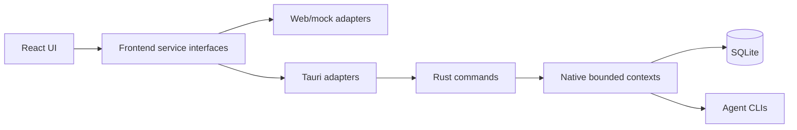

<div align="center">

[English](README.md)
· [简体中文](README.zh-CN.md)
· **日本語**

</div>

<!-- docs-section:hero -->

# VaneHub AI

<p align="center">
  
</p>

単一の React インターフェースと明確な Web/mock・Tauri runtime 境界を通じて AI Coding Agent を管理する、デスクトップ優先のワークスペースです。

<!-- docs-fact:project-version value:0.1.0-preview.1 -->
<!-- docs-fact:tauri-major value:2.x -->
<!-- docs-fact:react-major value:19.x -->

[](package.json)
[](src-tauri/Cargo.toml)
[](package.json)
[](https://github.com/cdavid817/vanehub-ai/actions/workflows/ci.yml)
[](LICENSE)

<!-- docs-section:overview -->

## 概要

VaneHub AI は Claude Code、OpenCode、Codex CLI、Gemini CLI、Antigravity CLI を共有デスクトップワークスペースに統合します。React コンポーネントを native API に直接依存させず、CLI の可用性、セッション、ターミナル実行、プロジェクトと worktree、設定、ツール、可観測性、デスクトップ統合を管理します。

<!-- docs-section:download -->

## ダウンロード

ビルド済みのデスクトップパッケージは [Releases ページ](https://github.com/cdavid817/vanehub-ai/releases)で公開しています。Windows は `.exe` インストーラー、macOS は `.dmg`、Linux は `.deb` と AppImage です。`.msi` と `.rpm` は公開していません。

現在のビルドは署名なしのプレビューです。Windows と macOS は実行前に警告を表示します。プラットフォームごとの手順は release notes に記載しています。インストール前に、公開されている `SHA256SUMS` でダウンロードを検証してください。

<!-- docs-section:architecture -->

## アーキテクチャ


```mermaid
flowchart LR
  UI[React UI] --> Service[Frontend service interfaces]
  Service --> Web[Web/mock adapters]
  Service --> Tauri[Tauri adapters]
  Tauri --> Commands[Rust commands]
  Commands --> Contexts[Native bounded contexts]
  Contexts --> SQLite[(SQLite)]
  Contexts --> CLI[Agent CLIs]
```

React コンポーネントは `src/services/` のサービスを呼び出します。Tauri 固有の `invoke()` は frontend Tauri adapter に限定し、SQLite、CLI process、filesystem access、desktop lifecycle は Rust に置きます。

<!-- docs-section:quick-start -->

## クイックスタート

<!-- docs-fact:node-minimum value:22+ -->

前提条件は Node.js 22+、npm、stable Rust、および各プラットフォームの [Tauri prerequisites](https://v2.tauri.app/start/prerequisites/) です。

プラットフォーム別 linker 要件、release profile の動作、worktree キャッシュの指針、ビルド計測結果については、[ネイティブビルド性能ガイド](docs/build-performance.md)を参照してください。

```powershell
npm ci
```

Web/mock preview を起動します。

```powershell
npm run dev -- --host 127.0.0.1
```

デスクトップアプリを起動します。

```powershell
$env:PATH="$env:USERPROFILE\.cargo\bin;$env:PATH"
npm run tauri -- dev
```

Web/mock は決定的なブラウザシミュレーションです。ローカル CLI 実行、SQLite 永続化、ファイル変更、OS side effect が発生したことを意味しません。

<!-- docs-section:documentation -->

## ドキュメント

<!-- docs-locale-guides -->

### ユーザーガイド

簡体字中国語ガイドが権威ある完全セット。英語ガイドは章構成を镜像し、未翻訳章は既知のギャップとして対応する中国語章へのリンクを持ちます。

| トピック | 入口 |
| --- | --- |
| クイックスタート | [CLI インストールからワークスペース作業まで](docs/user-guide/en/src/getting-started.md) |
| UI 概览 | [メインレイアウト、ナビゲーション、パネル切替、セッション/会話/ワークスペースタブ/情報パネル](docs/user-guide/en/src/user-interface.md) |
| セッションリスト | [グループ/検索/フィルタ/バッチ/ドラッグ、コンテキストメニュー、フォーカスモード](docs/user-guide/en/src/user-interface.md) |
| フローティングアシスタント | [独立フローティングウィンドウ、ステータスバッジ、メインアクションメニュー](docs/user-guide/en/src/user-interface.md) |
| ループセンター | [Loop 実行コントロール、検証コマンド、タイムライン](docs/user-guide/en/src/loop-engineering.md) |
| プランセンター | [プランドラフト、レビュー/承認/実行](docs/user-guide/en/src/user-interface.md) |
| 通知センター | [ベル、未読数、すべて既読、クリア](docs/user-guide/en/src/user-interface.md) |
| システムトレイ | [メインウィンドウ表示/非表示、スタートアップ、通知連動](docs/user-guide/en/src/user-interface.md) |
| CLI インストールと認証 | [CLI のインストール、認証、検出](docs/user-guide/en/src/getting-started.md) |
| マルチ Agent グループチャット | [seat、`@` 引き渡し、ターン境界](docs/user-guide/en/src/multi-agent-workflow.md) |
| スケジュールタスク | [スケジュールタスクと使用量統計](docs/user-guide/en/src/automation.md) |
| リモートワークスペース | [SSH ワークスペースと IM コネクタ](docs/user-guide/en/src/remote-and-im.md) |
| トラブルシューティング | [失敗時にまず確認](docs/user-guide/en/src/troubleshooting.md) |
| 基本設定 | [言語、テーマ、フォントサイズ、デフォルト権限テンプレート、スタートアップ、ネットワークプロキシ、データディレクトリ、ログディレクトリ](docs/user-guide/en/src/user-interface.md) |
| CLI 管理 | [モデル Provider の API キー、エンドポイント、モデルリスト](docs/user-guide/en/src/user-interface.md) |
| CLI パラメータ | [CLI Agent 単位の起動パラメータとグローバル設定](docs/user-guide/en/src/user-interface.md) |
| 拡張能力 | [ローカル拡張のインストール/有効化/無効化](docs/user-guide/en/src/user-interface.md) |
| プラグイン統合 | [プラグイン統合管理](docs/user-guide/en/src/user-interface.md) |
| MCP サーバー | [MCP サーバー設定と Agent 単位のバインド](docs/user-guide/en/src/tooling.md) |
| Agent 設定 | [Agent 単位のモデル、権限テンプレート、ランタイムパラメータ](docs/user-guide/en/src/user-interface.md) |
| エキスパートロール | [ロールとレビュー方針](docs/user-guide/en/src/personalization.md) |
| Agent 権限ポリシー | [Agent 権限ポリシーと承認テンプレート設定](docs/user-guide/en/src/user-interface.md) |
| パーソナライズ | [Custom Instructions とクロスセッションメモリ](docs/user-guide/en/src/personalization.md) |
| Skill 管理 | [Skill のインストールとバインド](docs/user-guide/en/src/skill-management.md) |
| Prompt Hook | [フック管理](docs/user-guide/en/src/tooling.md) |
| IM 能力 | [IM コネクタ設定](docs/user-guide/en/src/remote-and-im.md) |
| SSH 接続 | [保存した SSH 接続](docs/user-guide/en/src/remote-and-im.md) |
| 実行可観測性 | [実行トレースとログ収集方針](docs/user-guide/en/src/observability.md) |
| 使用統計 | [トークン使用量統計](docs/user-guide/en/src/automation.md) |
| バージョン情報 | [バージョン、更新チェック、changelog、リポジトリリンク](docs/user-guide/en/src/user-interface.md) |

### 開発者ガイド

| トピック | 入口 |
| --- | --- |
| トピック | 入口 |
| --- | --- |
| リポジトリ構成 | [リポジトリレイアウトとモジュール帰属](docs/developer-guide/src/repository-orientation.md) |
| ランタイム境界 | [フロントエンドサービス境界、Web/mock と Tauri アダプタ](docs/developer-guide/src/runtime-boundaries.md) |
| ボウンデッドコンテキスト | [11 の native bounded contexts](docs/developer-guide/src/native-contexts.md) |
| Agent ライフサイクルと provider ランタイム | [登録 Agent 編集、安定 provider 解決、能力宣言](docs/developer-guide/src/agent-lifecycle.md) |
| ターミナルと PTY ランタイム | [セッション単位 Agent Terminal、自動起動/アタッチ、リモートターミナル](docs/developer-guide/src/terminal-runtime.md) |
| ツールレジストリと実行 | [固定ネイティブツールカタログ、interface_format 翻訳、マルチターンツールループ](docs/developer-guide/src/tool-registry.md) |
| 権限モデル | [統一決定点、明示 Deny 優先、承認ブローカ、CLI flag 投影、Claude Code フックブリッジ](docs/developer-guide/src/permission-model.md) |
| コンテキスト圧縮 | [文字数カウントトリガ、要約圧縮、直近ターン保持](docs/developer-guide/src/context-compaction.md) |
| 検索とベクトル検索 | [ホストレベル共有メモリプール、workspace コード索引、優雅な縮退](docs/developer-guide/src/retrieval.md) |
| Tree-sitter コード索引 | [構文解析、bounded chunk、シンボルメタデータ、grammar バージョンと秘匿](docs/developer-guide/src/tree-sitter-code-indexing.md) |
| クロスセッションメモリ | [ホストレベル共有プール、provenance メタデータ、OnePiece ツールと CLI 自動抽出](docs/developer-guide/src/cross-session-memory.md) |
| セッション復旧 | [復旧ステータスはライフサイクルと直交、永続実行 ID と所有権](docs/developer-guide/src/session-recovery.md) |
| OnePiece ネイティブ Agent | [組み込み API Agent ID、Profile ライフサイクル、provider ディレクトリ](docs/developer-guide/src/onepiece-native-agent.md) |
| マルチ Agent グループチャット | [seat モデル、途中追加/削除、ターンルーティング、永続 presence](docs/developer-guide/src/multi-agent-group-chat.md) |
| Skill 管理 | [デュアルスコープ、SKILL.md 契約、ドリフト、組み込みシード/照合](docs/developer-guide/src/skill-management.md) |
| MCP ツールとクライアント | [トランスポートと設定モデル、ネイティブカタログの MCP ツール](docs/developer-guide/src/mcp-tools.md) |
| IM コネクタ | [5 つの組み込みコネクタ、初版ダイレクトメッセージ範囲、インバウンドルーティング](docs/developer-guide/src/im-connectors.md) |
| Loop と Plan ランタイム | [永続 Loop 定義、トポロジ認識直列サブタスクスケジューリング、Worker/Verifier 信頼](docs/developer-guide/src/loop-and-plan-runtime.md) |
| トークン使用量統計 | [報告トークンと推定文字の分離、時間範囲、per-Agent 内訳](docs/developer-guide/src/usage-statistics.md) |
| LSP コードインテリジェンス | [セッション内 LSP 統合実装](docs/developer-guide/src/lsp-code-intelligence.md) |
| 永続化とログ | [SQLite 所有権と統一秘匿ログ](docs/developer-guide/src/persistence-and-logging.md) |
| テストとリリース | [テスト、パッケージング、リリースフロー](docs/developer-guide/src/testing-and-release.md) |
| OpenSpec ワークフロー | [提案→設計→delta spec→タスク→検証→アーカイブの変更フロー](docs/developer-guide/src/openspec-workflow.md) |
| Native API リファレンス | [Rustdoc 生成の内部契約と所有権ドキュメント](docs/developer-guide/src/native-api-reference.md) |
| アーキテクチャ決定 | [ADR 真源（ARCHITECTURE.md）](src-tauri/ARCHITECTURE.md) |

ユーザーガイドは英語と簡体字中国語のみ提供されます。日本語、繁体字中国語、韓国語はアプリケーション UI のリソース言語としてのみ提供され、対応するユーザーガイドはありません。日本語のガイドは今後の変更で追加されるわけではなく、UI ロケールとガイドロケールの境界は仕様で固定されています。

<!-- /docs-locale-guides -->

### Agent 基盤技術ドキュメント

上記 2 つのガイドは VaneHub AI 自体を説明します。こちらは VaneHub AI が依拠する**プロトコルと技術そのもの**を説明します——技術選定や統合レイヤーの実装時に参照してください。索引は [Agent 基盤技術ドキュメント](docs/agent-infrastructure/README.md)。

| 領域 | ドキュメント |
| --- | --- |
| プロトコルとインターフェース | [MCP](docs/agent-infrastructure/mcp-architecture.md) · [Function Calling](docs/agent-infrastructure/function-calling-architecture.md) · [LSP](docs/agent-infrastructure/lsp-architecture.md) · [A2A](docs/agent-infrastructure/a2a-architecture.md) |
| Agent 能力とオーケストレーション | [マルチ Agent システム](docs/agent-infrastructure/multi-agent-architecture.md) · [Agent Skills](docs/agent-infrastructure/agent-skills-architecture.md) · [組み込み CLI パラメータ完全リファレンス](docs/agent-infrastructure/builtin-cli-reference.md) |
| 検索とコード理解 | [RAG](docs/agent-infrastructure/rag-architecture.md) · [Tree-sitter](docs/agent-infrastructure/tree-sitter-architecture.md) |
| エンジニアリング手法 | [OpenSpec](docs/agent-infrastructure/openspec-architecture.md) |

**これらは外部仕様の説明であり、VaneHub AI の実装保証ではありません**——記載されたプロトコル能力が実装済みであることを意味しません。実装範囲は上記 2 つのガイドが定義します。簡体字中国語のみ提供されます。

リファレンス：[native architecture inventory](src-tauri/ARCHITECTURE.md) · [コントリビューション](CONTRIBUTING.md) · [ネイティブビルド性能](docs/build-performance.md) · [リリース署名](docs/release-signing.md)

mdBook ガイドと Rustdoc reference をビルドします。

```powershell
npm run docs:check
npm run docs:test
npm run docs:build
```

ドキュメントビルドには `docs/toolchain.json` で固定された mdBook version が必要です。

<!-- docs-section:development -->

## 開発

変更を提出する前に、AGENTS.md の「校验命令」セクションにあるすべてのコマンドをそのまま実行してください。このリストが CI と整合する唯一の情報源です。

新機能とアーキテクチャ変更では、実装前に OpenSpec proposal が必要です。プロジェクトルールは [AGENTS.md](AGENTS.md) と [openspec/project.md](openspec/project.md) を参照してください。

<!-- docs-section:roadmap -->

## ロードマップ

実装済みの振る舞いと現在の contract は [OpenSpec main specifications](openspec/specs/) に記録されています。直近の方向性には、custom Agent、plugin marketplace、ローカル OCR/音声機能の拡張があります。

<!-- docs-section:contributing -->

## コントリビューション

変更を始める前に [CONTRIBUTING.md](CONTRIBUTING.md) を確認してください。振る舞いを変更する場合は、ドキュメント、両 frontend runtime adapter、native contract、テスト、OpenSpec artifact を整合させます。

<!-- docs-section:license -->

## License

Apache License 2.0 でライセンスされています。詳細は [LICENSE](LICENSE) を参照してください。
