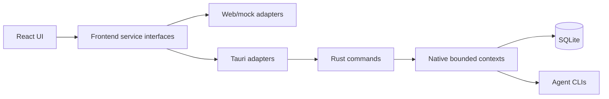

<div align="center">

[English](README.md)
· [简体中文](README.zh-CN.md)
· **日本語**

</div>

<!-- docs-section:hero -->

# VaneHub AI

<p align="center">
  
</p>

単一の React インターフェースと明確な Web/mock・Tauri runtime 境界を通じて AI Coding Agent を管理する、デスクトップ優先のワークスペースです。

<!-- docs-fact:project-version value:1.4.0 -->
<!-- docs-fact:tauri-major value:2.x -->
<!-- docs-fact:react-major value:19.x -->

[](package.json)
[](src-tauri/Cargo.toml)
[](package.json)
[](https://github.com/cdavid817/vanehub-ai/actions/workflows/ci.yml)
[](LICENSE)

<!-- docs-section:overview -->

## 概要

VaneHub AI は Claude Code、OpenCode、Codex CLI、Gemini CLI、Antigravity CLI を共有デスクトップワークスペースに統合します。React コンポーネントを native API に直接依存させず、CLI の可用性、セッション、ターミナル実行、プロジェクトと worktree、設定、ツール、可観測性、デスクトップ統合を管理します。

### サポートする CLI

1 つ入れれば始められます。5 つすべてを揃える必要はありません。

| Agent | 提供元 | コマンド | モデルファミリ | アプリ内インストール | サードパーティモデルエンドポイント |
| --- | --- | --- | --- | --- | --- |
| Claude Code | Anthropic | `claude` | Anthropic | ✅ `@anthropic-ai/claude-code` | ✅ |
| Codex CLI | OpenAI | `codex` | OpenAI | ✅ `@openai/codex` | ✅ |
| OpenCode | OpenCode（オープンソース） | `opencode` | 不明 | ✅ `opencode-ai` | ✅ |
| Gemini CLI | Google | `gemini` | Google | ✅ `@google/gemini-cli` | ⚠️ エンドポイントは変更可だが、カタログには公式プリセットのみ |
| Antigravity CLI | Google | `agy` | Google | ❌ npm パッケージなし。公式インストーラースクリプトを使用 | ❌ Google サインインのみ |

- アプリ内インストールとは、設定 → CLI 管理から VaneHub AI がインストールとアップグレードを代行できるかどうかです。npm、Windows の WinGet、および CLI ごとに監査済みのベンダーインストーラーを扱えます。Homebrew・Bun・Volta・デスクトップアプリ同梱・システムパッケージ由来のものは検出して報告しますが変更はしません。隣にもう一つ入れるのではなく、それを所有しているツールを案内します。
- サードパーティモデルエンドポイントとは、設定 → Agent 設定から DeepSeek や OpenRouter などの互換エンドポイントに向けられるかどうかです。**各社のサブスクリプションログイン（OAuth）は必ずターミナルで行います**——VaneHub AI は仲介しません。
- OpenCode のモデルファミリが「不明」なのは記載漏れではありません：設定した任意のモデルを駆動するため固定の所属がなく、「レビュアーは別のモデルファミリから」といった方針は適用されません。
- Gemini CLI は Antigravity CLI に置き換えられつつあります。Google は 2026-06-18 より個人・無料アカウント向けに段階的な提供終了を開始しました。
- CLI を一切入れたくない場合、組み込みのネイティブ API Agent OnePiece がアプリ内で HTTP 経由でモデルを呼び出します。以下のユーザーガイドを参照してください。

### サポートするモデルプロバイダ

25 社の設定テンプレートを内蔵し、OnePiece と 3 つの CLI Agent が共有します。カタログにないものはカスタム互換エンドポイントとして追加できます。

| カテゴリ | プロバイダ |
| --- | --- |
| 公式 | Anthropic、OpenAI |
| アグリゲータ・クラウド基盤 | OpenRouter、SiliconFlow、Alibaba Bailian、Volcengine Ark、Together AI、Fireworks AI、NVIDIA NIM、ModelScope、PPIO、Qiniu AI |
| モデルベンダー | DeepSeek、Zhipu GLM、Kimi / Moonshot、xAI、Mistral AI、MiniMax、MiniMax Global、StepFun、Baichuan AI、Xiaomi MiMo、Z.AI |
| 推論アクセラレータ | Groq、Cerebras |

**どのプロバイダがどの Agent に使えるかは、提供するエンドポイントプロトコルで決まります**：Anthropic Messages に対応する 16 社は Claude Code に、OpenAI Chat Completions に対応する 24 社は Codex CLI と OpenCode に設定できます。

完全なカタログ（各社アイコン、エンドポイントプロトコル、デフォルトモデル、API キー取得先）は[組み込みモデルプロバイダカタログ](docs/model-providers.md)（簡体字中国語）にあります。

<!-- docs-section:download -->

## ダウンロード

ビルド済みのデスクトップパッケージは [Releases ページ](https://github.com/cdavid817/vanehub-ai/releases)で公開しています。署名済み Windows x64 `.exe` インストーラー、署名・公証済み macOS x64 / Apple Silicon `.dmg`、Linux x64 / ARM64 `.deb` と AppImage があり、`.msi` と `.rpm` は公開していません。

公開済みの `SHA256SUMS`、SPDX SBOM、GitHub attestations でダウンロードを検証してください。Linux パッケージには整合性と来歴の証拠がありますが、OS のコード署名は使用していません。

<!-- docs-section:documentation -->

## ドキュメント

<!-- docs-locale-guides -->

### ユーザーガイド

章の完全な一覧は[ユーザーガイド](docs/user-guide/en/src/index.md)のサイドバーにあります。下表は入り口のみです。

| グループ | ここから | 内容 |
| --- | --- | --- |
| はじめに | [クイックスタート](docs/user-guide/en/src/quick-start.md) | CLI のインストール・認証・アップグレード、最初のセッション、コアコンセプト |
| 画面とワークスペース | [ユーザーインターフェース](docs/user-guide/en/src/user-interface.md) | レイアウトとナビゲーション、セッションワークスペース、設定、リモートワークスペース、worktree、スラッシュコマンド |
| Agent と協働 | [マルチ Agent グループチャット](docs/user-guide/en/src/multi-agent-workflow.md) | OnePiece、シートと引き継ぎ、エキスパートロール、Loop、目標とワークボード、コードレビュー、評価 |
| コンテキストとコードインテリジェンス | [メモリとコンテキスト](docs/user-guide/en/src/memory-and-context.md) | セッション横断メモリとパーソナライズ、圧縮、コードインデックス、LSP |
| ツールと統合 | [Agent と CLI の設定](docs/user-guide/en/src/agent-configuration.md) | CLI パラメータ、プロバイダ、Skill、MCP、Prompt Hook、ローカル拡張、ローカルメディア、IM コネクタ |
| ガバナンスと運用 | [権限承認](docs/user-guide/en/src/permissions.md) | 権限テンプレートと承認、可観測性、定期実行タスク、使用統計 |
| ヘルプ | [トラブルシューティング](docs/user-guide/en/src/troubleshooting.md) | ユースケース、FAQ、トラブルシューティング、問題の報告 |

### 開発者ガイド

章の完全な一覧は[開発者ガイド](docs/developer-guide/src/index.md)のサイドバーにあります。下表は入り口のみです。

| 領域 | ここから | 内容 |
| --- | --- | --- |
| 全体像と境界 | [リポジトリ構成](docs/developer-guide/src/repository-orientation.md) | ディレクトリの所有権、ランタイムとサービス境界、native bounded context、永続化の所有権 |
| Agent ランタイム | [Agent ライフサイクルと provider ランタイム](docs/developer-guide/src/agent-lifecycle.md) | OnePiece、tool registry、CLI ライフサイクルと委譲、ターミナルと PTY、グループチャット、Loop と Plan、セッション復旧 |
| コンテキスト・メモリ・コードインテリジェンス | [セッション横断メモリ](docs/developer-guide/src/cross-session-memory.md) | 圧縮、パーソナライズガバナンス、検索、Tree-sitter インデックス、LSP |
| Skill と外部統合 | [Skill 管理](docs/developer-guide/src/skill-management.md) | 有効 Skill ランタイム、オーバーレイガバナンス、進化のエビデンス、MCP ツール、IM コネクタ |
| セキュリティ・評価・可観測性 | [権限モデル](docs/developer-guide/src/permission-model.md) | 実行の可観測性、評価ランタイム、エビデンスコンソール、統一ログ、使用統計 |
| エンジニアリング | [テスト](docs/developer-guide/src/testing.md) | OpenSpec ワークフロー、リリース、実環境での適格性確認 |
| 生成リファレンス | [Native API リファレンス](docs/developer-guide/src/native-api-reference.md) | ソースから生成された native contract と所有権のリファレンス |

ユーザーガイドは英語と簡体字中国語のみ提供されます。日本語、繁体字中国語、韓国語はアプリケーション UI のリソース言語としてのみ提供され、対応するユーザーガイドはありません。日本語のガイドは今後の変更で追加されるわけではなく、UI ロケールとガイドロケールの境界は仕様で固定されています。

<!-- /docs-locale-guides -->

<!-- docs-section:architecture -->

## アーキテクチャ


```mermaid
flowchart LR
  UI[React UI] --> Service[Frontend service interfaces]
  Service --> Web[Web/mock adapters]
  Service --> Tauri[Tauri adapters]
  Tauri --> Commands[Rust commands]
  Commands --> Contexts[Native bounded contexts]
  Contexts --> SQLite[(SQLite)]
  Contexts --> CLI[Agent CLIs]
```

React コンポーネントは `src/services/` のサービスを呼び出します。Tauri 固有の `invoke()` は frontend Tauri adapter に限定し、SQLite、CLI process、filesystem access、desktop lifecycle は Rust に置きます。

<!-- docs-section:quick-start -->

## ソースから実行

<!-- docs-fact:node-minimum value:22+ -->

前提条件は Node.js 22+、npm、stable Rust、および各プラットフォームの [Tauri prerequisites](https://v2.tauri.app/start/prerequisites/) です。

プラットフォーム別 linker 要件、release profile の動作、worktree キャッシュの指針、ビルド計測結果については、[ネイティブビルド性能ガイド](docs/build-performance.md)を参照してください。

```powershell
npm ci
```

Web/mock preview を起動します。

```powershell
npm run dev -- --host 127.0.0.1
```

デスクトップアプリを起動します。

```powershell
$env:PATH="$env:USERPROFILE\.cargo\bin;$env:PATH"
npm run tauri:dev
```

Web/mock は決定的なブラウザシミュレーションです。ローカル CLI 実行、SQLite 永続化、ファイル変更、OS side effect が発生したことを意味しません。

<!-- docs-section:development -->

## 開発

変更を提出する前に、AGENTS.md の「校验命令」セクションにあるすべてのコマンドをそのまま実行してください。このリストが CI と整合する唯一の情報源です。

新機能とアーキテクチャ変更では、実装前に OpenSpec proposal が必要です。プロジェクトルールは [AGENTS.md](AGENTS.md) と [openspec/project.md](openspec/project.md) を参照してください。

### Agent 基盤技術ドキュメント

| トピック | エントリ |
| --- | --- |
| MCP | [プロトコルモデルと三役アーキテクチャ、トランスポート、コアプリミティブ、ライフサイクル、認可とセキュリティ](docs/agent-infrastructure/protocols/mcp.md) |
| Function Calling | [呼び出しループと制約デコード、Anthropic と OpenAI の API 差異、並列呼び出しとストリーム組み立て、構造化出力](docs/agent-infrastructure/protocols/function-calling.md) |
| LSP | [プロトコル階層とライフサイクル、能力ネゴシエーション、テキスト同期モデル、言語およびワークスペース機能](docs/agent-infrastructure/protocols/lsp.md) |
| A2A | [AgentCard/Task/Message/Artifact データモデル、タスク状態機械、発見機構、非同期更新チャネル](docs/agent-infrastructure/protocols/a2a.md) |
| マルチ Agent システム | [オーケストレーション位相と役割フレームワーク、通信と協調、コンテキスト管理、実行分離、失敗モード](docs/agent-infrastructure/patterns/multi-agent.md) |
| Agent Skills | [オープン仕様とファイル形式、漸進的開示ローディング、トリガーと実行、MCP/Prompt との位置づけ比較](docs/agent-infrastructure/patterns/agent-skills.md) |
| RAG | [インデックスと検索パイプライン、セマンティック検索とキーワード検索の取捨、ハイブリッド検索と再ランキング、評価手法](docs/agent-infrastructure/patterns/rag.md) |
| Tree-sitter | [GLR 増分解析、文法ツールチェーンと ABI、クエリシステム、構造化コード分割と Repo Map](docs/agent-infrastructure/patterns/tree-sitter.md) |
| OpenSpec | [仕様駆動開発の知識モデル、変更パッケージの成果物チェーン、opsx コマンド族、Delta 仕様のマージ](docs/agent-infrastructure/methods/openspec.md) |

リファレンス：[native architecture inventory](src-tauri/ARCHITECTURE.md) · [CLI パラメータリファレンス](docs/reference/cli/builtin-cli-reference.md) · [コントリビューション](CONTRIBUTING.md) · [ネイティブビルド性能](docs/build-performance.md) · [リリース署名](docs/release-signing.md)

mdBook ガイドと Rustdoc reference をビルドします。

```powershell
npm run docs:check
npm run docs:test
npm run docs:build
```

ドキュメントビルドには `docs/toolchain.json` で固定された mdBook version が必要です。

<!-- docs-section:roadmap -->

## ロードマップ

実装済みの振る舞いと現在の contract は [OpenSpec main specifications](openspec/specs/) に記録されています。直近の方向性には、custom Agent と plugin marketplace があります。ローカル OCR、音声認識、音声合成はすでにローカルマシン上で動作しており、この領域に残るのはエンジンとプラットフォームの対応範囲、インストール自動化、実機での資格検証です。

<!-- docs-section:contributing -->

## コントリビューション

変更を始める前に [CONTRIBUTING.md](CONTRIBUTING.md) を確認してください。振る舞いを変更する場合は、ドキュメント、両 frontend runtime adapter、native contract、テスト、OpenSpec artifact を整合させます。

<!-- docs-section:license -->

## License

Apache License 2.0 でライセンスされています。詳細は [LICENSE](LICENSE) を参照してください。
