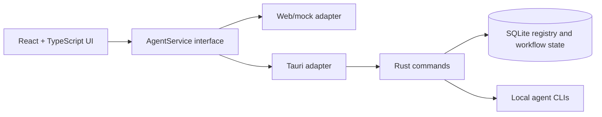

<div align="center">

<strong></strong>
[](README.zh-CN.md)
[](README.ja.md)

</div>

# VaneHub AI

Desktop-first workspace for managing and switching between AI coding agents.

> It is the best of times, it is the worst of times; it is the age of AI, it is the age of bugs.
>
> —— A tribute to Charles Dickens' *A Tale of Two Cities*

> **Special reminder:** All code in this project is generated by AI. Manual old-school programming is prohibited; humans are only responsible for thinking through plans and validating outputs.

[](package.json)
[](src-tauri/Cargo.toml)
[](package.json)
[](https://github.com/cdavid817/vanehub-ai/actions/workflows/ci.yml)
[](https://github.com/cdavid817/vanehub-ai/actions/workflows/codeql.yml)
[](https://github.com/cdavid817/vanehub-ai/actions/workflows/package.yml)
[](LICENSE)

## Overview

VaneHub AI is a Tauri desktop application with a React UI for coordinating AI coding agents such as Claude Code, OpenCode, Codex CLI, and Gemini CLI. It keeps agent metadata, availability, interaction modes, workflow state, and session details behind a shared service boundary so the same UI can run in the desktop runtime or in a browser preview.

## What is implemented

- **Multi-agent CLI management:** detects Claude Code, Codex CLI, Gemini CLI, and OpenCode installations; shows versions and conflicts; and supports safe npm-managed install, update, and removal flows.
- **Agent sessions and chat:** creates, switches, pins, archives, restores, and deletes sessions; persists session state in SQLite; and routes CLI chat execution, streaming output, cancellation, and failures through the native runtime.
- **Developer workspace:** combines chat with terminal/shell, files, documents, Git status and diffs, logs, reports, and configurable workspace tabs for the active session.
- **Tool and integration settings:** manages SDK dependencies, provider/model configuration, CLI parameters, MCP servers (including connection tests and import/export), scoped skills, and local extensions.
- **Desktop and communication features:** provides a background-capable floating assistant, desktop notifications, scheduled-task entry points, IM connector configuration and routing, and network-proxy settings.
- **Operations and observability:** includes usage statistics, a unified redacted log pipeline, long-running-operation feedback, and in-app notifications.
- **Consistent UI/runtime architecture:** keeps React behind service contracts that have web/mock and Tauri implementations, with `futuristic` and `minimal` visual styles and English/Simplified Chinese UI resources.
- **Packaging:** includes local and GitHub Actions Tauri packaging for Windows, macOS, and Linux targets.

## Architecture and Stack



Main technologies:

- Frontend: React 18, TypeScript, Vite, Tailwind CSS, lucide-react, Vitest.
- Desktop runtime: Tauri 2 with Rust.
- Local storage: SQLite through `rusqlite`.
- Browser automation dependency: Playwright configuration is present for browser interaction workflows.
- CI packaging: GitHub Actions workflow in `.github/workflows/package.yml`.

React components are expected to use the service interfaces in `src/services/` rather than calling Tauri `invoke()` directly.

## Prerequisites

- Node.js 22+ and npm.
- Rust stable and Cargo.
- Tauri system prerequisites for your platform.
- Windows desktop builds: Microsoft C++ Build Tools with MSVC, Windows SDK, and WebView2 Runtime.
- Linux desktop builds: WebKitGTK and related native packages used by the packaging workflow.
- macOS desktop builds: Xcode command line tools.

## Installation

```powershell
npm install
```

## Quick Start

Run the browser preview:

```powershell
npm run dev -- --host 127.0.0.1
```

Open:

```text
http://127.0.0.1:1420/
```

Run the Tauri desktop app:

```powershell
$env:PATH="$env:USERPROFILE\.cargo\bin;$env:PATH"
npm run tauri -- dev
```

Build and package the desktop app for the current host platform:

```powershell
npm run package
```

Generated Tauri bundle artifacts are written under `src-tauri/target/release/bundle/` or the target-specific `src-tauri/target/<rust-target>/release/bundle/` directory.

## Configuration

Project configuration is stored in the repository:

- `package.json`: npm scripts, frontend dependencies, and package version `0.1.0`.
- `src-tauri/Cargo.toml`: Rust package metadata and dependencies.
- `src-tauri/tauri.conf.json`: Tauri product name, app identifier, window settings, bundle settings, and version `0.1.0`.
- `tailwind.config.ts` and `src/styles.css`: theme tokens and UI styling.
- `.github/workflows/package.yml`: manual and tag-triggered desktop packaging workflow.
- `docs/release-signing.md`: release environment, signing, notarization, checksum, SBOM, and attestation guidance.

Runtime state is created locally by the Tauri backend under `.vanehub/vanehub.sqlite` from the current working directory. No required environment variables were found in the repository.

## Project Structure

```text
src/
  main-layout/          Main workspace UI with session sidebar, chat workspace, and detail panel
  settings/             Settings shell and pages
  services/             AgentService boundary and runtime adapters
  theme/                Theme registry and provider
  types/                Shared TypeScript types
src-tauri/
  src/                  Rust Tauri commands, SQLite registry, launch routing
  tauri.conf.json       Desktop app and bundling configuration
openspec/
  specs/                Current behavior specifications
  changes/archive/      Completed change history and task evidence
.github/workflows/
  package.yml           Desktop packaging workflow
ucd/
  futuristic/, minimal/ UCD reference assets
```

## Roadmap

### Delivered

- [x] Tauri + React desktop application, SQLite-backed state, and service-contract web/mock and native adapters.
- [x] CLI environment discovery and lifecycle management for Claude Code, Codex CLI, Gemini CLI, and OpenCode.
- [x] Session lifecycle management, CLI chat runtime, streaming/cancellation, and a multi-tab developer workspace.
- [x] Settings for agents, providers, SDKs, CLI parameters, MCP, skills, extensions, usage, proxy, IM connectors, and the floating assistant.
- [x] Unified redacted logging, notifications, desktop background lifecycle, and cross-platform packaging workflows.

### Next steps

- [ ] Configure trusted macOS signing/notarization credentials and a Windows Authenticode provider in the protected `release` environment.
- [ ] Add Japanese runtime UI resources if Japanese product localization is required; the repository currently ships English and Simplified Chinese UI resources.
- [ ] Publish and prioritize the next feature proposals through OpenSpec before implementation.

## Development

Useful validation commands:

```powershell
npm run test
npm run build
$env:PATH="$env:USERPROFILE\.cargo\bin;$env:PATH"
cargo test --manifest-path src-tauri\Cargo.toml
cargo check --manifest-path src-tauri\Cargo.toml
```

If OpenSpec is installed locally:

```powershell
openspec validate --specs --strict
```

## Contributing

See [CONTRIBUTING.md](CONTRIBUTING.md) for the branch, OpenSpec, validation, review, and security expectations.

## License

This project is licensed under the Apache License 2.0. See [LICENSE](LICENSE) for the full license text.
