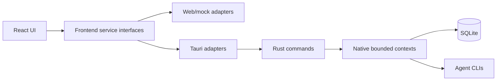

<div align="center">

**English**
· [简体中文](README.zh-CN.md)
· [日本語](README.ja.md)

</div>

<!-- docs-section:hero -->

# VaneHub AI

Desktop-first workspace for managing AI coding agents through one React interface and explicit Web/mock and Tauri runtime boundaries.

<!-- docs-fact:project-version value:0.1.0 -->
<!-- docs-fact:tauri-major value:2.x -->
<!-- docs-fact:react-major value:19.x -->

[](package.json)
[](src-tauri/Cargo.toml)
[](package.json)
[](https://github.com/cdavid817/vanehub-ai/actions/workflows/ci.yml)
[](LICENSE)

<!-- docs-section:overview -->

## Overview

VaneHub AI brings Claude Code, OpenCode, Codex CLI, and Gemini CLI into a shared desktop workspace. It manages CLI availability, sessions, terminal execution, projects and worktrees, settings, tools, observability, and desktop integrations without letting React components depend directly on native APIs.

<!-- docs-section:feature-status -->

## Feature status

<!-- feature:core-workspace status:delivered -->

- **Delivered:** CLI management, single-Agent sessions, interactive Agent terminals, session organization, project/worktree and SSH workspace tools, settings, MCP/SDK/Skills/Prompt Hooks/extensions, IM connectors, scheduled tasks, notifications, usage reporting, unified redacted logs, and cross-platform packaging.

<!-- feature:multi-agent-runtime status:preview -->

- **Preview:** Multi-Agent coordination has native and Web/mock service contracts for validated dependency graphs, ordered fallback, persistence, cancellation, and output propagation.

<!-- feature:multi-agent-ui status:planned -->

- **Planned:** The normal create-session UI still disables Multi Agent mode. The [workflow guide](docs/user-guide/README.md) does not present unavailable controls as delivered.

<!-- feature:japanese-ui status:planned -->

- **Planned:** Japanese runtime UI resources. Japanese is currently supported for this README, not for the application UI.

<!-- docs-section:architecture -->

## Architecture



React components call services in `src/services/`. Tauri-specific `invoke()` calls stay in frontend Tauri adapters, while SQLite, CLI processes, filesystem access, and desktop lifecycle behavior stay in Rust.

<!-- docs-section:quick-start -->

## Quick start

<!-- docs-fact:node-minimum value:22+ -->

Prerequisites: Node.js 22+, npm, stable Rust, and the [Tauri prerequisites](https://v2.tauri.app/start/prerequisites/) for your platform.

For platform linker requirements, release-profile behavior, worktree cache guidance, and measured build evidence, see the [native build performance guide](docs/build-performance.md).

```powershell
npm ci
```

Run Web/mock preview:

```powershell
npm run dev -- --host 127.0.0.1
```

Run the desktop application:

```powershell
$env:PATH="$env:USERPROFILE\.cargo\bin;$env:PATH"
npm run tauri -- dev
```

Web/mock is a deterministic browser simulation. It does not claim local CLI execution, SQLite persistence, filesystem changes, or operating-system side effects.

<!-- docs-section:documentation -->

## Documentation

- [User Guides — English and 简体中文](docs/user-guide/README.md)
- [Developer Guide source](docs/developer-guide/src/index.md)
- [Native architecture inventory](src-tauri/ARCHITECTURE.md)
- [Contributing guide](CONTRIBUTING.md)
- [Native build performance guide](docs/build-performance.md)
- [Release signing guide](docs/release-signing.md)

Build the mdBook guides and Rustdoc reference:

```powershell
npm run docs:check
npm run docs:test
npm run docs:build
```

The documentation build requires the mdBook version pinned in `docs/toolchain.json`.

<!-- docs-section:development -->

## Development

```powershell
npm run lint
npm run test
npm run build
cargo test --manifest-path src-tauri/Cargo.toml
cargo check --manifest-path src-tauri/Cargo.toml
cargo clippy --manifest-path src-tauri/Cargo.toml --all-targets -- -D warnings
openspec validate --specs --strict
```

New features and architecture changes require an OpenSpec proposal before implementation. See [AGENTS.md](AGENTS.md) and [openspec/project.md](openspec/project.md) for project rules.

<!-- docs-section:roadmap -->

## Roadmap

Delivered work and current contracts are recorded in [OpenSpec main specifications](openspec/specs/). Near-term product work includes the Multi-Agent coordination UI, persistent Agent memory, custom Agents, a plugin marketplace, and extended local OCR/speech capabilities.

<!-- docs-section:contributing -->

## Contributing

Read [CONTRIBUTING.md](CONTRIBUTING.md) before opening a change. Keep documentation, both frontend runtime adapters, native contracts, tests, and OpenSpec artifacts aligned with the behavior you change.

<!-- docs-section:license -->

## License

Licensed under the Apache License 2.0. See [LICENSE](LICENSE).
