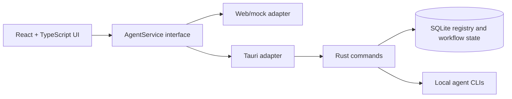

<div align="center">

<strong></strong>
[](README.zh-CN.md)
[](README.ja.md)

</div>

# VaneHub AI

Desktop-first workspace for managing and switching between AI coding agents.

[](package.json)
[](src-tauri/Cargo.toml)
[](package.json)
[](https://github.com/cdavid817/vanehub-ai/actions/workflows/package.yml)
[](#license)

## Overview

VaneHub AI is a Tauri desktop application with a React UI for coordinating AI coding agents such as Claude Code, OpenCode, Codex CLI, and Gemini CLI. It keeps agent metadata, availability, interaction modes, workflow state, and session details behind a shared service boundary so the same UI can run in the desktop runtime or in a browser preview.

Core capabilities currently present in the repository:

- Registered agent catalog with stable IDs, providers, launch metadata, capability tags, and supported interaction modes.
- Agent availability checks for local CLI/native tools before selection or launch.
- Active agent and interaction mode switching through a React settings page.
- Browser, native desktop, and CLI interaction-mode routing behind the same `AgentService` contract.
- UCD-aligned settings center with Basic, Providers, SDK, MCP, Agents, and Skills pages.
- Switchable `futuristic` and `minimal` visual styles persisted in frontend-local storage.
- Local and GitHub Actions Tauri packaging scripts for Windows, macOS, and Linux targets.

## Architecture and Stack



Main technologies:

- Frontend: React 18, TypeScript, Vite, Tailwind CSS, lucide-react, Vitest.
- Desktop runtime: Tauri 2 with Rust.
- Local storage: SQLite through `rusqlite`.
- Browser automation dependency: Playwright configuration is present for browser interaction workflows.
- CI packaging: GitHub Actions workflow in `.github/workflows/package.yml`.

React components are expected to use the service interfaces in `src/services/` rather than calling Tauri `invoke()` directly.

## Prerequisites

- Node.js 22+ and npm.
- Rust stable and Cargo.
- Tauri system prerequisites for your platform.
- Windows desktop builds: Microsoft C++ Build Tools with MSVC, Windows SDK, and WebView2 Runtime.
- Linux desktop builds: WebKitGTK and related native packages used by the packaging workflow.
- macOS desktop builds: Xcode command line tools.

## Installation

```powershell
npm install
```

## Quick Start

Run the browser preview:

```powershell
npm run dev -- --host 127.0.0.1
```

Open:

```text
http://127.0.0.1:1420/
```

Run the Tauri desktop app:

```powershell
$env:PATH="$env:USERPROFILE\.cargo\bin;$env:PATH"
npm run tauri -- dev
```

Build and package the desktop app for the current host platform:

```powershell
npm run package
```

Generated Tauri bundle artifacts are written under `src-tauri/target/release/bundle/` or the target-specific `src-tauri/target/<rust-target>/release/bundle/` directory.

## Configuration

Project configuration is stored in the repository:

- `package.json`: npm scripts, frontend dependencies, and package version `0.1.0`.
- `src-tauri/Cargo.toml`: Rust package metadata and dependencies.
- `src-tauri/tauri.conf.json`: Tauri product name, app identifier, window settings, bundle settings, and version `0.1.0`.
- `tailwind.config.ts` and `src/styles.css`: theme tokens and UI styling.
- `.github/workflows/package.yml`: manual and tag-triggered desktop packaging workflow.

Runtime state is created locally by the Tauri backend under `.vanehub/vanehub.sqlite` from the current working directory. No required environment variables were found in the repository.

## Project Structure

```text
src/
  main-layout/          Main workspace UI
  settings/             Settings shell and pages
  services/             AgentService boundary and runtime adapters
  theme/                Theme registry and provider
  types/                Shared TypeScript types
src-tauri/
  src/                  Rust Tauri commands, SQLite registry, launch routing
  tauri.conf.json       Desktop app and bundling configuration
openspec/
  specs/                Current behavior specifications
  changes/archive/      Completed change history and task evidence
.github/workflows/
  package.yml           Desktop packaging workflow
ucd/
  futuristic/, minmal/  UCD reference assets
```

## Roadmap

Issue data was not available in the local environment because the GitHub CLI is not installed. The checklist below is based on committed code, OpenSpec specs, archived task lists, and repository configuration. Please confirm priorities for planned work.

### Implemented Core Features

- [x] Tauri + React + TypeScript desktop application scaffold.
- [x] SQLite-backed agent registry and persisted workflow state.
- [x] Initial agent entries for Claude Code, OpenCode, Codex CLI, and Gemini CLI.
- [x] Agent listing, stable ID lookup, capability filtering, and availability status.
- [x] Active agent selection with compatible interaction-mode validation.
- [x] Browser, native desktop, and CLI interaction-mode lifecycle routing.

### Settings and UI

- [x] UCD-aligned settings center shell.
- [x] Basic Configuration, Provider Management, SDK Dependencies, MCP Servers, Agents, and Skills pages.
- [x] Agents page integration through `AgentService` without direct React-to-Tauri calls.
- [x] Switchable `futuristic` and `minimal` themes with local persistence.

### Packaging and Validation

- [x] Local package scripts for host and architecture-specific Tauri builds.
- [x] GitHub Actions packaging matrix for Windows, macOS, and Linux on x64 and ARM64 targets.
- [x] Frontend unit tests and Rust tests for registry/service behavior.
- [x] OpenSpec validation records for completed changes.

### Planned / Needs Confirmation

- [ ] Confirm project license and add a `LICENSE` file.
- [ ] Add `CONTRIBUTING.md` with branch, test, and review expectations.
- [ ] Decide whether release builds should remain unsigned or add Windows signing and macOS notarization.
- [ ] Replace frontend-local demo data for Providers, SDK, MCP, and Skills pages with real service boundaries where needed.
- [ ] Confirm roadmap priority from GitHub issues or project planning.

## Development

Useful validation commands:

```powershell
npm run test
npm run build
$env:PATH="$env:USERPROFILE\.cargo\bin;$env:PATH"
cargo test --manifest-path src-tauri\Cargo.toml
cargo check --manifest-path src-tauri\Cargo.toml
```

If OpenSpec is installed locally:

```powershell
openspec validate --specs --strict
```

## Contributing

`CONTRIBUTING.md` is not present yet. Please confirm whether it should be generated with the repository's expected workflow, test commands, and review rules.

Until then, keep changes scoped, run the relevant validation commands above, and preserve the `AgentService` boundary between React components and runtime-specific backends.

## License

No `LICENSE` file or license field was found in the repository. The license needs to be confirmed before redistribution or public release.
