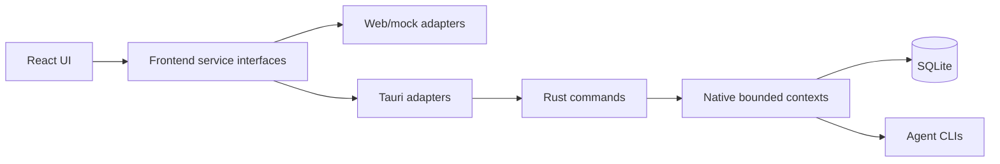

<div align="center">

**English**
· [简体中文](README.zh-CN.md)
· [日本語](README.ja.md)

</div>

<!-- docs-section:hero -->

# VaneHub AI

<p align="center">
  
</p>

Desktop-first workspace for managing AI coding agents through one React interface and explicit Web/mock and Tauri runtime boundaries.

<!-- docs-fact:project-version value:1.4.0 -->
<!-- docs-fact:tauri-major value:2.x -->
<!-- docs-fact:react-major value:19.x -->

[](package.json)
[](src-tauri/Cargo.toml)
[](package.json)
[](https://github.com/cdavid817/vanehub-ai/actions/workflows/ci.yml)
[](LICENSE)

<!-- docs-section:overview -->

## Overview

VaneHub AI brings Claude Code, OpenCode, Codex CLI, Gemini CLI, and Antigravity CLI into a shared desktop workspace. It manages CLI availability, sessions, terminal execution, projects and worktrees, settings, tools, observability, and desktop integrations without letting React components depend directly on native APIs.

### Supported CLIs

One is enough to start. You do not need all five.

| Agent | Provider | Command | Model family | In-app install | Third-party model endpoint |
| --- | --- | --- | --- | --- | --- |
| Claude Code | Anthropic | `claude` | Anthropic | ✅ `@anthropic-ai/claude-code` | ✅ |
| Codex CLI | OpenAI | `codex` | OpenAI | ✅ `@openai/codex` | ✅ |
| OpenCode | OpenCode (open source) | `opencode` | Unknown | ✅ `opencode-ai` | ✅ |
| Gemini CLI | Google | `gemini` | Google | ✅ `@google/gemini-cli` | ⚠️ Custom endpoint allowed, but the catalog ships only the official preset |
| Antigravity CLI | Google | `agy` | Google | ❌ No npm package; use the official installer script | ❌ Google sign-in only |

- In-app install means VaneHub AI can install and upgrade the CLI for you from Settings → CLI management. It drives npm, WinGet on Windows, and per-CLI audited vendor installers. A copy that came from Homebrew, Bun, Volta, a desktop bundle, or a system package is detected and reported but never changed — VaneHub names the tool that owns it instead of installing a second copy beside it.
- Third-party model endpoint means the CLI can be pointed at a compatible endpoint such as DeepSeek or OpenRouter from Settings → Agent configurations. **Vendor subscription login (OAuth) always happens in your terminal**; VaneHub AI does not broker it.
- OpenCode's model family is "Unknown" by decision, not omission: it drives whichever model you configured, so it has no fixed family, and policies such as "require a reviewer from a different model family" do not apply to it.
- Gemini CLI is being replaced by Antigravity CLI. Google began phasing it out for personal and free accounts on 2026-06-18.
- If you would rather install no CLI at all, the built-in native API Agent OnePiece calls model providers over HTTP entirely inside the application. See the user guide below.

### Supported model providers

Twenty-five providers ship as configuration templates, shared by OnePiece and three of the CLI Agents. Anything outside the catalog can be added as a custom compatible endpoint.

| Category | Providers |
| --- | --- |
| Official | Anthropic, OpenAI |
| Aggregators and cloud platforms | OpenRouter, SiliconFlow, Alibaba Bailian, Volcengine Ark, Together AI, Fireworks AI, NVIDIA NIM, ModelScope, PPIO, Qiniu AI |
| Model vendors | DeepSeek, Zhipu GLM, Kimi / Moonshot, xAI, Mistral AI, MiniMax, MiniMax Global, StepFun, Baichuan AI, Xiaomi MiMo, Z.AI |
| Inference accelerators | Groq, Cerebras |

**Which Agent a provider can serve depends on the endpoint protocols it offers**: the 16 providers speaking Anthropic Messages can back Claude Code, and the 24 speaking OpenAI Chat Completions can back Codex CLI and OpenCode.

The full catalog — vendor icons, endpoint protocols, default models, and API key links — is in the [built-in model provider catalog](docs/model-providers.md) (Simplified Chinese).

<!-- docs-section:download -->

## Download

Prebuilt desktop packages are published on the [Releases page](https://github.com/cdavid817/vanehub-ai/releases): a signed Windows x64 `.exe` installer, signed and notarized macOS x64 and Apple Silicon `.dmg` files, and Linux x64 and ARM64 `.deb` and AppImage builds. No `.msi` or `.rpm` is published.

Verify downloads against the published `SHA256SUMS`, SPDX SBOM, and GitHub attestations. Linux packages carry integrity and provenance evidence but do not use operating-system code signing.

<!-- docs-section:documentation -->

## Documentation

<!-- docs-locale-guides -->

### User guide

| Topic | Entry |
| --- | --- |
| Quick start | [Five steps from installing a CLI to working in a workspace](docs/user-guide/en/src/quick-start.md) |
| Basic configuration | [Interface language, theme, font size, default policy template, launch at login, network proxy, data directory, log directory](docs/user-guide/en/src/user-interface.md#basic-configuration) |
| User interface overview | [Main layout, navigation, panel toggles, session/conversation/workspace tabs/info panel](docs/user-guide/en/src/user-interface.md) |
| Session list | [Grouping/search/filter/batch/drag, context menu, focus mode](docs/user-guide/en/src/user-interface.md#session-list) |
| Floating assistant | [Standalone floating window session, status badge, main action menu](docs/user-guide/en/src/user-interface.md#floating-assistant) |
| Loop center | [Loop run controls, verification command, timeline](docs/user-guide/en/src/loop-engineering.md) |
| OnePiece Plan mode | [Read-only planning and approved transition to Agent mode](docs/user-guide/en/src/user-interface.md#onepiece-plan-mode) |
| Goal Center | [Track scattered execution items in one place](docs/user-guide/en/src/goal-management.md) |
| Todo Board | [Board view and stage transitions for work items](docs/user-guide/en/src/todo-board.md) |
| Agent evaluation | [Run several Agents head-to-head on the same task; compare pass rate, tokens, and time](docs/user-guide/en/src/evaluation.md) |
| Notification center | [Bell, unread count, mark all read, clear](docs/user-guide/en/src/user-interface.md#notifications) |
| System tray | [Show/hide main window, startup, notification integration](docs/user-guide/en/src/user-interface.md#system-tray) |
| CLI management, install & auth | [Two install methods, authentication, install detection, conflict diagnostics, upgrades](docs/user-guide/en/src/getting-started.md) |
| Multi-Agent group chat | [Seats, `@` handoff, turn bounds](docs/user-guide/en/src/multi-agent-workflow.md) |
| Git worktrees | [Parallel changes to one repository without stepping on each other](docs/user-guide/en/src/worktree.md) |
| Code review | [The review center and review flow](docs/user-guide/en/src/code-review.md) |
| Slash commands | [In-session command entry points](docs/user-guide/en/src/slash-commands.md) |
| Memory and context | [Cross-session memory and context compaction](docs/user-guide/en/src/memory-and-context.md) |
| Code indexing | [Workspace code indexing and its privacy boundary](docs/user-guide/en/src/code-indexing.md) |
| LSP code intelligence | [The live language server and its trust model](docs/user-guide/en/src/lsp-code-intelligence.md) |
| OnePiece native Agent | [The built-in API Agent usable without installing a CLI](docs/user-guide/en/src/native-agent.md) |
| Scheduled tasks | [Scheduled tasks and usage statistics](docs/user-guide/en/src/automation.md) |
| Remote workspaces & SSH connections | [SSH workspaces, saved connections, and IM access](docs/user-guide/en/src/remote-and-im.md) |
| CLI parameters | [Per-CLI-Agent launch parameters, with a per-CLI parameter quick reference](docs/user-guide/en/src/tooling.md#cli-parameters) |
| Extension capabilities | [Local extension install/enable/disable](docs/user-guide/en/src/tooling.md#extension-capabilities) |
| Plugin integration | [Built-in product integrations and readiness checks](docs/user-guide/en/src/plugin-integration.md) |
| MCP servers | [MCP server configuration and per-Agent binding](docs/user-guide/en/src/mcp.md) |
| Agent configurations | [Provider, endpoint, and model per Agent](docs/user-guide/en/src/tooling.md#agent-configurations) |
| Expert roles | [Role fields, responsibilities, and review policy](docs/user-guide/en/src/expert-roles.md) |
| Agent policies | [Agent permission policies and approval template configuration](docs/user-guide/en/src/permissions.md) |
| Personalization | [Custom instructions and cross-session memory](docs/user-guide/en/src/personalization.md) |
| Skill management | [Skill installation and binding](docs/user-guide/en/src/skill-management.md) |
| Prompt Hooks | [Hook management](docs/user-guide/en/src/prompt-hooks.md) |
| IM connectors | [IM connector configuration](docs/user-guide/en/src/remote-and-im.md#im-connectors) |
| Execution observability | [Execution tracing and log collection policy](docs/user-guide/en/src/observability.md) |
| Usage statistics | [Token usage statistics](docs/user-guide/en/src/automation.md) |
| About | [Version, update check, changelog, and repository links](docs/user-guide/en/src/app-updates.md) |
| Troubleshooting | [Check here first when something fails](docs/user-guide/en/src/troubleshooting.md) |
| Reporting issues | [Which entry point to use, what the forms need, and how to redact before submitting](docs/user-guide/en/src/reporting-issues.md) |

### Developer guide

| Topic | Entry |
| --- | --- |
| Repository layout | [Repository layout and module ownership](docs/developer-guide/src/repository-orientation.md) |
| Runtime boundaries | [Frontend service boundaries, Web/mock and Tauri adapters](docs/developer-guide/src/runtime-boundaries.md) |
| Bounded contexts | [What each native bounded context owns](docs/developer-guide/src/native-contexts.md) |
| Agent lifecycle & provider runtime | [Registered Agent edits, stable provider resolution, capability declarations](docs/developer-guide/src/agent-lifecycle.md) |
| Terminal & PTY runtime | [Session-scoped Agent Terminal, auto-start/attach, remote terminals](docs/developer-guide/src/terminal-runtime.md) |
| Tool registry & execution | [Fixed native tool catalog, per-interface_format translation, multi-turn tool loop](docs/developer-guide/src/tool-registry.md) |
| Permission model | [Unified decision point, explicit-Deny-first, approval broker, CLI flag projection, Claude Code hook bridge](docs/developer-guide/src/permission-model.md) |
| Context compaction | [Token-aware trigger and character fallback, summarization compaction, recent turns kept](docs/developer-guide/src/context-compaction.md) |
| Retrieval & vector search | [Host-level shared memory pool, workspace code index, graceful degradation](docs/developer-guide/src/retrieval.md) |
| Tree-sitter code indexing | [Grammar parsing, bounded chunks, symbol metadata, grammar version, redaction](docs/developer-guide/src/tree-sitter-code-indexing.md) |
| Cross-session memory | [Host-level shared pool, provenance metadata, OnePiece tool vs CLI auto-extraction](docs/developer-guide/src/cross-session-memory.md) |
| Session recovery | [Recovery status orthogonal to lifecycle, durable execution identity and ownership](docs/developer-guide/src/session-recovery.md) |
| OnePiece native Agent | [Built-in API Agent identity, Profile lifecycle, provider directory](docs/developer-guide/src/onepiece-native-agent.md) |
| Multi-Agent group chat | [Seat model, mid-session add/remove, turn routing, durable presence](docs/developer-guide/src/multi-agent-group-chat.md) |
| Skill management | [Dual scope, SKILL.md contract, drift, built-in seeding/reconciliation](docs/developer-guide/src/skill-management.md) |
| MCP tools & clients | [Transport and configuration model, MCP tools in the native catalog](docs/developer-guide/src/mcp-tools.md) |
| IM connectors | [Five built-in connectors, first-version direct-message scope, inbound routing](docs/developer-guide/src/im-connectors.md) |
| Loop & Plan runtimes | [Durable Loop definitions, topology-aware serial subtask scheduling, Worker/Verifier trust](docs/developer-guide/src/loop-and-plan-runtime.md) |
| Usage statistics | [Reported tokens vs estimated characters, time ranges, per-Agent breakdown](docs/developer-guide/src/usage-statistics.md) |
| LSP code intelligence | [In-session LSP integration implementation](docs/developer-guide/src/lsp-code-intelligence.md) |
| Persistence & logging | [SQLite ownership and unified redacted logs](docs/developer-guide/src/persistence-and-logging.md) |
| Testing & release | [Testing, packaging, and release flow](docs/developer-guide/src/testing-and-release.md) |
| OpenSpec workflow | [Proposal→design→delta spec→tasks→validation→archive change flow](docs/developer-guide/src/openspec-workflow.md) |
| Native API reference | [Rustdoc-generated internal contract and ownership documentation](docs/developer-guide/src/native-api-reference.md) |
| Architecture decisions | [Repository layout and module orientation, bounded contexts and call relationships](docs/developer-guide/src/repository-orientation.md) |

User guides are available in English and Simplified Chinese. Japanese, Traditional Chinese, and Korean are delivered as application UI resource locales only; no user guide is provided for those locales.

<!-- /docs-locale-guides -->

<!-- docs-section:architecture -->

## Architecture


```mermaid
flowchart LR
  UI[React UI] --> Service[Frontend service interfaces]
  Service --> Web[Web/mock adapters]
  Service --> Tauri[Tauri adapters]
  Tauri --> Commands[Rust commands]
  Commands --> Contexts[Native bounded contexts]
  Contexts --> SQLite[(SQLite)]
  Contexts --> CLI[Agent CLIs]
```

React components call services in `src/services/`. Tauri-specific `invoke()` calls stay in frontend Tauri adapters, while SQLite, CLI processes, filesystem access, and desktop lifecycle behavior stay in Rust.

<!-- docs-section:quick-start -->

## Run from source

<!-- docs-fact:node-minimum value:22+ -->

Prerequisites: Node.js 22+, npm, stable Rust, and the [Tauri prerequisites](https://v2.tauri.app/start/prerequisites/) for your platform.

For platform linker requirements, release-profile behavior, worktree cache guidance, and measured build evidence, see the [native build performance guide](docs/build-performance.md).

```powershell
npm ci
```

Run Web/mock preview:

```powershell
npm run dev -- --host 127.0.0.1
```

Run the desktop application:

```powershell
$env:PATH="$env:USERPROFILE\.cargo\bin;$env:PATH"
npm run tauri:dev
```

Web/mock is a deterministic browser simulation. It does not claim local CLI execution, SQLite persistence, filesystem changes, or operating-system side effects.

<!-- docs-section:development -->

## Development

Run every command in the「校验命令」(validation commands) section of AGENTS.md verbatim before submitting changes; that list is the single source of truth aligned with CI.

New features and architecture changes require an OpenSpec proposal before implementation. See [AGENTS.md](AGENTS.md) and [openspec/project.md](openspec/project.md) for project rules.

### Agent infrastructure technical documentation

| Topic | Entry |
| --- | --- |
| MCP | [protocol model and three-role architecture, transports, core primitives, lifecycle, authorization and security](docs/agent-infrastructure/mcp-architecture.md) |
| Function Calling | [the call loop and constrained decoding, Anthropic versus OpenAI API differences, parallel calls and streaming assembly, structured output](docs/agent-infrastructure/function-calling-architecture.md) |
| LSP | [protocol layering and lifecycle, capability negotiation, text synchronization, language and workspace features](docs/agent-infrastructure/lsp-architecture.md) |
| A2A | [AgentCard/Task/Message/Artifact data model, task state machine, discovery, asynchronous update channels](docs/agent-infrastructure/a2a-architecture.md) |
| Multi-Agent systems | [orchestration topologies and role frameworks, communication, context management, execution isolation, failure modes](docs/agent-infrastructure/multi-agent-architecture.md) |
| Agent Skills | [the open specification and file format, progressive-disclosure loading, triggering and execution, comparison with MCP and prompts](docs/agent-infrastructure/agent-skills-architecture.md) |
| RAG | [indexing and retrieval pipelines, semantic versus keyword retrieval, hybrid retrieval and reranking, evaluation](docs/agent-infrastructure/rag-architecture.md) |
| Tree-sitter | [GLR incremental parsing, grammar toolchain and ABI, the query system, structured code chunking and repo maps](docs/agent-infrastructure/tree-sitter-architecture.md) |
| OpenSpec | [the knowledge model behind spec-driven development, change-package artifact chains, the opsx command family, delta spec merging](docs/agent-infrastructure/openspec-architecture.md) |

Reference: [native architecture inventory](src-tauri/ARCHITECTURE.md) · [CLI parameter reference](docs/reference/cli/builtin-cli-reference.md) · [contributing](CONTRIBUTING.md) · [native build performance](docs/build-performance.md) · [release signing](docs/release-signing.md)

Build the mdBook guides and Rustdoc reference:

```powershell
npm run docs:check
npm run docs:test
npm run docs:build
```

The documentation build requires the mdBook version pinned in `docs/toolchain.json`.

<!-- docs-section:roadmap -->

## Roadmap

Implemented work and current contracts are recorded in [OpenSpec main specifications](openspec/specs/). Near-term product work includes custom Agents and a plugin marketplace. Local OCR, speech-to-text, and text-to-speech already run on the local machine; the remaining work there is engine and platform coverage, install automation, and real-device qualification.

<!-- docs-section:contributing -->

## Contributing

Read [CONTRIBUTING.md](CONTRIBUTING.md) before opening a change. Keep documentation, both frontend runtime adapters, native contracts, tests, and OpenSpec artifacts aligned with the behavior you change.

<!-- docs-section:license -->

## License

Licensed under the Apache License 2.0. See [LICENSE](LICENSE).
