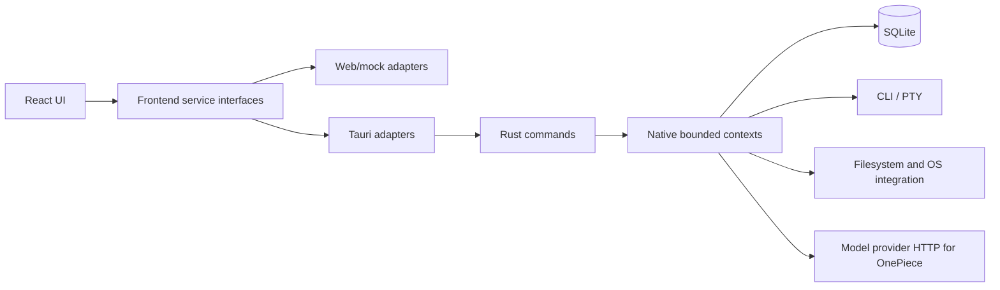

<div align="center">

**English**
· [简体中文](README.zh-CN.md)
· [日本語](README.ja.md)

</div>

<!-- docs-section:hero -->

# VaneHub AI

<p align="center">
  
</p>

A desktop-first workbench for AI coding agents: use and manage OnePiece, Claude Code, Codex CLI, OpenCode, Gemini CLI, and Antigravity CLI in one unified interface.

<!-- docs-fact:project-version value:1.4.0 -->
<!-- docs-fact:tauri-major value:2.x -->
<!-- docs-fact:react-major value:19.x -->

[](package.json)
[](src-tauri/Cargo.toml)
[](package.json)
[](https://github.com/cdavid817/vanehub-ai/actions/workflows/ci.yml)
[](LICENSE)

[Download](https://github.com/cdavid817/vanehub-ai/releases) · [Quick start](#quick-start) · [Documentation](#documentation)

<!-- docs-section:overview -->

## Overview

Working with several AI coding agents scatters sessions, projects, terminals, permissions, and cost across tools. VaneHub AI puts them in one desktop workbench: unified sessions and workspaces, unified permission approvals, unified observability and usage accounting, and multi-agent collaboration across vendors.

It supports two kinds of agents — **pick one path to start; you do not need to install every CLI**:

- **OnePiece** — the built-in native API agent that calls model providers over HTTP directly, requiring no external CLI at all;
- **External CLI agents** — Claude Code, Codex CLI, OpenCode, Gemini CLI, and Antigravity CLI, installed by you and authenticated through each vendor's own flow in your terminal.

<!-- docs-section:features -->

## Core capabilities

- **One entry point for every agent** — the OnePiece native API agent and five external CLI agents share sessions, configuration, permissions, and observability.
- **Sessions and workspaces** — projects, interactive terminals (PTY), Git worktrees, remote workspaces over SSH.
- **Multi-agent collaboration** — group-chat seats with `@` handoff, expert roles, Loop automatic iteration, Plan mode, goals and the work board.
- **Context and code intelligence** — context compaction, cross-session memory, personalization, retrieval, workspace code indexing, LSP code intelligence.
- **Extensibility** — Skills, MCP servers, Prompt Hooks, local extensions, plugin integrations, IM connectors, local media (OCR, speech recognition and synthesis).
- **Governance and operations** — permission templates with per-call approvals, execution observability, unified logging, agent evaluation, scheduled tasks, usage statistics.

<!-- docs-section:agents -->

## Agents and CLI support

| Agent | Kind | Command | Model source | In-app install | Authentication and model configuration |
| --- | --- | --- | --- | --- | --- |
| OnePiece | Built-in native API agent | No CLI needed | Provider catalog or a custom compatible endpoint | Ships with the app | Configure provider and API key in-app |
| Claude Code | External CLI | `claude` | Anthropic | ✅ npm / WinGet / vendor installer | Terminal OAuth; third-party compatible endpoints configurable in-app |
| Codex CLI | External CLI | `codex` | OpenAI | ✅ npm | Terminal OAuth; third-party compatible endpoints configurable in-app |
| OpenCode | External CLI | `opencode` | Whatever model you configure; no fixed family | ✅ npm / vendor installer | Terminal auth; third-party compatible endpoints configurable in-app |
| Gemini CLI | External CLI | `gemini` | Google | ✅ npm | Terminal auth; endpoint editable, catalog ships the official preset only |
| Antigravity CLI | External CLI | `agy` | Google | ✅ vendor installer (latest only) | Terminal Google sign-in; the CLI itself also supports API keys and compatible endpoints, which VaneHub does not yet manage in unified provider configuration |

- **In-app install** means VaneHub AI can install and upgrade the CLI from Settings → CLI Management: it drives npm, WinGet on Windows, and per-CLI audited vendor installers. A copy that came from Homebrew, Bun, Volta, a desktop bundle, or a system package is detected and reported but never changed.
- **Vendor subscription login (OAuth) always happens in your terminal**; VaneHub AI neither brokers nor stores subscription credentials.
- The integrated OpenCode is the open-source sst/opencode (npm package `opencode-ai`); it drives whichever model you configure, so policies like "require a reviewer from a different model family" do not apply to it.
- Gemini CLI's consumer path is narrowing: Google announced that from 2026-06-18, consumer accounts such as Gemini Code Assist Individuals and Google AI Pro/Ultra are no longer served through Gemini CLI and their "Login with Google" path is unavailable, with migration to Antigravity recommended; Gemini Code Assist Standard and Enterprise are unaffected. API keys and Vertex are separate authentication paths — refer to Google's official documentation.

**Model providers**: the app ships a provider configuration catalog shared by OnePiece and the CLI agents that accept third-party endpoints; anything outside the catalog can be added as a custom compatible endpoint, with API keys stored in the operating-system credential service. The full vendor list, endpoint protocols, and default models are in the [built-in model provider catalog](docs/model-providers.md) (Simplified Chinese).

<!-- docs-section:quick-start -->

## Quick start

1. Download and install the desktop package for your platform from the [Releases page](https://github.com/cdavid817/vanehub-ai/releases).
2. Pick one: configure a model provider and API key for OnePiece in Settings → Agent Configurations; or install any one supported external CLI, authenticate it in your terminal, then refresh detection in Settings → CLI Management.
3. Click New, choose an agent and a project folder, and create your first session.
4. Send your first task from the session workspace input box.

For details, see the user guide's quick start, CLI installation and authentication, and first-session chapters (the [Documentation](#documentation) section below).

<!-- docs-section:download -->

## Download, platforms, and release integrity

Prebuilt desktop packages are published on the [Releases page](https://github.com/cdavid817/vanehub-ai/releases):

| Platform | Architecture | Format |
| --- | --- | --- |
| Windows | x64 | NSIS `.exe` installer |
| macOS | x64, Apple Silicon | `.dmg` |
| Linux | x64, ARM64 | `.deb`, AppImage |

No `.msi` or `.rpm` is published; the NSIS installer and the AppImage serve those users respectively.

**Keep three signing facts apart**:

- **Release integrity** — every release ships `SHA256SUMS`, an SPDX SBOM, and GitHub attestations for integrity and provenance verification;
- **Auto-update artifacts** — Tauri updater artifacts carry updater signatures;
- **Operating-system code signing** — **Windows Authenticode signing and macOS Developer ID signing/notarization are not yet in place** (a later phase), so Windows SmartScreen and macOS Gatekeeper may warn about the installers; the release notes carry per-platform handling steps.

Verification steps, the credential inventory, and the signing roadmap are in [release signing](docs/release-signing.md).

<!-- docs-section:runtimes -->

## Runtime modes

| Runtime | Purpose | Capabilities |
| --- | --- | --- |
| **Tauri desktop runtime** | Real use | Real CLI/PTY execution, SQLite persistence, filesystem access, desktop lifecycle and system integration, and the implemented local capabilities such as local media |
| **Web/mock runtime** | Deterministic UI preview, documentation screenshots, frontend development | An in-browser simulation — **no** real CLI execution, database persistence, file modification, or any system side effects happen |

Web/mock screens and simulated states are not evidence that a desktop feature passed real-environment verification.

<!-- docs-section:documentation -->

## Documentation

<!-- docs-locale-guides -->

### User guide

The [user guide](docs/user-guide/en/src/index.md) has the complete chapter list in its sidebar; the table below lists only each group's entry point.

| Group | Start here | Covers |
| --- | --- | --- |
| Getting started | [Quick Start](docs/user-guide/en/src/quick-start.md) | Installing and authenticating a CLI, the first session, core concepts, app updates |
| Interface and workspaces | [User interface](docs/user-guide/en/src/user-interface.md) | The session workspace, the settings center, remote workspaces and SSH, Git worktrees, slash commands |
| Agents and collaboration | [OnePiece (native agent)](docs/user-guide/en/src/native-agent.md) | Multi-agent group chat, expert roles, Loop, goals and the work board, code review, agent evaluation |
| Context and code intelligence | [Memory and context](docs/user-guide/en/src/memory-and-context.md) | Personalization, code indexing, LSP code intelligence |
| Tools and integrations | [Agent and CLI configuration](docs/user-guide/en/src/agent-configuration.md) | Skills, MCP, Prompt Hooks, local extensions, local media, plugin integrations, IM connectors |
| Governance and operations | [Permission approvals](docs/user-guide/en/src/permissions.md) | Observability, scheduled tasks and notifications, usage statistics |
| Help and reference | [Troubleshooting](docs/user-guide/en/src/troubleshooting.md) | Use cases, FAQ, reporting issues |

### Developer guide

The [developer guide](docs/developer-guide/src/index.md) has the complete chapter list in its sidebar; the table below lists only each domain's entry point.

| Domain | Start here | Covers |
| --- | --- | --- |
| Orientation and runtime boundaries | [Repository orientation](docs/developer-guide/src/repository-orientation.md) | Runtime and service boundaries, native bounded contexts, persistence ownership |
| Agent runtime | [Single-Agent governance: the five control planes](docs/developer-guide/src/single-agent-control-planes.md) | Agent lifecycle, OnePiece, built-in tools, the tool registry, CLI lifecycle, terminal and PTY, CLI delegation, group chat, Loop and Plan, the work board, session recovery |
| Workspace and platform capabilities | [SSH connections and the remote runtime](docs/developer-guide/src/ssh-connections.md) | The local media runtime |
| Context, memory, and code intelligence | [Cross-session memory](docs/developer-guide/src/cross-session-memory.md) | Context compaction, personalization governance, retrieval and vector search, Tree-sitter indexing, LSP |
| Skills and external integrations | [Skill management](docs/developer-guide/src/skill-management.md) | The effective Skill runtime, overlay governance, evolution evidence, MCP tools, IM connectors |
| Security, evaluation, and observability | [Permission model](docs/developer-guide/src/permission-model.md) | Execution observability, the evaluation runtime, the evidence console, unified logging, usage statistics |
| Engineering delivery | [Testing](docs/developer-guide/src/testing.md) | The OpenSpec workflow, release, live qualification |
| Generated reference and architecture decisions | [Native API reference](docs/developer-guide/src/native-api-reference.md) | The contract and ownership reference generated from source, Skill tool runtime security |

User guides are available in English and Simplified Chinese. Japanese, Traditional Chinese, and Korean are delivered as application UI resource locales only; no user guide is provided for those locales.

<!-- /docs-locale-guides -->

<!-- docs-section:architecture -->

## Architecture overview


```mermaid
flowchart LR
  UI[React UI] --> Service[Frontend service interfaces]
  Service --> Web[Web/mock adapters]
  Service --> Tauri[Tauri adapters]
  Tauri --> Commands[Rust commands]
  Commands --> Contexts[Native bounded contexts]
  Contexts --> SQLite[(SQLite)]
  Contexts --> CLI[CLI / PTY]
  Contexts --> FS[Filesystem and OS integration]
  Contexts --> HTTP[Model provider HTTP for OnePiece]
```

React components call only the frontend service interfaces in `src/services/` and never call Tauri `invoke()` directly; Tauri-specific calls live in the frontend Tauri adapters, while SQLite, CLI processes, filesystem access, and desktop lifecycle behavior all live in Rust. The full module inventory is in the [native architecture inventory](src-tauri/ARCHITECTURE.md).

<!-- docs-section:from-source -->

## Run from source and develop

<!-- docs-fact:node-minimum value:22+ -->

Prerequisites: Node.js 22+, npm, stable Rust, and the [Tauri prerequisites](https://v2.tauri.app/start/prerequisites/) for your platform. Platform linker requirements and build measurements are in the [native build performance guide](docs/build-performance.md).

```bash
npm ci
```

Run the Web/mock preview (an in-browser simulation — see [Runtime modes](#runtime-modes) above):

```bash
npm run dev -- --host 127.0.0.1
```

Run the real desktop application:

```bash
npm run tauri:dev
```

> Windows troubleshooting: if the desktop launch cannot find the Rust toolchain, temporarily add cargo to PATH in PowerShell and retry:
>
> ```powershell
> $env:PATH="$env:USERPROFILE\.cargo\bin;$env:PATH"
> ```

Before submitting changes, run every command in the validation-commands section of [AGENTS.md](AGENTS.md) verbatim; new features and architecture changes require an OpenSpec proposal first — see [openspec/project.md](openspec/project.md).

**Technical reference**: the [agent infrastructure documentation](docs/agent-infrastructure/README.md) covers **external protocols, general architecture patterns, and engineering methods themselves** — MCP, LSP, RAG, and the rest — and is not a promise of delivered VaneHub capability; judge implementation status by the user guide, the developer guide, the [OpenSpec main specifications](openspec/specs/), and the generated references. See also the [CLI parameter reference](docs/reference/cli/builtin-cli-reference.md) and [release signing](docs/release-signing.md).

<!-- docs-section:roadmap -->

## Project status and roadmap

- **Delivered** — implemented behavior and interface contracts are recorded in the [OpenSpec main specifications](openspec/specs/); usage is covered by the user guide.
- **In progress** — see the [unarchived OpenSpec changes](openspec/changes/): current work includes expanding the built-in Skill catalog, remote Skill registry and supply-chain governance, hardening governed cross-session memory, region screenshot capture, and first-stable-release preparation.
- **Planned** — listed only when a public proposal or issue exists; this section promises no dates.
- Some capabilities (individual IM connector platforms, the per-platform desktop matrix) are qualified by live-environment records — see the developer guide's engineering delivery domain.

<!-- docs-section:support -->

## Support and security

- Usage questions and defects: read the [support notes](SUPPORT.md) first, then file a bug report or feature request through the issue forms.
- **Never report a security vulnerability as a public issue**: use [GitHub private vulnerability reporting](https://github.com/cdavid817/vanehub-ai/security/advisories/new); the process is in the [security policy](SECURITY.md).
- Community participation follows the [code of conduct](CODE_OF_CONDUCT.md).

<!-- docs-section:contributing -->

## Contributing

Read the [contributing guide](CONTRIBUTING.md) before opening a change. Keep documentation, both frontend runtime adapters, native interface contracts, tests, and OpenSpec artifacts aligned with the behavior you change.

<!-- docs-section:license -->

## License

Licensed under the Apache License 2.0. See [LICENSE](LICENSE).
