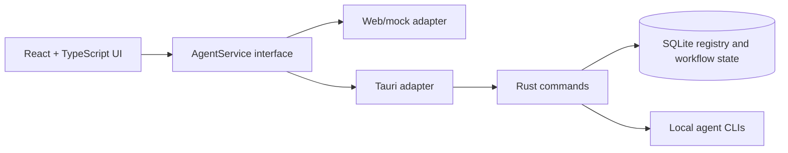

<div align="center">

[](README.md)
<strong></strong>
[](README.ja.md)

</div>

# VaneHub AI

用于管理和切换 AI Coding Agent 的桌面优先工作台。

> 这是最好的时代，这是最坏的时代；这是 AI 的时代，这是 bug 的时代。
>
> —— 致敬查尔斯・狄更斯《双城记》

> **特别提醒：** 本项目全部代码由 AI 生成，禁止手工古法编程；人类仅作为方案思考者与输出验证者。

[](package.json)
[](src-tauri/Cargo.toml)
[](package.json)
[](https://github.com/cdavid817/vanehub-ai/actions/workflows/package.yml)
[](LICENSE)

## 项目简介

VaneHub AI 是一个基于 Tauri 的桌面应用，使用 React UI 协调 Claude Code、OpenCode、Codex CLI、Gemini CLI 等 AI Coding Agent。项目通过统一的服务边界管理 Agent 元数据、可用性、交互模式、工作流状态和会话详情，因此同一套 UI 可以运行在桌面端，也可以运行在浏览器预览环境中。

仓库中当前可确认的核心能力包括：

- 带稳定 ID、Provider、启动元数据、能力标签和支持交互模式的 Agent 注册目录。
- 在选择或启动前检查本地 CLI / native 工具可用性。
- 通过 React 设置页切换当前 Agent 和交互模式。
- 在同一 `AgentService` 合约下封装 Browser、Native Desktop、CLI 交互模式路由。
- UCD 风格设置中心，包含 Basic、Providers、SDK、MCP、Agents、Skills 页面。
- 可切换的 `futuristic` / `minimal` 视觉风格，并持久化到前端本地存储。
- 三栏工作台布局，支持活动 / 分组会话导航、聊天优先主内容区和可折叠 keep-alive 信息面板。
- 工作台面板和各设置页面支持独立内部滚动，导航布局在内容滚动时保持稳定。
- 面向 Windows、macOS、Linux 的本地和 GitHub Actions Tauri 打包脚本。

## 架构与技术栈



主要技术栈：

- Frontend：React 18、TypeScript、Vite、Tailwind CSS、lucide-react、Vitest。
- Desktop runtime：Tauri 2 + Rust。
- Local storage：通过 `rusqlite` 使用 SQLite。
- Browser automation：仓库中包含用于 browser 交互工作流的 Playwright 配置。
- CI packaging：`.github/workflows/package.yml` 中的 GitHub Actions workflow。

React 组件应依赖 `src/services/` 中的服务接口，不应直接调用 Tauri `invoke()`。

## 前置要求

- Node.js 22+ 和 npm。
- Rust stable 和 Cargo。
- 当前平台所需的 Tauri 系统依赖。
- Windows 桌面构建：Microsoft C++ Build Tools、MSVC、Windows SDK、WebView2 Runtime。
- Linux 桌面构建：WebKitGTK 以及打包 workflow 中使用的相关 native packages。
- macOS 桌面构建：Xcode command line tools。

## 安装

```powershell
npm install
```

## 快速开始

启动浏览器预览：

```powershell
npm run dev -- --host 127.0.0.1
```

打开：

```text
http://127.0.0.1:1420/
```

启动 Tauri 桌面应用：

```powershell
$env:PATH="$env:USERPROFILE\.cargo\bin;$env:PATH"
npm run tauri -- dev
```

为当前宿主平台构建并打包桌面应用：

```powershell
npm run package
```

生成的 Tauri bundle artifact 位于 `src-tauri/target/release/bundle/`，或目标平台专属的 `src-tauri/target/<rust-target>/release/bundle/` 目录。

## 配置说明

项目配置保存在仓库中：

- `package.json`：npm scripts、前端依赖和 package version `0.1.0`。
- `src-tauri/Cargo.toml`：Rust package 元数据和依赖。
- `src-tauri/tauri.conf.json`：Tauri product name、app identifier、window settings、bundle settings 和 version `0.1.0`。
- `tailwind.config.ts` 和 `src/styles.css`：theme token 和 UI 样式。
- `.github/workflows/package.yml`：手动触发和 tag 触发的桌面打包 workflow。

Tauri backend 会在当前工作目录下创建 `.vanehub/vanehub.sqlite` 保存运行时状态。仓库中未发现必需的环境变量配置。

## 项目结构

```text
src/
  main-layout/          主工作台 UI，包含会话侧边栏、聊天工作区和详情面板
  settings/             设置中心 shell 与页面
  services/             AgentService 边界与 runtime adapter
  theme/                Theme registry 与 provider
  types/                共享 TypeScript 类型
src-tauri/
  src/                  Rust Tauri commands、SQLite registry、启动路由
  tauri.conf.json       桌面应用与打包配置
openspec/
  specs/                当前行为规格
  changes/archive/      已完成变更历史和任务证据
.github/workflows/
  package.yml           桌面打包 workflow
ucd/
  futuristic/, minimal/ UCD 参考资产
```

## Todolist / Roadmap

当前环境未安装 GitHub CLI，因此无法读取 GitHub issue 列表。以下清单基于已提交代码、OpenSpec specs、归档任务列表和仓库配置整理。请确认后续计划的优先级。

### 已实现的核心功能

- [x] Tauri + React + TypeScript 桌面应用脚手架。
- [x] 基于 SQLite 的 Agent registry 和持久化 workflow state。
- [x] Claude Code、OpenCode、Codex CLI、Gemini CLI 初始 Agent 条目。
- [x] Agent 列表、稳定 ID 查询、capability 过滤和可用性状态。
- [x] 当前 Agent 选择和兼容交互模式校验。
- [x] Browser、Native Desktop、CLI 交互模式生命周期路由。

### 设置与 UI

- [x] UCD 风格设置中心 shell。
- [x] Basic Configuration、Provider Management、SDK Dependencies、MCP Servers、Agents、Skills 页面。
- [x] Agents 页面通过 `AgentService` 集成，避免 React 组件直接调用 Tauri。
- [x] 可切换并本地持久化的 `futuristic` / `minimal` 主题。
- [x] 主工作台支持活动 / 分组会话导航、聊天优先内容区、固定输入框和可折叠详情面板。
- [x] 工作台面板和设置页面内容支持独立内部滚动。

### 打包与验证

- [x] 面向宿主平台和指定架构的本地 Tauri package scripts。
- [x] GitHub Actions packaging matrix，覆盖 Windows、macOS、Linux 的 x64 和 ARM64 target。
- [x] 用于 registry / service 行为的 frontend unit tests 和 Rust tests。
- [x] 已完成变更的 OpenSpec validation 记录。

### 计划中 / 待确认

- [ ] 添加 `CONTRIBUTING.md`，说明 branch、test 和 review 规则。
- [ ] 决定 release build 是否保持 unsigned，或加入 Windows signing 与 macOS notarization。
- [ ] 根据需要将 Providers、SDK、MCP、Skills 页面的 frontend-local demo data 替换为真实 service boundary。
- [ ] 基于 GitHub issues 或项目计划确认 roadmap 优先级。

## 开发

常用验证命令：

```powershell
npm run test
npm run build
$env:PATH="$env:USERPROFILE\.cargo\bin;$env:PATH"
cargo test --manifest-path src-tauri\Cargo.toml
cargo check --manifest-path src-tauri\Cargo.toml
```

如果本地安装了 OpenSpec：

```powershell
openspec validate --specs --strict
```

## 贡献指南

仓库中尚未包含 `CONTRIBUTING.md`。请确认是否需要一并生成，并写入本项目的开发流程、测试命令和 review 规则。

在贡献指南补齐前，请保持变更范围清晰，运行相关验证命令，并保留 React 组件与 runtime-specific backend 之间的 `AgentService` 边界。

## License

本项目采用 Apache License 2.0 许可。完整许可证文本见 [LICENSE](LICENSE)。
