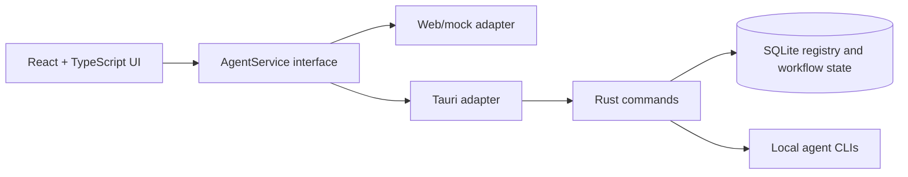

<div align="center">

[](README.md)
<strong></strong>
[](README.ja.md)

</div>

# VaneHub AI

用于管理和切换 AI Coding Agent 的桌面优先工作台。

> 这是最好的时代，这是最坏的时代；这是 AI 的时代，这是 bug 的时代。
>
> —— 致敬查尔斯・狄更斯《双城记》

> **特别提醒：** 本项目全部代码由 AI 生成，禁止手工古法编程；人类仅作为方案思考者与输出验证者。

[](package.json)
[](src-tauri/Cargo.toml)
[](package.json)
[](https://github.com/cdavid817/vanehub-ai/actions/workflows/ci.yml)
[](https://github.com/cdavid817/vanehub-ai/actions/workflows/codeql.yml)
[](https://github.com/cdavid817/vanehub-ai/actions/workflows/package.yml)
[](LICENSE)

## 项目简介

VaneHub AI 是一个基于 Tauri 的桌面应用，使用 React UI 协调 Claude Code、OpenCode、Codex CLI、Gemini CLI 等 AI Coding Agent。项目通过统一的服务边界管理 Agent 元数据、可用性、交互模式、工作流状态和会话详情，因此同一套 UI 可以运行在桌面端，也可以运行在浏览器预览环境中。

## 已实现功能

- **多 Agent CLI 管理：**检测 Claude Code、Codex CLI、Gemini CLI 和 OpenCode，展示当前 / 最新版本与冲突，提供本地环境健康检查，并为 npm 托管的 CLI 提供安全的安装、更新和卸载。
- **Agent 会话：**创建、切换、置顶、归档、恢复、删除、搜索和分类会话，导出为 JSON / Markdown，并支持崩溃恢复——全部持久化到 SQLite。
- **CLI 聊天 runtime：**由 native runtime 处理 CLI 执行、流式输出、取消和失败，并配备交互式 Agent 终端。
- **富文本聊天体验：**结构化 Rich Block 渲染、Mermaid 图表、Markdown，以及 tool-use / thinking 区块。
- **开发工作台：**为每个会话提供终端 / shell、文件、文档、Git 状态与 diff、日志、报告等标签页，外加工作区活动栏和"用 VS Code / 资源管理器 / 终端 / Git Bash / IDE 打开文件夹"入口。
- **远程工作区：**SSH 连接管理（密码 / 密钥 / agent 认证、连通性测试、加密存储）以及会话的远程工作目录。
- **设置中心：**SDK 依赖、Provider / 模型与 CLI 参数、MCP Server（含连接测试与导入导出）、带作用域的 Skills、Prompt Hook、本地 Extensions、GitHub 插件集成、用量统计、网络代理、IM Connector、浮动助手、数据管理和关于页面。
- **桌面与通信：**可后台运行的浮动助手、桌面通知、启动项控制、定时任务（cron / interval / once）以及 IM Connector 路由。
- **运行与可观测性：**用量 / token 统计、统一的脱敏日志管道、长时间操作反馈和应用内通知。
- **一致的 UI / runtime 架构：**React 通过 Web/mock 与 Tauri 的 service contract 对接，支持 `futuristic` 和 `minimal` 两种视觉风格，并内置英文 / 简体中文 UI 资源。
- **打包与供应链：**面向 Windows、macOS、Linux 的本地及 GitHub Actions Tauri 打包，包含 CI、CodeQL 和依赖 / 供应链加固。

## 架构与技术栈



主要技术栈：

- Frontend：React 18、TypeScript、Vite、Tailwind CSS、lucide-react、Vitest。
- Desktop runtime：Tauri 2 + Rust。
- Local storage：通过 `rusqlite` 使用 SQLite。
- Browser automation：仓库中包含用于 browser 交互工作流的 Playwright 配置。
- CI packaging：`.github/workflows/package.yml` 中的 GitHub Actions workflow。

React 组件应依赖 `src/services/` 中的服务接口，不应直接调用 Tauri `invoke()`。

## 前置要求

- Node.js 22+ 和 npm。
- Rust stable 和 Cargo。
- 当前平台所需的 Tauri 系统依赖。
- Windows 桌面构建：Microsoft C++ Build Tools、MSVC、Windows SDK、WebView2 Runtime。
- Linux 桌面构建：WebKitGTK 以及打包 workflow 中使用的相关 native packages。
- macOS 桌面构建：Xcode command line tools。

## 安装

```powershell
npm install
```

## 快速开始

启动浏览器预览：

```powershell
npm run dev -- --host 127.0.0.1
```

打开：

```text
http://127.0.0.1:1420/
```

启动 Tauri 桌面应用：

```powershell
$env:PATH="$env:USERPROFILE\.cargo\bin;$env:PATH"
npm run tauri -- dev
```

为当前宿主平台构建并打包桌面应用：

```powershell
npm run package
```

生成的 Tauri bundle artifact 位于 `src-tauri/target/release/bundle/`，或目标平台专属的 `src-tauri/target/<rust-target>/release/bundle/` 目录。

## 配置说明

项目配置保存在仓库中：

- `package.json`：npm scripts、前端依赖和 package version `0.1.0`。
- `src-tauri/Cargo.toml`：Rust package 元数据和依赖。
- `src-tauri/tauri.conf.json`：Tauri product name、app identifier、window settings、bundle settings 和 version `0.1.0`。
- `tailwind.config.ts` 和 `src/styles.css`：theme token 和 UI 样式。
- `.github/workflows/package.yml`：手动触发和 tag 触发的桌面打包 workflow。
- `docs/release-signing.md`：发布环境、签名、公证、校验和、SBOM 与 attestation 指南。

Tauri backend 会在当前工作目录下创建 `.vanehub/vanehub.sqlite` 保存运行时状态。仓库中未发现必需的环境变量配置。

## 项目结构

```text
src/
  main-layout/          主工作台 UI，包含会话侧边栏、聊天工作区和详情面板
  settings/             设置中心 shell 与页面
  services/             AgentService 边界与 runtime adapter
  theme/                Theme registry 与 provider
  types/                共享 TypeScript 类型
src-tauri/
  src/                  Rust Tauri commands、SQLite registry、启动路由
  tauri.conf.json       桌面应用与打包配置
openspec/
  specs/                当前行为规格
  changes/archive/      已完成变更历史和任务证据
.github/workflows/
  package.yml           桌面打包 workflow
ucd/
  futuristic/, minimal/ UCD 参考资产
```

## 路线图

### 已交付

- [x] Tauri + React 桌面应用、SQLite 持久化状态，以及 Web/mock + native 的 service contract adapter。
- [x] Claude Code、Codex CLI、Gemini CLI 和 OpenCode 的 CLI 环境检测、健康检查与生命周期管理。
- [x] 会话生命周期、搜索、分类、导出与崩溃恢复；带流式 / 取消的 CLI 聊天 runtime 和交互式 Agent 终端。
- [x] Rich Block + Mermaid 聊天渲染，以及带文件夹打开入口的多标签开发工作台。
- [x] SSH 远程工作区与连接管理。
- [x] Agents、Providers、SDK、CLI 参数、MCP、Skills、Prompt Hook、Extensions、GitHub 插件、用量、代理、IM Connector 与浮动助手的设置。
- [x] 定时任务、统一脱敏日志、通知、桌面后台生命周期，以及带 CI、CodeQL 和供应链加固的跨平台打包。

### 规划中

- [ ] **多智能体编排** —— 多 Agent 管理与多仓库开发。
- [ ] **自定义 Agent** —— OnePiece（负责需求拆解、架构设计、编码、测试、审查、修复的 Coding Multi-Agent）和 Allmate（负责问答、办公、知识检索、工具调用的通用助手）。
- [ ] **Agent 记忆** —— 跨会话的持久化记忆。
- [ ] **插件市场** —— 安装与管理 Superpowers、OpenSpec、Oh My OpenCode 等 Skill / 插件。
- [ ] **扩展本地能力** —— 在 Extension 框架之上内置 OCR、语音识别与语音合成。
- [ ] **SuperCLI**、应用内**待办清单**、聊天中的 **@文件引用**与按角色的会话标签，以及 **loop-engineering** 自动化。
- [ ] **安全与授权提示**，以及可靠性 / DFX 测试加固。
- [ ] 在受保护的 `release` 环境中配置可信的 macOS 签名 / 公证与 Windows Authenticode。
- [ ] 补充日文 runtime UI 资源（应用当前内置英文和简体中文 UI 资源）。

## 开发

常用验证命令：

```powershell
npm run test
npm run build
$env:PATH="$env:USERPROFILE\.cargo\bin;$env:PATH"
cargo test --manifest-path src-tauri\Cargo.toml
cargo check --manifest-path src-tauri\Cargo.toml
```

如果本地安装了 OpenSpec：

```powershell
openspec validate --specs --strict
```

## 贡献指南

请阅读 [CONTRIBUTING.md](CONTRIBUTING.md)，了解分支、OpenSpec、验证、评审和安全方面的约定。

## License

本项目采用 Apache License 2.0 许可。完整许可证文本见 [LICENSE](LICENSE)。
