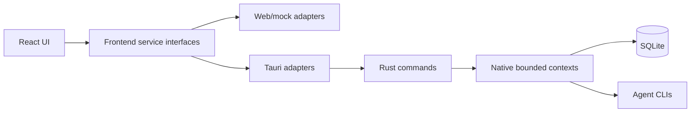

<div align="center">

[English](README.md)
· **简体中文**
· [日本語](README.ja.md)

</div>

<!-- docs-section:hero -->

# VaneHub AI

通过统一 React 界面和明确的 Web/mock、Tauri runtime 边界管理 AI Coding Agent 的桌面优先工作台。

<!-- docs-fact:project-version value:0.1.0 -->
<!-- docs-fact:tauri-major value:2.x -->
<!-- docs-fact:react-major value:19.x -->

[](package.json)
[](src-tauri/Cargo.toml)
[](package.json)
[](https://github.com/cdavid817/vanehub-ai/actions/workflows/ci.yml)
[](LICENSE)

<!-- docs-section:overview -->

## 项目简介

VaneHub AI 把 Claude Code、OpenCode、Codex CLI 和 Gemini CLI 汇集到统一桌面工作台中。它管理 CLI 可用性、会话、终端执行、项目与 worktree、设置、工具、可观测性和桌面集成，同时避免 React 组件直接依赖 native API。

<!-- docs-section:feature-status -->

## 功能状态

<!-- feature:core-workspace status:delivered -->

- **已交付：**CLI 管理、单 Agent 会话、交互式 Agent 终端、会话组织、项目/worktree 与 SSH 工作区工具、设置、MCP/SDK/Skills/Prompt Hooks/Extensions、IM Connector、定时任务、通知、用量统计、统一脱敏日志和跨平台打包。

<!-- feature:multi-agent-runtime status:preview -->

- **预览：**多 Agent 协调已具备 native 与 Web/mock service contract，支持依赖图校验、有序 fallback、持久化、取消和输出传播。

<!-- feature:multi-agent-ui status:planned -->

- **规划中：**正常创建会话 UI 仍禁用多 Agent 模式。[工作流指南](docs/user-guide/README.md)不会把尚不存在的控件描述为已交付功能。

<!-- feature:japanese-ui status:planned -->

- **规划中：**日文 runtime UI 资源。当前日文仅用于 README，应用 UI 尚不支持日文。

<!-- docs-section:architecture -->

## 架构



React 组件调用 `src/services/` 中的服务。Tauri 专属 `invoke()` 调用仅位于 frontend Tauri adapter；SQLite、CLI 进程、文件系统访问与桌面生命周期行为位于 Rust。

<!-- docs-section:quick-start -->

## 快速开始

<!-- docs-fact:node-minimum value:22+ -->

前置要求：Node.js 22+、npm、stable Rust，以及当前平台的 [Tauri 前置依赖](https://v2.tauri.app/start/prerequisites/)。

平台 linker 要求、release profile 行为、worktree 缓存建议及构建测量结果参见[原生构建性能指南](docs/build-performance.md)。

```powershell
npm ci
```

运行 Web/mock 预览：

```powershell
npm run dev -- --host 127.0.0.1
```

运行桌面应用：

```powershell
$env:PATH="$env:USERPROFILE\.cargo\bin;$env:PATH"
npm run tauri -- dev
```

Web/mock 是确定性的浏览器模拟，不代表真实发生了本地 CLI 执行、SQLite 持久化、文件修改或操作系统 side effect。

<!-- docs-section:documentation -->

## 文档

- [用户指南——English 与简体中文](docs/user-guide/README.md)
- [开发者指南源码](docs/developer-guide/src/index.md)
- [Native 架构清单](src-tauri/ARCHITECTURE.md)
- [贡献指南](CONTRIBUTING.md)
- [原生构建性能指南](docs/build-performance.md)
- [发布签名指南](docs/release-signing.md)

构建 mdBook 指南与 Rustdoc Reference：

```powershell
npm run docs:check
npm run docs:test
npm run docs:build
```

文档构建需要 `docs/toolchain.json` 中固定的 mdBook 版本。

<!-- docs-section:development -->

## 开发

```powershell
npm run lint
npm run test
npm run build
cargo test --manifest-path src-tauri/Cargo.toml
cargo check --manifest-path src-tauri/Cargo.toml
cargo clippy --manifest-path src-tauri/Cargo.toml --all-targets -- -D warnings
openspec validate --specs --strict
```

新功能和架构调整必须在实现前创建 OpenSpec proposal。项目规则见 [AGENTS.md](AGENTS.md) 与 [openspec/project.md](openspec/project.md)。

<!-- docs-section:roadmap -->

## 路线图

已交付行为和当前 contract 记录在 [OpenSpec 主规范](openspec/specs/)中。近期产品方向包括多 Agent 协调 UI、持久化 Agent memory、自定义 Agent、插件市场和扩展的本地 OCR/语音能力。

<!-- docs-section:contributing -->

## 贡献

开始变更前请阅读 [CONTRIBUTING.md](CONTRIBUTING.md)。涉及行为变更时，应同步文档、两个 frontend runtime adapter、native contract、测试与 OpenSpec 工件。

<!-- docs-section:license -->

## License

本项目采用 Apache License 2.0，详见 [LICENSE](LICENSE)。
