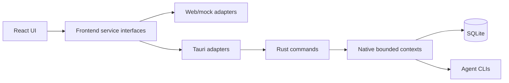

<div align="center">

[English](README.md)
· **简体中文**
· [日本語](README.ja.md)

</div>

<!-- docs-section:hero -->

# VaneHub AI

<p align="center">
  
</p>

通过统一 React 界面和明确的 Web/mock、Tauri runtime 边界管理 AI Coding Agent 的桌面优先工作台。

<!-- docs-fact:project-version value:1.4.0 -->
<!-- docs-fact:tauri-major value:2.x -->
<!-- docs-fact:react-major value:19.x -->

[](package.json)
[](src-tauri/Cargo.toml)
[](package.json)
[](https://github.com/cdavid817/vanehub-ai/actions/workflows/ci.yml)
[](LICENSE)

<!-- docs-section:overview -->

## 项目简介

VaneHub AI 把 Claude Code、OpenCode、Codex CLI、Gemini CLI 和 Antigravity CLI 汇集到统一桌面工作台中。它管理 CLI 可用性、会话、终端执行、项目与 worktree、设置、工具、可观测性和桌面集成，同时避免 React 组件直接依赖 native API。

### 支持的 CLI

装一个就能开始，不必五个都装。

| Agent | 提供方 | 命令 | 模型族 | 应用内安装 | 第三方模型端点 |
| --- | --- | --- | --- | --- | --- |
| Claude Code | Anthropic | `claude` | Anthropic | ✅ `@anthropic-ai/claude-code` | ✅ |
| Codex CLI | OpenAI | `codex` | OpenAI | ✅ `@openai/codex` | ✅ |
| OpenCode | OpenCode（开源） | `opencode` | 未知 | ✅ `opencode-ai` | ✅ |
| Gemini CLI | Google | `gemini` | Google | ✅ `@google/gemini-cli` | ⚠️ 端点可改，但目录中只有官方预设 |
| Antigravity CLI | Google | `agy` | Google | ❌ 无 npm 包，走官方安装脚本 | ❌ 只接受 Google 登录 |

- 应用内安装指能否在设置 → CLI 管理里由 VaneHub AI 代为安装与升级——它能驱动 npm、Windows 上的 WinGet，以及逐个 CLI 审核过的官方安装器。来自 Homebrew、Bun、Volta、桌面应用自带或系统包的那一份会被检测并报告，但不会被改动——VaneHub 会告诉你真正拥有它的是哪个工具，而不是在旁边再装一份。
- 第三方模型端点指能否在设置 → Agent 配置里把该 CLI 指向 DeepSeek、OpenRouter 一类兼容端点。**各家的官方订阅登录（OAuth）一律在终端里完成**，VaneHub AI 不代管。
- OpenCode 的模型族是「未知」而非漏填：它驱动的是你自己配置的任意模型，没有固定归属，「要求评审来自不同模型族」这类策略对它不生效。
- Gemini CLI 正在被 Antigravity CLI 取代，Google 自 2026-06-18 起对个人/免费账号逐步停用它。
- 不想装任何 CLI，可以直接用内置的原生 API Agent OnePiece——它通过 HTTP 调模型，完全在应用内运行，详见下面的使用者指南。

### 支持的模型提供商

内置 25 家提供商的配置模板，同时供 OnePiece 和三个 CLI Agent 使用；目录之外可填自定义兼容端点。

**一家提供商能配给哪个 Agent，取决于它提供的端点协议**：Anthropic Messages 的 16 家可配 Claude Code，OpenAI Chat Completions 的 24 家可配 Codex CLI 与 OpenCode。

完整目录、各家图标、端点协议、默认模型与 API Key 申请入口见[内置模型提供商目录](docs/model-providers.md)。

<!-- docs-section:download -->

## 下载

预构建的桌面安装包发布在 [Releases 页面](https://github.com/cdavid817/vanehub-ai/releases)：已签名的 Windows x64 `.exe` 安装器、已签名并公证的 macOS x64 与 Apple Silicon `.dmg`，以及 Linux x64 与 ARM64 `.deb` 和 AppImage。不发布 `.msi` 和 `.rpm`。

请使用已发布的 `SHA256SUMS`、SPDX SBOM 与 GitHub attestations 校验下载文件。Linux 安装包提供完整性与来源证明，但不使用操作系统代码签名。

<!-- docs-section:documentation -->

## 文档

<!-- docs-locale-guides -->

### 使用者指南

完整章节见[使用者指南目录](docs/user-guide/zh-CN/src/index.md)；下表只列各分组的入口。

| 分组 | 入口 | 涵盖 |
| --- | --- | --- |
| 开始使用 | [快速开始](docs/user-guide/zh-CN/src/quick-start.md) | 安装、CLI 认证与升级、第一个会话、核心概念 |
| 工作区与会话 | [用户界面](docs/user-guide/zh-CN/src/user-interface.md) | 主布局与导航、会话列表、Git Worktree、斜杠命令、代码评审 |
| Agent 与协作 | [多 Agent 群聊](docs/user-guide/zh-CN/src/multi-agent-workflow.md) | OnePiece、席位与交接、专家角色、Loop、目标与任务看板、Agent 评测 |
| 上下文与代码智能 | [记忆与上下文](docs/user-guide/zh-CN/src/memory-and-context.md) | 跨会话记忆与个性化、上下文压缩、代码索引、LSP 代码智能 |
| 工具与集成 | [Agent 与 CLI 配置](docs/user-guide/zh-CN/src/agent-configuration.md) | CLI 参数、provider 与模型、Skill、MCP、Prompt Hook、本地扩展、本地媒体、IM 连接器 |
| 治理与运行 | [权限审批](docs/user-guide/zh-CN/src/permissions.md) | 权限模板与审批、执行可观测性、定时任务与用量统计、版本更新 |
| 帮助 | [故障排查](docs/user-guide/zh-CN/src/troubleshooting.md) | 使用案例、常见问题、排障、反馈问题 |

### 开发者指南

完整章节见[开发者指南目录](docs/developer-guide/zh-CN/src/index.md)；下表只列各架构域的入口。

| 架构域 | 入口 | 涵盖 |
| --- | --- | --- |
| 入门与边界 | [仓库结构与模块导览](docs/developer-guide/zh-CN/src/repository-orientation.md) | 目录与所有权、运行时与服务边界、native 限界上下文、持久化与统一日志 |
| Agent 运行时 | [Agent 生命周期与 provider 运行时](docs/developer-guide/zh-CN/src/agent-lifecycle.md) | OnePiece、tool registry、CLI 生命周期与委派、终端与 PTY、多 Agent 群聊、Loop 与 Plan、会话恢复 |
| 上下文、记忆与代码智能 | [跨会话记忆](docs/developer-guide/zh-CN/src/cross-session-memory.md) | 上下文压缩、个性化治理、检索与向量搜索、Tree-sitter 索引、LSP |
| Skill 与外部集成 | [Skill 管理](docs/developer-guide/zh-CN/src/skill-management.md) | 有效 Skill 运行时、覆盖层治理、演进证据、MCP 工具与客户端、IM connector |
| 安全、评测与可观测 | [权限模型](docs/developer-guide/zh-CN/src/permission-model.md) | 执行可观测性与 Agent 评测、会话工作区证据控制台、使用统计 |
| 工程交付 | [测试](docs/developer-guide/zh-CN/src/testing.md) | OpenSpec 工作流、发布、真实环境资格验证 |
| 生成参考 | [Native API 参考](docs/developer-guide/zh-CN/src/native-api-reference.md) | 由源码生成的 native contract 与所有权参考 |

用户指南提供英文与简体中文两种语言。日文、繁体中文、韩文仅作为应用界面资源语言交付，不提供对应的用户指南。

<!-- /docs-locale-guides -->

<!-- docs-section:architecture -->

## 架构


```mermaid
flowchart LR
  UI[React UI] --> Service[Frontend service interfaces]
  Service --> Web[Web/mock adapters]
  Service --> Tauri[Tauri adapters]
  Tauri --> Commands[Rust commands]
  Commands --> Contexts[Native bounded contexts]
  Contexts --> SQLite[(SQLite)]
  Contexts --> CLI[Agent CLIs]
```

React 组件调用 `src/services/` 中的服务。Tauri 专属 `invoke()` 调用仅位于 frontend Tauri adapter；SQLite、CLI 进程、文件系统访问与桌面生命周期行为位于 Rust。

<!-- docs-section:quick-start -->

## 从源码运行

<!-- docs-fact:node-minimum value:22+ -->

前置要求：Node.js 22+、npm、stable Rust，以及当前平台的 [Tauri 前置依赖](https://v2.tauri.app/start/prerequisites/)。

平台 linker 要求、release profile 行为、worktree 缓存建议及构建测量结果参见[原生构建性能指南](docs/build-performance.md)。

```powershell
npm ci
```

运行 Web/mock 预览：

```powershell
npm run dev -- --host 127.0.0.1
```

运行桌面应用：

```powershell
$env:PATH="$env:USERPROFILE\.cargo\bin;$env:PATH"
npm run tauri:dev
```

Web/mock 是确定性的浏览器模拟，不代表真实发生了本地 CLI 执行、SQLite 持久化、文件修改或操作系统 side effect。

<!-- docs-section:development -->

## 开发

提交变更前，请逐字运行 AGENTS.md「校验命令」一节中的全部命令；该清单是与 CI 对齐的唯一真源。

新功能和架构调整必须在实现前创建 OpenSpec proposal。项目规则见 [AGENTS.md](AGENTS.md) 与 [openspec/project.md](openspec/project.md)。

### Agent 基础设施技术文档

| 主题 | 入口 |
| --- | --- |
| MCP | [协议模型与三角色架构、传输层、核心原语、生命周期、授权与安全模型](docs/agent-infrastructure/protocols/mcp.md) |
| Function Calling | [调用循环与约束解码、Anthropic 与 OpenAI 的 API 差异、并行调用与流式组装、结构化输出](docs/agent-infrastructure/protocols/function-calling.md) |
| LSP | [协议分层与生命周期、能力协商、文本同步模型、语言与工作区特性](docs/agent-infrastructure/protocols/lsp.md) |
| A2A | [AgentCard/Task/Message/Artifact 数据模型、任务状态机、发现机制、异步更新通道](docs/agent-infrastructure/protocols/a2a.md) |
| 多 Agent 系统 | [编排拓扑与角色框架、通信与协调、上下文管理、执行隔离、失败模式与评估](docs/agent-infrastructure/patterns/multi-agent.md) |
| Agent Skills | [开放规范与文件格式、渐进式披露加载、触发与执行、与 MCP/Prompt 的定位对比](docs/agent-infrastructure/patterns/agent-skills.md) |
| RAG | [索引与检索管线、语义与关键字检索取舍、混合检索与重排序、评估方法](docs/agent-infrastructure/patterns/rag.md) |
| Tree-sitter | [GLR 增量解析、语法工具链与 ABI、查询系统、结构化代码切分与 Repo Map](docs/agent-infrastructure/patterns/tree-sitter.md) |
| OpenSpec | [规范驱动开发的知识模型、变更包工件链、opsx 命令族、Delta 规格合并](docs/agent-infrastructure/methods/openspec.md) |

参考：[Native 架构清单](src-tauri/ARCHITECTURE.md) · [CLI 参数参考](docs/reference/cli/builtin-cli-reference.md) · [贡献指南](CONTRIBUTING.md) · [原生构建性能](docs/build-performance.md) · [发布签名](docs/release-signing.md)

构建 mdBook 指南与 Rustdoc Reference：

```powershell
npm run docs:check
npm run docs:test
npm run docs:build
```

文档构建需要 `docs/toolchain.json` 中固定的 mdBook 版本。

<!-- docs-section:roadmap -->

## 路线图

已实现行为和当前 contract 记录在 [OpenSpec 主规范](openspec/specs/)中。近期产品方向包括自定义 Agent 与插件市场。本地 OCR、语音转文字与文字转语音已在本机运行；这一块剩下的是引擎与平台覆盖面、安装自动化，以及真实设备上的资格验证。

<!-- docs-section:contributing -->

## 贡献

开始变更前请阅读 [CONTRIBUTING.md](CONTRIBUTING.md)。涉及行为变更时，应同步文档、两个 frontend runtime adapter、native contract、测试与 OpenSpec 工件。

<!-- docs-section:license -->

## License

本项目采用 Apache License 2.0，详见 [LICENSE](LICENSE)。
