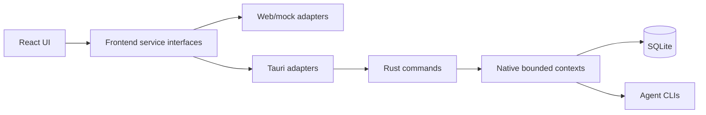

<div align="center">

[English](README.md)
· **简体中文**
· [日本語](README.ja.md)

</div>

<!-- docs-section:hero -->

# VaneHub AI

<p align="center">
  
</p>

通过统一 React 界面和明确的 Web/mock、Tauri runtime 边界管理 AI Coding Agent 的桌面优先工作台。

<!-- docs-fact:project-version value:0.1.0-preview.1 -->
<!-- docs-fact:tauri-major value:2.x -->
<!-- docs-fact:react-major value:19.x -->

[](package.json)
[](src-tauri/Cargo.toml)
[](package.json)
[](https://github.com/cdavid817/vanehub-ai/actions/workflows/ci.yml)
[](LICENSE)

<!-- docs-section:overview -->

## 项目简介

VaneHub AI 把 Claude Code、OpenCode、Codex CLI、Gemini CLI 和 Antigravity CLI 汇集到统一桌面工作台中。它管理 CLI 可用性、会话、终端执行、项目与 worktree、设置、工具、可观测性和桌面集成，同时避免 React 组件直接依赖 native API。

<!-- docs-section:download -->

## 下载

预构建的桌面安装包发布在 [Releases 页面](https://github.com/cdavid817/vanehub-ai/releases)：Windows `.exe` 安装器、macOS `.dmg`，以及 Linux 的 `.deb` 与 AppImage。不发布 `.msi` 和 `.rpm`。

当前构建是未签名的预览版。Windows 与 macOS 在运行前会给出警告，各平台的处理步骤记录在 release notes 中。安装前请用发布的 `SHA256SUMS` 校验下载文件。

<!-- docs-section:architecture -->

## 架构


```mermaid
flowchart LR
  UI[React UI] --> Service[Frontend service interfaces]
  Service --> Web[Web/mock adapters]
  Service --> Tauri[Tauri adapters]
  Tauri --> Commands[Rust commands]
  Commands --> Contexts[Native bounded contexts]
  Contexts --> SQLite[(SQLite)]
  Contexts --> CLI[Agent CLIs]
```

React 组件调用 `src/services/` 中的服务。Tauri 专属 `invoke()` 调用仅位于 frontend Tauri adapter；SQLite、CLI 进程、文件系统访问与桌面生命周期行为位于 Rust。

<!-- docs-section:quick-start -->

## 快速开始

<!-- docs-fact:node-minimum value:22+ -->

前置要求：Node.js 22+、npm、stable Rust，以及当前平台的 [Tauri 前置依赖](https://v2.tauri.app/start/prerequisites/)。

平台 linker 要求、release profile 行为、worktree 缓存建议及构建测量结果参见[原生构建性能指南](docs/build-performance.md)。

```powershell
npm ci
```

运行 Web/mock 预览：

```powershell
npm run dev -- --host 127.0.0.1
```

运行桌面应用：

```powershell
$env:PATH="$env:USERPROFILE\.cargo\bin;$env:PATH"
npm run tauri -- dev
```

Web/mock 是确定性的浏览器模拟，不代表真实发生了本地 CLI 执行、SQLite 持久化、文件修改或操作系统 side effect。

<!-- docs-section:documentation -->

## 文档

<!-- docs-locale-guides -->

### 使用者指南

简体中文是权威完整集；英文镜像其拓扑，未翻译章节以已知缺口标记并链接到对应中文章节。

| 主题 | 入口 |
| --- | --- |
| 快速开始 | [五步走完，从装 CLI 到在工作区里干活](docs/user-guide/zh-CN/src/quick-start.md) |
| 基础配置 | [界面语言、主题、字号、默认权限模板、开机自启、网络代理、数据目录、日志目录](docs/user-guide/zh-CN/src/user-interface.md#设置中心) |
| 用户界面总览 | [主布局、导航、面板切换、会话/对话/工作区标签页/信息面板](docs/user-guide/zh-CN/src/user-interface.md) |
| 会话列表 | [分组/搜索/筛选/批量/拖拽、右键菜单、专注模式](docs/user-guide/zh-CN/src/user-interface.md#会话列表) |
| 浮动助手 | [独立浮窗会话、状态徽章、主操作菜单](docs/user-guide/zh-CN/src/user-interface.md#浮动助手) |
| 循环中心 | [Loop 运行控件、验证命令、时间线](docs/user-guide/zh-CN/src/loop-engineering.md) |
| 计划中心 | [计划草稿、评审/批准/运行](docs/user-guide/zh-CN/src/user-interface.md#计划中心) |
| 通知中心 | [铃铛、未读数、全部已读、清除](docs/user-guide/zh-CN/src/user-interface.md#通知) |
| 系统托盘 | [显示/隐藏主窗口、开机自启、通知联动](docs/user-guide/zh-CN/src/user-interface.md#系统托盘) |
| CLI 安装与认证 | [装一个 CLI 并完成认证、被检测到](docs/user-guide/zh-CN/src/getting-started.md) |
| 多 Agent 群聊 | [席位、`@` 交接、轮次边界](docs/user-guide/zh-CN/src/multi-agent-workflow.md) |
| 定时任务 | [定时任务与用量统计](docs/user-guide/zh-CN/src/automation.md) |
| 远程工作区 | [SSH 工作区与 IM 接入](docs/user-guide/zh-CN/src/remote-and-im.md) |
| CLI 管理 | [各 CLI 的安装检测、冲突诊断与升级](docs/user-guide/zh-CN/src/getting-started.md) |
| CLI 参数 | [按 CLI Agent 配置启动参数与全局配置](docs/user-guide/zh-CN/src/tooling.md#cli-参数) |
| 扩展能力 | [本地扩展安装/启用/禁用](docs/user-guide/zh-CN/src/tooling.md#扩展能力) |
| 插件集成 | [第三方插件的集成配置](docs/user-guide/zh-CN/src/tooling.md#插件集成) |
| MCP 服务器 | [MCP server 配置与按 Agent 绑定](docs/user-guide/zh-CN/src/mcp.md) |
| Agent 配置 | [按 Agent 配置模型、权限模板、运行参数](docs/user-guide/zh-CN/src/user-interface.md#设置中心) |
| 专家角色 | [角色与评审策略](docs/user-guide/zh-CN/src/personalization.md) |
| Agent 权限策略 | [Agent 权限策略与审批模板配置](docs/user-guide/zh-CN/src/permissions.md) |
| 个性化 | [Custom Instructions 与跨会话记忆](docs/user-guide/zh-CN/src/personalization.md) |
| Skill 管理 | [Skill 安装与绑定](docs/user-guide/zh-CN/src/skill-management.md) |
| Prompt Hook | [钩子管理](docs/user-guide/zh-CN/src/prompt-hooks.md) |
| IM 能力 | [IM 连接器配置](docs/user-guide/zh-CN/src/remote-and-im.md) |
| SSH 连接 | [保存的 SSH 连接](docs/user-guide/zh-CN/src/remote-and-im.md) |
| 执行可观测性 | [执行追踪与日志采集策略](docs/user-guide/zh-CN/src/observability.md) |
| 使用统计 | [Token 用量统计](docs/user-guide/zh-CN/src/automation.md) |
| 关于 | [版本、更新检查、changelog、仓库链接](docs/user-guide/zh-CN/src/app-updates.md) |
| 故障排查 | [出错了先看这里、日志在哪](docs/user-guide/zh-CN/src/troubleshooting.md) |

### 开发者指南

| 主题 | 入口 |
| --- | --- |
| 仓库结构 | [仓库布局与模块归属、各限界上下文职责](docs/developer-guide/zh-CN/src/repository-orientation.md) |
| 运行时边界 | [前端服务边界、Web/mock 与 Tauri 适配器](docs/developer-guide/zh-CN/src/runtime-boundaries.md) |
| 限界上下文 | [十一个 native bounded contexts](docs/developer-guide/zh-CN/src/native-contexts.md) |
| Agent 生命周期与 provider 运行时 | [注册 Agent 编辑、稳定 provider 解析、能力声明](docs/developer-guide/zh-CN/src/agent-lifecycle.md) |
| 终端与 PTY 运行时 | [会话级 Agent Terminal、自动启动/附着、远程终端](docs/developer-guide/zh-CN/src/terminal-runtime.md) |
| 工具注册表与执行 | [固定原生工具目录、按 interface_format 翻译、多轮工具循环](docs/developer-guide/zh-CN/src/tool-registry.md) |
| 权限模型 | [统一决策点、显式 Deny 优先、审批代理、CLI flag 投影、Claude Code 钩子桥](docs/developer-guide/zh-CN/src/permission-model.md) |
| 上下文压缩 | [字符计数触发、摘要式压缩、保留近期轮次](docs/developer-guide/zh-CN/src/context-compaction.md) |
| 检索与向量搜索 | [主机级共享记忆池、workspace 代码索引、优雅降级](docs/developer-guide/zh-CN/src/retrieval.md) |
| Tree-sitter 代码索引 | [语法解析、bounded chunk、符号元数据、grammar 版本与脱敏](docs/developer-guide/zh-CN/src/tree-sitter-code-indexing.md) |
| 跨会话记忆 | [主机级共享池、provenance 元数据、OnePiece 工具与 CLI 自动提取](docs/developer-guide/zh-CN/src/cross-session-memory.md) |
| 会话恢复 | [恢复状态与生命周期正交、持久化执行身份与所有权](docs/developer-guide/zh-CN/src/session-recovery.md) |
| OnePiece 原生 Agent | [内置 API Agent 身份、Profile 生命周期与 provider 目录](docs/developer-guide/zh-CN/src/onepiece-native-agent.md) |
| 多 Agent 群聊 | [席位模型、中途增减、轮次路由与持久化 presence](docs/developer-guide/zh-CN/src/multi-agent-group-chat.md) |
| Skill 管理 | [双 scope、SKILL.md 契约、漂移与内建播种/对账](docs/developer-guide/zh-CN/src/skill-management.md) |
| MCP 工具与客户端 | [传输与配置模型、原生工具目录中的 MCP 工具](docs/developer-guide/zh-CN/src/mcp-tools.md) |
| IM 连接器 | [五种内建连接器、首版直发消息范围、入站路由](docs/developer-guide/zh-CN/src/im-connectors.md) |
| Loop 与 Plan 运行时 | [持久化 Loop 定义、拓扑感知串行子任务调度、Worker/Verifier 信任](docs/developer-guide/zh-CN/src/loop-and-plan-runtime.md) |
| Token 用量统计 | [上报 token 与估算字符分离、时间范围、per-Agent 拆分](docs/developer-guide/zh-CN/src/usage-statistics.md) |
| LSP 代码智能 | [会话内 LSP 集成实现](docs/developer-guide/zh-CN/src/lsp-code-intelligence.md) |
| 持久化与日志 | [SQLite 所有权与统一脱敏日志](docs/developer-guide/zh-CN/src/persistence-and-logging.md) |
| 测试与发布 | [测试、打包与发布流程](docs/developer-guide/zh-CN/src/testing-and-release.md) |
| OpenSpec 工作流 | [提案→设计→delta spec→任务→校验→归档的变更流程](docs/developer-guide/zh-CN/src/openspec-workflow.md) |
| Native API 参考 | [Rustdoc 生成的内部契约与所有权文档](docs/developer-guide/zh-CN/src/native-api-reference.md) |
| 架构决策 | [仓库结构与模块导览、限界上下文与调用关系](docs/developer-guide/zh-CN/src/repository-orientation.md) |

用户指南提供英文与简体中文两种语言。日文、繁体中文、韩文仅作为应用界面资源语言交付，不提供对应的用户指南。

<!-- /docs-locale-guides -->

参考：[Native 架构清单](src-tauri/ARCHITECTURE.md) · [贡献指南](CONTRIBUTING.md) · [原生构建性能](docs/build-performance.md) · [发布签名](docs/release-signing.md)

构建 mdBook 指南与 Rustdoc Reference：

```powershell
npm run docs:check
npm run docs:test
npm run docs:build
```

文档构建需要 `docs/toolchain.json` 中固定的 mdBook 版本。

<!-- docs-section:development -->

## 开发

提交变更前，请逐字运行 AGENTS.md「校验命令」一节中的全部命令；该清单是与 CI 对齐的唯一真源。

新功能和架构调整必须在实现前创建 OpenSpec proposal。项目规则见 [AGENTS.md](AGENTS.md) 与 [openspec/project.md](openspec/project.md)。

<!-- docs-section:roadmap -->

## 路线图

已实现行为和当前 contract 记录在 [OpenSpec 主规范](openspec/specs/)中。近期产品方向包括自定义 Agent、插件市场和扩展的本地 OCR/语音能力。

<!-- docs-section:contributing -->

## 贡献

开始变更前请阅读 [CONTRIBUTING.md](CONTRIBUTING.md)。涉及行为变更时，应同步文档、两个 frontend runtime adapter、native contract、测试与 OpenSpec 工件。

<!-- docs-section:license -->

## License

本项目采用 Apache License 2.0，详见 [LICENSE](LICENSE)。
