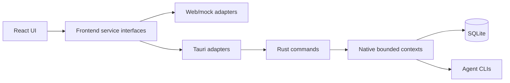

<div align="center">

[English](README.md)
· **简体中文**
· [日本語](README.ja.md)

</div>

<!-- docs-section:hero -->

# VaneHub AI

通过统一 React 界面和明确的 Web/mock、Tauri runtime 边界管理 AI Coding Agent 的桌面优先工作台。

<!-- docs-fact:project-version value:0.1.0-preview.1 -->
<!-- docs-fact:tauri-major value:2.x -->
<!-- docs-fact:react-major value:19.x -->

[](package.json)
[](src-tauri/Cargo.toml)
[](package.json)
[](https://github.com/cdavid817/vanehub-ai/actions/workflows/ci.yml)
[](LICENSE)

<!-- docs-section:overview -->

## 项目简介

VaneHub AI 把 Claude Code、OpenCode、Codex CLI 和 Gemini CLI 汇集到统一桌面工作台中。它管理 CLI 可用性、会话、终端执行、项目与 worktree、设置、工具、可观测性和桌面集成，同时避免 React 组件直接依赖 native API。

<!-- docs-section:download -->

## 下载

预构建的桌面安装包发布在 [Releases 页面](https://github.com/cdavid817/vanehub-ai/releases)：Windows `.exe` 安装器、macOS `.dmg`，以及 Linux 的 `.deb` 与 AppImage。不发布 `.msi` 和 `.rpm`。

当前构建是未签名的预览版。Windows 与 macOS 在运行前会给出警告，各平台的处理步骤记录在 release notes 中。安装前请用发布的 `SHA256SUMS` 校验下载文件。

<!-- docs-section:feature-status -->

## 功能状态

<!-- feature:core-workspace status:delivered -->

- **已交付：**CLI 管理、单 Agent 会话、交互式 Agent 终端、会话组织、项目/worktree 与 SSH 工作区工具、设置、MCP/SDK/Skills/Prompt Hooks/Extensions、IM Connector、定时任务、通知、用量统计、统一脱敏日志和跨平台打包。

<!-- feature:multi-agent-runtime status:delivered -->

- **已交付：**多 Agent 群聊运行时。一个会话可容纳多个 Agent 席位，回复通过 `@` 提及交接发言权，提及数量与交接链深度均有上限。它取代了此前基于依赖图的协调运行时，后者已被移除。

<!-- feature:multi-agent-ui status:delivered -->

- **已交付：**正常创建会话对话框中的席位分配，以及会话工作区内的席位切换、发言人标注与轮次状态。

<!-- feature:japanese-ui status:delivered -->

- **已交付：**日文应用 UI 资源，与其余支持的语言——English、简体中文、繁體中文、한국어——保持键级一致。

<!-- docs-section:architecture -->

## 架构


```mermaid
flowchart LR
  UI[React UI] --> Service[Frontend service interfaces]
  Service --> Web[Web/mock adapters]
  Service --> Tauri[Tauri adapters]
  Tauri --> Commands[Rust commands]
  Commands --> Contexts[Native bounded contexts]
  Contexts --> SQLite[(SQLite)]
  Contexts --> CLI[Agent CLIs]
```

React 组件调用 `src/services/` 中的服务。Tauri 专属 `invoke()` 调用仅位于 frontend Tauri adapter；SQLite、CLI 进程、文件系统访问与桌面生命周期行为位于 Rust。

<!-- docs-section:quick-start -->

## 快速开始

<!-- docs-fact:node-minimum value:22+ -->

前置要求：Node.js 22+、npm、stable Rust，以及当前平台的 [Tauri 前置依赖](https://v2.tauri.app/start/prerequisites/)。

平台 linker 要求、release profile 行为、worktree 缓存建议及构建测量结果参见[原生构建性能指南](docs/build-performance.md)。

```powershell
npm ci
```

运行 Web/mock 预览：

```powershell
npm run dev -- --host 127.0.0.1
```

运行桌面应用：

```powershell
$env:PATH="$env:USERPROFILE\.cargo\bin;$env:PATH"
npm run tauri -- dev
```

Web/mock 是确定性的浏览器模拟，不代表真实发生了本地 CLI 执行、SQLite 持久化、文件修改或操作系统 side effect。

<!-- docs-section:documentation -->

## 文档

|  | 怎么用 | 怎么实现 |
| --- | --- | --- |
| **简体中文** | [快速开始](docs/user-guide/zh-CN/src/quick-start.md) · [全部章节](docs/user-guide/zh-CN/src/index.md) | [架构与实现](docs/zh/src/README.md) |
| **English** | [Getting started](docs/user-guide/en/src/getting-started.md) · [all chapters](docs/user-guide/en/src/index.md) | [Developer Guide](docs/developer-guide/src/index.md) |

中文架构文档暂无英文版，英文开发者指南也暂无中文版。

参考：[Native 架构清单](src-tauri/ARCHITECTURE.md) · [贡献指南](CONTRIBUTING.md) · [原生构建性能](docs/build-performance.md) · [发布签名](docs/release-signing.md)

构建 mdBook 指南与 Rustdoc Reference：

```powershell
npm run docs:check
npm run docs:test
npm run docs:build
```

文档构建需要 `docs/toolchain.json` 中固定的 mdBook 版本。

<!-- docs-section:development -->

## 开发

提交变更前，请逐字运行 AGENTS.md「校验命令」一节中的全部命令；该清单是与 CI 对齐的唯一真源。

新功能和架构调整必须在实现前创建 OpenSpec proposal。项目规则见 [AGENTS.md](AGENTS.md) 与 [openspec/project.md](openspec/project.md)。

<!-- docs-section:roadmap -->

## 路线图

已交付行为和当前 contract 记录在 [OpenSpec 主规范](openspec/specs/)中。近期产品方向包括多 Agent 协调 UI、持久化 Agent memory、自定义 Agent、插件市场和扩展的本地 OCR/语音能力。

<!-- docs-section:contributing -->

## 贡献

开始变更前请阅读 [CONTRIBUTING.md](CONTRIBUTING.md)。涉及行为变更时，应同步文档、两个 frontend runtime adapter、native contract、测试与 OpenSpec 工件。

<!-- docs-section:license -->

## License

本项目采用 Apache License 2.0，详见 [LICENSE](LICENSE)。
