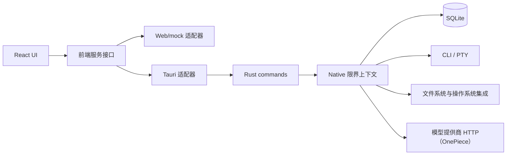

<div align="center">

[English](README.md)
· **简体中文**
· [日本語](README.ja.md)

</div>

<!-- docs-section:hero -->

# VaneHub AI

<p align="center">
  
</p>

桌面优先的 AI 编码 Agent 工作台：在一个统一界面里使用与管理 OnePiece、Claude Code、Codex CLI、OpenCode、Gemini CLI 和 Antigravity CLI。

<!-- docs-fact:project-version value:1.4.0 -->
<!-- docs-fact:tauri-major value:2.x -->
<!-- docs-fact:react-major value:19.x -->

[](package.json)
[](src-tauri/Cargo.toml)
[](package.json)
[](https://github.com/cdavid817/vanehub-ai/actions/workflows/ci.yml)
[](LICENSE)

[下载安装包](https://github.com/cdavid817/vanehub-ai/releases) · [快速开始](#快速开始) · [文档](#文档)

<!-- docs-section:overview -->

## 项目简介

同时使用多个 AI 编码 Agent 时，会话、项目、终端、权限和成本分散在各个工具里。VaneHub AI 把它们放进同一个桌面工作台：统一的会话与工作区、统一的权限审批、统一的可观测性与用量口径，以及跨 Agent 的多人协作。

它支持两类 Agent，**选一条路径即可开始，不需要安装全部 CLI**：

- **OnePiece**——内置的原生 API Agent，直接通过 HTTP 调用模型提供商（provider），不要求安装任何外部 CLI；
- **外部 CLI Agent**——Claude Code、Codex CLI、OpenCode、Gemini CLI、Antigravity CLI，由你安装并在终端完成各自的认证。

<!-- docs-section:features -->

## 核心能力

- **统一 Agent 入口**——OnePiece 原生 API Agent 与五个外部 CLI Agent 共用会话、配置、权限与观测体系。
- **会话与工作区**——项目、交互式终端（PTY）、Git worktree、远程工作区（SSH）。
- **多 Agent 协作**——群聊席位与 `@` 交接、专家角色、Loop 自动迭代、Plan 模式、目标与任务看板。
- **上下文与代码智能**——上下文压缩、跨会话记忆、个性化、检索、工作区代码索引、LSP 代码智能。
- **能力扩展**——Skill、MCP 服务器、Prompt Hook、本地扩展、插件集成、IM 连接器、本地媒体（OCR、语音识别与合成）。
- **治理与运行**——权限模板与逐次审批、执行可观测性、统一日志、Agent 评测、定时任务、使用统计。

<!-- docs-section:agents -->

## Agent 与 CLI 支持

| Agent | 形态 | 命令 | 模型来源 | 应用内安装 | 认证与模型配置 |
| --- | --- | --- | --- | --- | --- |
| OnePiece | 内置原生 API Agent | 无需 CLI | 提供商目录或自定义兼容端点 | 随应用内置 | 应用内配置 provider 与 API Key |
| Claude Code | 外部 CLI | `claude` | Anthropic | ✅ npm / WinGet / 官方安装器 | 终端 OAuth；可在应用内配第三方兼容端点 |
| Codex CLI | 外部 CLI | `codex` | OpenAI | ✅ npm | 终端 OAuth；可在应用内配第三方兼容端点 |
| OpenCode | 外部 CLI | `opencode` | 取决于你配置的模型，无固定模型族 | ✅ npm / 官方安装器 | 终端认证；可在应用内配第三方兼容端点 |
| Gemini CLI | 外部 CLI | `gemini` | Google | ✅ npm | 终端认证；端点可改，目录仅含官方预设 |
| Antigravity CLI | 外部 CLI | `agy` | Google | ✅ 官方安装器（仅最新版） | 终端 Google 登录；CLI 官方另支持 API Key 与兼容端点，VaneHub 暂未纳入统一 Provider 配置 |

- **应用内安装**指能否在「设置 → CLI 管理」由 VaneHub AI 代为安装与升级：它能驱动 npm、Windows 上的 WinGet，以及逐个 CLI 审核过的官方安装器。来自 Homebrew、Bun、Volta、桌面应用自带或系统包的那一份会被检测并报告，但不会被改动。
- **各家的官方订阅登录（OAuth）一律在终端完成**，VaneHub AI 不代管、不保存订阅凭据。
- VaneHub 集成的 OpenCode 是开源的 sst/opencode（npm 包 `opencode-ai`）；它驱动你自己配置的任意模型，「要求评审来自不同模型族」这类策略对它不生效。
- Gemini CLI 的消费级路径正在收缩：Google 宣布自 2026-06-18 起，Gemini Code Assist Individuals 及 Google AI Pro/Ultra 等消费级账号不再经 Gemini CLI 提供请求服务，其「Login with Google」路径不再可用，官方建议这些用户迁移到 Antigravity；Gemini Code Assist Standard 与 Enterprise 不受影响。API Key 与 Vertex 属于不同认证路径，请以 Google 官方说明为准。

**模型提供商**：应用内置一份提供商配置目录，供 OnePiece 及支持第三方端点的 CLI Agent 共用；目录之外可填自定义兼容端点，API Key 存入操作系统凭据服务。完整厂商清单、端点协议与默认模型见[内置模型提供商目录](docs/model-providers.md)。

<!-- docs-section:quick-start -->

## 快速开始

1. 从 [Releases 页面](https://github.com/cdavid817/vanehub-ai/releases)下载当前平台的桌面安装包并安装。
2. 二选一：在「设置 → Agent 配置」为 OnePiece 配置模型提供商与 API Key；或安装任意一个受支持的外部 CLI 并在终端完成认证，然后在「设置 → CLI 管理」刷新检测。
3. 点击「新建」，选择 Agent 与项目文件夹，创建第一个会话。
4. 在会话工作区的输入框里发出第一个任务。

详细步骤见用户指南的快速开始、CLI 安装认证与创建第一个会话章节（下方[文档](#文档)一节）。

<!-- docs-section:download -->

## 下载、平台与发布完整性

预构建桌面安装包发布在 [Releases 页面](https://github.com/cdavid817/vanehub-ai/releases)：

| 平台 | 架构 | 格式 |
| --- | --- | --- |
| Windows | x64 | NSIS `.exe` 安装器 |
| macOS | x64、Apple Silicon | `.dmg` |
| Linux | x64、ARM64 | `.deb`、AppImage |

不发布 `.msi` 与 `.rpm`；对应用户可分别使用 NSIS 安装器与 AppImage。

**签名状态请注意区分三件事**：

- **发布完整性**——每次发布附带 `SHA256SUMS`、SPDX SBOM 与 GitHub attestations，用于校验完整性与来源；
- **自动更新工件**——Tauri updater 工件带 updater 签名；
- **操作系统级代码签名**——**Windows Authenticode 签名与 macOS Developer ID 签名/公证目前尚未完成**（属于后续阶段），因此 Windows SmartScreen 与 macOS Gatekeeper 可能对安装包发出警告，发布说明中附有各平台的处理步骤。

校验方式、密钥清单与签名路线见[发布签名](docs/release-signing.md)。

<!-- docs-section:runtimes -->

## 运行模式

| 运行模式 | 用途 | 能力 |
| --- | --- | --- |
| **Tauri 桌面运行时** | 正式使用 | 真实的 CLI/PTY 执行、SQLite 持久化、文件系统访问、桌面生命周期与系统集成、本地媒体等已实现的本地能力 |
| **Web/mock 运行时** | 确定性 UI 预览、文档截图、前端开发 | 浏览器内模拟，**不发生**真实 CLI 执行、数据库持久化、文件修改或任何系统副作用 |

Web/mock 的界面与模拟状态不能作为桌面功能已通过真实环境验证的证据。

<!-- docs-section:documentation -->

## 文档

<!-- docs-locale-guides -->

### 用户指南

完整章节见[用户指南目录](docs/user-guide/zh-CN/src/index.md)；下表只列各分组入口。

| 分组 | 入口 | 涵盖 |
| --- | --- | --- |
| 开始使用 | [快速开始](docs/user-guide/zh-CN/src/quick-start.md) | 安装并认证 CLI、创建第一个会话、核心概念、版本更新 |
| 界面与工作区 | [用户界面](docs/user-guide/zh-CN/src/user-interface.md) | 会话工作区、设置中心、远程工作区与 SSH、Git worktree、斜杠命令 |
| Agent 与协作 | [OnePiece（原生 Agent）](docs/user-guide/zh-CN/src/native-agent.md) | 多 Agent 群聊、专家角色、Loop、目标与任务看板、代码评审、Agent 评测 |
| 上下文与代码智能 | [记忆与上下文](docs/user-guide/zh-CN/src/memory-and-context.md) | 个性化、代码索引、LSP 代码智能 |
| 工具与集成 | [Agent 与 CLI 配置](docs/user-guide/zh-CN/src/agent-configuration.md) | Skill、MCP、Prompt Hook、本地扩展、本地媒体、插件集成、IM 连接器 |
| 治理与运行 | [权限审批](docs/user-guide/zh-CN/src/permissions.md) | 可观测性、定时任务与通知、使用统计 |
| 帮助与参考 | [故障排查](docs/user-guide/zh-CN/src/troubleshooting.md) | 使用案例、常见问题、反馈问题与提交 Issue |

### 开发者指南

完整章节见[开发者指南目录](docs/developer-guide/zh-CN/src/index.md)；下表只列各架构域入口。

| 架构域 | 入口 | 涵盖 |
| --- | --- | --- |
| 入门与运行时边界 | [仓库结构与模块导览](docs/developer-guide/zh-CN/src/repository-orientation.md) | 运行时与服务边界、Native 限界上下文、持久化所有权 |
| Agent 运行时 | [单 Agent 治理：五控制面模型](docs/developer-guide/zh-CN/src/single-agent-control-planes.md) | Agent 生命周期、OnePiece、内置工具、Tool registry、CLI 生命周期、终端与 PTY、CLI 委派、多 Agent 群聊、Loop 与 Plan、目标看板、会话恢复 |
| 工作区与平台能力 | [SSH 连接与远程运行时](docs/developer-guide/zh-CN/src/ssh-connections.md) | 本地媒体运行时 |
| 上下文、记忆与代码智能 | [跨会话记忆](docs/developer-guide/zh-CN/src/cross-session-memory.md) | 上下文压缩、个性化治理、检索与向量搜索、Tree-sitter 索引、LSP |
| Skill 与外部集成 | [Skill 管理](docs/developer-guide/zh-CN/src/skill-management.md) | 有效 Skill 运行时、覆盖层治理、演进证据、MCP 工具、IM 连接器 |
| 安全、评测与可观测 | [权限模型](docs/developer-guide/zh-CN/src/permission-model.md) | 执行可观测性、评测运行时、会话工作区证据控制台、统一日志、使用统计 |
| 工程交付 | [测试](docs/developer-guide/zh-CN/src/testing.md) | OpenSpec 工作流、发布、真实环境资格验证 |
| 生成参考与架构决策 | [Native API 参考](docs/developer-guide/zh-CN/src/native-api-reference.md) | 由源码生成的接口契约与所有权参考、Skill Tool 运行时安全 |

用户指南提供英文与简体中文两种语言。日文、繁体中文、韩文仅作为应用界面资源语言交付，不提供对应的用户指南。

<!-- /docs-locale-guides -->

<!-- docs-section:architecture -->

## 架构概览


```mermaid
flowchart LR
  UI[React UI] --> Service[前端服务接口]
  Service --> Web[Web/mock 适配器]
  Service --> Tauri[Tauri 适配器]
  Tauri --> Commands[Rust commands]
  Commands --> Contexts[Native 限界上下文]
  Contexts --> SQLite[(SQLite)]
  Contexts --> CLI[CLI / PTY]
  Contexts --> FS[文件系统与操作系统集成]
  Contexts --> HTTP[模型提供商 HTTP（OnePiece）]
```

React 组件只调用 `src/services/` 中的前端服务接口，不得直接调用 Tauri `invoke()`；Tauri 专属调用位于前端 Tauri 适配器，SQLite、CLI 进程、文件系统访问与桌面生命周期行为全部位于 Rust 侧。完整模块清单见 [Native 架构清单](src-tauri/ARCHITECTURE.md)。

<!-- docs-section:from-source -->

## 从源码运行与开发

<!-- docs-fact:node-minimum value:22+ -->

前置要求：Node.js 22+、npm、stable Rust，以及当前平台的 [Tauri 前置依赖](https://v2.tauri.app/start/prerequisites/)。平台 linker 要求与构建测量见[原生构建性能指南](docs/build-performance.md)。

```bash
npm ci
```

运行 Web/mock 预览（浏览器内模拟，见上方[运行模式](#运行模式)）：

```bash
npm run dev -- --host 127.0.0.1
```

运行真实桌面应用：

```bash
npm run tauri:dev
```

> Windows 排障：若桌面启动报找不到 Rust 工具链，可在 PowerShell 中临时把 cargo 加入 PATH 后重试：
>
> ```powershell
> $env:PATH="$env:USERPROFILE\.cargo\bin;$env:PATH"
> ```

提交变更前，请逐字运行 [AGENTS.md](AGENTS.md)「校验命令」一节的全部命令；新功能与架构调整须先创建 OpenSpec proposal，项目规则见 [openspec/project.md](openspec/project.md)。

**技术参考**：[Agent 基础设施技术文档](docs/agent-infrastructure/README.md)介绍 MCP、LSP、RAG 等**外部协议、通用架构模式与工程方法本身**，不代表 VaneHub 已交付的能力；判断实现状态请以用户指南、开发者指南、[OpenSpec 主规范](openspec/specs/)与生成参考为准。另见 [CLI 参数参考](docs/reference/cli/builtin-cli-reference.md)与[发布签名](docs/release-signing.md)。

<!-- docs-section:roadmap -->

## 项目状态与路线图

- **已交付**——已实现行为与接口契约以 [OpenSpec 主规范](openspec/specs/)为准；各能力的使用方式见用户指南。
- **进行中**——见[未归档的 OpenSpec 变更](openspec/changes/)：当前活跃方向包括内建 Skill 目录扩充、远程 Skill 注册表与供应链治理、跨会话记忆治理强化、区域截图采集与首个稳定版发布准备等。
- **计划中**——仅在存在公开 proposal 或 issue 时列入；本节不承诺发布日期。
- 部分能力（如 IM 连接器的个别平台、桌面各平台矩阵）以真实环境资格验证记录为准，见开发者指南「工程交付」。

<!-- docs-section:support -->

## 支持与安全

- 使用问题与缺陷：先查[支持说明](SUPPORT.md)，再通过 Issue 表单提交缺陷报告或功能建议。
- **安全漏洞请勿提交公开 Issue**：使用 [GitHub 私密漏洞报告](https://github.com/cdavid817/vanehub-ai/security/advisories/new)，流程见[安全策略](SECURITY.md)。
- 参与社区请阅读[行为准则](CODE_OF_CONDUCT.md)。

<!-- docs-section:contributing -->

## 贡献

开始变更前请阅读[贡献指南](CONTRIBUTING.md)。涉及行为变更时，应同步文档、两个前端运行时适配器、原生接口契约、测试与 OpenSpec 工件。

<!-- docs-section:license -->

## 许可证

本项目采用 Apache License 2.0，详见 [LICENSE](LICENSE)。
