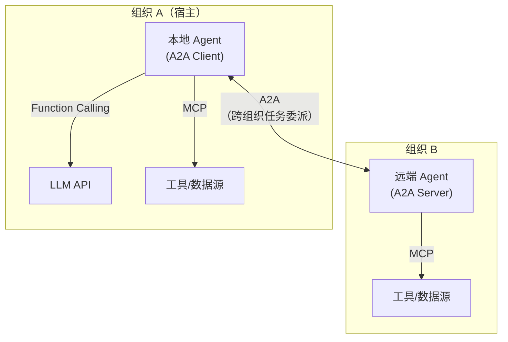
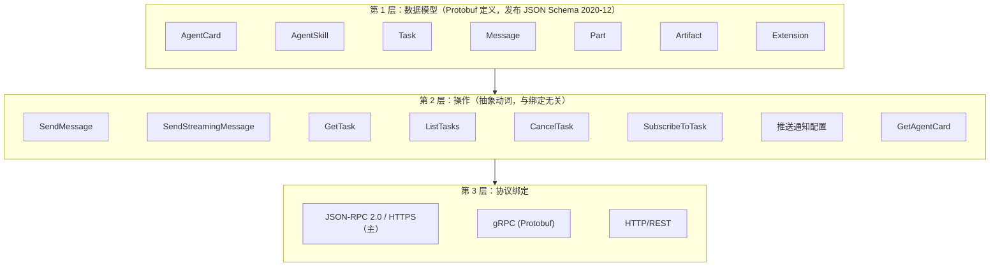
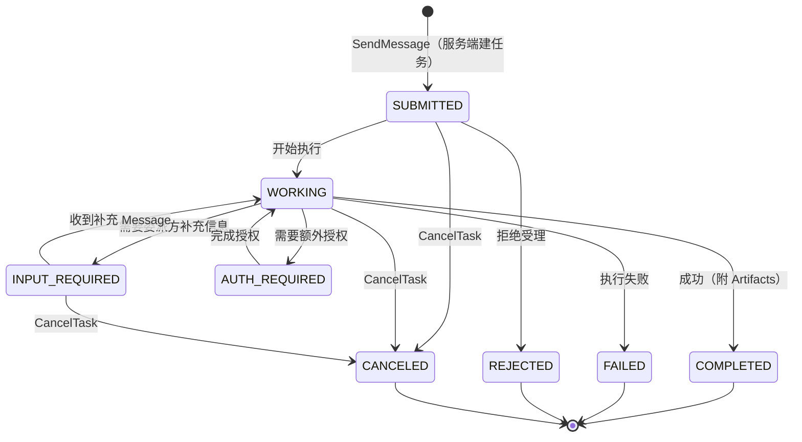
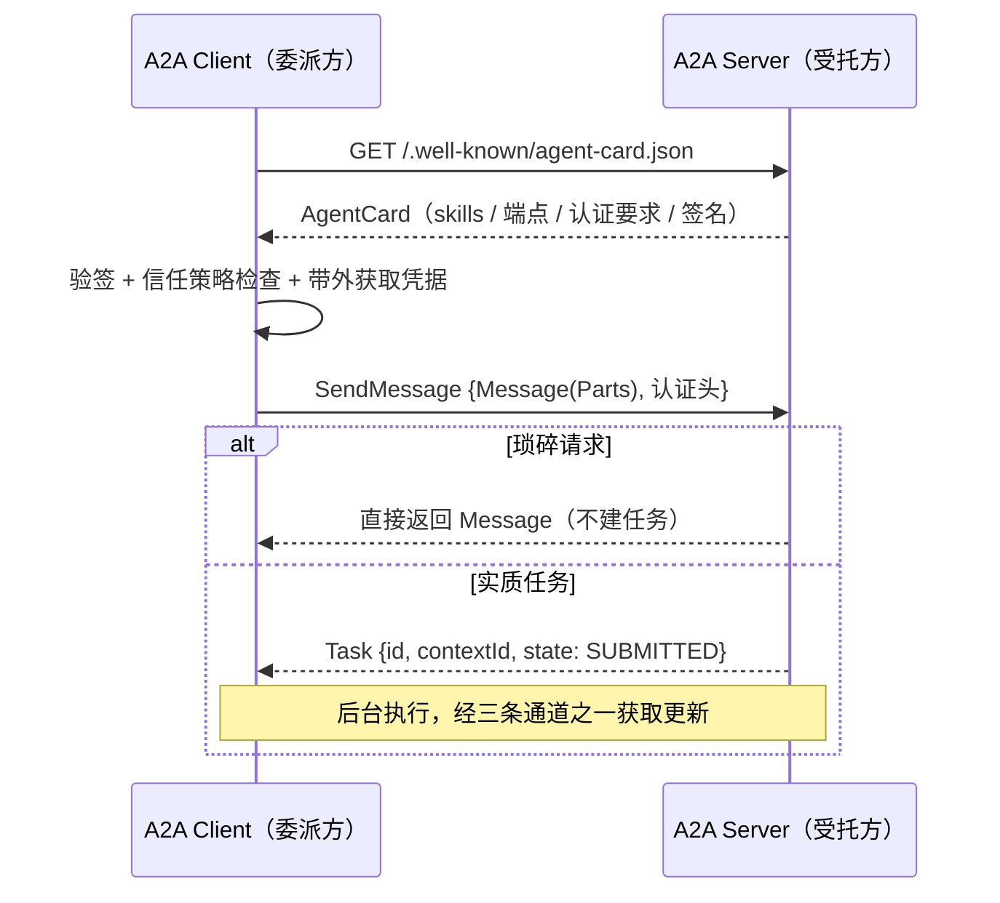

# A2A（Agent2Agent Protocol）技术架构

> VaneHub AI 技术文档 · Agent 基础设施系列
>
> 本文是多 Agent 篇 §5 的展开专篇，介绍 A2A 协议的完整技术体系：数据模型（AgentCard / Task / Message / Artifact）、任务状态机、发现机制、三种异步更新通道、协议绑定、安全模型，以及宿主作为 A2A Server/Client 双端集成的设计。适用于对外暴露 Agent 能力、委派外部 Agent 任务的互操作层实现参考。
>
> 规范基准：**A2A v1.0**（2026 年发布的当前稳定版；协议由 Google 于 2025 年 4 月发布，2025 年 6 月起交 Linux Foundation 中立治理；核心数据模型与协议绑定已宣布稳定）。

---

## 1. 概述

### 1.1 定义

A2A（Agent2Agent Protocol）是**Agent 之间**任务委派与协作的开放协议：定义独立开发、独立部署、可能分属不同组织的 AI Agent 如何相互**发现**（能力名片）、**委派**（任务生命周期）、**交换**（多模态消息与产物），全程不暴露各自的内部状态、记忆与工具。

一句话定位：**MCP 连接 Agent 与工具，A2A 连接 Agent 与 Agent**。两者同属 Linux Foundation 治理下的 Agent 互操作标准族，是同一技术栈中的相邻两层。

### 1.2 与相邻协议的分层

| 层 | 协议 | 抽象 | 语义 |
|----|------|------|------|
| 模型 ↔ 应用 | Function Calling | 同步调用意图 | "以这些参数调这个函数" |
| Agent ↔ 工具 | MCP | 工具调用（2026 后无状态） | "执行这个操作给我结果" |
| Agent ↔ Agent | A2A | **有状态任务生命周期** | "把这件事委托给你，过程中保持沟通" |

关键区分：A2A 的核心抽象不是"调用"而是**任务（Task）**——有唯一标识、有状态机、可长时运行、可中途要求补充输入、可流式汇报进度。这是"委托一个智能体"与"调用一个函数"的本质差异。

### 1.3 设计原则

- **拥抱既有标准**：HTTP(S) + JSON-RPC 2.0 + SSE，不发明新传输
- **默认不透明（Opacity）**：协作方只交换消息与产物，内部推理/记忆/工具互为黑盒——组织边界上的正确默认，也是与"共享内存式"多 Agent 框架的根本区别
- **异步优先**：操作立即返回 Task 或 Message，执行在后台继续；更新经轮询/流式/推送三通道获取
- **企业就绪**：认证对齐 OpenAPI 安全模型、卡片可签名、多租户隔离（v1.0）

---

## 2. 规范三层结构

- 数据模型以 **Protocol Buffers** 为规范源，同时发布 JSON Schema——gRPC 绑定直接用 proto，JSON-RPC/REST 绑定用 JSON 序列化
- 操作层与绑定解耦：同一套动词在三种绑定中有各自的方法名/路由映射；错误模型对齐 `google.rpc`（如 `ErrorInfo`、`BadRequest` 详情类型），各绑定映射到本地错误表示并保持语义一致
- 一个 Agent 可在 AgentCard 中声明多个传输端点，客户端择一使用

---

## 3. 数据模型详解

### 3.1 AgentCard：能力名片

Agent 的自描述 JSON 文档，是发现与信任的锚点。核心字段：

| 字段域 | 内容 |
|--------|------|
| 身份 | 名称、描述、版本、提供方信息 |
| 端点 | 服务 URL（可多个，对应不同传输绑定） |
| 能力旗标 | 是否支持流式、推送通知等可选能力 |
| **skills** | `AgentSkill` 列表——每项含 id、名称、描述、标签、输入/输出模态（MIME types）、示例。**这是委派方判断"该不该找你"的依据**，其描述工程学与 Function Calling 的工具 description、Skills 的 frontmatter description 完全同源 |
| **securitySchemes / security** | 对齐 OpenAPI 安全模型：声明接受的认证方案（OAuth2 / OIDC / API Key / mTLS 等）及各自要求的 scope |
| signatures | 卡片签名（见下） |

**签名卡（v1.0）**：`AgentCardSignature` 为卡片提供密码学身份——对卡片做 **JCS 规范化（RFC 8785）** 后计算 **JWS（RFC 7515）** 签名，保证签名跨序列化器稳定；客户端用签发方公钥（来自可信注册表或 x5c 证书链）验证后才信任卡片内容。这是对"伪造/篡改 AgentCard"这一首要威胁的协议级回应。

### 3.2 Task：核心抽象与状态机

- 八个状态（v1.0 以 `TASK_STATE_*` 前缀命名）：`SUBMITTED` / `WORKING` / `INPUT_REQUIRED` / `AUTH_REQUIRED` / `COMPLETED` / `FAILED` / `REJECTED` / `CANCELED`——前四个为非终态，后四个为终态
- **非终态任务可继续收消息**：多轮交互（澄清、追加要求）通过向未终结任务发 Message 实现——这是 A2A 与"一发一收"式 RPC 的关键差异
- `INPUT_REQUIRED` / `AUTH_REQUIRED` 把"中途要人/要权"建模为一等状态，而非错误——与 MCP 2026 的 MRTR（`resultType: "input_required"`）思想同构，可对照理解
- **contextId**：服务端生成的可选分组标识，把多个相关任务串成一条协作脉络（多任务会话），支撑跨任务的历史引用
- 规范以文字描述状态机，个别边界（如 CANCELED 后能否重启）存在解释空间——跨实现集成时对边界行为做防御性处理

### 3.3 Message 与 Part：多模态内容

- `Message`：一次通信单元，含角色（user/agent 视角）与 `Part` 列表
- `Part` 是多模态的最小内容单元，三类：
  - **TextPart**：文本
  - **FilePart**：文件（内联 bytes 或 URI 引用）
  - **DataPart**：结构化 JSON 数据（表单、参数、机器可读载荷）
- 委派方与受托方经 AgentCard 中声明的输入/输出模态协商用什么类型交换——"能不能给我返回 PDF"在握手前就可判断

### 3.4 Artifact：任务产物

任务的正式输出（文档、图片、结构化数据），由 Part 组成、带唯一标识与元数据。与 Message 的区分：Message 是**过程沟通**，Artifact 是**交付物**——流式场景下 Artifact 可分块推送（artifact chunks），客户端按标识拼装。

### 3.5 Extension

超出核心规范的能力经扩展机制声明与协商（AgentCard 中广告支持的扩展）——与 MCP 2026 的 Extensions 框架思路一致。生态中最重要的官方扩展是 **AP2**（Agent Payments Protocol，v1.0 同期发布）：Agent 间安全交易的支付层，获支付/金融行业数十家组织支持。

---

## 4. 发现机制（Agent Discovery）

规范定义三种发现策略，按信任来源分层：

| 策略 | 机制 | 适用 |
|------|------|------|
| **Well-known URI** | `GET https://{domain}/.well-known/agent-card.json` | 公开 Agent；知道域名即可发现 |
| **注册表（Registry）** | 从策展目录检索 AgentCard（企业内部目录/行业目录） | 组织内治理、生态市场；**注册表接口本身尚未标准化**——当前各生态自建，是已知的规范缺口 |
| **直接配置** | 带外分发卡片（配置文件、私下交换） | 私有集成、开发调试 |

发现后的信任链：验证卡片签名 → 核对签发方身份 → 按 `securitySchemes` 完成带外凭据获取 → 才开始委派。**发现 ≠ 信任**：能拿到卡片不代表应该委派，宿主侧需要自己的信任策略层（白名单/签名要求/技能范围审查）。

---

## 5. 交互模式与三条更新通道

### 5.1 基本委派流

注意 `SendMessage` 的**双形态响应**：服务端可为琐碎请求直接回 Message（无任务开销），为实质工作建 Task——客户端必须两种都处理。

### 5.2 三条更新通道

| 通道 | 机制 | 适用 | 代价 |
|------|------|------|------|
| **轮询** | 周期调用 `GetTask` | 实现最简；低频任务 | 网络与延迟开销；轮询间隔与时效的权衡 |
| **流式（SSE）** | `SendStreamingMessage` / `SubscribeToTask`，同一 HTTP 响应上以 Server-Sent Events 推送状态变更与 Artifact 分块 | 交互式场景、需要实时进度 | 长连接运维（超时/断线/网关配置） |
| **推送通知（Webhook）** | 客户端注册回调 URL，服务端在状态变更时反向 HTTP POST | 超长任务、客户端可离线的场景 | 客户端要暴露可达端点 + 验证回调真伪（防伪造推送） |

工程现实：长连接与 webhook 的连接保持、超时、认证校验通常压给 API 网关层处理；断线后的兜底是回退轮询——三通道做成可降级的梯队而非三选一。

### 5.3 多轮与人机介入

`INPUT_REQUIRED` 流程：受托方转入该状态并在状态消息中说明所需信息 → 委派方（或其背后的人）补发 Message → 任务回到 `WORKING`。`AUTH_REQUIRED` 同构但语义是"需要额外授权凭据"（如访问用户的某个第三方账户）。对宿主而言，这两个状态是**人在环审批点**的天然挂载位。

---

## 6. 协议绑定要点

| 绑定 | 要点 |
|------|------|
| **JSON-RPC 2.0 / HTTPS（主绑定）** | 所有请求/响应为 JSON-RPC 载荷（SSE 流的外层包装除外）；方法名对应操作层动词；错误用 JSON-RPC error 对象 + `google.rpc` 风格详情 |
| **gRPC** | 直接使用规范的 Protobuf 定义；错误映射 gRPC status；适合内网高吞吐 |
| **HTTP/REST** | 资源风格路由映射操作层；适合与现有 REST 基础设施集成 |

同步失败在 RPC 错误中返回；异步失败经任务转入 `FAILED` / `REJECTED` 表达——**两条错误通道都要监听**，只处理 RPC 错误会漏掉异步失败。

---

## 7. 安全模型

### 7.1 协议层措施

- **传输**：强制 HTTP(S)，生产环境 TLS
- **认证**：AgentCard 声明方案（OpenAPI 风格 `securitySchemes` + `security`），凭据**带外获取**、随每个请求以协议适当的头/元数据携带——A2A 本身不做发凭据的授权服务器（与 MCP 把授权框架内置为 OAuth 2.1 RS 模型不同，A2A 只做声明与承载）
- **身份**：签名 AgentCard（JWS + JCS，见 §3.1）
- **细粒度授权方向**：结合 RFC 9396（Rich Authorization Requests）实现交易绑定的 token；但**token 降权（downscoping）等细则属于当前规范缺口**，需应用层补齐

### 7.2 威胁面（Agent 间信任是新攻击面）

| 威胁 | 机制 | 缓解 |
|------|------|------|
| 伪造/篡改 AgentCard | 冒充可信 Agent 骗取委派与数据 | 强制验签 + 签发方白名单；不信任未签名卡片 |
| 经消息的提示注入 | 受托方返回的 Message/Artifact 内容操纵委派方 LLM | 远端内容一律按不可信数据处理（与 MCP 工具结果同级）；敏感后续动作过人工确认 |
| 恶意受托方渗出 | 委派时携带的上下文被滥用 | 最小披露：任务消息只装完成所需信息（多 Agent 篇 §3.2 契约纪律的跨组织版） |
| 伪造推送通知 | 攻击者向 webhook 灌假状态 | 回调验证（签名/挑战应答）；关键状态以 GetTask 回查确认 |
| 混淆代理 | 受托方诱导委派方以自身权限操作第三方 | 交易绑定 token（RAR）；scope 最小化 |
| 供应链（注册表投毒） | 恶意 Agent 进入目录 | 注册表准入审查；技能范围与历史信誉策略 |

---

## 8. 与 MCP 的详细对比

| 维度 | MCP（2026-07-28） | A2A（v1.0） |
|------|-------------------|-------------|
| 连接对象 | Agent ↔ 工具/数据源 | Agent ↔ Agent |
| 核心抽象 | 无状态请求（工具调用） | 有状态 Task 生命周期 |
| 时长假设 | 秒级为主（长任务走 Tasks 扩展） | 原生面向长时/异步 |
| 中途要输入 | MRTR（`input_required` + 客户端重试驱动） | `INPUT_REQUIRED` 状态 + 向任务补发消息 |
| 能力发现 | `server/discover` + `tools/list`（schema 级） | AgentCard（技能级，粒度更粗、含身份与认证声明） |
| 对端透明度 | 工具行为由 schema 精确约束 | 受托方完全黑盒（不透明原则） |
| 授权 | 内置 OAuth 2.1 资源服务器框架 | 声明式（OpenAPI 风格），凭据带外 |
| 传输 | stdio + Streamable HTTP | HTTPS（JSON-RPC / gRPC / REST），无本地 stdio 场景 |
| 治理 | 基金会中立治理 | Linux Foundation |
| 组合方式 | **对下**：Agent 用 MCP 挂工具 | **对外**：Agent 经 A2A 互相委派 |

判断口径：需要**精确可控的能力调用**（schema 约束、宿主全权治理）→ MCP 工具；需要**委托一个自治智能体**（对方自己决定怎么做、可能很久、可能反问）→ A2A。把外部 Agent 包装成 MCP 工具在技术上可行，但会丢掉任务状态机与多轮语义——长任务协作场景不建议这样降维。

---

## 9. 宿主双端集成设计

宿主（桌面 Agent 编排应用）在 A2A 中有两个可选角色，互相独立：

### 9.1 作为 A2A Server：对外受托

把宿主的编排能力暴露为可被外部委派的 Agent：

- **AgentCard 生成**：从宿主注册的能力（可用 CLI、技能、工具域）投影生成 skills 列表；卡片纳入版本管理并签名
- **任务映射**：A2A Task ↔ 宿主内部任务模型——`SUBMITTED` 对应任务入队，`WORKING` 期间把 DELEGATOR 的阶段性产出转为流式状态更新，GUARD 验证通过即 `COMPLETED` + Artifacts，验证失败且不可返工则 `FAILED`
- **审批挂载**：外来任务默认进人工审批（`SUBMITTED` 停留至用户放行或策略自动放行）；`AUTH_REQUIRED` 用于外部委派方补充凭据的场景
- **隔离**：外来任务的执行与本地任务同规格隔离（独立 worktree/预算/工具白名单），且默认更严

### 9.2 作为 A2A Client：对外委派

- **发现与信任层**：维护受信 Agent 目录（验签 + 白名单 + 技能审查），不做开放发现
- **委派决策**：DELEGATOR 分解任务时，外部 Agent 作为一种特殊 Worker 参与调度——契约（多 Agent 篇 §3.2）翻译为 A2A Message，`budget` 映射为客户端侧超时与取消策略
- **最小披露**：出站 Message 过敏感信息审计（与 MCP 出站参数审计共用管线）
- **回材处理**：外部 Artifact/Message 按不可信内容标注后进入 GUARD 验证流,与内部 Worker 产出同一验收标准
- **可观测**：A2A 交互纳入 OTel trace（委派 span 挂在任务树上），contextId 记录为关联属性

---

## 10. 生态现状与现实校准

- **采用规模**：Linux Foundation 口径下支持组织已超 150 家，官方 SDK 覆盖 Python / JavaScript / Java / Go / .NET 五语言，微软（Azure AI Foundry / Copilot Studio）、AWS（Bedrock AgentCore）、Google Cloud 三大云的 Agent 平台均已集成
- **校准**："表态支持"与"生产深度使用"是两个口径——协议本身已过"会不会消失"的存疑期（v1.0 稳定 + 中立治理 + 多云落地），但日常工程中"直接写个 REST 调用"仍是大量场景的实际选择
- **已知缺口**（架构上需应用层补齐）：技能级请求体 schema 的标准化、token 降权细则、注册表接口标准化、状态机个别边界语义
- **合理姿态**：内部编排自建（进程内调度，不引协议开销）；对外的输入/输出边界各留一个 A2A 适配器，随生态成熟度渐进投入

---

## 11. 故障排查速查

| 症状 | 常见原因 | 处理 |
|------|---------|------|
| 拿不到 AgentCard | well-known 路径部署错误；未走 HTTPS | 核对 `/.well-known/agent-card.json`；检查 TLS |
| 验签失败 | 卡片改动后未重签；序列化不规范 | 经 JCS 规范化后签名；用官方 utils 生成 |
| 委派后杳无音信 | 只处理了 Message 直返形态，漏了 Task 形态（或反之） | SendMessage 双形态都处理；拿到 Task 即挂更新通道 |
| 收不到流式更新 | 网关切断长连接；SSE 缓冲 | 网关超时配置；断线回退轮询 |
| 状态"卡"在 WORKING | 受托方异常未转终态；推送丢失 | 客户端侧超时 + CancelTask；关键节点 GetTask 回查 |
| INPUT_REQUIRED 后无法继续 | 补发消息未关联到原任务 | 携带 task 标识向原任务发 Message，而非新开任务 |
| 401/403 循环 | 凭据方案与 securitySchemes 不匹配；scope 不足 | 按卡片声明重走带外获取；核对 scope |
| 异步失败被吞 | 只监听 RPC 错误，未监听 FAILED/REJECTED 状态 | 双错误通道都处理 |
| 收到伪造回调 | webhook 未验证 | 回调签名/挑战校验；状态以 GetTask 为准 |

---

## 12. 参考

- 规范与文档：a2a-protocol.org（Specification / Agent Discovery / 各绑定章节）
- 项目治理与 SDK：Linux Foundation A2A 项目（github.com/a2aproject/A2A，五语言 SDK）
- 相关标准：RFC 7515（JWS）、RFC 8785（JCS）、RFC 9396（RAR）、OpenAPI 安全模型
- 本系列相关：多 Agent 篇 §5（本篇的上位视角）、MCP 篇（相邻层协议，§8 对比的另一端）、Function Calling 篇（最内层的调用语义）
