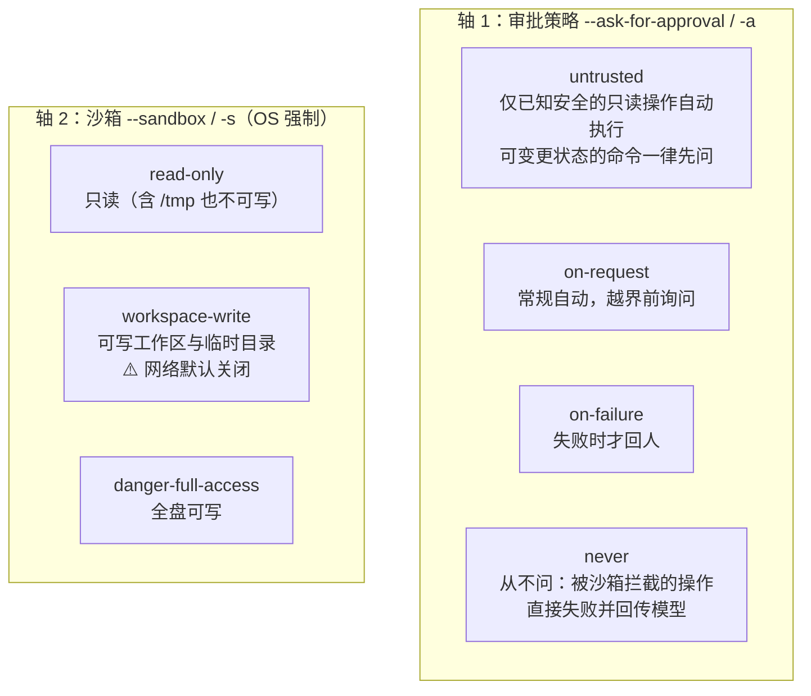

# VaneHub AI 内置 CLI 参数完全参考

> VaneHub AI 技术文档 · Agent 基础设施系列
>
> 本文是 VaneHub AI 编排的五种 AI 编码 CLI 的参数完全参考：Claude Code、OpenCode、Codex CLI、Antigravity CLI，以及已停服的 Gemini CLI（迁移附录）。逐一覆盖调用形态、会话管理、模型选择、权限与沙箱、输出格式、配置注入等参数族，并给出宿主（PTY 适配层）按统一任务模型向各 CLI 投影参数的映射矩阵。
>
> 版本基准（2026-08 核对）：Claude Code **v2.1.2xx**、OpenCode **1.14.x**、Codex CLI（当前发布线）、Antigravity CLI **v1.1.x**（`agy`，Gemini CLI 于 2026-06-18 停服后的官方接替者）。
>
> ⚠️ **时效警告**：编码 CLI 是当前演进最快的软件品类，旗标每月都在增删改名；本表为宿主适配层的实现基准，接入前务必以各 CLI 当前安装版本的 `--help` 与官方文档为最终依据（注意：Claude Code 的 `--help` 不列出全部旗标——缺席不代表不可用）。

---

## 1. 五 CLI 概览与现状

| CLI | 命令 | 厂商 | 技术形态 | 现状要点 |
|-----|------|------|---------|---------|
| Claude Code | `claude` | Anthropic | Node/原生二进制，TUI + print 模式 + 后台会话 | 旗标面最全的参考系；native 安装为推荐路径，npm 安装已标记废弃 |
| OpenCode | `opencode` | Anomaly（开源 MIT） | TUI + `run` 无头 + `serve` HTTP 服务端 + ACP | 客户端-服务端架构最清晰；provider 中立（多模型）；内建 LSP 自动加载 |
| Codex CLI | `codex` | OpenAI | TUI + `exec` 无头 | 权限模型独树一帜：**OS 级强制沙箱**（Seatbelt / Landlock+seccomp）与审批策略双轴 |
| Antigravity CLI | `agy` | Google | Go 闭源二进制，TUI + print | 2026-05 I/O 发布、6-18 接替 Gemini CLI；多模型自动路由；**功能尚未与旧 Gemini CLI 对齐**，缺口需宿主规避 |
| Gemini CLI（遗留） | `gemini` | Google | Node 开源 | **2026-06-18 起对免费/Pro/Ultra 停服**——仅存迁移语义，见附录 §7 |

宿主视角的共同抽象：五者都收敛为「**一次性无头执行**（prompt 进、结果出）与**交互式 TUI 会话**（PTY 托管）两种形态 + **会话续接** + **权限档位** + **模型/配置注入**」——这也是本文各节的统一组织维度，§8 的参数投影矩阵按此映射。

---

## 2. 核心能力对照总表

| 维度 | Claude Code | OpenCode | Codex CLI | Antigravity CLI |
|------|-------------|----------|-----------|-----------------|
| 无头执行 | `claude -p "…"` | `opencode run "…"` | `codex exec "…"` | `agy -p "…"` |
| 结构化输出 | `--output-format json / stream-json` | `--format json`（事件流） | `exec` 的 JSON 输出模式 | 有限（print 文本为主） |
| 继续上次会话 | `-c` / `--continue` | `-c` / `--continue` | 会话恢复子命令 | 会话内 `/rewind` 等（外部续接弱） |
| 按 ID/名恢复 | `-r <id\|name>`、`-n` 命名 | `-s <sessionID>`、export/import JSON | 支持 | 弱 |
| 模型选择 | `--model` 别名/全名 + `--fallback-model` + `--effort` | `-m provider/model` | `--model` + config profile | **无 `--model` 旗标**：8 模型自动路由（Gemini 3.x 族 / Claude Sonnet 4.6 / Opus 4.6 / GPT-OSS 120B），默认 Gemini 3.5 Flash + `--effort` |
| 权限档位 | 6 种 `--permission-mode` | agent 级 permission 配置（frontmatter/JSON） | 审批策略 × 沙箱双轴 | `--mode`（default/accept-edits/plan）+ request-review 默认 |
| 全放行（危险） | `--dangerously-skip-permissions` | agent 配置放开 | `--dangerously-bypass-approvals-and-sandbox`（别名 `--yolo`） | `--dangerously-skip-permissions`（**无** `--yolo`） |
| OS 级沙箱 | 无（策略层拦截） | 无（策略层） | ✅ Seatbelt / Landlock+seccomp | 有 `--sandbox` 但**非安全边界**（见 §6.4） |
| 服务端形态 | daemon / 后台会话 / Remote Control | `serve`（HTTP API）/ `web` / `acp` | — | — |
| Worktree 原生支持 | `--worktree` | 会话并行（进程级） | — | — |
| MCP 配置 | `claude mcp` + `--mcp-config` | `opencode mcp` + JSON 配置 | config.toml | 继承 `~/.gemini` 导入 + 自有配置 |
| 项目指令文件 | CLAUDE.md（`--bare` 可跳过） | AGENTS.md | `.rules`（`--ignore-rules` 可跳过） | GEMINI.md（沿用 `~/.gemini`） |

---

## 3. Claude Code（`claude`）

### 3.1 调用形态与输出

| 参数 | 说明 |
|------|------|
| `claude` | 交互式 TUI（宿主 PTY 托管形态） |
| `claude "prompt"` | 带初始提示进入交互 |
| `-p, --print "prompt"` | **print 模式**：无头执行，输出后退出——脚本/编排的主形态 |
| `--output-format <text\|json\|stream-json>` | 输出格式；`json` 为结构化结果（免解析自然语言），`stream-json` 为逐事件流（宿主实时进度解析用） |
| `--input-format <text\|stream-json>` | 输入格式；`stream-json` 支持多轮流式喂入 |
| `--verbose` | 详细日志（含逐轮工具调用信息） |
| `--bare` | 跳过 MCP、hooks、plugins、CLAUDE.md 发现——最小启动，适合高频脚本循环降低冷启动 |

### 3.2 会话管理

| 参数 | 说明 |
|------|------|
| `-c, --continue` | 继续本项目最近一次会话 |
| `-r, --resume <id\|name>` | 按会话 ID 或名称恢复 |
| `-n, --name <name>` | 为会话命名（配合 resume 按名续接） |
| `--fork-session` | 从已有会话分叉新线（不污染原会话） |
| 后台/守护形态 | `claude daemon <subcommand>`、后台会话族（启动/attach/停止/删除，删除时保留 transcript）；v2.1.199 起 `--dangerously-skip-permissions daemon <sub>` 才正确路由到 daemon（此前版本会被当作 prompt——宿主适配需注意版本判别） |
| `--environment` / `--ref` | 远程/环境会话：指定运行环境与源码 ref |

### 3.3 模型与预算

| 参数 | 说明 |
|------|------|
| `--model <alias\|full>` | 模型别名（`sonnet`/`opus`）或完整模型名 |
| `--fallback-model <model>` | 主模型过载时自动降级目标（print 模式） |
| `--effort <low\|medium\|high\|max>` | 会话级推理力度（`max` 限旗舰模型） |
| `--max-turns <n>` | print 模式轮次上限，命中即报错退出——**编排必设护栏** |
| `--max-budget-usd <n>` | print 模式美元硬顶，命中即中止——**编排必设护栏** |

### 3.4 权限与工具控制（宿主 PEP 的对接面）

六种权限档位与三层工具收窄：

| 参数 | 说明 |
|------|------|
| `--permission-mode <mode>` | `default`（逐项询问）/ `acceptEdits`（自动接受编辑）/ `plan`（只读规划）/ `auto` / `dontAsk`（不问，被拦截即失败返回模型）/ `bypassPermissions`（全放行）。无人值守 CI 的安全选择是 `dontAsk`；`auto` 需 Team/Enterprise/API 计划且限特定模型 |
| `--allowedTools <list>` | 白名单工具**免提示**执行；支持范围化 Bash 如 `Bash(git diff *)` |
| `--disallowedTools <list>` | 黑名单（仍在上下文中，只是被拒） |
| `--tools <list\|""\|default>` | **限定可用工具集**——比 deny 更强：工具从模型上下文中移除、等于不存在；`""` 剥离全部工具（纯文本任务） |
| `--dangerously-skip-permissions` | 等价 `bypassPermissions`；官方口径：仅容器/VM 内使用 |
| `--allow-dangerously-skip-permissions` | 把 bypass 档加入 Shift+Tab 循环但不默认进入 |
| `--permission-prompt-tool <mcp_tool>` | **print 模式下把权限提问委托给一个 MCP 工具**——宿主实现"无头执行 + 程序化审批"的关键旗标（PDP 外置的官方通道） |

### 3.5 系统提示注入

| 参数 | 说明 |
|------|------|
| `--system-prompt <text>` / `--system-prompt-file <path>` | **替换**默认系统提示（二者互斥）——替换会丢弃默认的工具指导与安全指令，仅当身份/权限模型整体不同时使用 |
| `--append-system-prompt <text>` / `--append-system-prompt-file <path>` | **追加**到默认提示——保留 Claude Code 默认行为之上加规则，可与替换旗标组合；逐次调用生效 |

### 3.6 环境与其他

| 参数 | 说明 |
|------|------|
| `--worktree` | 为会话创建隔离 git worktree——多会话并行的原生支持（与宿主 Worktree 编排二选一，避免双重嵌套） |
| `--add-dir <path>` | 追加可访问目录 |
| `--mcp-config <path>` | 指定 MCP 配置 |
| `--settings <path>` | 指定 settings 文件 |
| 子命令 | `claude auth login/status/logout`、`claude update`、`claude doctor`、`claude mcp`、`claude install`（npm→native 迁移） |

---

## 4. OpenCode（`opencode`）

### 4.1 架构特点

OpenCode 是五者中**客户端-服务端分离**最彻底的：TUI 只是前端，后端可独立以 `serve` 常驻——宿主可用「一个常驻 server + 多次 `run --attach`」规避每次调用的 MCP 冷启动，这是高频编排下的显著延迟优化。数据面为本地 SQLite（会话/消息/项目）+ `auth.json` 凭据；内建 LSP 自动加载项目语言服务器（Agent 自带结构级代码理解）。

### 4.2 `opencode run`（无头执行）

| 参数 | 短旗标 | 说明 |
|------|--------|------|
| `--command` | | 要运行的命令（message 作为参数） |
| `--continue` | `-c` | 继续上次会话 |
| `--session <id>` | `-s` | 指定会话 ID 续接 |
| `--fork` | | 从既有会话分叉新线 |
| `--share` | | 发布共享该会话 |
| `--model <provider/model>` | `-m` | **provider/model 二段式**模型选择（如 `anthropic/claude-sonnet-4-6`） |
| `--agent <name>` | | 指定 agent（角色/权限预设） |
| `--file <path>` | `-f` | 附加文件到消息（可多个） |
| `--format <default\|json>` | | `json` 输出**原始事件对象流**（宿主解析用） |
| `--title <text>` | | 会话标题（缺省取截断的 prompt） |
| `--attach <url>` | | **附着到运行中的 `opencode serve`**（如 `http://localhost:4096`）——跳过后端冷启动 |
| `--port <n>` | | 本地 server 端口（默认随机） |

### 4.3 服务端与协议形态

| 命令 | 说明 |
|------|------|
| `opencode serve` | 无头 HTTP API 服务器（HTTP Basic 认证，用户名 `opencode`）——宿主可直接走 HTTP 接口编排而非 PTY |
| `opencode web` | serve + 自动拉起 Web UI |
| `opencode acp` | 启动 **ACP（Agent Client Protocol）服务器**，stdin/stdout ND-JSON——面向编辑器/宿主的标准化 Agent 接入协议（宿主集成的另一条正规通道，与 PTY 托管并列评估） |
| `opencode attach <url>` | 用 TUI 附着到远端后端（远程编排场景） |

### 4.4 Agent 与会话治理

| 命令/参数 | 说明 |
|-----------|------|
| `opencode agent create` | 创建自定义 agent（系统提示 + 权限配置）；**未显式允许的权限在生成的 frontmatter 中默认 deny**；传全 `--path --description --mode --permissions` 即非交互创建——宿主可程序化生成角色（如只读 reviewer / 沙箱 implementor 流水线） |
| `opencode agent list` | 列出 agent |
| `opencode session …` | 会话管理族 |
| `opencode export / import` | 会话导出/导入 **JSON**——跨机迁移、归档、宿主侧 Context Handoff 的现成载体 |
| `opencode stats` | 用量/成本统计 |
| `opencode models [--refresh]` | 列出可用模型；`--refresh` 刷新缓存的 provider 模型清单 |
| `opencode auth` / `mcp` / `upgrade` | 凭据、MCP 接入、升级 |

配置位：`~/.config/opencode/opencode.json`（全局）+ 项目级 AGENTS.md；环境变量可覆盖关键配置。

---

## 5. Codex CLI（`codex`）

### 5.1 权限模型：双轴正交

Codex 的独特性在于把「问不问」与「能碰什么」拆成**两个正交轴**，且沙箱由**操作系统强制**（macOS 12+ 用 Apple Seatbelt / `sandbox-exec` profile；Linux 用 Landlock + seccomp）——越界操作是"失败"而不是"询问"：



| 组合 | 语义 | 典型用途 |
|------|------|---------|
| `-a on-request -s workspace-write` | 区内自动、越界询问（官方 "auto" 口径） | 交互开发 |
| `-a never -s workspace-write` | 不问；越界即失败回模型 | **无头编排的推荐基线** |
| `-a untrusted -s read-only` | 最谨慎 | 审查不可信仓库 |

### 5.2 关键旗标

| 参数 | 说明 |
|------|------|
| `codex` | 交互 TUI |
| `codex exec "prompt"` | 无头执行 |
| `--sandbox, -s <mode>` | 见上；**workspace-write 下网络默认禁用**——`npm install`/`git push`/`curl` 会触发审批或失败，需显式开网 |
| `--ask-for-approval, -a <policy>` | 见上 |
| `-c '<key>=<value>'` | **行内配置覆盖**，如 `-c 'sandbox_workspace_write.network_access=true'` 单次开网——宿主逐任务差异化注入配置的主通道 |
| `--full-auto` | **已废弃**的兼容旗标（约等于 workspace-write 组合），仍可用但打印警告；新脚本一律用显式双轴 |
| `--dangerously-bypass-approvals-and-sandbox`（别名 `--yolo`） | 关审批 + 关沙箱，以用户权限直跑——仅限一次性容器/VM 且外层有防护 |
| `--ignore-user-config` | 跳过 `~/.codex/config.toml`——CI/编排防止本地配置渗入的**必备旗标** |
| `--ignore-rules` | 跳过项目 `.rules` 文件（受控环境） |
| `--model` / `--profile` | 模型与配置档选择 |
| `-i <image>` | 附加图片输入 |

### 5.3 配置文件（config.toml）

```toml
# ~/.codex/config.toml 或 <project>/.codex/config.toml
approval_policy = "on-request"     # untrusted | on-request | on-failure | never
sandbox_mode    = "workspace-write" # read-only | workspace-write | danger-full-access

[sandbox_workspace_write]
network_access = true               # workspace-write 下显式开网
```

要点：**旗标 > 配置文件**（单次运行强制某档位的可靠方式）；项目级配置仅对**受信项目**加载——仓库不能靠自带配置给自己提权（供应链防线）；权限档（permission profiles，`/permissions` 交互选择、`default_permissions` 设默认）为 beta，与旧三轴配置并存时旧配置优先。

---

## 6. Antigravity CLI（`agy`）

### 6.1 背景与迁移语义

Google 于 2026-05 I/O 发布 Antigravity CLI，**6-18 停服 Gemini CLI**（免费/Pro/Ultra 全停，无宽限期——所有调用 `gemini` 的脚本当日即断）。`agy` 为 Go 编写的闭源二进制，定位从"单模型问答"升级为多 Agent 终端助手，但**发布时未与旧 CLI 功能对齐**——宿主适配要同时处理"继承"与"缺口"两面：

**继承**（迁移友好面）：
- 沿用 `~/.gemini` 主目录与 `~/.gemini/GEMINI.md` 全局指令——旧配置与约定直接生效
- 首次启动引导导入 Gemini CLI 的 MCP servers、allowed commands、keybindings、主题
- `agy plugin import gemini`：批量迁移旧扩展为 Antigravity 插件

### 6.2 执行模式与权限

| 参数/机制 | 说明 |
|-----------|------|
| `agy` | 交互 TUI |
| `-p, --print "prompt"` | 无头执行 |
| `--mode <default\|accept-edits\|plan>` | 启动即设执行模式（v1.1 起）；交互中 Shift+Tab 循环切换 |
| request-review（默认模式） | 写文件前暂停展示**行级 diff 预览**，`f` 键逐条接受/拒绝——比旧 Gemini CLI 的整体确认更细粒度 |
| `--dangerously-skip-permissions` | 全放行（YOLO）。**注意：没有 `--yolo` 旗标**——旧 Gemini CLI 的 `--yolo`/`--approval-mode=yolo` 在 agy 中不存在，迁移脚本必改 |
| `--sandbox` | 存在但**不构成安全边界**：公开 issue 已确认与 `--dangerously-skip-permissions` 组合时可被绕过——宿主不得将其计入安全假设，隔离靠外层（容器/worktree/受限用户） |
| `--effort` / `/effort` | 推理力度查看与调整（v1.1.5） |

### 6.3 模型策略

**没有 `--model` 旗标**（社区有公开 feature request）：同一命令后接 8 个模型——Gemini 3.x 族、Claude Sonnet 4.6、Claude Opus 4.6、GPT-OSS 120B——默认 Gemini 3.5 Flash 并按任务**自动路由**。对宿主意味着：模型选择不可编排注入，成本/能力档位控制只能靠 `--effort` 与任务描述间接影响——这是与其他四者的关键差异，统一任务模型中"指定模型"字段对 agy 需降级为 no-op 并在 UI 标注。

### 6.4 已知缺口（宿主必须规避）

| 缺口 | 影响 | 宿主对策 |
|------|------|---------|
| **`-p` 模式无 plan/只读档**：print 模式自动批准全部工具调用（含 `write_file`） | 无头跑不可信输入不安全；无"只读评审"保证 | 需只读语义的任务不路由给 agy 无头模式；或跑在只读挂载/一次性 worktree |
| `--sandbox` 可被绕过（见上） | 沙箱不可作为安全层 | 外层隔离兜底 |
| 无 `--model` | 模型不可指定 | 字段降级 + 标注 |
| 会话外部续接弱 | 跨进程编排的断点续作不如其他四者 | 以任务包（OpenSpec 变更包）为状态载体，弱依赖 CLI 会话 |

### 6.5 其他

斜杠命令族活跃演进：`/plan`（取代旧 `/planning`）、`/effort`、`/codesearch`（别名 `/cs` `/search`，工作区正则搜索）、`/rewind`、`/compact` 等；`agy changelog` 查看版本变更。该 CLI 处于高速迭代期（月度多次发版），宿主适配层应把 agy 的参数投影表做成**按版本分支**的配置而非硬编码。

---

## 7. 附录：Gemini CLI（遗留）

仅为存量配置迁移保留语义（**2026-06-18 起停服**，调用即失败）：

| 旧参数 | 说明 | agy 对应 |
|--------|------|---------|
| `-p "prompt"` | 无头执行 | `agy -p`（注意 §6.4 权限缺口） |
| `--yolo` / `--approval-mode=yolo` | 全自动 | `--dangerously-skip-permissions` |
| `--approval-mode <default\|auto_edit\|plan>` | 审批档位 | `--mode <default\|accept-edits\|plan>`（交互）；`-p` 下**无对应** |
| `--model` | 模型选择 | 无对应（自动路由） |
| `GEMINI.md` / `settings.json` / 扩展 | 项目指令/配置/扩展 | 直接沿用 `~/.gemini` / 首启导入 / `agy plugin import gemini` |

---

## 8. 宿主参数投影矩阵（统一任务模型 → 各 CLI）

宿主以统一任务模型下发任务，PTY 适配层按下表投影为各 CLI 的实际参数：

| 统一字段 | Claude Code | OpenCode | Codex CLI | Antigravity |
|----------|-------------|----------|-----------|-------------|
| 无头 + prompt | `-p "…"` | `run "…"` | `exec "…"` | `-p "…"` |
| 结构化输出 | `--output-format stream-json` | `--format json` | exec JSON 模式 | —（文本解析降级） |
| 会话续接 | `-r <name>` | `-s <id>` / `--attach` | resume | —（任务包续作） |
| 模型 | `--model` | `-m provider/model` | `--model` | no-op + 标注 |
| 推理力度 | `--effort` | （随模型） | （随模型/profile） | `--effort` |
| 权限档：只读/规划 | `--permission-mode plan` | 只读 agent | `-a untrusted -s read-only` | `--mode plan`（**仅交互**） |
| 权限档：区内自动 | `--permission-mode acceptEdits` | 默认 agent | `-a never -s workspace-write` | `--mode accept-edits` |
| 权限档：全放行 | `--dangerously-skip-permissions` | 放开 agent 配置 | `--dangerously-bypass-approvals-and-sandbox` | `--dangerously-skip-permissions` |
| 程序化审批 | `--permission-prompt-tool <mcp>` | serve HTTP / ACP 回调 | `-a on-request` + PTY 应答 | PTY 应答 |
| 预算护栏 | `--max-turns` + `--max-budget-usd` | 宿主侧计量 | 宿主侧计量 | 宿主侧计量 |
| 配置隔离 | `--bare` / `--settings` | 独立 config 路径 | `--ignore-user-config` | 独立 HOME 注入 |
| 工作区隔离 | `--worktree` 或宿主 worktree | 宿主 worktree | 沙箱 + 宿主 worktree | 宿主 worktree（必须） |

三条实现要点：

1. **权限语义不同构**：四家的"档位"背后是三种机制——策略层拦截（Claude Code）、OS 强制沙箱（Codex）、diff 级人审（agy request-review）。宿主 PDP 输出的抽象决策（allow/ask/deny）到各 CLI 的映射必须按机制单独实现与测试，不能假设同名档位等价。
2. **护栏不齐一律宿主兜底**：只有 Claude Code 提供原生轮次/预算硬顶——其余三家的预算控制在宿主侧实现（token 计量 + 超时 + 强制终止），保证五 CLI 在编排层获得一致的护栏语义。
3. **无头即高危默认**：无头模式下各家的默认行为差异极大（agy 全放行 vs Codex 默认保守）——宿主对"无头 + 权限档"的组合应做白名单式显式配置，禁止落到 CLI 各自的默认值。

---

## 9. 故障排查速查

| 症状 | CLI | 常见原因 | 处理 |
|------|-----|---------|------|
| `--help` 里找不到某旗标 | Claude Code | help 不列全量旗标 | 以官方 CLI reference 为准 |
| daemon 子命令没执行、开了个会话 | Claude Code | v2.1.199 前旗标前置路由 bug | 升级；或调整旗标顺序 |
| 每次 run 都很慢 | OpenCode | MCP 冷启动 | 常驻 `serve` + `--attach` |
| 嵌入式运行时崩溃 | OpenCode | CPU 缺 AVX（部分 VM 类型） | VM CPU 设 host / 换支持 AVX2 的运行时 |
| `npm install` 神秘失败/被问 | Codex | workspace-write 默认断网 | `-c 'sandbox_workspace_write.network_access=true'` |
| CI 行为与本地不一致 | Codex | 本地 config.toml 渗入 | `--ignore-user-config`（必要时 `--ignore-rules`） |
| `--yolo` 报错 | agy | 旧 Gemini 旗标不存在 | 改 `--dangerously-skip-permissions` |
| 无头评审改了文件 | agy | `-p` 无只读档、自动批准写操作 | 不用 agy 做无头只读任务；外层只读隔离 |
| `gemini` 命令全部失败 | Gemini CLI | 2026-06-18 停服 | 迁移 agy（§7 对照表） |
| 权限档表现与预期不符 | 全部 | 版本间旗标语义漂移 | 适配层按版本分支配置；升级后跑权限回归测试 |

---

## 10. 参考

- Claude Code：code.claude.com/docs → CLI reference（全旗标权威源）
- OpenCode：opencode 官方 docs → CLI / Server / ACP 章节
- Codex CLI：developers.openai.com/codex → Sandbox & approvals、Configuration Reference
- Antigravity CLI：Google Developers Blog（Gemini CLI 停服公告）、官方 docs 与 github.com/google-antigravity/antigravity-cli issue 追踪（缺口现状的一手来源）
- 本系列相关：MCP 篇（各 CLI 的 MCP 配置治理）、多 Agent 篇 §4（worktree 隔离）、OpenSpec 篇 §7（变更包作为跨 CLI 编排原语）、Function Calling 篇 §6（权限层 PDP/PEP 的上位设计）
