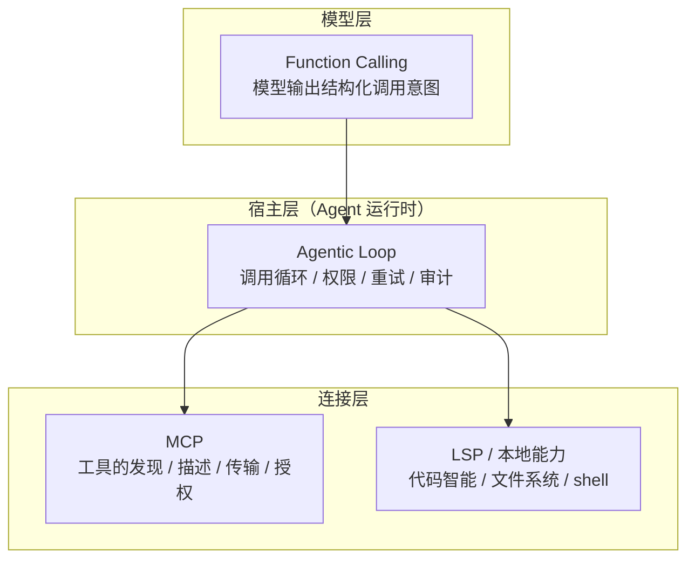
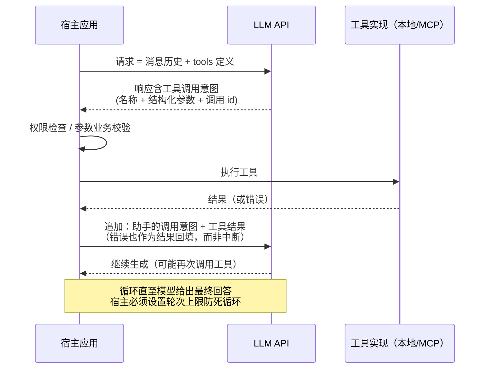
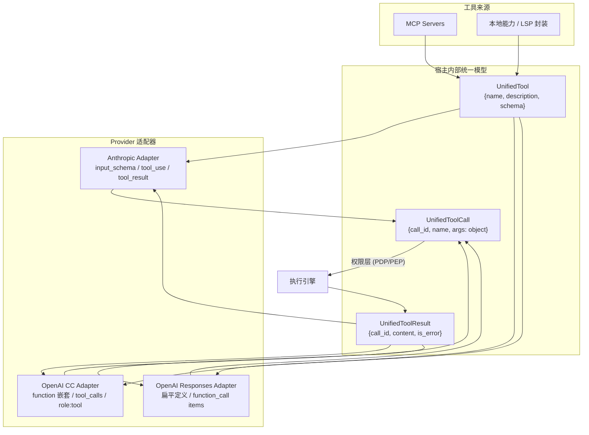

# Function Calling（工具调用）技术架构

> 本文介绍 Function Calling 的完整技术体系：通用调用循环与约束解码原理、Anthropic Tool Use 与 OpenAI Function Calling 的 API 细节对比、并行调用与流式组装、结构化输出、以及多 Provider 适配层的设计。适用于实现工具执行引擎、跨 Provider 消息格式转换层时参考。
>
> API 基准：Anthropic Messages API（tool use，含 2025-11 后的 advanced tool use 能力族）与 OpenAI Responses API / Chat Completions API（2026 年现状：新项目官方推荐 Responses API，Assistants API 已废弃并定于 2026-08-26 关停）。

---

## 1. 概述

### 1.1 定义与本质

Function Calling（Anthropic 称 Tool Use）是 LLM Provider 在**模型层**提供的能力：开发者随请求声明一组带 JSON Schema 的函数描述，模型在推理中决定"是否调用、调用哪个、传什么参数"，并以结构化格式输出调用意图。

**最重要的一条心智模型：模型从不执行任何函数**。它只输出"我想以这些参数调用这个函数"的声明；执行发生在你的代码里，你把结果送回模型，模型再基于结果继续生成。因此 Function Calling 的准确称呼其实是 "function call **request** generation"——安全边界、重试、超时、鉴权全部是调用方（宿主）的责任。

### 1.2 在 Agent 技术栈中的位置



系列呼应：Function Calling 是 MCP 的**上游**——MCP 解决"工具从哪来、怎么连"，Function Calling 解决"模型如何表达要用工具"。宿主的职责是把 MCP `tools/list` 的结果翻译成各 Provider 的工具定义格式，再把模型的调用意图翻译回 MCP `tools/call`。

### 1.3 为什么参数是可靠的：约束解码

现代 Provider 的结构化保证不靠"提示模型输出 JSON 再祈祷"，而靠**约束解码（constrained decoding）**：将 JSON Schema 编译为语法（如上下文无关文法），在采样阶段直接屏蔽会违反语法的 token——模型在物理上无法生成不合 schema 的输出。这是 OpenAI Structured Outputs / strict mode 与 Anthropic structured outputs 的共同底层机制。理解这一点有两个推论：

- schema 首次使用需编译（有一次性延迟，随后缓存）——schema 频繁变化的场景会反复付出这个成本
- 约束的是**语法合法性**，不是**语义正确性**——参数值仍可能是错的（模型幻觉出不存在的 ID），宿主侧业务校验不可省

---

## 2. 通用调用循环

两家 API 的循环骨架相同：



循环的四条铁律（跨 Provider 通用）:

1. **调用意图必须原样回传**：下一轮请求的消息历史里要包含助手输出的调用块本身，再跟工具结果——丢失会破坏对应关系
2. **按 id 配对，不按顺序**：并行调用时结果与请求靠调用 id 关联
3. **错误是数据不是异常**：工具失败应作为结果内容回填（附错误标记），让模型看到并自我修正/换路，而不是宿主侧中断循环
4. **封顶**：最大轮次、单轮最大调用数、总 token 预算三重上限

---

## 3. Anthropic：Tool Use（Messages API）

### 3.1 工具定义

工具在请求顶层 `tools` 数组声明，三要素扁平结构：

```json
{
  "name": "get_weather",
  "description": "获取指定城市的当前天气。当用户询问天气、气温、是否下雨时使用。",
  "input_schema": {
    "type": "object",
    "properties": {
      "city": { "type": "string", "description": "城市名，如 'Singapore'" },
      "unit": { "type": "string", "enum": ["celsius", "fahrenheit"] }
    },
    "required": ["city"]
  }
}
```

- 字段名是 `input_schema`（区别于 OpenAI 的 `parameters`），JSON Schema 格式
- 模型**完全依赖这三个字段**决定是否调用与如何传参——description 的写法工程学与 Skills 篇 §4 的原则一致（能力 + 时机 + 触发词）
- 启用 tools 后 API 会自动注入一段工具使用系统提示，产生**固定的 token 开销**（数百 token 量级，随模型不同），这部分计入 input tokens

### 3.2 响应与回传：内容块模型

Anthropic 的响应是**内容块（content blocks）数组**——文本与工具调用作为不同类型的块混排，这是与 OpenAI 最大的结构差异：

```jsonc
// 模型响应（assistant 消息）
{
  "stop_reason": "tool_use",
  "content": [
    { "type": "text", "text": "我来查一下天气。" },
    { "type": "tool_use", "id": "toolu_01A...", "name": "get_weather",
      "input": { "city": "Singapore", "unit": "celsius" } }   // 已解析的对象，非字符串
  ]
}
```

回传时，工具结果放在**下一条 user 消息**的内容块中：

```jsonc
{
  "role": "user",
  "content": [
    { "type": "tool_result", "tool_use_id": "toolu_01A...",
      "content": "31°C，多云", "is_error": false }
  ]
}
```

实现要点：

- `input` 是**已解析的 JSON 对象**（OpenAI 的 `arguments` 是需要自行 `JSON.parse` 的字符串）——少一步解析，但流式时要处理增量拼装（见 §3.5）
- `tool_result` 的 `content` 支持富内容块（文本 + 图片），工具可以"返回一张截图"
- `is_error: true` 是错误回填的标准通道
- **并行调用的所有结果必须在同一条 user 消息中一次性回传**，逐条分开发会报错

### 3.3 tool_choice：四种模式

| 模式 | 语义 | 典型用途 |
|------|------|---------|
| `{"type": "auto"}` | 模型自主决定（默认） | 常规 Agent 循环 |
| `{"type": "any"}` | 必须调用至少一个工具 | 强制走工具路径 |
| `{"type": "tool", "name": "x"}` | 必须调用指定工具 | 强制结构化输出（历史主流做法） |
| `{"type": "none"}` | 禁止调用 | 收尾轮/纯文本轮 |

配合 `disable_parallel_tool_use: true` 可进一步收紧：auto 下"至多一个"、any/tool 下"恰好一个"。

### 3.4 并行工具调用

Claude 4 系模型默认具备良好的并行调用能力：一次响应中返回**多个 `tool_use` 块**，宿主可并发执行后把全部 `tool_result` 装入同一条消息回传。工程注意：

- 并发执行前逐个过权限层（PDP/PEP）——不能因为是同一批就整批放行
- 结果块顺序无所谓，配对靠 `tool_use_id`
- 提示词可显式鼓励并行（"相互独立的查询请并行调用"），对降低多轮延迟收益显著

### 3.5 流式：input_json_delta

流式模式下工具调用参数以增量事件到达：`content_block_start`（宣告 tool_use 块与 id/name）→ 一串 `content_block_delta`（`input_json_delta`，携带 `partial_json` 字符串片段）→ `content_block_stop`。宿主要做**片段拼接 + 完整后解析**；SDK 的高层接口（如 `get_final_message()`）会代劳，自实现引擎则需自己维护每个块的拼装缓冲。

### 3.6 结构化输出

两条路径：

- **经典路径（强制工具）**：定义一个 `input_schema` 即目标 shape 的工具 + `tool_choice: {"type": "tool"}` 强制调用——`input` 就是合 schema 的结构化数据。长期以来这是 Anthropic 生态获取结构化输出的标准做法（Anthropic 不提供 OpenAI 式的 `response_format` JSON mode）
- **原生路径（structured outputs）**：较新的官方能力，支持在工具上标注 `strict: true` 获得 schema 严格保证，以及对最终回复的输出格式约束。注意与其他高级能力的兼容矩阵（如 strict 工具与 programmatic tool calling 不兼容，见 §3.7）

### 3.7 高级能力族（advanced tool use）

这一组能力是 Anthropic 侧近期演进的重点，对"工具很多、调用很密"的 Agent 宿主尤其相关：

| 能力 | 机制 | 解决的问题 |
|------|------|-----------|
| **Server Tools** | `web_search`、`code_execution`、`web_fetch` 等在 Anthropic 基础设施执行，宿主无需实现 handler，直接收到结果 | 常用能力免自建；注意与 client tool 混在同批并行时的 fallback 语义 |
| **Tool Search Tool** | 工具标注 `defer_loading: true`，定义不预载上下文；模型经工具检索机制按需发现并加载（beta: `tool-search-tool-2025-10-19`） | 数百上千工具时上下文爆炸——与 MCP 篇"工具过多做检索/分组"的宿主侧方案同构，但下沉到了 API 层 |
| **Programmatic Tool Calling** | 工具标注 `allowed_callers` 允许被代码执行环境调用：模型写代码、代码在沙箱里批量/循环调用工具，中间结果不进模型上下文（beta: `advanced-tool-use-2025-11-20`） | 高频细粒度调用的 token 与延迟开销；限制：不支持 strict 工具、不支持 tool_choice 强制、schema 不得含循环 $ref |
| **Mid-conversation Tool Changes** | 经 system 消息的 `tool_addition`/`tool_removal` 内容块增删工具，而非重发整个 `tools` 数组（beta，最新旗舰模型支持） | 重发 tools 数组会**打断 prompt cache**——增量变更保住缓存前缀 |
| **Token-efficient Tool Use** | Claude 4 系内建 | 降低工具调用的 token 开销 |

### 3.8 成本与缓存要点

- `tools` 数组位于 prompt 前缀,是 **prompt caching 的理想缓存段**——保持工具定义稳定与顺序确定（与 MCP 篇 `tools/list` 确定性排序的要求呼应），命中缓存可大幅降费
- 工具定义本身 + 自动注入的工具系统提示都计入每轮 input tokens——"只传本轮相关的工具"是最直接的降本手段
- 与 extended thinking 组合时注意各自的兼容说明（思考块在工具循环中的保留规则）

---

## 4. OpenAI：Function Calling（Responses API / Chat Completions）

### 4.1 双端点现状

OpenAI 当前并存两个端点，**新项目官方推荐 Responses API**：

| 维度 | Chat Completions (`/v1/chat/completions`) | Responses (`/v1/responses`) |
|------|------------------------------------------|----------------------------|
| 定位 | 经典端点，生态兼容面最广（事实上的行业兼容格式） | 新一代，agentic by default |
| 状态 | 无状态，历史随请求全量携带 | 可选有状态（`store: true` + `previous_response_id` 续接） |
| 单请求能力 | 一轮生成 | 内部可执行多步 agentic loop（内置工具 + 自定义函数混用） |
| 内置工具 | 无 | `web_search`、`file_search`、`code_interpreter`、computer use、remote MCP servers |
| 输出结构 | `choices[0].message`（`content` + `tool_calls`） | 类型化的 `output` 数组（`message`、`function_call`、`reasoning` 等 item 混排） |
| strict 默认 | 非严格（须显式 `strict: true`） | **默认尝试严格**：schema 可归一化则自动 strict，否则回退并标注 `strict: false` |
| 缓存效率 | 基线 | 官方称缓存利用率显著优于前者 |

（Assistants API 已废弃，定于 2026-08-26 关停，存量应迁移 Responses。）

### 4.2 工具定义与格式差异

```jsonc
// Chat Completions：嵌套一层 function
{ "type": "function",
  "function": {
    "name": "get_weather",
    "description": "...",
    "strict": true,
    "parameters": { "type": "object", "properties": {...},
                    "required": ["city"], "additionalProperties": false } } }

// Responses：扁平化（无 function 包装层）
{ "type": "function",
  "name": "get_weather",
  "description": "...",
  "strict": true,
  "parameters": { ... } }
```

字段名为 `parameters`（vs Anthropic 的 `input_schema`）。**两个端点的定义格式不同**，做兼容层时是一个容易踩的差异点。

### 4.3 strict mode：结构化保证的细则

`strict: true` 复用 Structured Outputs 的约束解码引擎，换来"参数 100% 合 schema"的保证，但对 schema 有硬性要求：

- 每个 object 必须 `"additionalProperties": false`
- `properties` 中**所有字段必须列入 `required`**——可选字段用类型联合 `["string", "null"]` 表达，而不是从 required 里去掉
- 仅支持 JSON Schema 子集（部分关键字不可用）
- 不满足要求：Chat Completions 直接 400 拒绝；Responses 尝试自动归一化，失败则静默回退非严格并在响应中标注 `strict: false`——**宿主应检查这个回退标记**，否则以为有保证实际没有
- schema 首次请求编译并缓存;schema 逐请求变化会反复吃编译延迟（且缓存不适用零数据保留场景）
- JSON mode（`response_format: json_object`）已被视为 legacy：只保证"是合法 JSON"不保证合 schema，新代码一律用 strict

### 4.4 响应与回传

```jsonc
// Chat Completions 响应
{ "choices": [{ "finish_reason": "tool_calls",
    "message": { "tool_calls": [
      { "id": "call_abc", "type": "function",
        "function": { "name": "get_weather",
                      "arguments": "{\"city\":\"Singapore\"}" } }  // JSON 字符串！
    ] } }] }

// 回传：role: "tool" 消息
{ "role": "tool", "tool_call_id": "call_abc", "content": "31°C，多云" }
```

```jsonc
// Responses 响应：output 数组中的 function_call item
{ "output": [
    { "type": "function_call", "call_id": "call_abc",
      "name": "get_weather", "arguments": "{\"city\":\"Singapore\"}" } ] }

// 回传：input 中追加 function_call_output item
{ "type": "function_call_output", "call_id": "call_abc", "output": "31°C，多云" }
```

关键差异点：

- `arguments` 是 **JSON 字符串**，宿主须自行解析（并准备好解析失败的兜底——非 strict 模式下可能不合法）
- 并行调用经 `parallel_tool_calls` 参数控制（默认开启，可关）；strict 与并行在非微调模型上已兼容，微调模型上并行时 strict 可能失效——可靠性优先的场景直接 `parallel_tool_calls: false`
- Responses 的有状态模式下，续接请求只需 `previous_response_id` + 新增 input，无需重放全量历史——但跨 Provider 兼容层通常仍以无状态全量历史为公共模型

### 4.5 流式

`stream: true` 下工具调用以 delta 块到达：Chat Completions 中 `tool_calls` 的 `arguments` 字符串分片流出，按 index 聚合拼接；Responses 有对应的类型化流事件。与 Anthropic 的 `input_json_delta` 同构——宿主流式引擎都需要"按调用分桶 + 片段拼装 + 完整后解析"三件套。

---

## 5. 双家对比总表

| 维度 | Anthropic (Messages) | OpenAI (Responses / Chat Completions) |
|------|---------------------|----------------------------------------|
| 工具定义字段 | `name` / `description` / `input_schema`（扁平） | `parameters`；CC 嵌套 `function` 层，Responses 扁平 |
| 调用在响应中的形态 | `tool_use` 内容块（与 text 块混排） | CC: `message.tool_calls` 数组；Responses: `function_call` item |
| 参数格式 | 已解析对象 | JSON 字符串（需自行 parse） |
| 结果回传 | 下一条 **user** 消息中的 `tool_result` 块 | CC: `role: "tool"` 消息；Responses: `function_call_output` item |
| 配对键 | `tool_use_id` | `tool_call_id` / `call_id` |
| 强制调用 | `tool_choice: auto/any/tool/none` | `tool_choice: auto/required/指定函数/none` |
| 并行控制 | 默认可并行；`disable_parallel_tool_use` | 默认可并行；`parallel_tool_calls: false` |
| 结构化保证 | 强制工具路径 + strict 工具（structured outputs） | strict mode（Structured Outputs 引擎），Responses 默认尝试 strict |
| 错误回填 | `tool_result.is_error: true` | 结果内容中自行表达（无专用标记字段） |
| 平台侧工具 | server tools（web_search / code_execution 等） | Responses 内置工具（web_search / file_search / code_interpreter / remote MCP） |
| 大规模工具 | Tool Search Tool（defer_loading） | 上下文自管理 / 平台侧工具检索能力（视模型代际） |
| 批量调用优化 | Programmatic Tool Calling（代码内调用，中间结果不进上下文） | 经 code_interpreter 组合实现类似模式 |
| 状态管理 | 无状态（历史全量携带） | CC 无状态；Responses 可有状态 |
| 停止原因 | `stop_reason: "tool_use"` | CC `finish_reason: "tool_calls"`；Responses 看 output item 类型 |

---

## 6. 多 Provider 适配层设计

宿主同时对接多家 API 时，工具执行引擎应建立**内部统一模型 + 双向翻译**：



设计要点：

- **参数统一为已解析对象**：在适配器边界完成 OpenAI `arguments` 字符串的解析与失败兜底，内部一律对象
- **schema 归一化**：MCP 工具的 `inputSchema` 是 JSON Schema，翻译到 OpenAI strict 路径时需做 strict 化改写（补 `additionalProperties: false`、required 全量化 + null 联合）；无法 strict 化的 schema 记录降级标记
- **错误语义统一**：内部 `is_error` 标记，翻译到无专用字段的 Provider 时编码进结果内容（如 `{"error": "..."}` 约定）
- **流式统一**：各家 delta 事件在适配器内拼装为统一的"调用开始/参数增量/调用完成"事件流，上层引擎与 UI 只消费统一事件
- **能力探测矩阵**：并行开关、strict 支持、server tools、缓存行为按 (provider, model) 维护配置表，循环引擎按矩阵启用降级路径
- **审计键统一**：call_id 作为贯穿"模型意图 → 权限决策 → 执行 → 结果 → 回填"的关联键，接入 OTel span

---

## 7. 工程实践清单

| 关注点 | 要点 |
|--------|------|
| description 工程 | 动词开头、写明何时用/何时不用、参数含义放 schema 的 property description；这是影响调用准确率的第一因素 |
| 工具数量 | 单轮暴露 4–20 个为宜；更多则做检索/分组（宿主侧）或用 Tool Search Tool（API 侧）；定义计入每轮 input tokens |
| 参数校验 | 约束解码保语法不保语义——ID 存在性、路径合法性、值域业务校验在执行前做 |
| 错误回填 | 错误作为结果回填（Anthropic 用 is_error；OpenAI 编码进内容），信息要**可行动**（"文件不存在，可用文件有 X/Y"优于"失败"） |
| 循环护栏 | 最大轮次 + 单轮最大并行数 + 总 token 预算；命中上限时让模型收尾而非硬切 |
| 幂等与重试 | 网络重试可能导致同一 call 重复执行——写操作工具做幂等设计或宿主去重（按 call_id） |
| 缓存 | 工具定义稳定 + 顺序确定 → prompt cache 前缀命中；避免逐轮重排/重发 tools（Anthropic 侧可用 mid-conversation 增量变更） |
| 安全 | 每个调用过权限层；参数中的敏感数据出站审计；并行批不整批放行 |
| 观测 | 记录每次调用的 (call_id, tool, args 摘要, 决策, 时长, 结果状态)；调用成功率/重试率/轮次分布是 Agent 质量的核心指标 |

---

## 8. 故障排查速查

| 症状 | 常见原因 | 处理 |
|------|---------|------|
| 模型不调用该调的工具 | description 弱；工具过多稀释；tool_choice 被设为 none | 重写描述；缩减工具集；检查 tool_choice |
| 参数解析失败 | OpenAI 非 strict 下 arguments 不合法；流式片段未拼完就解析 | 开 strict；拼装完成事件后再 parse |
| strict 请求被 400 拒 | schema 不满足 strict 要求 | 补 additionalProperties:false、required 全量 + null 联合 |
| Responses 下 schema 保证"失灵" | 自动回退了非严格 | 检查响应中工具的 strict 标记 |
| Anthropic 回传报错 | 并行结果分多条消息发；tool_use 块未随历史回传 | 全部 tool_result 装同一条 user 消息；历史完整重放 |
| 微调模型并行时参数越界 | strict 在微调 + 并行组合下可能失效 | `parallel_tool_calls: false` |
| 成本异常增长 | tools 数组变动打断缓存；工具过多；schema 逐请求变化反复编译 | 稳定定义与顺序；增量变更；固定 schema |
| 同一工具被重复执行 | 网络重试重放请求 | 写操作幂等化 / call_id 去重 |
| 死循环调用 | 工具持续报错且错误信息不可行动；无轮次上限 | 改进错误信息；加护栏 |

---

## 9. 参考

- Anthropic：Claude Platform Docs → Tool use（overview / implement / programmatic tool calling / tool search / structured outputs 各专页）
- OpenAI：developers.openai.com → Function calling 指南、Structured Outputs、Migrate to Responses
- 本系列相关：MCP 篇（工具的连接层）、Skills 篇（description 工程学同源）、LSP 篇（可封装为工具的代码智能）
