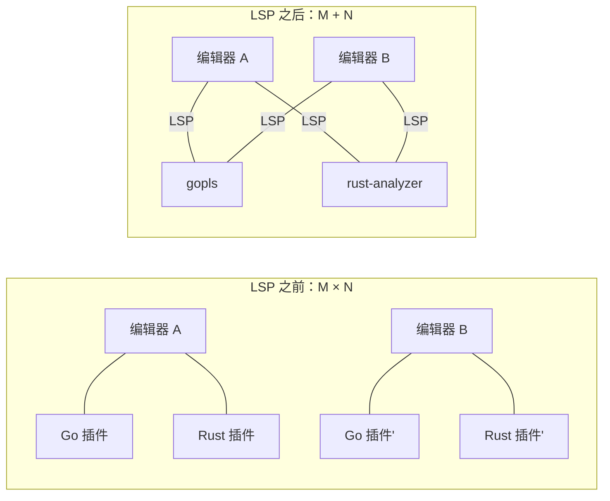
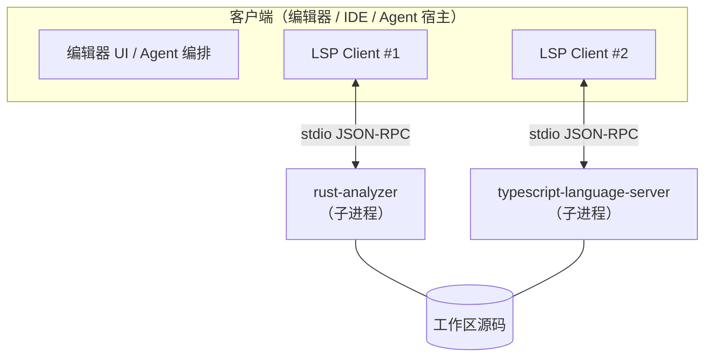
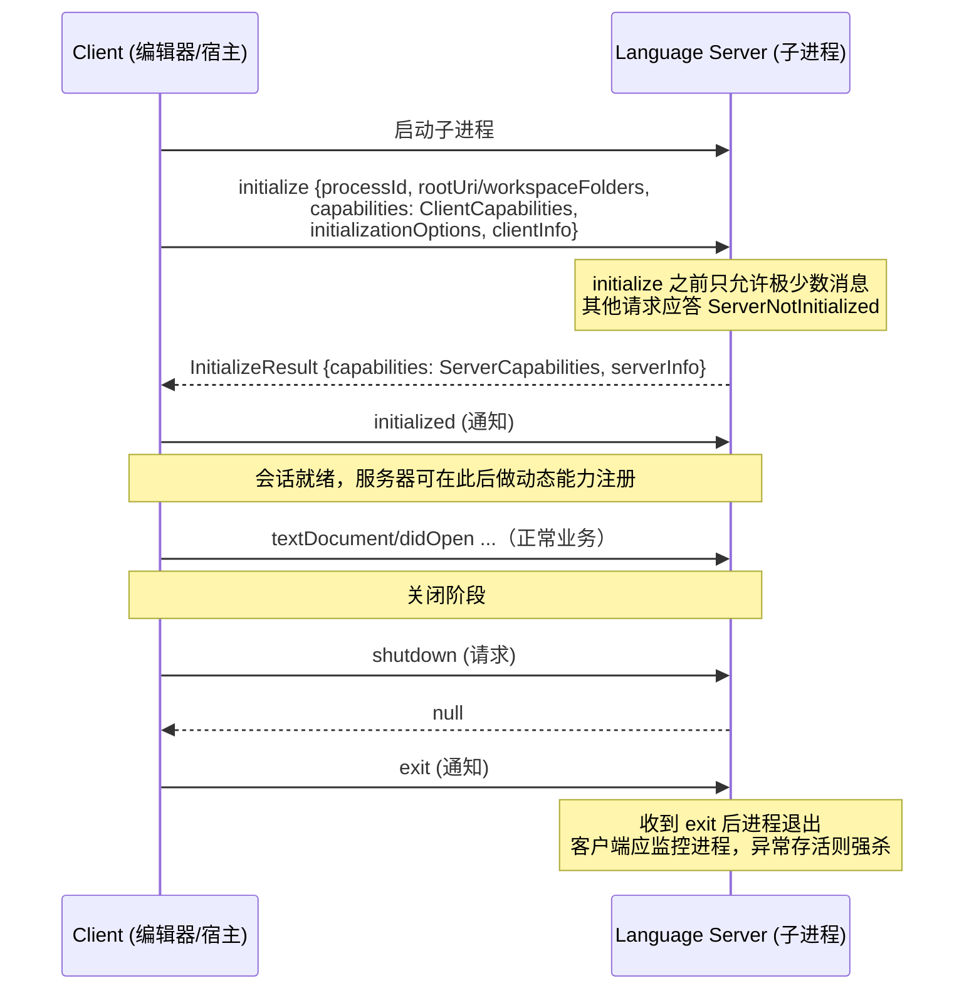
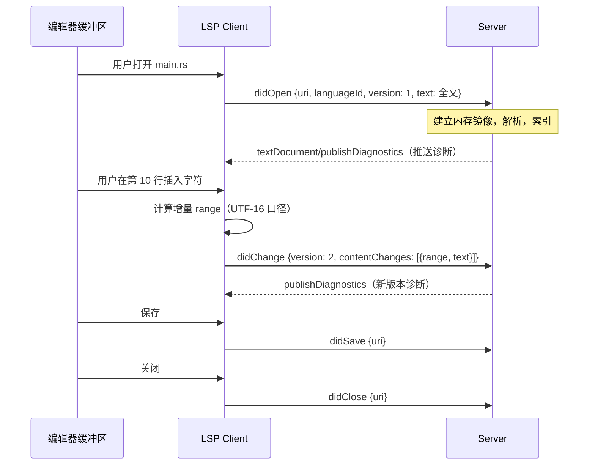
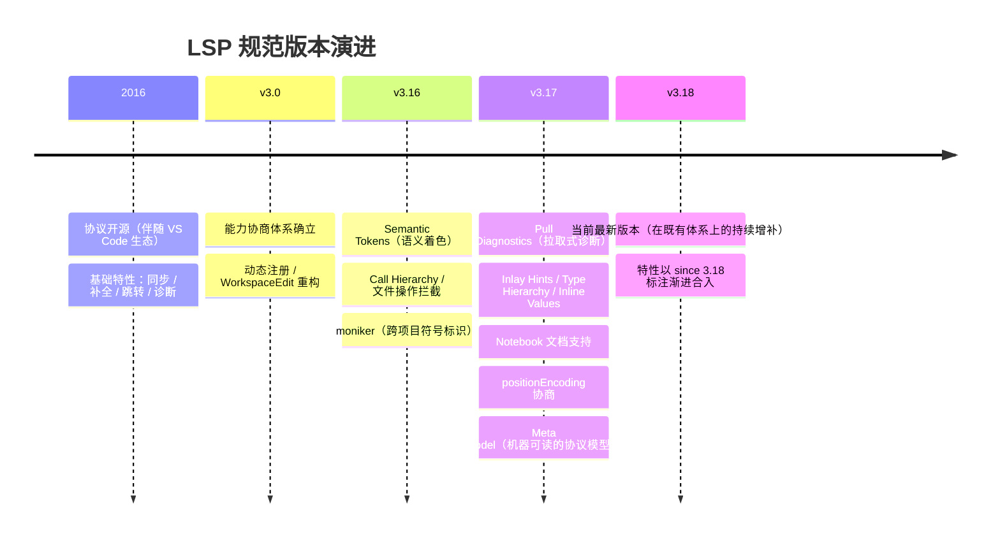
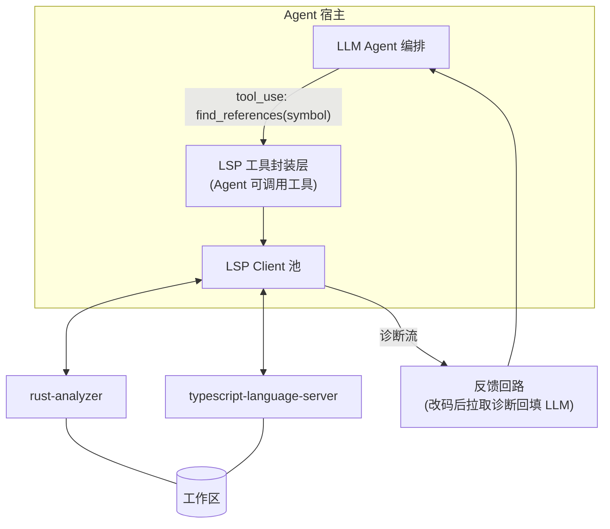

# LSP（Language Server Protocol）技术架构

> 本文介绍 LSP 的完整技术体系：协议分层与生命周期、能力协商、文本同步模型、语言特性与工作区特性、版本演进，以及 LSP 在 AI 编码 Agent 架构中的角色。适用于为应用引入代码智能（诊断、跳转、补全）、把 LSP 能力封装为 Agent 工具、以及管理 Language Server 子进程时参考。
>
> 规范基准：**LSP 3.18**（当前最新版本，Microsoft 维护，规范以 JSON-RPC 消息格式定义开发工具与语言服务器之间的通信）。

---

## 1. 概述

### 1.1 定义

LSP（Language Server Protocol，语言服务器协议）是 Microsoft 于 2016 年随 VS Code 生态推出的开放协议，定义**编辑器/IDE**（客户端）与**语言服务器**（服务端）之间的标准化通信，把语言智能（补全、跳转定义、查找引用、诊断、重构等）从编辑器中解耦为独立进程。

### 1.2 解决的问题：M×N → M+N

在 LSP 之前，M 个编辑器 × N 门语言 = M×N 个插件实现，且语言分析逻辑往往要用编辑器的宿主语言重写（如为某编辑器用 Lisp 重写 C++ 分析器）。LSP 将其降为 M+N：



附带收益：语言服务器可用**最适合该语言的语言**实现（rust-analyzer 用 Rust、gopls 用 Go），且作为独立进程运行，崩溃不拖垮编辑器。

> **系列呼应**：MCP 的设计明确受 LSP 启发——同样的 M×N 动机、同样的 JSON-RPC 消息层、同样的初始化能力协商模式。理解 LSP 有助于理解 MCP 的设计取舍；反之，两者的差异（LSP 有状态长会话且深度绑定"文档"模型，MCP 2026 后转向无状态）也反映了各自场景的不同约束。

### 1.3 角色模型



- 客户端按**语言/工作区**维度启动并持有多个语言服务器连接（通常一门语言一个服务器进程）
- 通信默认走 **stdio**（也可用 socket/pipe），服务器一般作为客户端的子进程
- 会话是**有状态**的：服务器在内存中维护打开文档的镜像、语法树、索引等分析状态

---

## 2. 协议基础（Base Protocol）

### 2.1 消息封装：Header + Content

LSP 消息在传输层采用类 HTTP 的封装——头部与内容以 `\r\n` 分隔：

```
Content-Length: 126\r\n
\r\n
{"jsonrpc":"2.0","id":1,"method":"textDocument/definition","params":{...}}
```

- `Content-Length`（必需）：内容字节数——**实现 LSP 客户端的第一个坑**：按字节而非字符计数，且读满指定字节再解析
- `Content-Type`（可选）：默认 `application/vscode-jsonrpc; charset=utf-8`

内容部分为 JSON-RPC 2.0，与 MCP 相同的三种消息类型：Request（带 id，期待响应）、Response（result 或 error）、Notification（无 id，单向）。约定参数为对象类型。

### 2.2 协议级通用机制

| 机制 | 方法 | 说明 |
|------|------|------|
| 请求取消 | `$/cancelRequest`（通知） | 客户端撤销在途请求（如用户继续输入使旧补全请求作废）；服务器应尽快以 `RequestCancelled` 错误码响应。**取消是协作式的**，服务器可以不理会 |
| 进度报告 | `$/progress`（通知） | 长操作（索引整个工作区）的进度流，token 由发起方创建；服务器主动发起进度需先经 `window/workDoneProgress/create` 征得客户端同意 |
| 协议扩展 | `$/` 前缀方法 | 依赖具体实现的私有方法约定；收到无法处理的 `$/` 请求应答 `MethodNotFound`，通知则忽略 |
| 错误码 | JSON-RPC 保留区 + LSP 专属区 | 如 `ServerNotInitialized (-32002)`、`RequestCancelled (-32800)`、`ContentModified (-32801)`——后者表示结果因文档已变更而失效，客户端应视需要重发 |

`ContentModified` 值得展开：LSP 的核心并发难题是"分析是异步的，文档在持续变化"。服务器在旧版本文档上算出的结果可能已经无效，此时与其返回错误答案不如返回 `ContentModified` 让客户端基于新版本重试——版本化文档同步（§4）是这套机制的基础。

---

## 3. 生命周期与能力协商

### 3.1 初始化握手



要点：

- `processId`：客户端进程 ID，供服务器检测宿主死亡后自我退出（防孤儿进程）
- **两段式关闭**（`shutdown` 请求 + `exit` 通知）保证服务器有机会落盘状态；宿主还应对不配合退出的服务器设置强杀超时
- 服务器崩溃后客户端负责重启，但要做**退避与熔断**（规范建议避免无限重启风暴）

### 3.2 能力协商（Capabilities）

LSP 特性演进的兼容性机制不靠版本号分支，而靠**能力旗标**：初始化时双向交换，之后各自只使用对方声明支持的特性。

- **ClientCapabilities**：细粒度到单特性的属性级（如"补全项支持 snippet 格式吗""诊断支持 relatedInformation 吗"）
- **ServerCapabilities**：声明提供哪些特性及其选项（如同步模式、补全触发字符）
- **动态注册**：客户端声明 `dynamicRegistration` 支持后，服务器可在运行期经 `client/registerCapability` 注册/注销能力（常用于按配置开关特性、按文件类型过滤）
- **枚举容错原则**：遇到不认识的枚举值不报错、忽略并尽量在往返中保留——保证新旧版本互通

> 这套"能力旗标 + 未知即忽略"的演进策略让 LSP 十年间保持了向后兼容，代价是 capability 结构极其庞大。实现客户端时不要试图声明全量能力——**只声明真正实现了的**，否则服务器会发来你处理不了的消息。

---

## 4. 文本文档同步（Text Document Sync）

这是客户端实现中状态最重的部分：服务器不读磁盘上的打开文件，而是依赖客户端推送的**内存镜像**。

### 4.1 文档所有权与版本

- `textDocument/didOpen`：文档"真理源"从磁盘转移到客户端内存——此后该 URI 的内容以客户端通知为准，服务器不得自行读文件
- `textDocument/didChange`：携带**单调递增的版本号**与变更集
- `textDocument/didClose`：所有权归还磁盘
- `didSave` / `willSave` / `willSaveWaitUntil`：保存事件；最后者允许服务器在保存前返回文本编辑（如保存时格式化）

### 4.2 同步粒度：Full vs Incremental

| 模式 | 每次 didChange 传输 | 取舍 |
|------|--------------------|------|
| Full (1) | 全文 | 实现简单；大文件高频编辑时带宽与解析开销大 |
| Incremental (2) | 变更区间列表（range + 新文本） | 高效；客户端必须精确计算 range，**多个变更按序应用且后一个 range 基于前一个应用后的状态** |

### 4.3 位置编码：UTF-16 陷阱

LSP 的 `Position` 是零基的行号 + **字符偏移**，而字符偏移的默认单位是 **UTF-16 code unit**（历史包袱：JS 字符串）。对 Rust（内部 UTF-8）实现者这是高频错误源：

- `𝄞`（U+1D11E）在 UTF-8 中 4 字节、UTF-16 中 2 code unit、按码点算 1 字符——三种口径的偏移互不相等
- 3.17 起支持 `positionEncoding` 协商（客户端声明支持 `utf-8`/`utf-16`/`utf-32`，服务器选定其一），但大量存量服务器只支持 UTF-16——客户端必须实现 UTF-8 ↔ UTF-16 偏移换算层，并对换算做属性测试



---

## 5. 语言特性（Language Features）

按交互形态分类的主要特性（方法名即 LSP method）：

### 5.1 导航与查询

| 特性 | 方法 | 说明 |
|------|------|------|
| 跳转定义 | `textDocument/definition` | 另有 declaration / typeDefinition / implementation 变体 |
| 查找引用 | `textDocument/references` | 可含/不含声明本身 |
| 悬停 | `textDocument/hover` | 类型签名 + 文档，Markdown 或纯文本 |
| 文档符号 | `textDocument/documentSymbol` | 文件内符号树（大纲视图） |
| 工作区符号 | `workspace/symbol` | 全工作区符号搜索 |
| 调用层级 | `callHierarchy/*` | 入调用/出调用（3.16） |
| 类型层级 | `typeHierarchy/*` | 父类型/子类型（3.17） |

### 5.2 编辑辅助

| 特性 | 方法 | 说明 |
|------|------|------|
| 补全 | `textDocument/completion` | 两段式：先返回列表（可 `isIncomplete`），选中项再经 `completionItem/resolve` 补全昂贵字段（文档、附加编辑）——延迟敏感路径的懒加载设计 |
| 签名帮助 | `textDocument/signatureHelp` | 函数参数提示 |
| 重命名 | `textDocument/rename` | 返回跨文件 `WorkspaceEdit`；`prepareRename` 预校验可行性 |
| 格式化 | `textDocument/formatting` | 另有 range / on-type 变体 |
| 代码动作 | `textDocument/codeAction` | 快速修复与重构入口，可返回编辑或命令；`resolve` 懒算编辑 |
| 内嵌提示 | `textDocument/inlayHint` | 行内类型/参数名提示（3.17） |
| 语义着色 | `textDocument/semanticTokens/*` | 基于语义分析的 token 分类，支持全量/增量/delta |

### 5.3 诊断：Push 与 Pull 双模型

- **Push（经典）**：服务器经 `textDocument/publishDiagnostics` 主动推送——服务器决定何时算、算哪个文件，客户端被动接收
- **Pull（3.17 引入）**：客户端经 `textDocument/diagnostic` / `workspace/diagnostic` 主动拉取——客户端掌握编辑节奏与可见性，能对"当前可见/正在编辑"的文档优先拉取，配合 `resultId` 做增量。规范方向上 Pull 是演进重点

**对 Agent 宿主的意义**：Pull 模型天然契合 Agent 工作流——Agent 改完代码后同步拉取诊断作为"编译器反馈回路"，而不是被动等推送到达，时序确定性更好。

### 5.4 WorkspaceEdit：跨文件修改的统一载体

重命名、代码动作、`willSaveWaitUntil` 等都以 `WorkspaceEdit` 表达修改：文本编辑按文档分组、支持带版本校验的 `TextDocumentEdit`（版本不匹配即拒绝应用，防止基于过期内容的编辑落盘）、以及文件级操作（创建/重命名/删除）。**应用编辑是客户端的职责**——服务器经 `workspace/applyEdit` 反向请求客户端落地修改。

---

## 6. 工作区特性（Workspace Features）

| 特性 | 方法 | 说明 |
|------|------|------|
| 多根工作区 | `workspace/workspaceFolders` + 变更通知 | monorepo 场景一个会话多个根目录 |
| 配置获取 | `workspace/configuration`（服务器→客户端） | 服务器按需拉取用户配置（scoped by URI）；配置变更经 `didChangeConfiguration` 通知 |
| 文件监听 | `workspace/didChangeWatchedFiles` | 服务器经动态注册声明关心的 glob，**客户端负责监听文件系统**并转发事件（磁盘上未打开文件的变更，如 git 分支切换） |
| 命令执行 | `workspace/executeCommand` | 客户端触发服务器预声明的命令（常由代码动作返回的 Command 间接触发） |
| 文件操作拦截 | `workspace/willRenameFiles` 等 | 重命名/创建/删除文件前，服务器可返回连带编辑（如同步更新 import 路径） |

---

## 7. 版本演进



3.17 引入的 **Meta Model**（`metaModel.json`，机器可读的完整协议定义）值得单独一提：SDK 的类型定义可从模型直接生成，多语言实现（如 Go、Rust 生态的协议库）普遍转向"生成而非手写"，跟进新版本的成本大幅下降。

---

## 8. LSP 与 MCP 对比

两者同为 "JSON-RPC + 能力协商" 家族，但场景约束导致设计分岔：

| 维度 | LSP 3.18 | MCP 2026-07-28 |
|------|----------|----------------|
| 连接对象 | 编辑器 ↔ 语言服务器 | AI 应用 ↔ 工具/数据源 |
| 会话状态 | **强状态**（文档镜像、分析索引常驻内存） | 无状态核心（状态经显式句柄） |
| 部署形态 | 几乎总是本地子进程 | 本地子进程 + 远程 HTTP 并重 |
| 消费者 | 确定性的编辑器逻辑 | 概率性的 LLM 决策 |
| 接口描述 | 方法固定，能力旗标开关 | 工具动态发现，schema 自描述 |
| 授权 | 无（进程信任） | OAuth 2.1（远程） |
| 双向性 | 保留（服务器可发配置拉取/applyEdit） | 2026 起以 MRTR 取代服务端发起请求 |

分岔的根因：LSP 的客户端是**程序**，交互高频（每次击键）且低延迟敏感，本地有状态是最优解；MCP 的"客户端"背后是 LLM 与远程部署需求，无状态可扩展与安全治理权重更高。

---

## 9. LSP 在 AI 编码 Agent 架构中的角色

对 Agent 宿主而言，LSP 不是"编辑器的历史遗产"，而是**现成的代码智能供给层**——一条不经过 LLM 的、确定性的代码理解通道。

### 9.1 三种集成形态



1. **LSP 作为 Agent 工具**：把 `definition` / `references` / `documentSymbol` / `rename` 封装为工具暴露给 LLM。相比让模型 grep + 猜测，LSP 给出的是**语义精确**的答案（区分同名符号、跨文件解析 import），且 `rename` 这类操作由服务器保证跨文件一致性——模型只做决策，机械修改交给确定性通道。
2. **诊断作为反馈回路**：Agent 每轮编辑后经 Pull Diagnostics 获取编译/静态检查错误回填上下文，构成"生成→校验→修正"闭环。这是提升 Agent 编码正确率最直接的基础设施（等价于给模型接上编译器）。
3. **上下文构建的检索源**：为 LLM 组装上下文时，用 LSP 的符号与引用关系做**结构化检索**（当前函数的被调用方、类型定义链），与 RAG 的向量/关键字检索互补——RAG 召回"相似的"，LSP 召回"相关的"（语义图上确切相连的）。

### 9.2 宿主实现要点（Rust 生态）

- **协议库选型**：`lsp-types`（类型定义，随 meta model 更新）+ `lsp-server`（rust-analyzer 团队的同步风格骨架）或 `tower-lsp`（async/tower 风格）——做客户端时前者组合更常见（多数库偏服务端，客户端侧需自行组装 stdio 编解码 + 请求路由）
- **子进程管理**：语言服务器走**普通 pipe 而非 PTY**（与 MCP stdio 同理，PTY 会污染协议流）；生命周期状态机、崩溃退避重启、shutdown/exit 两段式关闭 + 强杀超时——可与既有的 CLI 子进程管理框架共用监督逻辑，但传输通道类型必须区分
- **文档镜像与编码换算**：宿主若自带编辑能力（或代 Agent 应用 WorkspaceEdit），须维护与服务器一致的版本化文档镜像，UTF-8 ↔ UTF-16 偏移换算做属性测试覆盖多字节/代理对/emoji
- **请求节流与取消**：Agent 高频操作场景同样需要防抖——批量编辑期间合并 didChange、作废的查询及时 `$/cancelRequest`
- **服务器发现与按需启动**：按工作区语言构成（文件扩展名统计/构建文件探测）懒启动对应服务器；大仓库首次索引耗时长，用 `$/progress` 反映到 UI，索引完成前对查询类工具返回"暖机中"而非空结果（避免 LLM 把空结果当"不存在"）

---

## 10. 支持的 LSP 语言服务器

宿主集成的主流语言服务器清单。除功能与安装方式外，补充了宿主实现按需启动（§9.2）所需的两项关键信息：**启动命令**（统一走 stdio 传输）与**项目探测文件**（懒启动的触发依据）。

| 语言 | 服务器 | 安装命令 | 启动命令 (stdio) | 项目探测文件 | 支持功能 |
|------|--------|---------|------------------|-------------|---------|
| Python | pylsp | `pip install python-lsp-server` | `pylsp` | `pyproject.toml` / `setup.py` / `requirements.txt` | 补全、定义、诊断、悬停、格式化（诊断/格式化能力经插件启用，见下） |
| TypeScript / JavaScript | typescript-language-server | `npm i -g typescript-language-server typescript` | `typescript-language-server --stdio` | `tsconfig.json` / `package.json` | 补全、定义、诊断、重命名、代码动作 |
| Go | gopls | `go install golang.org/x/tools/gopls@latest` | `gopls` | `go.mod` / `go.work` | 补全、定义、引用、诊断、重命名、语义着色 |
| Rust | rust-analyzer | `rustup component add rust-analyzer` | `rust-analyzer` | `Cargo.toml` | 补全、定义、诊断、重构、inlay hints、宏展开 |
| Java | Eclipse JDT LS (jdt.ls) | 从 Eclipse 官方发布包下载解压（需 JRE 17+），或经编辑器扩展分发 | `java -jar plugins/org.eclipse.equinox.launcher_*.jar ...`（官方提供启动脚本） | `pom.xml` / `build.gradle` | 补全、定义、诊断、重构 |
| C / C++ | clangd | `apt install clangd`（macOS: `brew install llvm`） | `clangd` | `compile_commands.json` / `CMakeLists.txt` | 补全、定义、诊断、格式化 |
| PHP | intelephense | `npm i -g intelephense` | `intelephense --stdio` | `composer.json` | 补全、定义、诊断、悬停 |
| Lua | lua-language-server | `brew install lua-language-server`，或从 GitHub Releases 下载预编译二进制 | `lua-language-server` | `.luarc.json` / `init.lua` | 补全、定义、诊断、悬停 |

集成注意事项：

- **传输参数不统一**：部分服务器默认即 stdio（gopls、rust-analyzer、clangd、pylsp），部分需显式 `--stdio` 旗标（typescript-language-server、intelephense）——宿主的服务器注册表应把启动命令与参数作为配置项而非硬编码约定
- **typescript-language-server 依赖 `typescript` 包**：它是 `tsserver` 的 LSP 适配层，需保证全局或项目内可解析到 typescript；优先使用项目本地版本以匹配项目语法特性
- **pylsp 的诊断是插件化的**：基础包只含核心能力，诊断（pyflakes/pycodestyle）、格式化（black/autopep8）、类型检查（mypy）需按 extras 安装（如 `pip install "python-lsp-server[all]"`）；替代选择还有 Pyright（类型检查更强，`npm i -g pyright`，启动 `pyright-langserver --stdio`）
- **jdt.ls 无一行式安装命令**：它以 Eclipse 发布包形式分发（编辑器场景通常由 Java 扩展捆绑），启动依赖 JRE 17+ 与 workspace 数据目录参数，是清单中集成成本最高的一个——宿主侧建议做专门的下载与版本管理逻辑
- **lua-language-server 不经 luarocks 分发**：官方渠道是 GitHub Releases 预编译二进制与 Homebrew/Scoop 等包管理器
- **clangd 依赖编译数据库**：无 `compile_commands.json` 时诊断与跳转质量显著下降（CMake 用 `-DCMAKE_EXPORT_COMPILE_COMMANDS=ON` 生成；其他构建系统可用 bear 等工具捕获）
- **多语言 monorepo**：按探测文件命中情况并行启动多个服务器，同一文件类型只路由到对应服务器；探测应逐工作区根目录进行（多根工作区场景见 §6）

---

## 11. 故障排查速查

| 症状 | 常见原因 | 处理 |
|------|---------|------|
| 连接即挂 / 解析错乱 | Content-Length 按字符计数；粘包/半包处理错误 | 按字节读写；先读满 header 再读满 body |
| 位置全部偏移 | UTF-16 口径未换算 | 实现编码换算层；协商 positionEncoding |
| 请求全部报错 | initialize 前发了业务请求 | 严格生命周期状态机 |
| 诊断/结果与文件不符 | didChange 版本或 range 计算错误；镜像漂移 | 校验版本单调；增量变更按序应用；必要时降级 Full 同步定位问题 |
| 补全卡顿 | 未用两段式 resolve；未取消过期请求 | 懒加载昂贵字段；输入即取消旧请求 |
| 改名/修复没生效 | WorkspaceEdit 未被客户端应用；版本校验拒绝 | 实现 applyEdit 处理；检查 TextDocumentEdit 版本 |
| 服务器不退出成孤儿 | 只发 exit 未走 shutdown；未传 processId | 两段式关闭 + 强杀超时；initialize 带 processId |
| 大仓库查询长期空结果 | 索引未完成 | 监听 $/progress；暖机期显式标注而非静默空 |

---

## 12. 参考

- 规范主页与 3.18 规范全文：`microsoft.github.io/language-server-protocol`
- Meta Model（机器可读协议定义）：随 3.17+ 规范发布，SDK 类型生成的事实来源
- 参考实现：rust-analyzer（复杂服务端范本）、`vscode-languageserver-node`（官方 Node SDK）
- Rust 生态：`lsp-types` / `lsp-server` / `tower-lsp`
- 相关规范：LSIF（Language Server Index Format，离线索引的图格式，适用于无实时服务器的代码导航场景）
