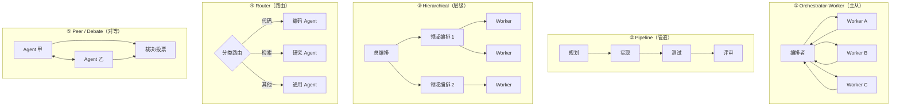
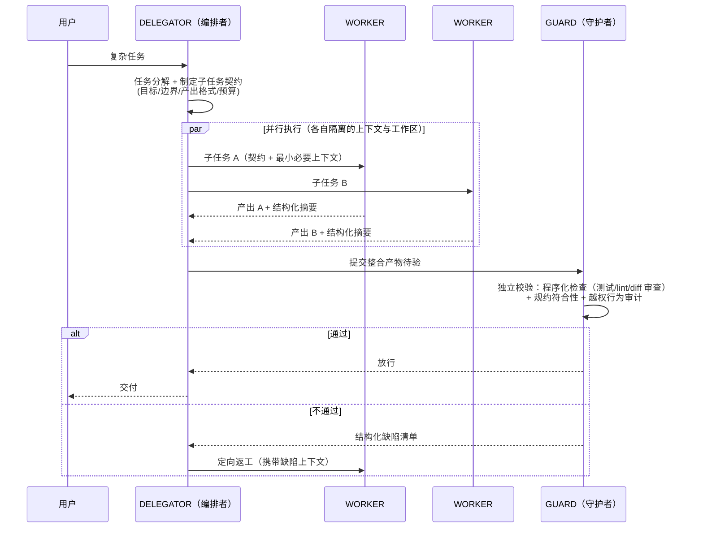
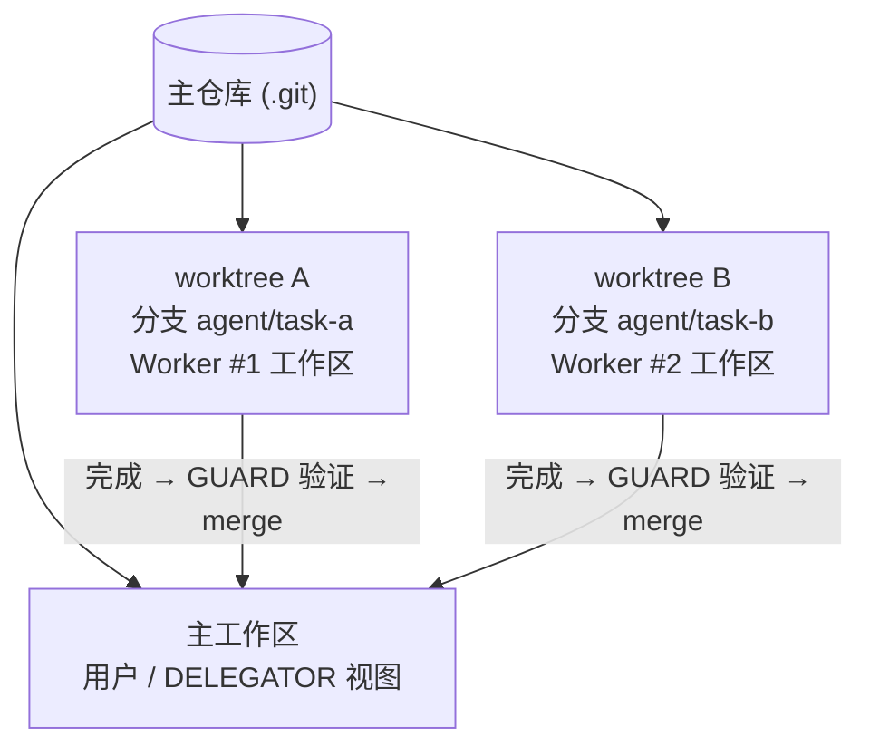
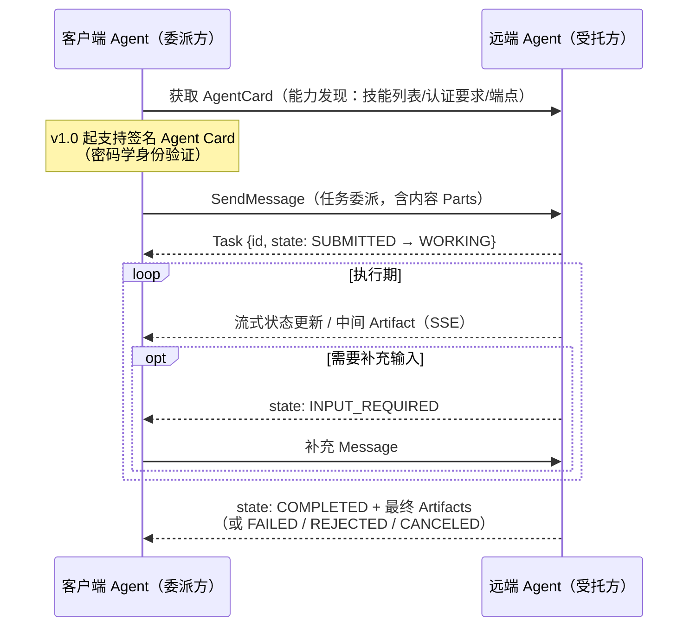

# 多 Agent 系统（Multi-Agent Orchestration）技术架构

> 本文介绍多 Agent 系统的完整技术体系：编排拓扑与角色框架、通信与协调机制、上下文管理策略、执行隔离（Worktree/沙箱）、跨组织互操作协议（A2A v1.0）、失败模式分类与评估方法。适用于设计 DELEGATOR/WORKER/GUARD 一类编排框架、实现并行任务执行与 Worktree 隔离机制时参考。
>
> 生态基准：A2A 协议 **v1.0**（2026 年发布稳定版，Linux Foundation 治理）；架构经验主要参考 Anthropic 多 Agent 研究系统、主流编排框架（LangGraph、OpenAI Agents SDK、Claude Code Subagents）的公开工程实践。

---

## 1. 概述

### 1.1 定义与本质

多 Agent 系统指由多个 LLM Agent 实例协同完成任务的架构：每个 Agent 拥有**独立的上下文窗口、独立的工具集与独立的指令**，通过某种协调机制分工合作。

一个去魅的视角：**多 Agent 首先是上下文管理手段，其次才是"分工协作"的拟人叙事**。单 Agent 的根本瓶颈是上下文窗口——长任务的中间产物（搜索结果、文件内容、试错痕迹）不断挤占推理空间；多 Agent 把任务切给多个独立窗口，每个窗口只装自己需要的内容，主窗口只收压缩后的结论。并行加速、角色专业化、故障隔离都是这个核心收益之上的叠加收益。

### 1.2 何时用多 Agent（决策框架）

多 Agent 不是默认选项——它引入协调开销、通信损耗与数倍的 token 成本（Anthropic 公开的研究系统数据：多 Agent 消耗约为单次对话的 **15 倍** token）。判断依据：

| 信号 | 倾向 |
|------|------|
| 任务可分解为**弱耦合**子任务，可并行 | ✅ 多 Agent |
| 单任务上下文注定超窗（大规模检索、全仓审计） | ✅ 多 Agent（隔离窗口） |
| 子任务需要**不同的工具集/权限/模型档位** | ✅ 多 Agent |
| 需要独立视角互查（生成 vs 审查） | ✅ 多 Agent |
| 子任务强耦合、共享大量中间状态 | ❌ 单 Agent + 好工具 |
| 任务简单、延迟敏感 | ❌ 单 Agent |
| 预算敏感 | ❌ 慎用（token 倍增） |

经验法则：**先把单 Agent + 工具做到极限，再考虑多 Agent**。很多"需要多 Agent"的场景，真实缺口是工具质量或上下文工程，而不是拓扑。

---

## 2. 编排拓扑

### 2.1 五种基础拓扑



| 拓扑 | 适用 | 主要风险 |
|------|------|---------|
| Orchestrator-Worker | 可并行的检索/分析/多文件编码任务；**当前生产系统的主流形态** | 编排者任务描述质量决定一切；Worker 间重复劳动 |
| Pipeline | 阶段边界清晰的流程（规划→实现→验证） | 传话失真逐级累积；上游错误下游放大 |
| Hierarchical | 超大任务（Orchestrator-Worker 的递归推广） | 层级越深，失真与成本越指数化；两层通常是上限 |
| Router | 异构请求分流（成本/能力分档） | 路由错误全盘皆输；需要兜底路径 |
| Peer/Debate | 高价值决策的质量增强（评审、事实核查） | 成本高；同源模型易同错（相关性失效） |

### 2.2 编排者-执行者-守护者：三角色框架

在 Orchestrator-Worker 之上补一个**独立的验证角色**，构成生产系统推荐的三角色框架（对应 DELEGATOR / WORKER / GUARD）：



三角色的职责纪律：

- **DELEGATOR 不亲自干活**：它的上下文是稀缺的全局视图，装满某个子任务的细节就丧失编排能力；它的核心产出是**子任务契约**（见 §3.2）
- **WORKER 不见全局**：只拿完成子任务的最小上下文——这既是 token 纪律也是安全纪律（最小知情）
- **GUARD 与生成者独立**：验证者不复用生成者的上下文（避免"自己查自己"的确认偏误）；能程序化验证的（测试、编译、schema 校验）绝不用 LLM 验证——GUARD 的 LLM 判断只兜程序化验证覆盖不了的部分（规约语义、代码品味）
- GUARD 同时是**权限审计点**：Worker 的工具调用记录汇总到此复查是否越权，与宿主 PDP/PEP 层（MCP 篇 §9.2）衔接

---

## 3. 通信与协调机制

### 3.1 两种基础范式

| 范式 | 机制 | 优点 | 缺点 |
|------|------|------|------|
| **消息传递** | Agent 间以结构化消息交接（编排者中转或直连） | 边界清晰、可审计、天然契合上下文隔离 | 传话失真;带宽受限于"愿意写多少字" |
| **共享状态（黑板）** | 共用外部存储（文件系统/数据库/任务板），各 Agent 读写 | 大产物不过嘴（文件即通信）；天然持久化 | 需要并发控制；读时机不当读到半成品 |

生产系统几乎总是**混合**：控制流走消息（任务下发、状态汇报走结构化消息），数据流走共享存储（代码、文档、检索结果落文件，消息里只传路径与摘要）。"消息传引用、存储放实体"是控制 token 成本的第一原则。

### 3.2 子任务契约（Task Spec）

编排质量的决定因素是**任务描述质量**——模糊的委派产生重复劳动与漏做。Anthropic 研究系统的核心教训之一即为此。子任务契约的最小字段：

```yaml
objective: 明确的单一目标（可验收的表述）
boundaries: 边界与禁区（不要动哪些文件/不要做哪些决定）
inputs: 输入（文件路径、前置产物引用）
output_contract: 产出格式（落盘路径 + 摘要 schema）
budget: 预算（最大轮次 / token / 时间）
tools: 允许的工具集（最小化）
escalation: 何时必须上报而非自行决定
```

### 3.3 交接（Handoff）与聚合

- **Handoff**：控制权转移模式（路由拓扑的机制基础）——当前 Agent 判断"这不归我管"，携带压缩上下文把会话移交给目标 Agent。关键设计：移交时传什么（任务陈述 + 已确认事实 + 已排除方向，而非原始对话全文）
- **聚合**：编排者合并多个 Worker 产出时的三种策略——**拼接**（产出天然分区，如各管一个文件）、**综合**（LLM 融合冲突信息，需要溯源标注）、**裁决**（对等产出择优，程序化指标优先于 LLM 评审）

### 3.4 上下文流动纪律

多 Agent 的信息损耗集中在交接点（telephone game）。纪律：

- **压缩是有损的，方向要对**：Worker 汇报"结论 + 证据指针（文件/行号/来源）"，而不是过程流水账；编排者需要细节时按指针回查，而不是要求 Worker 预先全量上传
- **事实与推断分离**：交接摘要中区分"验证过的事实"与"未验证的假设"，防止假设经两次转手变成事实
- **持久化外置**：跨 Agent 共享的长期状态（决策记录、任务板）放外部存储由所有方引用，而非在消息链里反复复述——这也是断点续作（Context Handoff / 会话可移植性）的基础

---

## 4. 执行隔离

并行 Worker 同时改代码是多 Agent 编码系统的核心工程问题。

### 4.1 Git Worktree 隔离



- 每个 Worker 分配独立 worktree + 独立分支：**文件系统级隔离**（互不见对方的未提交修改）+ **共享对象库**（不复制整仓，创建开销低）
- 合并即集成点：GUARD 验证在 worktree 内进行（跑测试、审 diff），通过后才 merge；冲突处理策略前置声明（自动 rebase 重试 / 上报编排者仲裁）
- 生命周期治理：任务终结（成功/失败/取消）后 worktree 与分支的回收要有兜底清扫（崩溃残留的 worktree 是常见垃圾源）；`.git` 锁竞争在高并发 worktree 操作时需串行化仓库级命令

### 4.2 其他隔离维度

| 维度 | 手段 |
|------|------|
| 进程/环境 | Worker 的 CLI 子进程各自独立（PTY 会话隔离）；危险操作沙箱（容器/受限用户） |
| 依赖/构建 | 各 worktree 独立的构建缓存目录，避免并行构建互踩 |
| 端口/服务 | 并行起 dev server 时的端口池分配 |
| 凭据 | Worker 按任务契约的 tools 白名单拿最小凭据，而非继承宿主全量 |

---

## 5. 跨框架互操作：A2A 协议

宿主内部编排不需要标准协议（进程内/子进程调度即可），但当协作跨越**框架与组织边界**（你的 Agent 委派任务给别家部署的 Agent），需要互操作标准。A2A（Agent2Agent）是该层的主导协议：2025 年 4 月由 Google 发布，同年 6 月交 Linux Foundation 中立治理，2026 年发布 **v1.0 稳定版**，生态超 150 家组织、五语言官方 SDK，三大云的 Agent 平台均已集成。

### 5.1 规范三层结构

| 层 | 内容 |
|----|------|
| 数据模型 | `AgentCard`（能力名片）、`AgentSkill`、`Task`、`Message`、`Part`、`Artifact`——以 Protobuf 定义、发布 JSON Schema |
| 操作 | `SendMessage` / `SendStreamingMessage` / `GetTask` / `ListTasks` / `CancelTask` / `SubscribeToTask` / 推送通知配置 / Agent Card 获取 |
| 协议绑定 | JSON-RPC 2.0 over HTTPS（主）、gRPC、REST |

### 5.2 核心机制



理解要点：

- **A2A 是任务生命周期协议，不是函数调用**：核心抽象是有状态的 `Task`（提交→执行→需输入→完成/失败），天然面向长时、异步、需人机介入的协作——与 Function Calling 的同步调用语义处于不同层
- **与 MCP 互补**：业界共识表述为"MCP 连接 Agent 与工具，A2A 连接 Agent 与 Agent"。同一个 Agent 对下用 MCP 挂工具、对外经 A2A 受托任务；两者同属 Linux Foundation 旗下的 Agent 互操作标准族
- **不共享内部状态**：A2A 协作方只交换消息与 Artifact，各自的记忆、推理、工具完全黑盒——组织边界上的正确默认
- v1.0 同期还引入了 **AP2**（Agent Payments Protocol，Agent 间支付）与多租户隔离等企业特性
- 现实校准：150+ 组织是"表态支持"口径，生产渗透率仍在早期；宿主的合理策略是**内部编排自建、对外预留 A2A 适配层**，而非用 A2A 做内部总线

---

## 6. 失败模式

多 Agent 系统的失败大多不是"模型不够聪明"，而是**系统设计缺陷**。学术侧的失败分类研究（如 MAST 分类法，分析主流框架的大量失败轨迹后归纳）与工程实践观察高度一致，可归为三族：

### 6.1 失败分类

| 族 | 典型失败 | 根因 | 对策 |
|----|---------|------|------|
| **规约与分解缺陷** | 子任务重叠/漏配；Worker 违反未言明的约束；角色越权 | 任务契约模糊、边界未显式化 | §3.2 契约字段强制化；禁区显式列举 |
| **Agent 间错位** | 传话失真；假设当事实；重复劳动；互相等待死锁 | 交接压缩无纪律、无共享事实源 | §3.4 纪律；黑板存事实；超时打破等待环 |
| **验证不足** | 错误产物被聚合放大；GUARD 走过场；"完成"定义不一 | 验证不独立、不程序化 | 程序化验证优先；验收标准写进契约 |

### 6.2 多 Agent 特有的系统性风险

- **错误放大链**：Pipeline 中上游的小偏差被下游当作既定前提加工，产出偏离度逐级放大——阶段间插程序化检查点截断
- **同源相关性失效**：Debate/投票的价值建立在"错误不相关"上，同一模型同一提示的多实例常犯**同一个错**——异构化（不同模型/不同提示视角）才有对冲价值
- **成本失控**：编排者返工循环 + Worker 各自重试的乘法效应——预算分层（单 Worker 预算 × 总预算双封顶）、返工次数上限
- **责任扩散**：出错后无法归因到具体 Agent——每个产物带生成方与依据的溯源标注（见 §7）
- **协调开销反噬**：任务本身耗时 < 协调耗时（分解+交接+聚合）时,多 Agent 为负收益——回到 §1.2 决策框架

---

## 7. 可观测性与评估

### 7.1 追踪：跨 Agent 的因果链

单 Agent 的 trace 是一条线，多 Agent 是一棵树/图。落地要点（衔接 OTel 体系）：

- **trace 贯穿**：用户任务开 root span；每个子任务、每次 LLM 调用、每次工具调用（含跨 MCP 边界，见 MCP 篇 §7.3）都是子 span，`task_id`/`agent_role`/`worktree` 作为属性
- **交接留痕**：每次 handoff 记录"交出了什么摘要"——事后诊断传话失真的唯一依据
- **成本核算维度**：token 按 (agent_role × 模型 × 任务) 三维聚合，返工轮次单独计数——优化点通常一目了然（某类子任务的返工率异常高）

### 7.2 评估

- **端到端为主，单元为辅**：先测"整个系统完成任务的通过率/成本/时长"，再对失败案例下钻到单 Agent 归因——顺序不能反（单 Agent 全绿不代表系统能用，交接才是失败高发区）
- **LLM-as-Judge + 程序化断言混合**：可程序化的（测试通过、文件存在、schema 合规）绝不用 Judge；Judge 只评开放性质量并需人工抽检校准
- **失败轨迹库**：真实失败 trace 沉淀为回归集，按 §6.1 三族打标——改动编排策略后跑回归看各族失败率变化，这是编排迭代的主反馈环
- **消融基线**：定期跑"同任务单 Agent 基线"对照——多 Agent 的增益会随基础模型变强而缩水，架构该退役时要能看见

---

## 8. 工程实践清单

| 关注点 | 要点 |
|--------|------|
| 拓扑保守 | 从 Orchestrator-Worker + GUARD 起步；层级不超两层；Peer/Debate 只用于高价值决策点 |
| 契约先行 | 无契约不委派；契约模板化并随代码版本管理 |
| 通信纪律 | 消息传引用、存储放实体；摘要区分事实/推断 |
| 隔离默认 | Worker 默认 worktree + 最小工具集 + 独立预算；共享是显式例外 |
| 验证独立 | GUARD 不复用生成上下文；程序化验证优先 |
| 预算双封顶 | 单 Worker 与全任务双层预算；返工上限；命中即收尾上报 |
| 兜底降级 | 编排失败可降级为单 Agent 串行执行完成任务（可用性优先于架构纯度） |
| 人在环设计 | 明确哪些决策必须上浮用户（不可逆操作、预算突破、契约外行为） |
| 对外边界 | 内部自建编排；跨组织协作预留 A2A 适配层（AgentCard 描述自身能力） |

---

## 9. 故障排查速查

| 症状 | 常见原因 | 处理 |
|------|---------|------|
| Worker 产出偏题 | 契约 objective 模糊 / 缺边界 | 契约补 boundaries 与验收标准 |
| 两个 Worker 干了同一件事 | 分解时职责切分重叠 | 编排者分解后自查互斥性；契约互引边界 |
| 结论与事实不符 | 交接中假设升格为事实 | 摘要 schema 强制事实/推断分离；关键结论带证据指针 |
| 合并冲突频发 | 任务分解未按文件/模块边界切 | 分解时以代码所有权为切分依据 |
| 成本爆炸 | 返工循环 / Worker 内部重试叠加 | 双层预算 + 返工上限 + 成本 trace 下钻 |
| 系统卡死 | Worker 互相等待 / 编排者等丢失的汇报 | 全链路超时；心跳；孤儿任务回收 |
| GUARD 形同虚设 | 验证复用生成上下文 / 全靠 LLM 评 | 独立上下文；程序化断言优先 |
| 残留 worktree/分支堆积 | 异常路径未清理 | 生命周期兜底清扫任务 |
| 单 Agent 反而更好 | 任务本不可分 / 协调开销反噬 | 回到 §1.2 决策框架；保留单 Agent 降级路径 |

---

## 10. 参考

- Anthropic 工程博客：多 Agent 研究系统的构建经验（编排提示工程、token 经济学、评估方法）
- A2A 协议：a2a-protocol.org 与 Linux Foundation A2A 项目（v1.0 规范、五语言 SDK）
- 失败模式研究：多 Agent 系统失败分类（MAST 等失败轨迹分析工作）
- 本系列相关：MCP 篇（工具连接层与 PDP/PEP）、Function Calling 篇（单 Agent 循环——多 Agent 的原子单元）、Skills 篇（角色能力包化）、Tree-sitter 篇（代码任务分解的结构依据）
