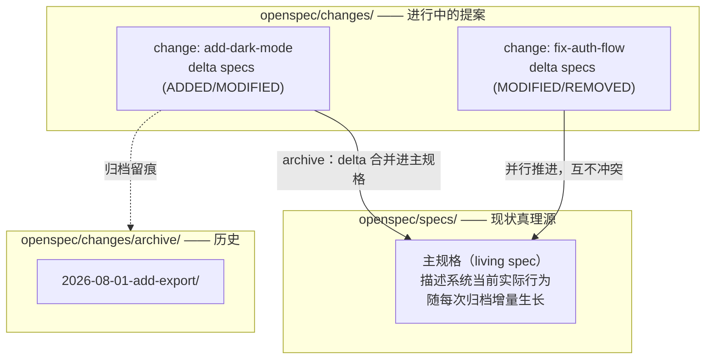
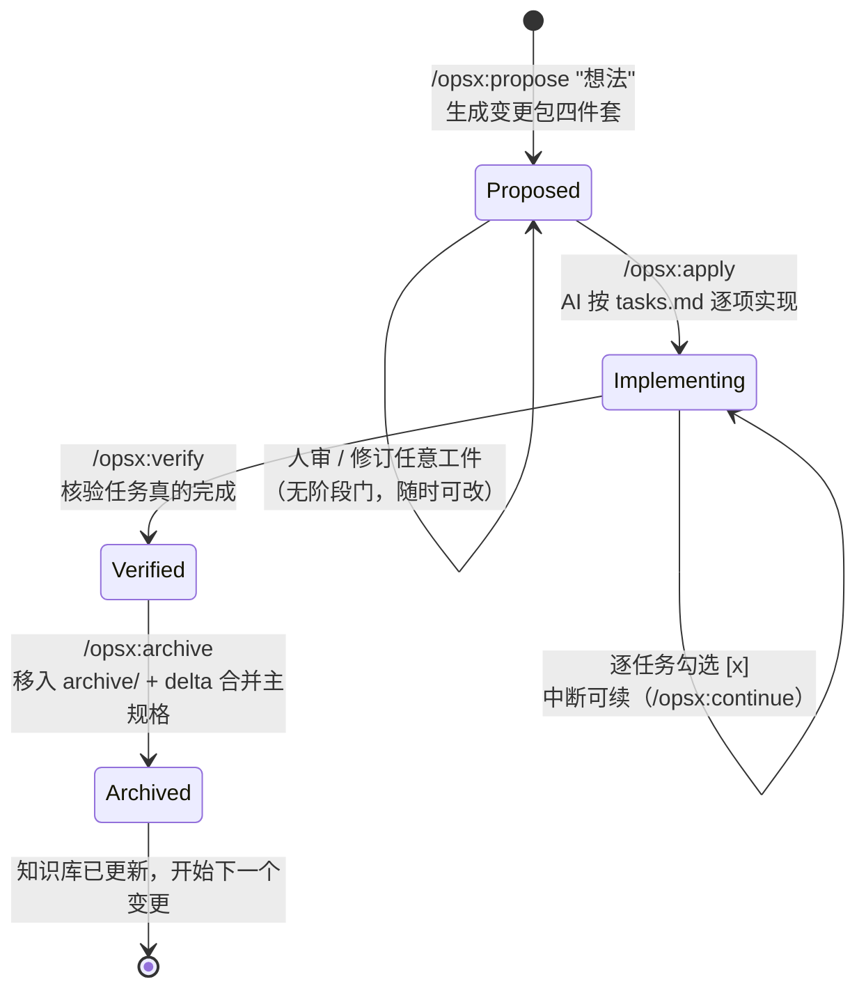

# OpenSpec（规范驱动开发）技术架构

> VaneHub AI 技术文档 · Agent 基础设施系列
>
> 本文介绍 OpenSpec 的完整技术体系：规范驱动开发（SDD）的动机与知识模型、变更包工件链、opsx 命令族与生命周期、Delta 规格合并机制、多工具集成原理，以及 OpenSpec 在 Agent 工程中的上下文工程定位。适用于以 OpenSpec 治理项目变更流、跨 CLI 统一开发工作流的实践参考。
>
> 版本基准：**OpenSpec v1.4.x**（Fission-AI 维护的开源 TypeScript CLI，MIT 协议，npm 包 `@fission-ai/openspec`，要求 Node.js ≥ 20.19；当前主推重构后的 **artifact-guided 工作流（opsx 命令族）**，支持 25+ 种 AI 编码工具）。

---

## 1. 概述

### 1.1 定义与动机

OpenSpec 是一个**规范驱动开发（Spec-Driven Development, SDD）框架**：在 AI 写代码之前，先让人与 AI 就"要构建什么"达成书面一致——以结构化的规范工件（提案、规格、设计、任务清单）为契约，AI 按契约实现，完成后将变更归档并同步回项目的规范知识库。

它针对的是 AI 辅助编码的根本痛点：**需求只活在聊天历史里**。对话式开发中，"为什么这么改、做了哪些决策、边界在哪"随会话结束蒸发——代码留下来了，推理消失了；下次修改时（无论人还是 AI）都在无上下文状态下工作。AI 能力越强、生成越快，这个问题被放大得越厉害：模糊的提示产出不可预测的结果。

### 1.2 设计哲学

OpenSpec 官方的五条哲学，决定了它与同类工具的差异：

```
→ 流动而非僵硬（fluid not rigid）        —— 工件随时可改，无锁死的阶段门
→ 迭代而非瀑布（iterative not waterfall）—— 小步变更循环，不搞大爆炸发布
→ 简单而非复杂（easy not complex）       —— 分钟级上手
→ 面向存量项目（built for brownfield）   —— 可从现有代码反向生成规范
→ 规模可伸缩（personal → enterprise）    —— 同一工作流适配不同规模
```

其中"流动而非僵硬"是与传统重流程（以及 Spec Kit 等重型 SDD 工具）的核心分界：官方文档明确将工作流定义为**动作（actions）而非锁定的阶段（phases）**——创建、实现、更新、归档可按需交错，规范是活文档不是审批关卡。

### 1.3 与相邻方法论的关系

| 方法 | 先行物 | OpenSpec 的继承与差异 |
|------|--------|---------------------|
| TDD | 测试先于实现 | 同构思想：规格先于实现；但规格覆盖"意图与行为"而不只是可执行断言 |
| RFC / 设计文档 | 大型变更先写文档评审 | 把 RFC 流程轻量化、模板化到每个变更，并让 AI 成为文档的第一读者 |
| ADR | 记录架构决策及理由 | proposal.md 承载同类信息；社区有 spec-driven-with-adr 的融合 schema |
| Prompt 工程 | 精心构造单次提示 | 把"好提示"沉淀为版本化工件——规格即持久化、可评审、可复用的提示 |

---

## 2. 核心知识模型

### 2.1 双层结构：Specs（现状）与 Changes（提案）



这是 OpenSpec 最重要的架构决策：

- **Specs 是行为契约**：描述系统"现在是什么样"，用 Requirement + Scenario 表达（见 §2.3），不写实现细节。它是 AI 开始任何新任务前应先查阅的项目事实源（AGENTS.md 会提醒 AI 这样做）
- **Changes 是 Delta 规格**：每个变更只描述"与主规格的差异"，以 **`ADDED` / `MODIFIED` / `REMOVED`** 标记段落——人和 AI 都无需 diff 整个文档即可看清提案改了什么。多个变更各占一个文件夹并行推进，互不干扰
- **Archive 即同步**：变更完成归档时，CLI 自动把 delta 应用回主规格——"提案"转正为"现实"。项目知识库因此随每次变更保持新鲜，而不是文档与代码渐行渐远

### 2.2 变更包工件链

每个变更一个文件夹，四类工件各司其职：

| 工件 | 回答的问题 | 内容 |
|------|-----------|------|
| `proposal.md` | **Why & What** | 动机、目标、变更范围、非目标——评审的第一入口，秒级理解一个变更 |
| `specs/` | **行为契约** | 本次变更的 delta 规格（Requirement + Scenario） |
| `design.md` | **How（技术）** | 技术方案、架构决策、权衡取舍 |
| `tasks.md` | **How（步骤）** | 实现清单，`[ ]`/`[x]` 复选框实时跟踪进度 |

工件链的价值在于**责任分离**：需求争议在 proposal/specs 层解决，技术争议在 design 层解决，AI 执行时只需忠实走 tasks——避免了"一边写代码一边重新发明需求"的漂移。

### 2.3 规格的书写规范

规格采用 **Requirement + Scenario** 结构：

```markdown
## ADDED Requirements

### Requirement: 主题切换
系统 SHALL 支持亮色/暗色主题切换，并 MUST 持久化用户选择。

#### Scenario: 跟随系统偏好
- GIVEN 用户未手动选择过主题
- WHEN 应用启动
- THEN 主题跟随操作系统偏好设置

#### Scenario: 手动选择优先
- GIVEN 用户手动选择了暗色主题
- WHEN 系统偏好变为亮色
- THEN 应用保持暗色主题
```

- **RFC 2119 关键词**（MUST / SHALL / SHOULD / MAY）表达约束强度——AI 与人共享同一套约束语义
- **Given/When/Then 场景**保证每条需求可测试——规格与验收天然对齐（GUARD/verify 的依据）
- 每个场景单一可验证——这也是任务拆分与程序化校验的锚点

---

## 3. 工作流与命令族（opsx）

### 3.1 核心三步生命周期



三步的关键机制：

1. **Propose**：`/opsx:propose <想法>` 让 AI 生成完整变更包（proposal/specs/design/tasks）。这一步强制在花费实现成本之前对齐 What 与 Why；`openspec validate` 可校验提案结构合法性
2. **Apply**：AI 以变更包为指令来源——读 proposal 与 specs 理解需求，顺序执行 tasks 并实时勾选。**预先批准的清单**是防 AI 跑偏的核心机制：不臆造功能、不跳过规格中定义的边界情况；中断后下次从断点继续
3. **Archive**：代码验证通过后，`/opsx:archive` 把变更文件夹移入 `openspec/changes/archive/<日期>-<id>/`，同时 CLI 将 delta 规格（ADDED/MODIFIED/REMOVED）合并进主规格——完成"提案 → 现实"的知识同步

### 3.2 扩展命令族

基础三步之外的扩展命令（经 `openspec config profile` 选择扩展档位、`openspec update` 生效）：

| 命令 | 用途 |
|------|------|
| `/opsx:explore` | 前置探索：想法还不成形时与 AI 对话收敛方案，再进入 propose |
| `/opsx:new` | 创建空变更骨架（不经 AI 生成内容） |
| `/opsx:continue` | 恢复未完成的实现（跨会话续作） |
| `/opsx:ff` | fast-forward：跳过逐步确认直通实现 |
| `/opsx:verify` | 核验 tasks 是否**真的**完成（而非仅被勾选）——独立验证步 |
| `/opsx:sync` | 代码已改但规格未跟上时反向同步规格 |
| `/opsx:bulk-archive` | 批量归档多个已完成变更 |
| `/opsx:onboard` | **存量项目冷启动**：扫描现有代码反向生成初始主规格——brownfield 支持的关键 |

工作流档位（profile）控制交互风格与步骤粒度——个人快节奏与团队重评审可选不同档位，同一套工件模型不变。

### 3.3 CLI 与多工具集成原理

- `openspec init`：创建 `openspec/` 目录结构 + 向目标 AI 工具注册斜杠命令；`openspec update`：升级后刷新各工具的指令投影
- **集成机制本质是"指令文件投影"**：OpenSpec 不依赖任何专有 API——它把工作流指令生成为各 AI 工具认识的形态（斜杠命令定义、AGENTS.md 段落），任何"能读文件、支持斜杠命令"的助手都能接入，因此可同时覆盖 25+ 工具而无锁定。这与本系列 Skills 篇的"文件夹即能力包"、多 CLI 治理的"单一事实源 + 投影"是同一设计模式
- `AGENTS.md` 注入的守则让 AI **在任何新任务前先查主规格**——规范成为常驻的项目事实层
- 配套 Dashboard 提供变更包与进度的可视化视图
- 遥测：仅匿名命令名与版本（可 `OPENSPEC_TELEMETRY=0` 关闭），CI 中自动禁用

---

## 4. 上下文工程视角：OpenSpec 在 Agent 栈中的定位

OpenSpec 表面是流程工具，本质是**上下文工程基础设施**——它回答的是"AI 的工作依据从哪来、如何跨会话持久、如何不挤爆上下文窗口"：

### 4.1 三个上下文工程机制

- **需求外置**：把"要做什么"从易失的聊天历史移到版本化文件——上下文从会话态变为仓库态，任何新会话冷启动即可恢复全部工作依据（这也是官方建议"实现前清空上下文窗口"的底气：该在窗口里的东西都在文件里）
- **知识增量演进**：archive 的 delta 合并让项目行为文档随变更自动生长——解决"文档腐烂"的机制化方案
- **窗口纪律**：变更包按需加载（做哪个变更读哪个文件夹），主规格作为共享事实源被引用而非复述——与多 Agent 篇 §3.4"消息传引用、存储放实体"同一纪律

### 4.2 与项目约束层的分工

延续 Skills 篇 §11.2 的分层，加入 OpenSpec 后的完整图景：

| 层 | 载体 | 内容 | 加载时机 |
|----|------|------|---------|
| 全局约束 | AGENTS.md / CLAUDE.md | 架构原则、禁令、"先查规格"守则 | 每会话常驻 |
| 场景流程 | Skills | 特定任务类型的操作程序 | 任务匹配时 |
| 项目事实 | **openspec/specs/** | 系统当前行为契约 | 按需查阅 |
| 变更依据 | **openspec/changes/<id>/** | 当前变更的完整工作包 | 做该变更时 |
| 用户触发 | 斜杠命令（含 opsx 族） | 固定动作入口 | 显式调用 |

### 4.3 与多 Agent 编排的咬合

- **变更包 ≈ 子任务契约**：tasks.md + specs 就是多 Agent 篇 §3.2 契约的现成实现（objective=proposal、boundaries=specs、output_contract=scenarios、验收=verify）——DELEGATOR 委派 Worker 时直接以变更包为契约载体
- **并行变更 ↔ Worktree 隔离**：多个 change 文件夹并行推进的模型，与"每 Worker 一个 worktree"一一对应——一个变更一个分支一个 worktree，archive 对应 merge
- **verify ≈ GUARD**：`/opsx:verify` 的"核验任务真的完成"正是独立验证角色的职责；scenario 的可测试性为程序化验证提供断言来源

---

## 5. 定制与生态

- **Schema 定制**：工件模板与工作流结构可定制（`openspec/config.yaml` 承载项目级配置）；官方支持自定义 schema
- **社区 schema**：以独立仓库分发的第三方 schema 包（如 minimalist、event-driven、spec-driven-with-adr、intent-driven 等风格），机制上类似 Spec Kit 的社区扩展目录——团队可按治理强度选择或自建
- **多语言支持**：工件语言可配置（中文团队可全中文书写规格）
- **模型与上下文建议**（官方使用注记）：规划与实现建议使用高推理档模型；保持上下文卫生——实现前清窗口，会话中维持窗口整洁

### 与同类工具对比

| 维度 | OpenSpec | Spec Kit (GitHub) | Kiro (AWS) |
|------|----------|-------------------|------------|
| 流程刚性 | 动作模型，无阶段门 | 严格阶段门（constitution→specify→plan→tasks） | IDE 内置流程 |
| 重量 | 轻（npm CLI，分钟级上手） | 重（大量 Markdown 仪式、Python 工具链） | 中，但绑定其 IDE |
| 工具中立 | 25+ 工具，无锁定 | 多工具 | 锁定 Kiro IDE 与特定模型 |
| 存量项目 | onboard 反向生成规范 | 偏 greenfield | — |
| 知识演进 | delta 合并的活规格 | 阶段产物 | — |

选型口径：要**轻量、可迭代、跨工具**的变更治理选 OpenSpec；要强流程管控且接受仪式成本的团队可考虑 Spec Kit；已深度绑定特定 IDE 生态的另议。

---

## 6. 工程实践与反模式

| 最佳实践 | 对应反模式 |
|---------|-----------|
| 变更保持小而聚焦（一个变更一个意图） | 巨型变更包揽半个 milestone——评审失焦、并行冲突、archive 后 delta 难审 |
| proposal 先行评审，再进 apply | 直接 ff 跳过人审——回到"vague prompt"原点 |
| Scenario 写到可测试粒度 | 需求只有一句愿景——verify 无从核验 |
| 代码改了立刻 `/opsx:sync` | 规格与代码漂移——真理源失真后全链条失效 |
| 用 `/opsx:onboard` 给存量项目建基线 | 存量项目从零手写主规格——成本劝退，基线永远缺席 |
| archive 及时、`bulk-archive` 清欠账 | changes/ 目录堆满已完成变更——现状与提案边界模糊 |
| RFC 2119 用词一致 | MUST/SHOULD 随手混用——约束强度失去语义 |
| 大变更先 `/opsx:explore` 收敛 | 想法不成形就 propose——生成一堆返工工件 |

---

## 7. 宿主集成要点（多 CLI 场景）

以 OpenSpec 作为宿主项目的变更治理层时：

- **单一工作流覆盖多 CLI**：得益于"指令投影"集成机制，同一个 `openspec/` 目录可同时服务 Claude Code、OpenCode、Codex CLI 等——宿主编排哪个 CLI 执行变更，工作依据都是同一套变更包。宿主升级各 CLI 后统一跑 `openspec update` 刷新投影
- **变更包作为编排原语**：宿主的任务模型可直接以 change-id 为单位——下发（指定 CLI + 变更包路径）、跟踪（解析 tasks.md 勾选进度）、验收（verify）、收口（archive），天然获得断点续作能力（tasks 状态在文件里）
- **与 Worktree 结合**：一个 change 绑定一个 worktree/分支；并行变更即并行 worktree；archive 前置条件包含分支合并完成——变更治理与执行隔离两层机制对齐
- **规格作为检索源**：主规格纳入项目 RAG 索引（结构化、语义密度高，是回答"系统现在怎么工作"的最优语料）；同时作为 GUARD 验证"实现是否符合既有行为契约"的依据
- **非代码工作流复用**：工件链模型不限于代码——长文写作（如书籍项目）可用同一循环：proposal=章节意图、specs=内容要求、tasks=写作清单、archive=定稿归档

---

## 8. 故障排查速查

| 症状 | 常见原因 | 处理 |
|------|---------|------|
| 斜杠命令不可用 | init 未注册到该工具；升级后未刷新 | `openspec update`；核对工具在支持列表 |
| 扩展命令缺失 | 处于基础 profile | `openspec config profile` 选扩展档 + update |
| AI 实现跑偏 | 未按变更包执行；tasks 粒度过粗 | 检查 AGENTS.md 投影在位；细化 tasks |
| 勾选了但没做 | 只看复选框不核验 | `/opsx:verify` 纳入流程必经步 |
| archive 后主规格不对 | delta 标记（ADDED/MODIFIED/REMOVED）书写不规范 | `openspec validate` 前置校验；修正 delta 段落结构 |
| 规格与代码对不上 | 热修/绕过流程改了代码 | `/opsx:sync` 反向同步；团队约定"改码必挂变更" |
| changes/ 混乱 | 完成未归档、废弃未清理 | `bulk-archive`；废弃变更显式删除留 git 记录 |
| 存量项目无从下手 | 缺基线规格 | `/opsx:onboard` 生成初始规格再人工校订 |
| 并行变更打架 | 两个变更 delta 触碰同一规格段 | 变更切分对齐规格边界；先后归档让后者基于新主规格重校 |

---

## 9. 参考

- 项目仓库与文档：github.com/Fission-AI/OpenSpec（docs/ 下 getting-started / workflows / commands / cli / concepts / customization）
- npm 包：`@fission-ai/openspec`
- 相关规范：RFC 2119（需求关键词）
- 本系列相关：Skills 篇 §11.2（约束分层的上位框架）、多 Agent 篇 §3.2/§4（契约与 Worktree 的咬合点）、RAG 篇（规格作为检索语料）
