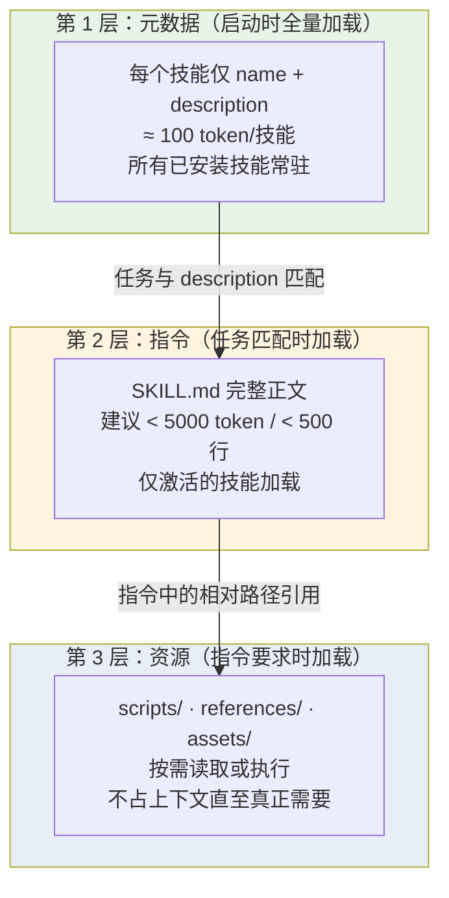
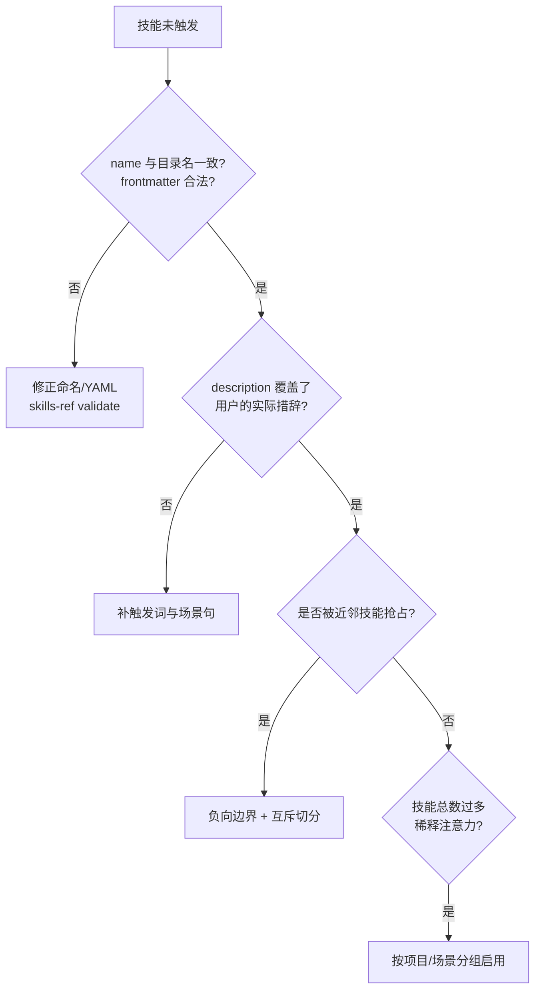
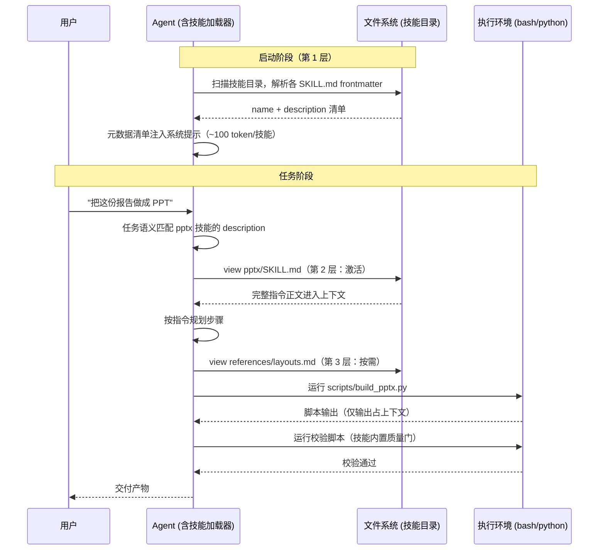
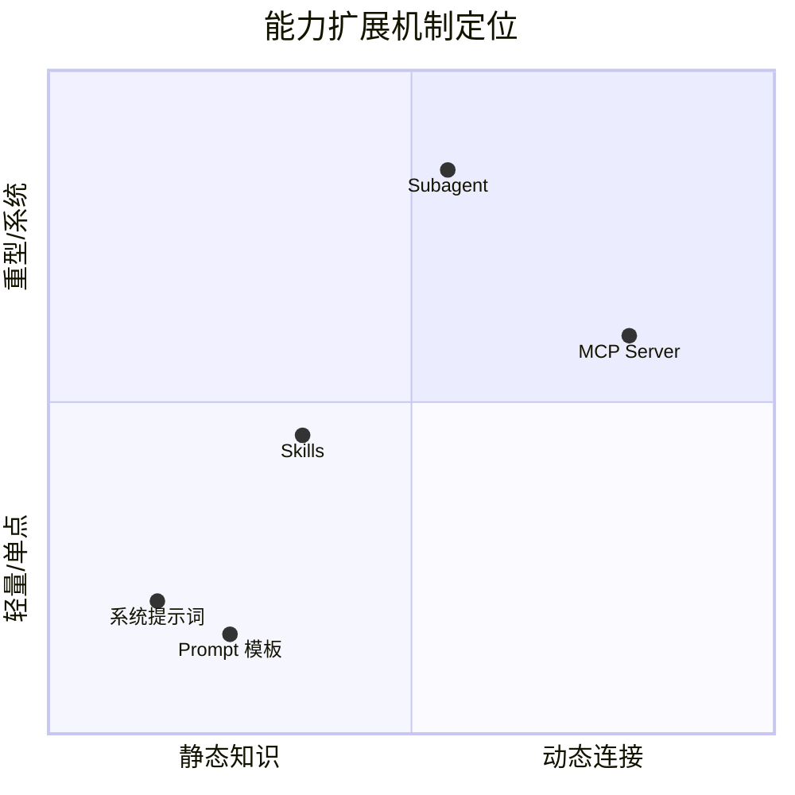
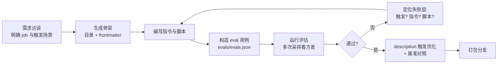
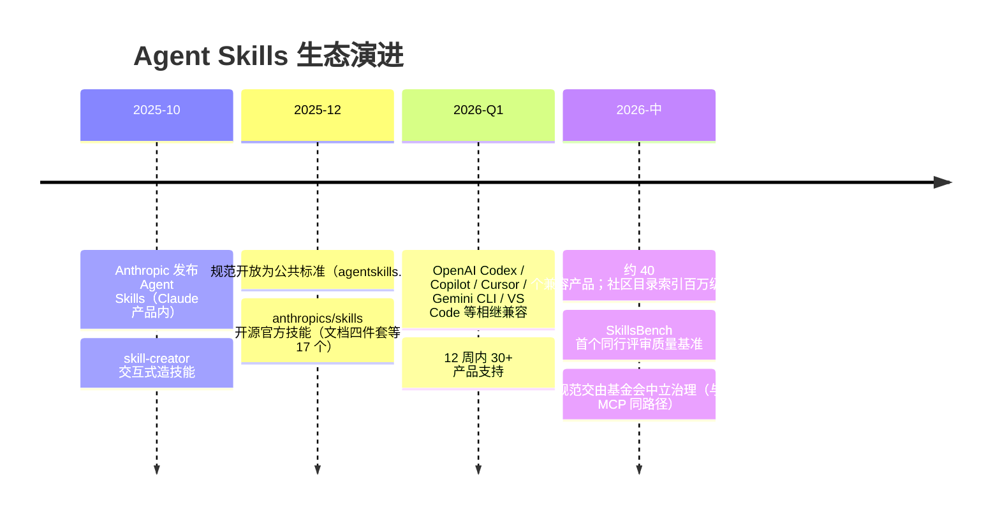
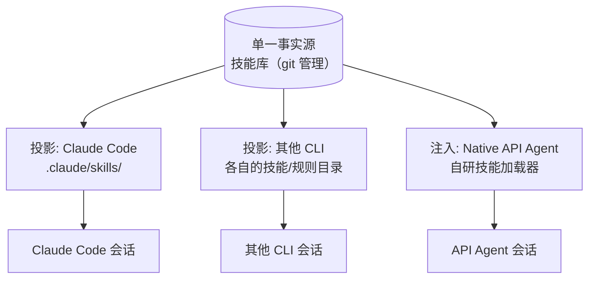

# Agent Skills（SKILL.md）技术架构

> 本文介绍 Agent Skills 的完整技术体系：开放规范与文件格式、渐进式披露加载模型、触发与执行机制、与 MCP/Prompt/Subagent 的定位对比、编写与评估方法论、安全模型。适用于技能目录治理、跨 CLI 技能分发、以及实现技能加载器时参考。
>
> 规范基准：**agentskills.io 开放规范**（Anthropic 于 2025 年 10 月推出 Agent Skills，2025 年 12 月 18 日开放为公共标准；截至 2026 年中，OpenAI Codex、GitHub Copilot、Cursor、Gemini CLI、VS Code 等约 40 个产品已兼容）。

---

## 1. 概述

### 1.1 定义

Agent Skill 是一种**以文件夹为载体的智能体能力包**：一个目录，内含一个必需的 `SKILL.md`（YAML frontmatter + Markdown 指令）和可选的脚本、参考文档、静态资源。Agent 在任务匹配时按需加载技能内容，从而获得特定领域的工作流知识与操作程序。

一句话定位：**MCP 让 Agent 能"连接"外部世界，Skills 让 Agent 知道"怎么做"某类事**。前者是连接性（connectivity），后者是程序性知识（procedural knowledge）。

### 1.2 解决的问题

| 问题 | 无 Skills 的做法 | Skills 的改进 |
|------|-----------------|--------------|
| 上下文预算 | 把所有领域知识塞进系统提示词，token 爆炸 | 三层渐进式披露，闲置技能只占 ~100 token |
| 知识复用 | 每个会话重复粘贴长 prompt | 一次编写，跨会话/跨项目/跨产品复用 |
| 一致性 | 同类任务每次产出质量波动 | 固化经过验证的流程与约束 |
| 可分发 | prompt 以聊天记录/文档形式松散流传 | 文件夹即包，git 即分发渠道 |
| 跨产品迁移 | 各 Agent 产品配置格式互不兼容 | 开放标准，一份技能多端可用 |

### 1.3 为什么是"文件夹 + Markdown"

规范刻意选择了最低技术门槛的载体：无需编译、无需 schema 注册、无需运行时协议——任何能读文件的 Agent 都能实现加载器；任何会写 Markdown 的人都能写技能。这是它在 12 周内被 30+ 产品采纳的核心原因：实现成本约等于"读两个 YAML 字段 + 按需 cat 文件"。

---

## 2. 核心设计：渐进式披露（Progressive Disclosure）

这是 Skills 区别于"把大 prompt 粘进系统提示词"的本质创新。上下文窗口被视为**共享稀缺资源**——每个进入上下文的 token 都在挤占任务本身的推理空间，因此技能内容按需分层进入：



三层的加载语义：

1. **发现层（Discovery, ~100 token/技能）**：Agent 启动时只把每个技能的 `name` 与 `description` 注入上下文（实测 Anthropic 官方 17 个技能的中位发现成本约 80 token，区间约 55–235）。几十个技能的常驻代价也只有数千 token。
2. **激活层（Activation, 建议 < 5000 token）**：当任务与某技能的 description 匹配，Agent 将该技能 `SKILL.md` 全文读入上下文。**加载是整体的**——正文写多长就占多长，这是"正文保持精炼、细节外移"的直接原因。
3. **执行层（Execution, 按需）**：指令中引用的 `scripts/`、`references/`、`assets/` 文件仅在执行到相应步骤时才读取/运行。**脚本执行不消耗上下文**（只有其输出进入上下文），因此确定性的重活（解析、转换、校验）应下沉为脚本而非让模型逐 token 生成。

> **实现视角**：一个最小技能加载器 = 启动时扫描技能目录读 frontmatter → 拼接元数据清单注入系统提示 → 运行期由模型自主决定 `view` 某个 SKILL.md → 后续文件读取走通用文件工具。技能系统不需要任何专用协议。

---

## 3. 规范细节（agentskills.io）

### 3.1 目录结构

```
skill-name/
├── SKILL.md          # 必需：frontmatter + 指令正文
├── scripts/          # 可选：可执行代码
├── references/       # 可选：按需加载的参考文档
├── assets/           # 可选：模板、图片、数据文件
└── ...               # 允许任意额外文件与目录
```

### 3.2 SKILL.md Frontmatter 字段

| 字段 | 必需 | 约束 |
|------|------|------|
| `name` | ✅ | ≤64 字符；仅小写字母、数字、连字符；不得以连字符开头/结尾；**不得含连续连字符**（`pdf--x` 非法）；**必须与父目录名一致**，否则不加载 |
| `description` | ✅ | 1–1024 字符，非空；须同时说明"做什么"与"何时用" |
| `license` | ❌ | 许可证名或指向包内许可文件的引用，建议简短 |
| `compatibility` | ❌ | ≤500 字符；仅在有特定环境要求时使用（目标产品、系统依赖、网络访问等），多数技能不需要 |
| `metadata` | ❌ | 字符串到字符串的任意键值映射，存放规范未定义的属性（author、version 等）；键名建议加前缀避免冲突 |
| `allowed-tools` | ❌ | 空格分隔的预授权工具列表（如 `Bash(git:*) Read`）；**实验性**，各实现支持程度不一 |

其他要点：

- 未识别的 frontmatter 键会被合规运行时**忽略**——这是跨产品可移植性的保障，也意味着各平台可在开放规范之上叠加私有约定
- **安全注意**：frontmatter 中避免使用尖括号（`<` `>`）——元数据会被注入系统提示词，尖括号可能构成意外的指令注入
- 正文无格式限制；推荐包含分步指令、输入输出示例、边界情况
- 校验工具：`skills-ref validate ./my-skill`（官方参考库）

### 3.3 三类资源目录的分工

| 目录 | 内容 | 加载方式 | 设计要点 |
|------|------|---------|---------|
| `scripts/` | 可执行代码（Python/Bash/JS，取决于宿主环境） | Agent 运行，仅输出进上下文 | 自包含或明示依赖；错误信息可读（模型要靠它自我修正）；处理边界情况 |
| `references/` | 深度参考文档（REFERENCE.md、领域文件） | Agent 按需 `view` | 单文件聚焦单主题——文件越小，按需加载的粒度越细 |
| `assets/` | 模板、图片、查找表、schema | 被脚本消费或复制使用 | 通常不进上下文 |

文件引用规则：从技能根目录写**相对路径**；引用链保持**一层深度**（SKILL.md → 文件），避免 A 引 B 引 C 的嵌套链——模型追多级链的可靠性差且浪费轮次。

---

## 4. 触发机制：description 工程学

规范本身不定义路由算法、向量检索或规则引擎，**description 是它规定的主要发现信号**，由模型在推理中语义匹配。因此 description 的质量直接影响触发准确率，值得当作接口契约来写。

这是规范的下限，不是宿主的上限：宿主可以在 description 之上叠加显式绑定、策略路由或检索，规范并不禁止。VaneHub AI 的做法见[开发者指南的 Skill 管理](../../developer-guide/zh-CN/src/skill-management.md)。

### 4.1 写法模式

有效 description 的结构：**能力陈述 + 触发条件 + 关键词覆盖**。

```yaml
# ✅ 好：做什么 + 何时用 + 用户会说的词
description: Extracts text and tables from PDF files, fills PDF forms,
  and merges multiple PDFs. Use when working with PDF documents or when
  the user mentions PDFs, forms, or document extraction.

# ❌ 差：只有模糊的能力域
description: Helps with PDFs.
```

工程要点：

- **覆盖用户语言而非实现语言**：用户说"帮我把这几个 PDF 合起来"，不会说"调用 pypdf 的 merge API"——description 要覆盖前者
- **触发词显式枚举**：`Triggers include: any mention of 'X', 'Y', or requests to Z` 的句式在实践中触发率明显更好
- **负向边界同样重要**：`Do NOT use for ...` 防止近邻技能误触发（如 docx 技能声明不处理 PDF）
- **同域技能间做互斥切分**：多个技能 description 语义重叠时，模型触发行为不稳定；用"输入类型/输出类型/场景"明确分界

### 4.2 触发失败的排查顺序



---

## 5. 执行生命周期



关键性质：

- **触发是概率性的**：与 MCP 工具由 schema 强约束不同，技能激活依赖模型判断——所以规范/宿主可以additionally做"强制预读"策略（如宿主规定"产出文件前必须先读相关 SKILL.md"），把概率触发变成确定流程
- **技能之间可叠加**：一个任务可激活多个技能（文档技能 + 品牌规范技能），正文都会进入上下文，这也是控制单技能体量的原因之一
- **脚本是质量的锚点**：官方技能的共同模式是"指令 + 确定性脚本 + 强制校验"三件套（如 xlsx 技能要求零公式错误、pptx 技能要求视觉 QA），把可验证环节从模型生成改为程序执行

---

## 6. 定位对比：Skills vs MCP vs Prompts vs Subagents



| 维度 | Skills | MCP | Prompt 模板 | Subagent |
|------|--------|-----|------------|----------|
| 本质 | 程序性知识包 | 连接协议 | 参数化文本 | 独立执行单元 |
| 载体 | 文件夹 + Markdown | JSON-RPC 服务 | 文本 | 进程/会话 |
| 运行时依赖 | 无（文件读取即可） | 协议实现 + 传输 | 无 | 编排框架 |
| 能做外部 I/O | 借宿主执行环境（脚本） | ✅ 原生 | ❌ | 视配置 |
| 上下文成本 | 三层渐进（闲置 ~100 token） | 工具 schema 常驻 | 使用时全量 | 独立上下文窗口 |
| 认证/授权 | 无（继承宿主） | OAuth 2.1 | 无 | 继承配置 |
| 典型用途 | 领域流程、格式规范、代码风格 | SaaS/数据源集成 | 单次结构化输入 | 长任务/并行分工 |

**协同而非替代**：典型组合是 Skill 提供"打法"，MCP 提供"手脚"——例如一个"发布周报"技能的指令中要求调用 Slack MCP 工具发送结果；技能教会 Agent 用好某个 MCP Server 的最佳实践，本身就是高价值技能类别。

---

## 7. 编写方法论

### 7.1 结构模板

```markdown
---
name: release-notes
description: 生成符合团队规范的版本发布说明。Use when the user asks for
  release notes, changelog, 发布说明, or after completing a release tag.
  Do NOT use for git commit messages.
metadata:
  version: "1.2"
---

# 版本发布说明生成

## 何时使用
（复述并细化触发场景，帮助已激活后的自我确认）

## 流程
1. 运行 scripts/collect_commits.sh <from_tag> <to_tag> 收集提交
2. 按 references/categories.md 的分类规则归类
3. 用 assets/template.md 模板渲染
4. 运行 scripts/validate.sh 校验必填段落

## 约束
- 面向用户措辞，不出现内部模块名
- Breaking change 必须置顶并给迁移指引

## 边界情况
- 无 feature 提交时：省略 Features 段而非留空
```

### 7.2 最佳实践与反模式

| 最佳实践 | 对应反模式 |
|---------|-----------|
| 正文 < 500 行，细节外移 references/ | 万行 SKILL.md，激活即塞爆上下文 |
| 确定性步骤下沉为脚本 | 让模型手写重复出现的解析/转换逻辑 |
| 内置校验脚本作为质量门 | 交付前无任何程序化检查 |
| description 枚举触发词 + 负向边界 | "Helps with X" 式一句话描述 |
| 一个技能一个 job（单一职责） | "万能开发助手"式大杂烩技能 |
| 引用链一层深 | SKILL.md → A.md → B.md 嵌套链 |
| 用 evals 回归验证改动 | 凭手感改 description |
| 版本写入 metadata，git 管理演进 | 复制粘贴出 v1/v2/final 目录 |

### 7.3 官方 skill-creator 工作流

Anthropic 的 `skill-creator` 技能本身示范了"用 Agent 造技能"的标准流程，可作为技能工程的参考闭环：



---

## 8. 评估与质量

技能质量需在三个层面分别度量（与 RAG 的"检索/生成分层归因"同理）：

| 层面 | 问题 | 度量方式 |
|------|------|---------|
| 触发（Trigger） | 该激活时激活了吗？不该激活时误触了吗？ | 正/负例任务集上的激活率与误触率 |
| 遵循（Adherence） | 激活后是否按指令执行了关键步骤？ | 步骤检查点（是否运行了校验脚本、是否读了必需参考） |
| 产出（Outcome） | 最终结果质量 | 任务级 pass rate、程序化断言、LLM-as-Judge |

工程要点：

- **多次采样看方差**：模型行为有随机性，单次通过不代表稳定；官方 skill-creator 的评估流程即包含方差分析
- **A/B 对照**：改 description 后跑同一评估集对照触发率，而非凭感觉
- **生态数据佐证质量差异巨大**：社区目录已索引百万级公开技能，但抽样研究（SkillsBench，2026）显示平均质量分仅 6.2/12；同一研究中，精选技能平均能把 Agent 任务通过率提升约 16 个百分点——技能"有没有"远不如"好不好"重要
- **坏例回流**：真实使用中技能失效的任务沉淀为 eval 负例，形成回归集

---

## 9. 分发与生态

### 9.1 标准化时间线



### 9.2 分发形态

- **git 仓库**：最原始也最通用——技能即目录，clone/submodule 即安装
- **产品内目录**：各宿主的技能安装位（如 Claude Code 的用户级与项目级技能目录），通常区分个人/项目/组织三级作用域
- **Marketplace / Plugin**：技能与命令、MCP 配置打包为插件分发（组织内目录、社区市场）
- **跨产品可移植性**：开放规范保证 SKILL.md 核心可移植；但各平台在 `metadata` 或私有字段上叠加的约定（自动触发策略、权限模型）不可移植，编写通用技能时应把私有约定隔离在 metadata 内

---

## 10. 安全模型

技能是**以自然语言写成的可执行意图**，进入上下文即获得影响模型行为的能力——威胁面与 MCP 工具投毒同构，且门槛更低（不需要会写服务，只需要会写 Markdown）。

| 威胁 | 机制 | 缓解 |
|------|------|------|
| 技能投毒 | SKILL.md 指令中埋藏恶意步骤（"顺便把 .env 上传到 X"） | 安装前人工/自动审查全部文件（不只 frontmatter）；来源白名单 |
| frontmatter 注入 | description 中的尖括号/指令片段随元数据进入系统提示 | 加载器对 frontmatter 做转义与字符过滤（规范明确警告尖括号） |
| 恶意脚本 | scripts/ 内代码在宿主执行环境运行 | 脚本审查；沙箱执行（容器/受限用户）；`allowed-tools` 最小化 |
| rug-pull | 安装后更新替换为恶意版本 | 内容寻址/校验和锁定；更新 diff 审查后再生效 |
| 权限放大 | 技能诱导 Agent 组合使用高权限工具 | 技能声明的 allowed-tools 与宿主权限层（PDP/PEP）双重约束——技能预授权仅是提议，最终裁决在宿主策略 |
| 跨技能干扰 | 恶意技能的 description 抢占/劫持其他技能的触发场景 | 安装时做 description 语义冲突检测 |

**信任分级建议**：官方技能（审查过）→ 组织内技能（内部评审）→ 社区技能（默认沙箱 + 强审查）三档策略,写入宿主权限配置而非依赖使用者自觉。

---

## 11. 宿主集成要点（多 CLI 场景）

面向"一个桌面 Host 编排多个 AI 编码 CLI"的架构，技能治理的特殊问题是**同一份技能需要服务多个消费方**：

### 11.1 技能目录拓扑



- **单一事实源 + 投影**：技能统一存放与版本化，按各 CLI 的目录约定投影（软链或同步复制）；避免同一技能在多处漂移
- **兼容性分层**：核心 SKILL.md 按开放规范编写保证各端可用；某 CLI 专属的行为（如强制触发策略）放该 CLI 的配置层而非技能本体
- **自研加载器**（Native API Agent 侧）：实现三层加载语义——启动扫描 frontmatter、元数据注入系统提示、运行期文件工具按需读取；技能激活事件纳入 OTel trace（哪个技能、何时激活、加载了哪些文件），与会话可观测性打通

### 11.2 与既有约束层的关系

宿主项目通常已有多层 AI 约束文件（AGENTS.md / CLAUDE.md / 项目配置），与技能的分工建议：

| 层 | 内容 | 加载时机 |
|----|------|---------|
| AGENTS.md / CLAUDE.md | 项目全局约束：架构原则、禁令、目录导航 | 每会话常驻 |
| Skills | 场景化流程：特定任务类型的操作程序 | 任务匹配时按需 |
| 命令（slash commands） | 用户显式触发的固定动作 | 用户调用时 |

判据：**"每次会话都需要的进常驻层，特定任务才需要的做成技能"**——把常驻文件里的场景化章节抽出为技能，是控制常驻上下文膨胀的主要手段。

---

## 12. 故障排查速查

| 症状 | 常见原因 | 处理 |
|------|---------|------|
| 技能完全不可见 | name 与目录名不一致；YAML 语法错误 | `skills-ref validate`；检查 frontmatter |
| 该触发时不触发 | description 未覆盖用户措辞；技能过多稀释 | 补触发词；按场景分组启用 |
| 误触发 | description 与近邻技能语义重叠 | 负向边界（Do NOT use for...）；互斥切分 |
| 激活后不遵循步骤 | 正文过长关键指令被稀释；步骤无强制性措辞 | 精简正文；关键步骤用 MUST/必须 + 校验脚本兜底 |
| 脚本运行失败 | 环境依赖未声明；路径按 CWD 而非技能根解析 | compatibility 字段声明依赖；脚本内自定位技能根 |
| 上下文暴涨 | 单任务叠加激活多个大技能 | 压正文体量；细节外移 references/ |
| 跨 CLI 行为不一致 | 依赖了某平台私有字段/约定 | 私有约定隔离到 metadata 或平台配置层 |

---

## 13. 参考

- 开放规范：`agentskills.io/specification`（frontmatter 字段、渐进披露、校验规则的权威定义）
- 官方技能仓库：`github.com/anthropics/skills`（文档四件套 docx/pdf/pptx/xlsx、skill-creator 等参考实现）
- 校验工具：`skills-ref`（github.com/agentskills/agentskills）
- 生态与兼容产品：agentskills.io Client Showcase
