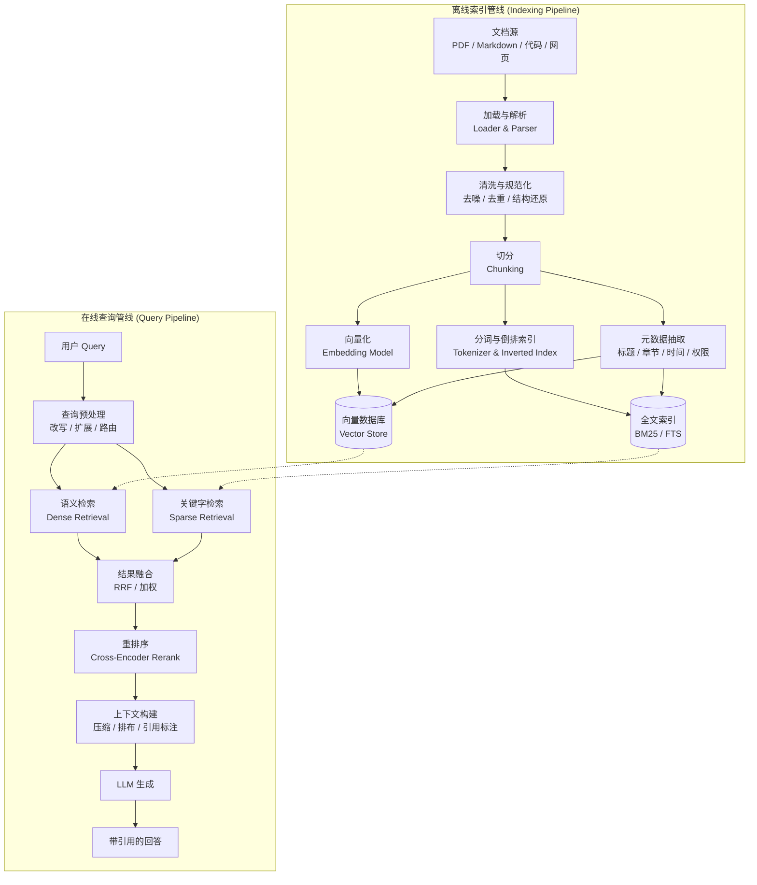
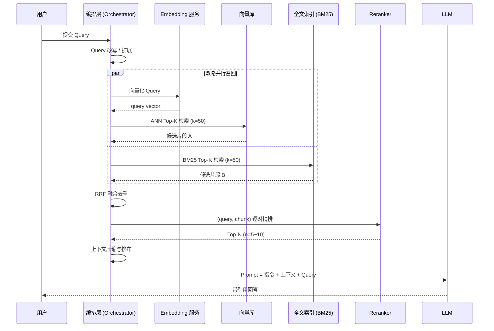
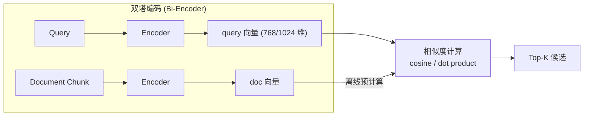
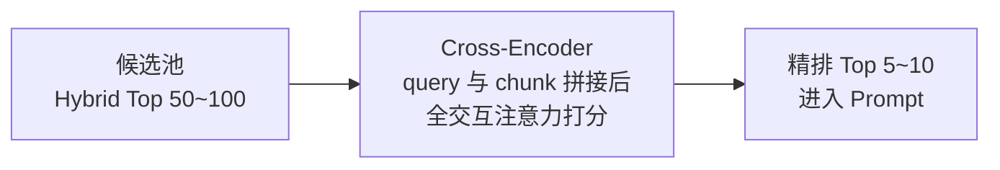
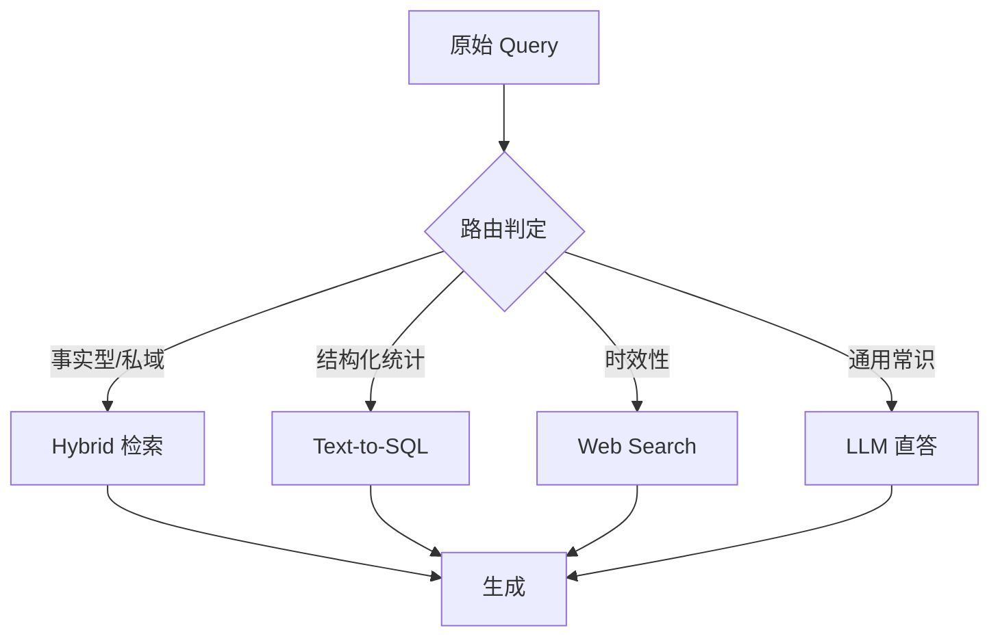
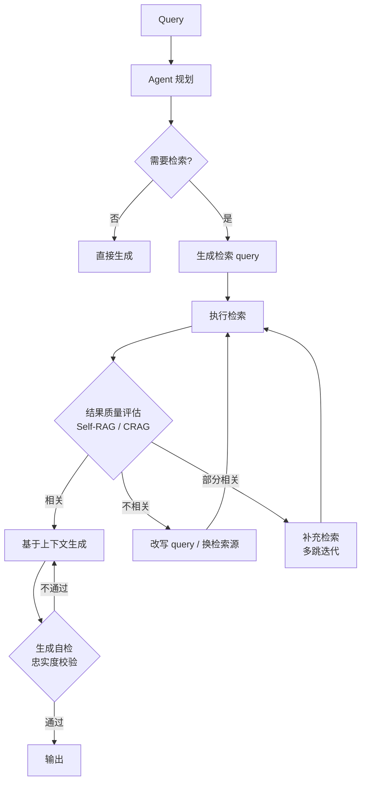
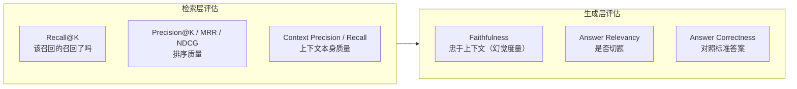

# RAG（检索增强生成）技术架构

> 本文介绍 RAG 的完整技术体系：索引与检索管线、语义检索与关键字检索的原理与取舍、混合检索与重排序、进阶范式与评估方法。适用于为 Agent 的长期记忆层、知识库问答能力做技术选型与实现时参考。

---

## 1. 概述

### 1.1 定义

RAG（Retrieval-Augmented Generation，检索增强生成）是一种在 LLM 生成回答前，先从外部知识源检索相关内容并注入上下文的架构模式。其本质是把「参数化知识」（模型权重内的知识）与「非参数化知识」（外部可更新的知识库）解耦。

### 1.2 解决的问题

| 问题 | 纯 LLM 表现 | RAG 的改进 |
|------|------------|-----------|
| 知识时效 | 受训练数据截止时间限制 | 更新文档即可更新知识，无需重训 |
| 幻觉 | 知识盲区仍自信输出 | 生成受检索上下文约束，可做忠实度校验 |
| 私域知识 | 企业内部/项目内文档不可知 | 索引私有语料即可覆盖 |
| 可溯源 | 无法给出出处 | 每条结论可回链到源文档片段 |
| 权限隔离 | 无法区分用户可见范围 | 检索层按 metadata 过滤实现行级权限 |

### 1.3 与微调、长上下文的关系

三者不是互斥关系，而是分工不同：

- **微调（Fine-tuning）**：注入"能力与风格"——领域术语理解、输出格式、行为约束。
- **RAG**：注入"事实与知识"——可更新、可溯源、可权限控制。
- **长上下文（Long Context）**：容纳更多候选材料，但全量灌入存在成本、延迟与注意力稀释问题（Lost in the Middle）。实践中 RAG 负责粗筛过滤，长窗口负责容纳更多精排后的候选。

---

## 2. 整体架构

RAG 分为**离线索引**与**在线查询**两条管线：



**在线查询时序**：



---

## 3. 索引管线细节

### 3.1 文档解析

解析质量是整条管线的地基，也是实际落地中最大的失败来源：

- **PDF**：表格、双栏排版、扫描件是重灾区。文本型 PDF 可用结构化解析器提取；扫描件需 OCR；复杂版面（财报、论文）建议引入版面分析模型或 VLM 辅助。
- **代码库**：按语法结构切分（函数 / 类 / 模块）优于按行切分，可借助 tree-sitter 等语法解析器保持语义完整。
- **Markdown / HTML**：保留标题层级作为 metadata，切分时以标题边界优先。

### 3.2 切分策略（Chunking）

| 策略 | 原理 | 优点 | 缺点 |
|------|------|------|------|
| 固定长度 | 每 N token 切一段 | 实现简单、可控 | 容易切断语义 |
| 递归字符切分 | 按段落→句子→字符层级回退 | 通用默认，兼顾语义边界 | 对无结构文本效果一般 |
| 语义切分 | 相邻句 embedding 相似度突变处断句 | 语义完整性最好 | 索引成本高 |
| 结构化切分 | 按标题 / 函数 / 表格等结构单元 | 适合文档与代码 | 依赖解析质量 |

工程默认值：chunk 大小 256–1024 token，重叠（overlap）10%–20% 以缓解边界信息丢失。

### 3.3 上下文增强索引（Contextual Retrieval）

孤立的 chunk 常常丢失指代信息（"该公司""上述方案"指什么）。做法是入库前用 LLM 为每个 chunk 生成一段全文视角的上下文说明，拼接在 chunk 前再做向量化与倒排索引。该方法（Anthropic 提出）可显著降低检索失败率，代价是一次性的索引侧 LLM 调用成本（可用 Prompt Caching 摊薄）。

---

## 4. 检索层：语义检索 vs 关键字检索

这是 RAG 检索层最核心的一组对比，两者的失败模式互补，生产系统几乎总是同时使用。

### 4.1 关键字检索（Sparse / Lexical Retrieval）

**原理**：基于词项的精确匹配。文档被分词后构建**倒排索引**（term → 文档列表），查询时按词项命中并用统计公式打分。工业标准是 **BM25**：

```
score(q, d) = Σ_{t∈q} IDF(t) · (tf(t,d) · (k1 + 1)) / (tf(t,d) + k1 · (1 - b + b · |d| / avgdl))
```

- `tf(t,d)`：词 t 在文档 d 中的词频，带饱和函数（k1 控制饱和速度，常取 1.2–2.0）
- `IDF(t)`：逆文档频率，惩罚常见词、奖励稀有词
- `b`：文档长度归一化系数（常取 0.75），抑制长文档天然占优

**优势**：
- 对**专有名词、型号、错误码、API 名、代码标识符**极其敏感——`portable-pty`、`E11000`、`tauri::command` 这类 token 在语义检索中常被稀释，但 BM25 能精确命中
- 无需训练、可解释（能看到命中了哪些词）、索引与查询成本低
- 零样本泛化稳定，不受 embedding 模型域外退化影响

**劣势**：
- **词汇鸿沟（Vocabulary Mismatch）**：同义不同词无法命中（"报错" vs "异常"，"删除" vs "移除"）
- 无法理解语序与否定（"A 调用 B" 与 "B 调用 A" 得分相同）
- 中文等无空格语言依赖分词质量

**实现选型**：Elasticsearch / OpenSearch（重型全功能）、Tantivy（Rust 生态，桌面端友好）、SQLite FTS5（嵌入式场景零依赖，适合 Tauri 应用本地索引）。

### 4.2 语义检索（Dense Retrieval）

**原理**：用 embedding 模型将 query 与文档映射到同一稠密向量空间，以向量相似度（余弦相似度 / 内积）度量语义相关性，通过 **ANN（近似最近邻）** 索引实现大规模低延迟检索。



**关键技术点**：

- **ANN 索引**：暴力检索是 O(N)，生产用 **HNSW**（分层可导航小世界图，高召回低延迟、内存占用高）或 **IVF+PQ**（倒排聚类 + 乘积量化，省内存、召回略降）。
- **Embedding 选型**：参考 MTEB / C-MTEB 榜单在目标领域的表现；中文场景 BGE 系列常用。注意部分模型要求 query 侧加指令前缀（非对称检索）。
- **归一化**：向量归一化后余弦相似度等价于内积，可简化索引配置。
- **维度与成本**：维度越高表达力越强但存储与计算成本线性增长；Matryoshka 表示学习支持截断降维。

**优势**：
- 跨越词汇鸿沟：同义改写、口语化提问、跨语言查询均可命中
- 理解语义组合关系，而非词袋

**劣势**：
- 对稀有专名、精确标识符不敏感（被上下文语义"平均化"）
- 域外退化：embedding 模型没见过的领域（内部黑话、新造词）效果下降
- 黑盒性：难以解释为何命中
- 索引更新成本高于倒排索引

### 4.3 对比总表

| 维度 | 关键字检索 (BM25) | 语义检索 (Dense) |
|------|------------------|------------------|
| 匹配基础 | 词项精确匹配 | 向量空间语义距离 |
| 同义改写 | ❌ 无法命中 | ✅ 可命中 |
| 专名/错误码/代码符号 | ✅ 精确命中 | ❌ 常被稀释 |
| 可解释性 | 高（可见命中词） | 低 |
| 索引结构 | 倒排索引 | HNSW / IVF-PQ |
| 增量更新 | 便宜 | 较贵（需重嵌入） |
| 域外泛化 | 稳定 | 依赖模型覆盖 |
| 典型失败 | 词汇鸿沟 | 精确性丢失 |

### 4.4 混合检索与融合（Hybrid Search + RRF）

双路并行召回后需融合两套**量纲不可比**的分数（BM25 分数无上界，余弦相似度在 [-1,1]）。工业标准是 **RRF（Reciprocal Rank Fusion）**——只用排名不用分数，天然免疫量纲问题：

```
RRF(d) = Σ_{r∈routes} 1 / (k + rank_r(d))     （k 常取 60）
```

文档在任一路排名越靠前贡献越大；两路都命中的文档得分叠加，自然置顶。替代方案是分数归一化后加权（α·dense + (1-α)·sparse），可调性更强但需要调参与分数校准。

### 4.5 重排序（Rerank）

召回与精排是速度/精度的两级分工：



- **Bi-Encoder（召回用）**：query 与文档独立编码，文档向量可离线预计算，快但精度有限。
- **Cross-Encoder（精排用）**：query 与文档拼接后过一次完整 Transformer，token 级交互，精度显著更高但无法预计算，只能作用于小候选集。

Rerank 是整条管线性价比最高的优化点之一，常见选型：BGE-reranker、Cohere Rerank、Jina Reranker。

---

## 5. 查询侧优化（Pre-Retrieval）

| 技术 | 做法 | 适用场景 |
|------|------|---------|
| Query 改写 | LLM 将口语问题改写为检索友好形式 | 用户输入随意、含指代 |
| Multi-Query | 生成 3–5 个 query 变体分别检索后合并 | 单一表述召回不稳 |
| HyDE | 先让 LLM 生成假设性答案，用答案向量去检索 | 问题与答案语域差异大 |
| Query 分解 | 复杂问题拆为子问题分别检索 | 多跳 / 复合问题 |
| Query 路由 | 判定走向量库 / SQL / 直接回答 / Web 搜索 | 多知识源系统 |



---

## 6. 上下文构建（Post-Retrieval）

1. **上下文压缩**：用小模型或规则剔除 chunk 内与 query 无关的句子，降低 token 成本与噪声干扰。
2. **排布策略**：应对 Lost in the Middle——最相关片段放 prompt 首尾，次要内容居中。
3. **引用标注**：为每个片段编号（`[1]` `[2]`），指令要求模型逐句标注来源，支撑前端引用跳转与忠实度校验。
4. **去重与多样性**：MMR（最大边际相关性）在相关性与多样性间平衡，避免 top-k 全是近似重复片段。

---

## 7. 进阶范式

### 7.1 Small-to-Big（Parent Document Retrieval）

用小 chunk 保证检索精度，命中后返回其父级大 chunk 保证生成上下文完整——索引粒度与生成粒度解耦。

### 7.2 GraphRAG

先用 LLM 从语料抽取实体-关系构建知识图谱，配合社区检测生成分层摘要。擅长回答向量检索天然答不了的**全局性问题**（"这批文档的核心主题是什么"），代价是索引成本高数量级上升。

### 7.3 Agentic RAG

将检索降级为 Agent 的一个工具，由模型自主决策：是否检索、检索几轮、如何改写、结果是否可信。



代表工作：**Self-RAG**（生成反思 token 自评检索必要性与结果质量）、**CRAG**（检索质量评估器，低质量时降级到 Web 搜索）。这是 RAG 与 Agent 架构融合最深的方向，多跳问题、跨源问题只能靠此类迭代式方案解决。

---

## 8. 评估体系

### 8.1 分层指标



检索层与生成层必须**分开归因**：端到端答错时，先看是"没检到"（检索问题）还是"检到了没用好"（生成问题），修复路径完全不同。

### 8.2 工程实践

- **框架**：RAGAS、TruLens、DeepEval，普遍采用 LLM-as-a-Judge，需人工抽检校准 judge 偏差。
- **评测集构建**：从真实语料合成 QA 对（LLM 生成 + 人工审核），覆盖事实型 / 多跳型 / 汇总型 / 无答案型（拒答能力）四类。
- **坏例回流**：线上差评 case 沉淀为回归测试集，每次索引策略 / 模型变更跑回归。

---

## 9. 生产工程清单

| 关注点 | 要点 |
|--------|------|
| 增量索引 | 文档变更监听 → 差量重嵌入 → 软删除旧版本，避免全量重建 |
| 权限过滤 | 检索时按 metadata（用户/团队/密级）过滤，权限在检索层而非生成层执行 |
| 缓存 | Query embedding 缓存、高频问答语义缓存、Prompt Caching |
| 延迟预算 | 典型分配：召回 <100ms、rerank <200ms、生成为大头；召回并行化 |
| 降级策略 | 向量库不可用时降级 BM25；检索空结果时明确告知而非强行生成 |
| 可观测性 | 每次请求记录检索命中、分数分布、rerank 前后变化，接入 OTel trace |
| 幻觉兜底 | 指令强约束"仅基于上下文回答"，生成后忠实度校验，低置信输出附来源提示 |

---

## 10. 常见失败模式速查

| 症状 | 可能原因 | 排查方向 |
|------|---------|---------|
| 明明有文档却检不到 | chunk 切坏 / 词汇鸿沟 / embedding 域外退化 | 检查 chunk 边界；补 BM25 路；换 embedding |
| 检到了但答错 | 上下文噪声大 / Lost in the Middle | 上压缩与排布；减小 k、加 rerank |
| 专名/错误码查询失败 | 只有语义检索 | 补关键字检索路 |
| 汇总类问题答不好 | 向量检索只命中局部 | GraphRAG / 摘要索引 |
| 多跳问题失败 | 单轮检索天花板 | Query 分解 / Agentic 迭代检索 |
| 引用与内容不符 | 生成幻觉 | 忠实度校验 + 强制引用标注 |

---

## 附：参考实现栈（桌面端 / 本地优先场景）

针对 Tauri + Rust 本地应用的轻量组合参考：

- **全文索引**：SQLite FTS5（零依赖、嵌入式、支持中文需自定义分词）或 Tantivy
- **向量存储**：sqlite-vec / 本地 HNSW（usearch、hnsw_rs）
- **Embedding**：本地 ONNX 推理（BGE-small 级别）或远程 API，按隐私要求选择
- **融合**：应用层实现 RRF，逻辑不足 50 行
- **Rerank**：本地小型 cross-encoder（ONNX）或按需调用远程 rerank API
