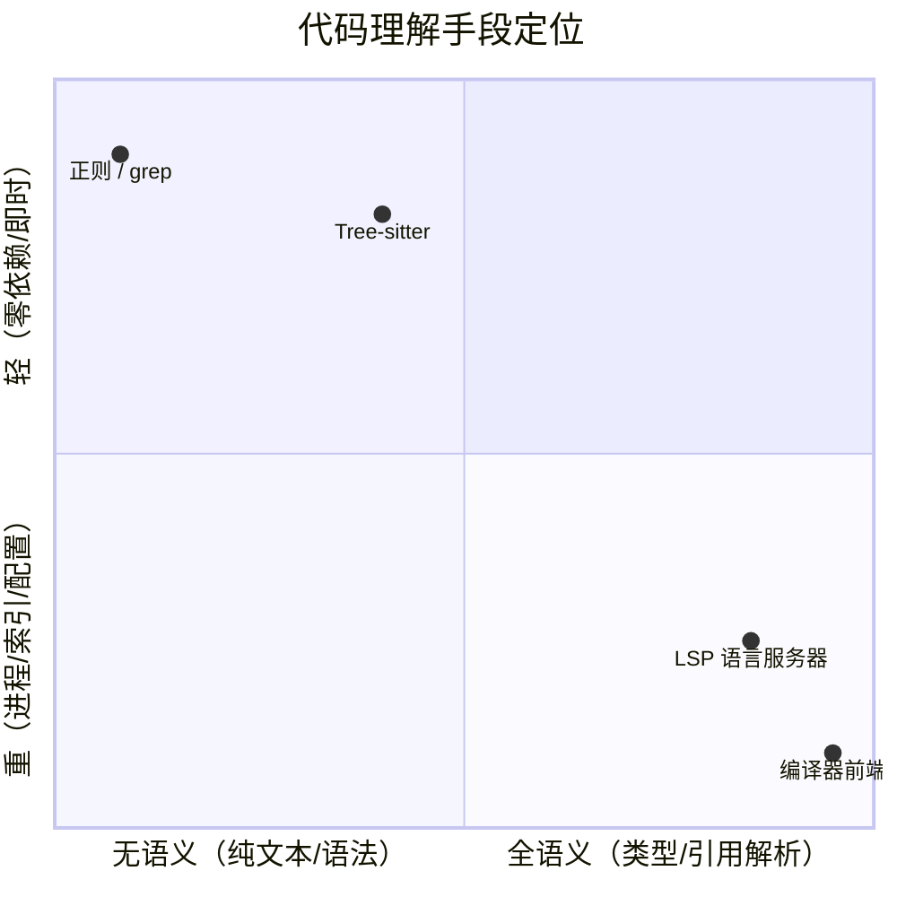
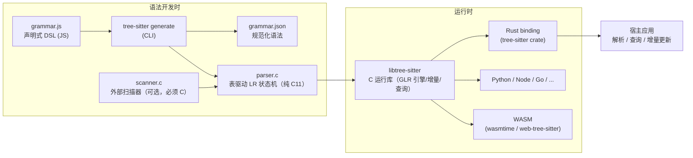
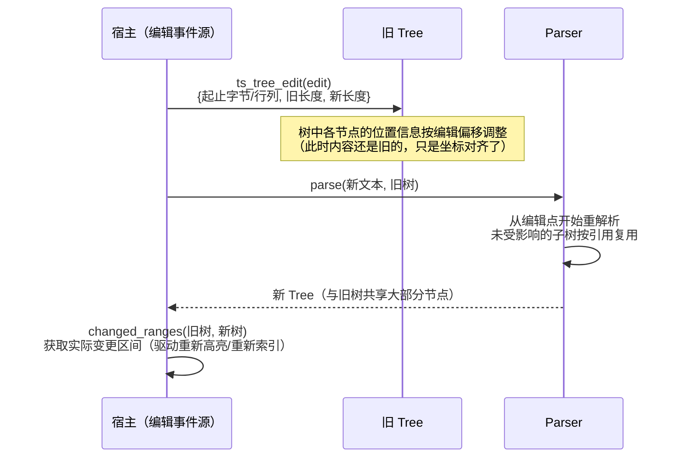
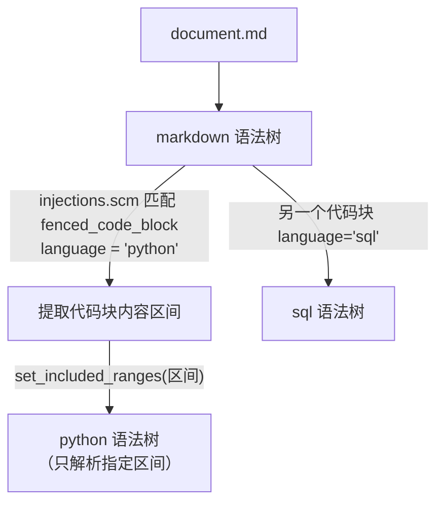
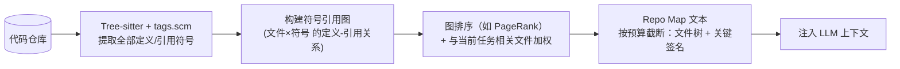

# Tree-sitter 技术架构

> VaneHub AI 技术文档 · Agent 基础设施系列
>
> 本文介绍 Tree-sitter 的完整技术体系：GLR 增量解析原理、语法开发工具链与 ABI 机制、查询系统（Queries）、语言注入，以及在 AI 编码 Agent 中的应用模式（结构化代码切分、Repo Map、代码检索）。适用于代码理解层、RAG 代码索引管线、语法感知编辑能力的实现参考。
>
> 版本基准：tree-sitter **0.26.x**（当前活跃版本线；0.25 起语法 ABI 升至 **15**，运行库向后兼容旧 ABI 语法但不向前兼容；外部 scanner 仅支持 C 实现）。

---

## 1. 概述

### 1.1 定义

Tree-sitter 是一个**解析器生成工具 + 增量解析运行时**：从声明式语法定义（`grammar.js`）生成无依赖的 C 解析器，在运行时把源代码解析为**具体语法树（CST）**，并在代码编辑后以增量方式高效更新语法树。最初由 GitHub 为 Atom 编辑器开发，现已成为代码工具领域的事实标准解析基础设施——Neovim、Zed、Helix 的语法高亮，GitHub 的代码导航，以及大量 AI 编码工具的代码理解层都构建在其上。

### 1.2 四条设计目标

| 目标 | 含义 | 工程后果 |
|------|------|---------|
| **General** | 能解析任何编程语言 | GLR 算法处理歧义文法 + 外部 scanner 处理上下文相关词法 |
| **Fast** | 快到能在每次击键后重解析 | 增量解析：毫秒级更新，复用未变动子树 |
| **Robust** | 语法错误时仍给出有用结果 | 内置错误恢复——**残缺代码也能出树**，这是与传统编译器前端的本质差异 |
| **Dependency-free** | 生成的解析器是纯 C11，零运行时依赖 | 可嵌入任何宿主（Rust/桌面应用/浏览器 WASM） |

对 Agent 宿主而言，**Robust 是最关键的一条**：Agent 编辑中的代码大部分时间处于语法不完整状态，编译器前端会直接罢工，而 Tree-sitter 把错误局部化为 `ERROR`/`MISSING` 节点，树的其余部分照常可用。

### 1.3 定位：与 LSP、正则的三方对比



| 维度 | 正则/grep | Tree-sitter | LSP |
|------|-----------|-------------|-----|
| 理解层次 | 字符模式 | **语法结构**（函数/类/表达式边界精确） | 语义（类型、跨文件引用） |
| 残缺代码 | 无所谓 | ✅ 错误恢复 | 视服务器（常降级） |
| 启动成本 | 零 | 零（进程内库调用） | 子进程 + 索引暖机 |
| 跨文件 | 否 | 否（单文件语法） | ✅ |
| 典型误判 | 把字符串/注释里的 `function` 当函数 | 分不清同名符号是否同一实体 | — |

三者是**分层互补**：grep 做粗筛、Tree-sitter 做结构精确定位与切分、LSP 做语义精确解析——本系列 LSP 篇 §9 的"结构化检索"与 RAG 篇 §3.1 的"代码按语法结构切分"，落地时的执行者正是 Tree-sitter。

---

## 2. 工具链架构



三个关键分离：

1. **语法与引擎分离**：`parser.c` 只是数据表（状态转移表 + 产生式），GLR 解析算法在共享运行库中——所有语言共用同一引擎
2. **生成物自包含**：每个语言仓库（tree-sitter-python、tree-sitter-rust 等）附带预生成的 `parser.c`，消费方无需 Node/npm，直接编译 C 即可
3. **ABI 版本契约**：语法由某版本 CLI 生成时打上 ABI 号（当前 **15**，0.25 起）；运行库**向后兼容旧 ABI、不向前兼容新 ABI**——升级运行库安全，但拿新 CLI 生成的语法喂旧运行库会加载失败。宿主集成多语言时要为整套语法锁定统一的 ABI 基线（生态长尾中仍有大量 ABI 13/14 的语法仓库）

---

## 3. 解析原理

### 3.1 GLR：处理真实语言的歧义

Tree-sitter 基于 **GLR（Generalized LR）**：在 LR 解析遇到冲突（一个状态下多个动作可行）时**分叉解析栈并行推进**，错误的分支自然消亡，存活分支按声明的优先级（`prec`）与动态代价择优。这让语法作者不必把文法改写成严格 LALR——真实语言里大量"局部歧义、全局唯一"的结构（C 的类型/表达式歧义、三元与泛型的 `<` 冲突）得以自然表达。

### 3.2 CST 而非 AST

Tree-sitter 产出**具体语法树**：保留全部源码信息（含标点、关键字），每个节点带精确的字节区间与行列位置。两类节点：

- **Named nodes**：语法规则对应的结构节点（`function_definition`、`call_expression`）——分析时主要遍历对象
- **Anonymous nodes**：字面 token（`(`、`,`、`def`）——高亮需要、结构分析通常跳过

补充两个结构化访问机制：

- **Fields**：规则中用 `field("name", ...)` 标注的具名子节点——`function_definition` 的 `name`/`parameters`/`body` 字段让消费端按名取子树而非按位置猜
- **Supertypes**：抽象节点分类（如 `_expression` 统摄所有表达式类型），查询与遍历可按大类匹配

### 3.3 错误恢复

遇到无法归约的输入时，解析器不中止，而是：

- 将无法解释的片段包进 **`ERROR` 节点**，其内部仍尽力解析出子结构
- 对"缺了个 token 就通"的位置插入零宽 **`MISSING` 节点**（如缺失的右括号）

消费端心智模型：**树永远存在，局部可能带伤**。做结构提取时对 `ERROR` 子树降级处理（跳过或回退文本模式），而不是假设树完美。

### 3.4 增量解析

编辑后不重新解析全文，而是：



要点：

- `ts_tree_edit` 的坐标是**字节偏移 + 行列**双口径——与 LSP 篇 §4.3 的编码换算问题同源：宿主若同时对接 LSP（UTF-16）与 Tree-sitter（字节），必须维护统一的换算层
- 编辑必须**逐次如实上报**（与 LSP `didChange` 增量事件天然同构——同一份编辑流可以同时喂两边）
- 树是廉价共享的持久化结构，旧树新树可并存做 diff（`changed_ranges` 精确告知哪些区域真的变了，避免全量重处理）

---

## 4. 语法开发

### 4.1 grammar.js DSL

语法用 JavaScript DSL 声明（仅作为描述语言，生成后与 JS 无关）：

```javascript
module.exports = grammar({
  name: 'toy',
  rules: {
    source_file: $ => repeat($._statement),
    _statement: $ => choice($.function_definition, $.expression_statement),
    function_definition: $ => seq(
      'fn',
      field('name', $.identifier),
      field('parameters', $.parameter_list),
      field('body', $.block),
    ),
    binary_expression: $ => choice(
      prec.left(1, seq($._expression, '+', $._expression)),
      prec.left(2, seq($._expression, '*', $._expression)),  // 优先级解决歧义
    ),
    identifier: $ => /[a-zA-Z_]\w*/,
  }
});
```

核心组合子：`seq`（序列）、`choice`（分支）、`repeat`/`repeat1`、`optional`、`prec`/`prec.left`/`prec.right`/`prec.dynamic`（静态/结合性/动态优先级）、`token`（合并为单 token）、`alias`（重命名节点）、`field`（具名子节点）。下划线前缀规则为**隐藏规则**（不产生 named node，用于组织语法）。

### 4.2 外部扫描器（External Scanner）

上下文相关的词法无法用正则表达（Python 的缩进层级、Heredoc、字符串插值、JS 的自动分号），此时在 `scanner.c` 中手写词法逻辑，与生成的解析器协同：解析器在特定状态把控制权交给外部 scanner，scanner 可维护自己的状态（如缩进栈）并参与增量解析的状态序列化。**注意：外部 scanner 只支持 C 实现**（非 C 实现已被生态移除支持）——这是评估第三方语法质量时的检查项之一。

### 4.3 语法测试

CLI 内置基于语料的测试：`test/corpus/*.txt` 中"源码片段 + 期望 S-expression 树"成对书写，`tree-sitter test` 回归验证；`tree-sitter parse <file>` 打印实际树用于调试。维护自有语法时，语料测试是防止改动引发歧义漂移的主要护栏。

---

## 5. 查询系统（Queries）

这是 Tree-sitter 对上层应用最重要的接口：用 **S-expression 模式**在语法树上做结构化匹配，等价于"语法树上的 CSS 选择器"。

### 5.1 模式语法

```scheme
; 匹配函数定义，捕获名字与函数体
(function_definition
  name: (identifier) @func.name
  body: (block) @func.body)

; 谓词过滤：只匹配 test_ 开头的函数
((function_definition name: (identifier) @name)
 (#match? @name "^test_"))

; 通配与量词
(call_expression
  function: (_) @callee          ; (_) 匹配任意 named 节点
  arguments: (argument_list (_)* @args))

; 锚点：^ 首个子节点 / 备选分支 [ ... ]
[ (line_comment) (block_comment) ] @comment
```

要素：节点类型匹配、`field:` 字段约束、`@name` 捕获（capture）、`#eq?`/`#match?`/`#any-of?` 等谓词、`_`/`(_)` 通配、量词 `* + ?`、`.` 锚点。**谓词由绑定层执行**而非核心库——不同语言绑定支持的谓词集合略有差异，跨绑定复用查询时需核对。

### 5.2 约定查询文件（.scm）

生态围绕几个约定文件名建立了跨编辑器复用的查询层，语言仓库的 `queries/` 目录通常提供：

| 文件 | 用途 | 消费方 |
|------|------|--------|
| `highlights.scm` | 语法高亮捕获（`@function`、`@keyword`、`@string`…） | 编辑器着色 |
| `injections.scm` | 语言注入声明（见 §6） | 多语言嵌套解析 |
| `locals.scm` | 局部作用域与定义/引用（语法层近似） | 高亮消歧、轻量跳转 |
| `tags.scm` | 符号提取（函数/类/方法定义与调用） | 代码导航、**Repo Map**（见 §7.2） |

对 Agent 宿主，`tags.scm` 是现成的"符号提取器规格"——直接复用各语言仓库的 tags 查询即可获得跨语言统一的定义/引用提取，无需逐语言写遍历代码。

### 5.3 执行模型与成本

- **Query 编译一次、复用多次**：模式编译有成本，宿主应按（语言 × 查询）维度缓存编译产物
- **QueryCursor** 在指定节点子树内迭代匹配，可限定字节/行区间——配合增量解析的 `changed_ranges`，只对变更区域重跑查询
- 匹配是流式的，大文件不需要物化全部结果

---

## 6. 语言注入（Injections）

真实文件常是多语言嵌套：Markdown 里的代码块、HTML 里的 `<script>`、Rust 里的 SQL 字符串、模板语言。Tree-sitter 的解法是**多棵树分层解析**：



- 宿主用外层树 + `injections.scm` 查询发现注入点与目标语言
- 对每个注入区间，用目标语言的 parser 配合 **`set_included_ranges`**（限定解析范围）建子树
- 各层树独立做增量更新;高亮/查询结果按层叠加

这套机制同样服务于 Agent 场景：对 Markdown 文档做 RAG 索引时,代码块可以注入解析后按其自身语言的结构切分，而不是当纯文本。

---

## 7. AI 编码 Agent 中的应用模式

### 7.1 结构化代码切分（RAG 索引管线）

RAG 篇 §3.2 中"代码按语法结构切分"的具体实现：

- **切分单元**：以 tags 查询提取的定义节点（函数/方法/类）为天然 chunk 边界——语义完整、大小适中、天然带标识符
- **上下文补全**：每个 chunk 附加其**结构路径**（`模块 > 类 > 方法`）与签名作为 metadata/上下文前缀（Contextual Retrieval 的结构化平替，零 LLM 成本）
- **超大函数**：按语句块层级递归下分，保持子块对齐语法边界
- **增量索引**：文件变更后 `changed_ranges` 定位受影响的定义节点，只重嵌入变更的 chunk——与 RAG 篇 §9 的增量索引要求闭环
- **残缺容忍**：ERROR 子树内的定义降级为行切分，不阻塞整个文件的索引

### 7.2 Repo Map：给模型的仓库地图

在有限上下文内让模型"看见"整个仓库的主流做法（Aider 推广的模式）：



要点：只放**签名不放实现**（一个 500 行的类在地图上只占十几行）；排序保证 token 预算内优先呈现"当前任务最可能触及"的符号；地图随索引增量更新。这是 Tree-sitter（快、全语言、免服务器）而非 LSP 承担的活——对整仓批量提取符号，LSP 需要逐服务器暖机且接口是交互式的，Tree-sitter 一次遍历即可。

### 7.3 其他 Agent 侧用途

| 用途 | 做法 |
|------|------|
| 结构化代码检索工具 | 把 Query 封装为 Agent 工具："找出所有调用 X 且带 await 的函数"——比 grep 精确（不误伤字符串/注释），比 LSP 轻（无需服务器在线） |
| 编辑落点定位 | Agent 声明"在类 Foo 里加方法"时，用树定位类体的精确插入区间，而非让模型输出行号（模型数行号不可靠） |
| Diff 的结构化理解 | 变更行 → 所属定义节点 → "本次改动触及了哪些函数"——commit 摘要、影响面分析的输入 |
| 语法感知的输出校验 | Agent 生成的代码先过一遍解析，ERROR 节点即语法错误，早于编译器/LSP 给出最快反馈（构成"生成→校验"闭环的第一道门） |
| 安全/规约扫描 | 以 Query 表达结构化规则（如"捕获所有字符串拼接进 SQL 调用的模式"）做轻量静态检查 |

### 7.4 与 LSP 的分工决策表

| 需求 | 用 Tree-sitter | 用 LSP |
|------|---------------|--------|
| 整仓批量符号提取 | ✅（一次遍历，全语言统一） | ❌（交互式接口 + 暖机） |
| "这个符号的定义在哪"（语义精确） | ❌（同名无法消歧） | ✅ |
| 残缺代码的结构 | ✅ | 视服务器 |
| 跨文件重命名 | ❌ | ✅ |
| 每次击键的实时结构 | ✅（增量毫秒级） | 高频请求需节流 |
| 类型信息 | ❌ | ✅ |

---

## 8. Rust 集成要点

- **crate 组合**：核心 `tree-sitter`（运行库绑定）+ 各语言 crate（`tree-sitter-python`、`tree-sitter-rust` 等，静态链接预生成 parser.c）；语言 crate 版本要与核心 crate 的 ABI 支持范围对齐（编译期/加载期版本检查会拒绝不兼容组合）
- **加载策略**：常用语言静态链接（编译进二进制，零运行时依赖）；长尾语言可走动态加载（编译为动态库按需 dlopen）或 **WASM 路径**（`wasm` feature 经 wasmtime 加载 .wasm 语法——沙箱化，适合加载不受信任的第三方语法，代价是性能损耗与内存读校验开销）
- **线程模型**：`Parser` 有内部状态,**每线程一个实例**（池化复用）；`Tree` 廉价克隆、可跨线程共享快照；`Query` 编译产物全局缓存，`QueryCursor` 池化
- **大文件防线**：解析设超时/取消标志（病态输入下 GLR 分叉可能放大耗时）；超大文件（生成代码、压缩 JS）设行长/文件大小阈值降级
- **与 PTY/进程管理的关系**：Tree-sitter 是**进程内库**，没有子进程与协议——这是它与 LSP/MCP 集成成本的量级差异，也是"能用 Tree-sitter 解决就不动用 LSP"的理由

---

## 9. 故障排查速查

| 症状 | 常见原因 | 处理 |
|------|---------|------|
| 语法加载失败 / 版本报错 | 语法 ABI 高于运行库支持（不向前兼容） | 统一 ABI 基线；用匹配版本 CLI 重新 generate |
| 增量解析后树错乱 | 编辑未逐次上报 / edit 坐标算错 | 编辑事件流如实转发；字节与行列双口径都要准确 |
| 位置与编辑器不一致 | 字节 vs UTF-16 口径混用 | 统一换算层（与 LSP 集成共用） |
| 查询在某绑定不工作 | 谓词由绑定层实现，支持集不同 | 核对目标绑定的谓词支持；避免冷门谓词 |
| 结构提取偶发漏项 | ERROR 子树吞掉了定义 | 对 ERROR 区域降级为文本模式提取 |
| 高亮/索引全量重算 | 未用 changed_ranges | 增量消费变更区间 |
| 病态文件解析极慢 | 深度歧义/超长行触发 GLR 分叉爆炸 | 超时取消 + 大小阈值降级 |
| 第三方语法质量差 | 无语料测试 / scanner 非 C / ABI 过旧 | 按 §4.2/§2 检查项评估；优先官方与活跃维护的语法 |

---

## 10. 参考

- 官方文档与规范：tree-sitter.github.io/tree-sitter（Using Parsers / Creating Parsers / Syntax Highlighting）
- 语法生态清单：tree-sitter GitHub Wiki "List of parsers"（含各语法的 ABI 与 scanner 状况）
- Rust 绑定：docs.rs/tree-sitter；Python 绑定：py-tree-sitter
- 本系列相关：RAG 篇 §3.2（代码切分的消费方）、LSP 篇 §9（语义层互补）、Function Calling 篇 §6（Query 封装为工具时的执行引擎）
