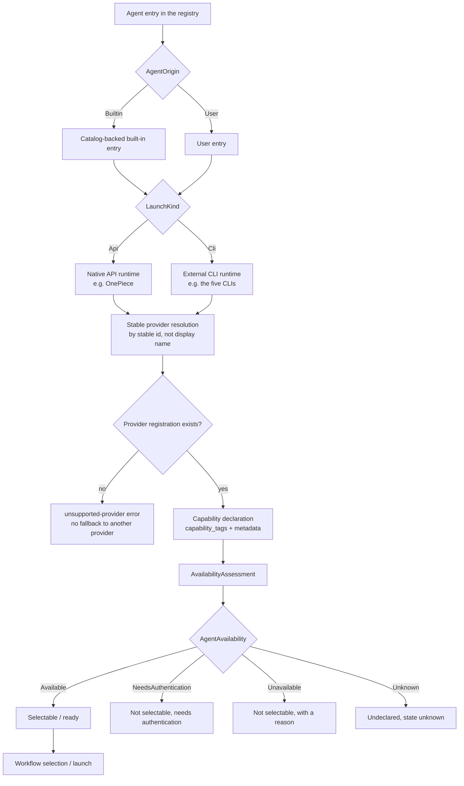

# Agent lifecycle and provider runtime

This chapter covers how registered Agents (other than the built-in OnePiece) are edited, and how the runtime resolves a stable Agent id to a concrete provider contract without provider-identity branching in the application layer.

## Editing a registered API Agent

A user-created API Agent's display name, model id, Base URL, and stored API key are editable. The Agent's `id`, `provider`, and `interface format` are immutable through the ordinary edit operation. Edits re-validate like registration: an omitted required Base URL for an `openai-compatible` Agent rejects the whole edit without persisting any part of it. A rotated API key replaces the stored credential and takes effect on the next generation.

OnePiece is the exception: it uses dedicated catalog-backed provider-**Profile** operations that preserve stable id `onepiece` while allowing multiple independently secured provider/endpoint/model configurations and one explicit active Profile. OnePiece's provider, endpoint type, interface format, and Base URL are resolved from the selected built-in directory entry — never edited directly.

## Stable provider resolution

The Agent Runtime resolves supported built-in CLI runtime behavior through a **provider registry** keyed by the Agent registry entry's stable id. Provider-neutral application and Session modules do not branch on provider identity to select behavior. An Agent id with no compatible provider registration returns a classified `unsupported-provider` error with no fallback to another provider.

## Provider metadata and capabilities

Each registered provider declares validated metadata, readiness prerequisites, and supported runtime capabilities (interaction, resume, structured-output, terminal, usage, permissions, model-selection, reasoning, sandbox, cancellation) independently of display-name matching or caller inference. A capability not declared by a provider is not silently assumed.

## From registry entry to launch

An Agent passes through origin classification, runtime resolution, capability declaration, and availability assessment on its way from a registry entry to something launchable. The diagram below shows that trunk path.

### Origin and runtime shape

- **Stable agent id** — every Agent is identified by a durable id that stays constant across every session it participates in. That id, not the display name, is the key for provider resolution and for every reference such as a Loop definition's Worker and Verifier ids.
- **`AgentOrigin`** — a built-in Agent (`Builtin`) is catalog-backed; an Agent marked `User` is a user entry in the registry.
- **`LaunchKind`** — distinguishes runtime shape: `Api` for a native API runtime such as OnePiece, and `Cli` for an external CLI runtime. The enum in code also carries `Browser`, `NativeDesktop`, and `Other`.

### Provider resolution and capabilities

- **Provider resolution is stable** — the runtime resolves supported built-in CLI runtime behavior through a **provider registry** keyed by the Agent registry entry's stable id. Provider-neutral application and Session modules do not branch on provider identity to select behavior.
- **No fallback** — an Agent id with no compatible provider registration returns a classified `unsupported-provider` error and does not fall back to another provider.
- **Capabilities are declared** — each registered provider declares its own validated metadata, readiness prerequisites, and supported runtime capabilities (interaction, resume, structured-output, terminal, usage, permissions, model-selection, reasoning, sandbox, cancellation) independently of display-name matching or caller inference. A capability the provider does not declare is not silently assumed to exist.

### Availability states and selection

`AgentAvailability` is derived by `AvailabilityAssessment::assess()`, which combines the managed SDK dependency state (`ManagedSdkStatus`) with the executable state (`ExecutableStatus`).

| State | Meaning | Selectable |
| --- | --- | --- |
| `Available` | The managed SDK, where required, is installed and the executable is on `PATH` | Yes — can enter a session |
| `NeedsAuthentication` | Additional authentication is required | No |
| `Unavailable` | The managed SDK is missing or unrecognized, or the executable is not on `PATH`, with a reason | No |
| `Unknown` | No executable is declared | State unknown |

`ensure_selectable()` and `ensure_session_selectable()` apply two gates before selection: first `AgentAvailability`, rejecting an unavailable Agent with its reason; then whether the Agent declares the target `InteractionMode`, rejecting it if unsupported.

### Built-in Agents

- **OnePiece** — `builtin` plus `LaunchKind::Api`, stable id `onepiece`. It uses dedicated catalog-backed provider **Profile** operations that allow several independently secured provider, endpoint, and model combinations with one explicit active Profile. Its provider, endpoint type, interface format, and Base URL are all resolved from the selected built-in directory entry.
- **The five CLIs** — `claude-code`, `codex-cli`, `gemini-cli`, `opencode`, and `antigravity-cli` are all `builtin` plus `Cli`, with runtime behavior resolved by the built-in provider registry.

## Key types and constants

The lists below collect the core types, constants, and error codes of the Agent lifecycle and provider runtime for quick reference during implementation. The authoritative semantics remain the prose above and the specs.

### Origin and runtime shape

- The `AgentOrigin` enum — `Builtin`, backed by the built-in catalog, and `User`, a user entry in the registry.
- `LaunchKind` — `Api` for a native API runtime such as OnePiece, `Cli` for an external CLI runtime such as the five CLIs, plus `Browser`, `NativeDesktop`, and `Other`.

### Stable agent id

Every Agent is identified by a durable id that stays constant across every session it participates in. That id is the key for provider resolution and for every reference such as a Loop definition's Worker and Verifier ids — never the display name.

### Provider resolution stability

The runtime resolves supported built-in CLI runtime behavior through a **provider registry** keyed by the Agent registry entry's stable id. Provider-neutral application and Session modules do not branch on provider identity to select behavior.

- **No fallback** — an Agent id with no compatible provider registration returns a classified `unsupported-provider` error and does not fall back to another provider.

### Capability declaration

Each registered provider declares its own validated metadata, readiness prerequisites, and `capability_tags`, plus the supported runtime capabilities:

- `interaction`, `resume`, `structured-output`, `terminal`, `usage`, `permissions`, `model-selection`, `reasoning`, `sandbox`, `cancellation`.

A capability the provider does not declare is not silently assumed to exist.

### Availability states

`AgentAvailability` is derived by `AvailabilityAssessment::assess()` from the managed SDK dependency state (`ManagedSdkStatus`) and the executable state (`ExecutableStatus`), across four states:

- `Available` — selectable, can enter a session
- `NeedsAuthentication` — not selectable, needs additional authentication
- `Unavailable` — not selectable, carries a reason
- `Unknown` — no executable declared, state unknown

### Selection gates

`ensure_selectable()` and `ensure_session_selectable()` apply two gates before selection:

1. Check `AgentAvailability` first, rejecting an unavailable Agent with its reason.
2. Then check whether the Agent declares the target `InteractionMode`, rejecting it if unsupported.

## Runtime shapes in a single-Agent session

In a single-Agent session, the selected Agent takes a different runtime path according to its `LaunchKind`:

| Dimension | Built-in CLI Agent (`Cli`) | OnePiece native Agent (`Api`) |
| --- | --- | --- |
| Process | VaneHub AI starts and manages the CLI child process through the Agent Terminal and its PTY; the CLI performs the actual code generation | No external process is started; the application calls the provider configured by the active Profile over HTTP |
| Authentication | Managed by each CLI itself; VaneHub AI does not store its credentials | The API key is stored by VaneHub AI as a Profile-scoped credential |
| Skills | Injected through the unified Skill system after overlay governance | Consumed through `AgentSkillPort` as an effective view: eager Skills are injected into the system prompt, on-demand ones load through a fixed read-only tool |
| MCP | Claude Code and Codex CLI go through the relay; the others are configured individually | The native tool catalog directly includes visible, active MCP tools |
| Observability | The CLI's internals are a black box, so traces stop at the boundary | Native fidelity, with tool calls expandable layer by layer |

The PTY and launch path for CLI Agents is covered in [Terminal and PTY runtime](terminal-runtime.md); OnePiece's provider invocation, context assembly, and tool loop are covered in [OnePiece native Agent](onepiece-native-agent.md). The unified Skill and MCP management architecture shared by both is covered in [Skill management](skill-management.md) and [MCP tools and clients](mcp-tools.md).

## Where the design lives

This chapter orients contributors. The authoritative requirements live in the specs.

- [openspec/specs/agent-lifecycle-management](../../../openspec/specs/agent-lifecycle-management/spec.md)
- [openspec/specs/agent-provider-runtime](../../../openspec/specs/agent-provider-runtime/spec.md)
- [openspec/specs/agent-switching](../../../openspec/specs/agent-switching/spec.md)

The native execution path lives in the `agent_runtime` bounded context; see [Native bounded contexts](native-contexts.md).
