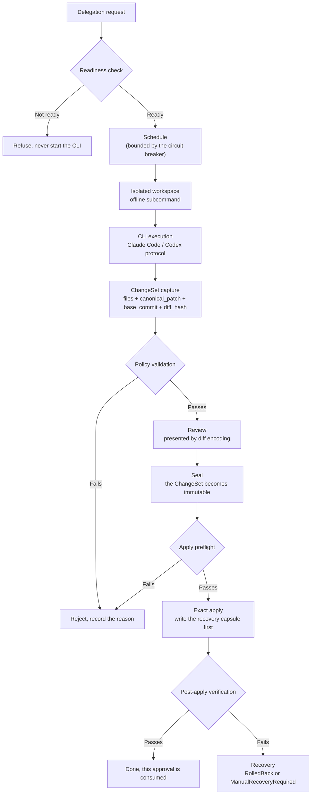

# CLI delegation and the ChangeSet pipeline

The `cli_delegation` context does something different from [Agent lifecycle](agent-lifecycle.md): **hand a piece of work to Claude Code or Codex CLI without letting it touch your repository directly**.

The CLI runs in an isolated workspace, and its output is captured as a **ChangeSet**, which is reviewed, sealed, and only then possibly applied precisely to the target repository — and only once.

## How deep the isolation goes

The specification requires an **independent, no-remote Git environment**, spelled out in four points:

- **A freshly created temporary clone**, detached at the captured clean commit, with its **own Git object store**.
- **No remote configured at all.** When the child process looks for a remote, it finds nothing capable of fetch or push — **this removes "push the changes while you're at it" as a possibility outright**, rather than relying on convention or a permission check.
- **Artifact inputs are materialized read-only outside the Git workspace**, and controller metadata is invisible to the child.
- **The child neither runs in nor writes to the user's target workspace.** In an analyze delegation the clone is read-only to the child, and any observed workspace mutation fails the attempt; in an edit delegation, only the admitted paths inside the clone are writable.

Authentication is equally constrained: the controller lets each CLI use **its own authentication mechanism** — it never copies OAuth tokens, and never injects API keys into prompts, arguments, logs, SQLite, Artifacts, or any environment visible to the child. The child gets a **minimal allowlisted environment**; control-plane connectivity to the provider does not mean the child command has network access.

> Two specific V1 narrowings: **Claude Code gets no Bash or command-execution tool at all**; **Codex delegation on Windows stays unavailable** until an independent "provider versus child network isolation" canary passes.

> Every stage on this path is controlled by its own release gate, all disabled by default. The gate list is in [OnePiece built-in tools](onepiece-builtin-tools.md).

## Three gates carve out three tiers of capability

| Gate | Capability | Boundary |
| --- | --- | --- |
| `VANEHUB_ONEPIECE_DELEGATION_ANALYZE_ENABLED` | Analysis | CLI is read-only, produces no changes |
| `VANEHUB_ONEPIECE_DELEGATION_EDIT_ENABLED` | Isolated editing and ChangeSet sealing | Edits inside an isolated workspace, produces a sealed ChangeSet |
| `VANEHUB_ONEPIECE_DELEGATION_APPLY_ENABLED` | One-time precise apply | Lands a sealed ChangeSet on the target repository |

**The tiering is deliberate**: enabling analysis does not enable editing, and enabling editing does not enable applying. Rolling back a tier only requires removing the corresponding environment variable and restarting; append-only migrations and retained evidence are not deleted.

## The pipeline end to end

## ChangeSet hard ceilings and rejection reasons

`DelegationChangeSetPolicy::validate` runs immediately after capture, against the hard ceiling `DelegationChangeSetLimits::HARD_CEILING`:

| Limit | Value |
| --- | --- |
| File count | **256** |
| Normalized patch bytes | **32 MB** |
| Bytes per path | **4096** |

Six rejection reasons, each meaning something different:

| `DelegationChangeSetPolicyError` | Trigger |
| --- | --- |
| `EmptyChangeSet` | The file list is empty, or `canonical_patch` is empty |
| `LimitExceeded` | The file count or patch size exceeds the ceiling |
| `IncompleteEvidence` | `base_commit` is empty, or `diff_hash` is not a 71-character string starting with `sha256:` |
| `UnsafePath` | A path is unsafe (absolute, parent traversal, etc.) or too long |
| `PathCollision` | Two paths normalize to the same value |
| `UnsupportedFileType` | A file mode falls outside the supported set |

**Path collision detection normalizes `\` to `/` and lowercases before comparing** — this is not fastidiousness: on a case-insensitive filesystem, `Src/Main.rs` and `src/main.rs` are the same file, and letting both through would have two patches overwrite each other.

**`IncompleteEvidence` is the one that separates "the evidence is incomplete" from "the change is invalid."** A missing `base_commit` or a malformed hash means the capture itself cannot be trusted, regardless of whether the change content is any good.

## The circuit breaker trips only on integrity failures

`DelegationCircuitFailure` has nine variants, but `trips_circuit()` returns true for only four of them:

| Failure class | Trips the circuit | Why |
| --- | --- | --- |
| `ProtocolIntegrity` | ✅ | The protocol layer is broken; retrying just keeps it broken |
| `SandboxIntegrity` | ✅ | Isolation has failed; continuing to run is risky |
| `ProcessTreeIntegrity` | ✅ | The process tree is out of control |
| `CleanupIntegrity` | ✅ | Cleanup did not finish cleanly |
| `Authentication` | ❌ | A credential problem; swap the credential and move on |
| `ProviderRefusal` | ❌ | The vendor declined this particular request |
| `TaskFailure` | ❌ | The task just wasn't solved |
| `ModelQuality` | ❌ | The result quality wasn't good enough |
| `ProjectTestFailure` | ❌ | The project's tests didn't pass |

**This distinction is the design worth remembering in this context**: "the model did badly" is not an infrastructure fault. Task failure, poor quality, and failing tests are all ordinary results — letting them trip the circuit would suspend the entire delegation path over one hard task. Only **integrity** failures — protocol, sandbox, process tree, cleanup — mean the runtime itself can no longer be trusted.

The state machine is `Closed` and `Open { failure_count, retry_after_millis }`, parameterized by a threshold, an observation window, and a cooldown; a success on the compatible path clears the observation record.

## Apply is exactly-once

The ten variants of `DelegationApplyPreflightError` break "cannot apply" down finely:

| Error | Meaning |
| --- | --- |
| `InvalidRequest` | The request itself is invalid |
| `ArtifactUnavailable` | The sealed artifact cannot be retrieved |
| `IntegrityFailure` | The artifact's integrity check failed |
| `TargetUnavailable` | The target repository is unreachable |
| `RepositoryMismatch` | The target is not the repository captured against |
| `StaleBase` | The target has moved off `base_commit` |
| `DirtyTarget` | The target workspace has uncommitted changes |
| `PlatformIncompatible` | The platform is incompatible |
| **`ApprovalConsumed`** | **This approval has already been spent** |
| `StateFailure` | State persistence failed |

`ApprovalConsumed`, together with an exclusive lease, is what makes "exact one-time apply" hold: **one approval can be redeemed exactly once** — replaying the same sealed ChangeSet does not land it a second time.

### The recovery capsule and recovery

Before applying, the pipeline writes a **recovery capsule** (`DelegationRecoveryCapsule`) and records a pre-apply witness. Recovery has exactly two outcomes:

- **`RolledBack`** — fully restored from the capsule; the target returns to its pre-apply state.
- **`ManualRecoveryRequired`** — a deterministic restore was not possible; **the system reports honestly and leaves evidence for a human**, rather than guessing at a state and claiming success.

`verify_pre_apply_witness` is what draws the line between the two: if the witness doesn't match, the system will not attempt an automatic restore.

## Relationship to other contexts

- The CLIs used for delegation are the same ones registered in [Agent lifecycle](agent-lifecycle.md), but **they don't take the same path**: an ordinary session attaches the CLI to the [Terminal and PTY runtime](terminal-runtime.md) for interaction, while delegation runs one non-interactive pass in an isolated workspace.
- The Git state of the isolated workspace and the target repository is provided by `workspaces`; see [Native bounded contexts](native-contexts.md).
- Gates, dependencies, and rollback triggers are in [OnePiece built-in tools](onepiece-builtin-tools.md).
- The user-facing review surface is covered in the user guide's code review chapter.

## Where the design lives

This chapter orients contributors; the authoritative requirements live in the specs. The delegation path's behavioral contract — isolation, sealing, one-time apply, and recovery — is defined by the corresponding main specs under `openspec/specs`.
