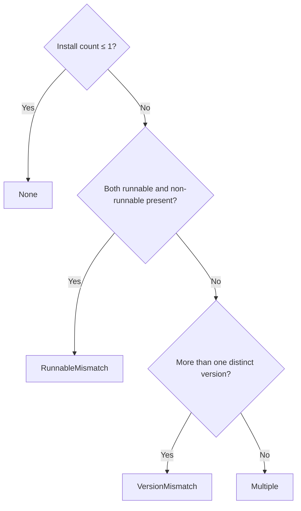

# CLI lifecycle and global configuration

`tooling` is the largest bounded context; its Skill and MCP subdomains each have their own chapter ([Skill management](skill-management.md), [MCP tools and clients](mcp-tools.md)). This chapter covers the other half: **detecting the CLIs themselves, resolving conflicts, install/upgrade, and writing provider configuration into each CLI's own configuration file**.

## The catalog is a compile-time constant

`CLI_TOOL_DEFINITIONS` is a `[ToolDefinition; 5]` const array, not a runtime-extensible registry:

| Agent | Executable | npm package | Install script |
| --- | --- | --- | --- |
| Claude Code | `claude` | `@anthropic-ai/claude-code` | shell |
| Codex CLI | `codex` | `@openai/codex` | none |
| Gemini CLI | `gemini` | `@google/gemini-cli` | none |
| OpenCode | `opencode` | `opencode-ai` | shell |
| Antigravity CLI | `agy` | **none** | shell + PowerShell |

The doc comment on `package_name: Option<&str>` explains why it's an `Option`:

> `None` for CLIs distributed only by installer script, which have no npm package to install, query for versions, or name in guidance.

**Antigravity's `None` has a chain effect on three things**: it can't be installed, its version can't be queried, and npm shouldn't even be mentioned in guidance text. Writing it as an empty string instead of `None` would force each of those three call sites to check for emptiness on its own.

### The platform decides which install script to use

The comment on `platform_installer()` states why a URL can't stand alone:

> Windows has no POSIX shell to run a `.sh` installer through, so a CLI that ships only a shell installer relies on its npm or winget package there.

**The interpreter has to travel with the URL** — `ScriptInstaller::Shell` and `PowerShell` are enum variants that carry a value, not a bare URL plus a separate platform check. Feeding a `.sh` script to PowerShell would execute it as garbage.

## Conflict resolution: three conflicts are not the same thing

`derive_conflict_state` resolves in stages when it finds multiple installations:

**The order matters**: runnability inconsistency is checked before versions, because a broken installation matters more than a version difference — different versions can at least both run, while `RunnableMismatch` means the copy you think you're using might not start at all.

`InstallSource` has nine variants (`Npm`, `Winget`, `Desktop`, `Homebrew`, `Volta`, `Bun`, `Vendor`, `System`, `Unknown`) — **the source has to be split this finely because the upgrade path follows the source**.

## Upgrade eligibility: only an npm install can be upgraded for you

`derive_lifecycle_eligibility`'s determination:

**When not installed**, it looks at what the catalog can offer: a platform install script → `Wget`; otherwise an npm package → `Npm`; neither → `Manual`.

**When installed**, it looks at the source of **the copy currently in effect**; all three matched paths require `runnable` to be true:

| Source of the copy in effect | And the catalog provides | Eligibility |
| --- | --- | --- |
| `InstallSource::Npm` | an npm package name | `Npm` |
| `InstallSource::Vendor` | a platform install script | `Wget` |
| `InstallSource::Winget` | a winget package id (from the catalog, or inferred from the path) | `Winget` |
| Anything else | — | `Manual` |
| No installation in effect | — | `Unavailable` |

**"The copy currently in effect" is the key qualifier.** Having three copies installed, one of them from npm, doesn't mean it can be upgraded via npm — because the copy `PATH` actually resolves to might be the Homebrew one, and Homebrew doesn't sit on any of the three matched paths above, so eligibility falls to `Manual`. Installing yet another copy through npm would only deepen the conflict, while the command line still hits the old one — which shows up as "the upgrade didn't take effect."

**The upgrade method has to follow the source**, so `classify_install_source` recognizes the source from path features: `/microsoft/winget/packages/` and `/links/` → Winget, `/programs/openai/codex/` → Desktop, `/appdata/roaming/npm/`, `/.npm/`, `/node_modules/`, or an npm sibling file present → Npm, `/homebrew/`, `/cellar/` → Homebrew, and so on.

The message shown in the UI is a direct projection of this logic:

> The active install path comes from {source}; use that source's update method. VaneHub will not add another npm copy to pretend an upgrade happened.

`VersionCheckStatus` has four states that separate "unsupported," "not detected," "check succeeded," and "check failed" — **conflating `NotDetected` with `Failed` would turn "not installed" and "installed but broken" into the same thing**, when the two call for completely different responses.

## Global configuration: rewriting each CLI's own file

The `cli_config` subdomain is the only part of `tooling` that **actively rewrites an external program's configuration file**. All five Agents have their own managed file; the semantics are covered in [CLI Agent global configuration](../../cli-agent-global-configuration.md).

Four write constraints:

- **Only VaneHub-owned fields are replaced.** Hooks, permissions, and plugins in `settings.json`, and projects, MCP servers, comments, and unrelated providers in `config.toml`, are all preserved as-is.
- **The full result is built in memory first, then swapped in atomically.** When Codex touches multiple files, any single step failing rolls back every file already changed.
- **Managed fields are read back before switching configurations.** Leaving one configuration reads the managed fields out of the currently active file and writes them back into that configuration — otherwise your manual tweaks to the live file would be silently discarded.
- **Drift is only reported, never overwritten.** After applying, a fingerprint is kept for the managed fragment; if the file is changed externally, drift is reported, and the write is aborted if concurrent modification is detected mid-apply.

Credentials are stored in the operating system's credential service, scoped per Agent/profile, never in SQLite; plaintext is only written into a file the CLI requires plaintext for when you explicitly hit "apply."

**Running CLI processes are never restarted automatically after a successful apply** — no hot reload is claimed.

## Relationship to other contexts

- How a detected CLI becomes a usable Agent is covered in [Agent lifecycle and provider runtime](agent-lifecycle.md).
- The interactive path once a CLI process starts is in [Terminal and PTY runtime](terminal-runtime.md); the non-interactive delegation path is in [CLI delegation and the ChangeSet pipeline](cli-delegation.md).
- The provider catalog is shared with OnePiece; see [OnePiece native Agent](onepiece-native-agent.md) and the [built-in model provider catalog](../../model-providers.md) (Simplified Chinese).
- The user-facing flow is covered in the user guide's chapter on installing and authenticating a CLI.

## Where the design lives

This chapter orients contributors; the authoritative requirements live in the corresponding main specs under `openspec/specs`.
