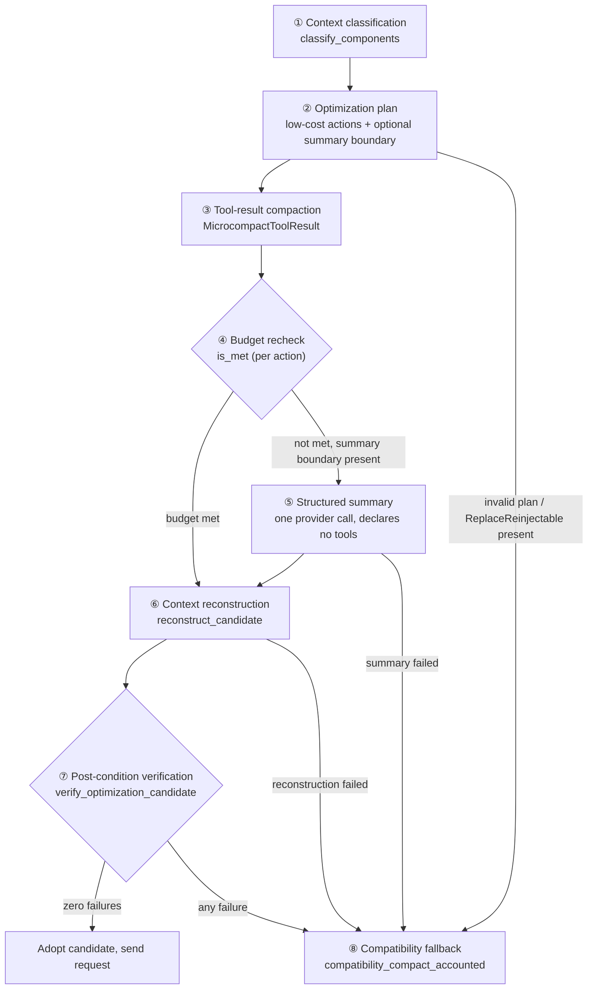

# Context compaction

Context compaction runs only on the **OnePiece native API path** (`agent_runtime/infrastructure/api_process_adapter/`): it is checked once before a generation's first request and once before every round of the tool-use loop. A CLI Agent's internal compaction is performed by the CLI itself; VaneHub neither manages nor measures it.

Compaction is not "hit a threshold, keep the most recent messages, make one model call for a summary, and replace history" — that is only the **compatibility fallback path**. The current implementation is an **optimizer-first** pipeline: classify the context, apply low-cost reductions, re-check the budget after every action, produce a structured summary only when it is still needed, rebuild the context, and pass post-condition verification; only when a stage fails does it fall back to the old summary-style compaction. **Compaction does not necessarily call a model**: when the low-cost actions (tool-result compaction) already meet the budget, the whole compaction makes zero model calls.

## Trigger decision: token-aware primary, character fallback

`select_authoritative_compaction` (`domain/context_compaction_control.rs`) looks only at the token decision's `should_compact: Option<bool>`:

- **`Some(v)`** — adopt v, source `TokenAware`. The threshold is computed in `domain/context_measurement.rs`: `threshold = context_window_tokens − reserve − buffer`, where `reserve = min(maximum_output_tokens, 20_000)` and `buffer = min(context_window / 10, 13_000)`. Note that `Some(false)` does **not** fall through to the character decision — the character result is recorded only as disagreement observability alongside the decision.
- **`None`** (no capacity catalog entry, or no token metering) — adopt the character fallback, source `CharacterFallback`: characters are counted by recursively walking every nested string (so tool results are covered), and the trigger is exceeding `COMPACTION_TRIGGER_CHARACTERS = 60_000`.

Model capacity comes from `model_context_catalog::resolve_capacity(provider, model)`; the runtime never fabricates a capacity or token value.

## Before the trigger: early exit and gates

One early exit runs **before** the gates: with turn count ≤ `COMPACTION_KEEP_RECENT_TURNS = 6`, compaction bypasses as `insufficient-context` — there is nothing reclaimable.

Gates are evaluated in a fixed priority order (`context_compaction_control.rs`):

| Order | `CompactionBypassReason` | Condition |
| --- | --- | --- |
| 1 | `RequestSuppressed` | Request-level `AutomaticCompactionMode::Suppressed` (the channel exists, but no production caller currently sets it; only tests do) |
| 2 | `UserPreferenceSuppressed` | The user disabled automatic compaction in settings (`automaticContextCompactionEnabled`) |
| 3 | `CircuitOpen` | The circuit trips after `AUTOMATIC_COMPACTION_FAILURE_LIMIT = 2` consecutive failures |
| 4 | `Cooldown` | Character growth since the last successful compaction is < `AUTOMATIC_COMPACTION_COOLDOWN_CHARACTERS = 8_192` |

Circuit and cooldown state is **generation-scoped**: rebuilt for every generation (`execution.rs`), never accumulated across generations. A successful compaction resets the failure count and records `last_success_characters`.

## The optimizer pipeline

The primary path, `optimize_compaction_accounted` (`api_process_adapter/compaction.rs`), runs these stages:



- **① Classification** — every context component gets a semantic class (`SemanticClass`, 10 values) and a retention class (`RetentionClass`): `Protected` (system instructions, tool schemas, protocol-incomplete turns), `Verbatim` (current user intent, corrections, the last turn), `Summarizable`, `Microcompactable`, `Reinjectable`, `Discardable`.
- **③ Tool-result compaction** — a ToolResult that is duplicated or ≥ `LARGE_TOOL_RESULT_CHARACTERS = 4_096` characters is replaced by a one-line `[OnePiece compacted tool result] outcome=…; source=<fingerprint>` marker, accounted as 160 kept characters.
- **④ Budget recheck** — after every action, `ContextOptimizationBudget::is_met` re-checks (tokens first, characters otherwise); the target is `min(OPTIMIZER_TARGET_CHARACTERS = 45_000, original characters − 1)`. After compaction a post snapshot recomputes `should_compact` once more.
- **⑤ Structured summary** — issued only when the plan carries a `summary_boundary` (which must be contiguous from round 0). When low-cost actions already meet the budget it is skipped — this is why compaction may make no model call.
- **⑦ Post-condition verification** — `VerificationFailure` has 9 variants: candidate not smaller, target not met, protected content changed, verbatim content changed, component order changed, protocol incomplete, action mismatch, reinjection missing, coverage incomplete — the candidate is adopted only with **zero failures**.

### Two known gaps between the spec and the implementation

The classes and action types exist, but two reduction channels are not enabled on the production path — these are **known gaps**, not documentation omissions:

- **`Discardable` (transient-content removal)** — the action and rebuild logic exist, but the production classifier never emits `Discardable`; the only assignment lives in offline policy-evaluation support.
- **`Reinjectable` (reference-izing re-injectable content)** — `component.reinjectable` is hardcoded `false` in the production projection; the moment a plan contains a `ReplaceReinjectable` action, orchestration abandons the optimizer entirely and falls back (`FallbackReason::ReinjectionUnavailable`), and verification receives an empty required-reinjections list. The authoritative-source re-injection semantics described in `openspec/specs/agent-context-optimization` are **not yet implemented** — do not read the spec as shipped behavior.

## The structured summary

The optimizer path's summary is driven by `STRUCTURED_SUMMARY_PROMPT` (`domain/context_summary.rs`), requiring **exactly eight sections, in order**:

```text
## PRIMARY INTENT
## TECHNICAL CONSTRAINTS
## DECISIONS
## FILES AND CODE AREAS
## ERRORS AND FIXES        (risk information lands here; there is no separate risk section)
## COMPLETED WORK
## PENDING WORK
## IMMEDIATE NEXT ACTION
```

The summary is **machine-validated** (`parse_structured_summary`): empty, oversized (cap `STRUCTURED_SUMMARY_MAX_CHARACTERS = 12_000`), missing section, duplicate section, out-of-order section, and empty section all fail; the version identifier is `onepiece-continuation-summary-v1`.

Three hard constraints on the summary call:

- **It declares no tools** (an empty tools array), so summarization can never spawn a new tool loop;
- **It does not inherit the user's generation options** (`GenerationOptions::disabled()` — no thinking or reasoning depth);
- **Hidden reasoning is stripped first**: `strip_internal_generation_content` removes `thinking`/`reasoning`/`reasoning_content` fields and thinking blocks before feeding the summary model, and the prompt itself forbids including hidden thinking.

**Synthetic context is not real user input.** On reconstruction the summary is inserted as a `role: "user"` turn after the leading system messages, prefixed with the `[OnePiece structured continuation summary: onepiece-continuation-summary-v1]` marker — identifiable, never impersonating a genuine user message.

## The compatibility fallback

Any optimizer stage failure (`FallbackReason`: `InvalidPlan` / `InsufficientReclaimableContext` / `ReductionFailed` / `ReinjectionUnavailable` / `SummaryFailed` / `ReconstructionFailed` / `VerificationFailed`) lands on `compatibility_compact_accounted` — the pre-optimizer summary-only path:

- Keep the most recent `COMPACTION_KEEP_RECENT_TURNS = 6` turns verbatim and make one free-text summary call over the older turns (`SUMMARIZATION_INSTRUCTION` — no structure, no machine validation);
- The synthetic turn is also `role: "user"`, but carries **no** marker prefix;
- This path does **not** strip thinking content before summarizing — a known difference from the optimizer path;
- Therefore when the optimizer's summary fails and the fallback runs, one compaction can make up to **two** summary calls (one optimizer + one fallback) — the spec's "at most once" constrains the optimizer path only.

**Four failure kinds must be kept apart**: optimizer failure (falls back to the compatibility path — not a compaction failure), summary failure (inside the optimizer → fallback; inside the compatibility path → the whole compaction fails), verification failure (fallback), and **fallback failure** (the compatibility path's summary call fails or returns empty → `AutomaticCompactionOutcome::Failed`, `record_failure` counts toward the circuit, and the request is **sent unmodified** while the generation continues). Only a failure to sink the compaction event produces `TerminalFailure` and ends the generation.

## User visibility and observability

- **In-session notice** — every successful compaction inserts a `kind: "card"` rich block (titled "Conversation compacted") containing metrics only: before/after characters and tokens, savings, measurement quality, trigger source, compaction path, policy version — never conversation content.
- **Structured logs** — `agent.context.compaction.control` (trigger source, quality, token threshold, bypass reason, cooldown growth, consecutive failures, circuit state) and `session.runtime.api.context-optimizer` (success/fallback per stage).
- **Usage accounting** — the summary call is billed as `UsagePurpose::ContextCompaction`; the frontend classifies it as internal usage.
- **Quality assessment persistence** — outcome is one of `Compacted/Bypassed/Fallback/Failed`, path `Optimizer/Compatibility`, with 13 reason variants (including `ProviderFailure` and `PersistenceFailure`). Known limitation: on optimizer success the invariant evidence is currently hardcoded all-true rather than mapped from the per-item verification results.
- **Frontend contracts** — the settings toggle lives in the OnePiece compaction settings section (key `automaticContextCompactionEnabled`); the context-health page and manifest inspector surface compaction metrics. **Web/mock** carries a same-shape contract: a 2,000-character mock trigger, a rich block shaped like the desktop one (fixed `compatibility` path, `character-fallback` source, all-null tokens), and no real model call.

## Field ownership (easy to conflate)

- `compaction_triggered: bool` belongs to `ContextEvidenceManifest` (the context-engine evidence manifest), unrelated to the compaction execution path; the production assignment is currently **always `false`** — an unwired field. Do not use it to tell whether compaction happened.
- `reserved_recent_turns: u64` belongs to `ContextBudget` (the context-engine evidence budget); the OnePiece path sets `12_288` (total 32,768, reserved_system 8,192, reserved_task 4,096, reserve 2,048). It is a reserved allowance for **evidence selection** and has nothing to do with the compaction trigger threshold above.

## Where the design lives

The authoritative requirements live in the specs; this chapter describes the current implementation and records the gaps.

- [openspec/specs/agent-context-compaction](../../../openspec/specs/agent-context-compaction/spec.md) — the optimizer-first pipeline, summary constraints, fallback semantics.
- [openspec/specs/agent-context-compaction-control](../../../openspec/specs/agent-context-compaction-control/spec.md) — trigger selection, gates, cooldown, and the circuit.
- [openspec/specs/agent-context-optimization](../../../openspec/specs/agent-context-optimization/spec.md) — classification, actions, verification; its authoritative-source re-injection and transient-reduction sections are **not yet live on the production path** (see the gaps above).

Compaction runs inside the `agent_runtime` bounded context, on the same path as the tool-use loop described in [Tool registry and execution](tool-registry.md). OnePiece automatic memory extraction triggers alongside compaction (currently only on the compatibility fallback path) — see [Cross-session memory](cross-session-memory.md).
