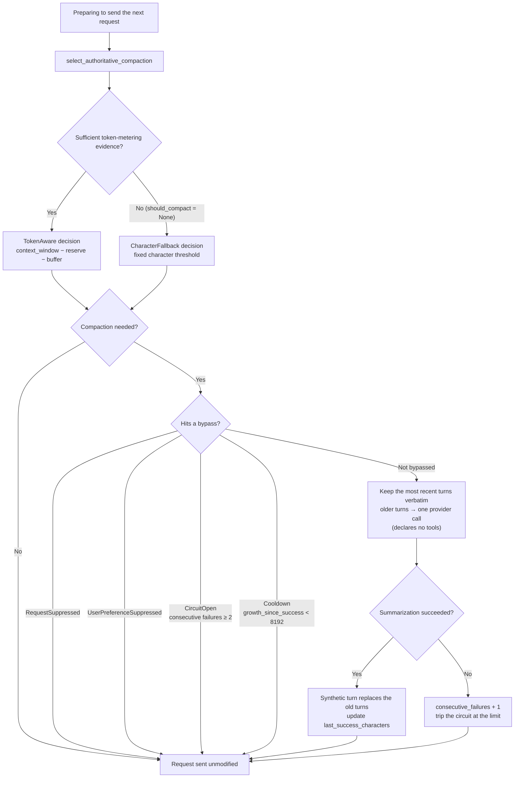

# Context compaction

Context compaction is driven by a **versioned, token-aware decision**: when verifiable evidence of model capacity and token usage is available, hitting the token-occupancy threshold is the authoritative trigger; when that evidence is unavailable or analysis fails, it falls back to a fixed character-count trigger. The runtime compacts before sending the next request, and it never fabricates a capacity or token value.

**Two things in this diagram are easy to read backwards**: `8192` is a **cooldown** threshold, not a trigger threshold — it governs "how much growth since the last successful compaction is required before compacting again." And the summarization call **declares no tools**, so it cannot itself trigger another round of the tool-use loop.

## Trigger priority: token-aware first, character fallback second

`select_authoritative_compaction` (`agent_runtime/domain/context_compaction_control.rs`) decides whether to compact in this order of priority:

- **Token-aware (primary path)** — when token-metering evidence is sufficient, judged against a versioned threshold (`context_window_tokens - reserve - buffer`); `CompactionTriggerSource::TokenAware`.
- **Character fallback** — when token evidence is insufficient (`should_compact = None`), judged against a fixed character-count threshold; `CompactionTriggerSource::CharacterFallback`.

The runtime also records the "disagreement" between the token decision and the character decision, for observability. The spec explicitly requires that the token-aware production decision is the authoritative trigger and character counting is a compatibility fallback — the two must never be reversed.

## When compaction triggers

- The trigger decision is no → the request is sent unmodified.
- The session's conversation history alone already exceeds the threshold → compact before the first request of that generation.
- Turns accumulated during a tool-use loop push the total over the threshold → compact before the loop's next request, so context doesn't grow unbounded mid-loop.

## Summarization compaction

When compaction triggers, the runtime keeps a fixed number of the most recent turns verbatim and replaces all older turns with a single synthetic turn carrying a model-generated summary of them. The summarization call is a **single provider call over the turns older than the kept window, and it declares no tools at all** — summarization itself never triggers a new tool loop.

## Compaction control and cooldown

Automatic compaction is governed by `AutomaticCompactionState` and `AutomaticCompactionMode` (`context_compaction_control.rs`):

- **`AUTOMATIC_COMPACTION_COOLDOWN_CHARACTERS = 8192`** — this is a **cooldown threshold** (not a trigger threshold): character growth since the last successful compaction must exceed this value before compacting again, to avoid compacting too frequently. When `growth_since_success < 8192`, it bypasses with `CompactionBypassReason::Cooldown`.
- **`AutomaticCompactionMode`** — automatic by default; in `Suppressed` mode, compaction never happens automatically even past the threshold, and timing is taken over by the caller (such as the layer driving a long-running tool-use loop).
- **`AutomaticCompactionState`** — records `user_preference_enabled`, `last_success_characters`, `consecutive_failures`, `circuit_open`; the circuit trips and bypasses once consecutive failures reach `AUTOMATIC_COMPACTION_FAILURE_LIMIT` (2).
- **`CompactionBypassReason`** — `RequestSuppressed`, `UserPreferenceSuppressed`, `Cooldown`, `CircuitOpen`.
- **`AUTOMATIC_COMPACTION_POLICY_VERSION = "onepiece-automatic-compaction-control-v1"`** — the versioned decision identifier.

## Key types and where fields actually live

Watch the field ownership; don't conflate these:

- `compaction_triggered: bool` belongs to `ContextEvidenceManifest` (`context_engine.rs`), recording whether a given generation triggered compaction.
- `reserved_recent_turns: u64` belongs to `ContextBudget` (`context_engine.rs`); the OnePiece path sets it to `12_288`. It is a **reserved capacity allowance**, not a turn count: `evidence_budget()` subtracts it (along with `reserved_system`, `reserved_task`, and `reserve`) from `total` via `saturating_sub` to derive how much budget is left for evidence. It is not something on `AutomaticCompactionState`.

## Where the design lives

This chapter orients contributors. The authoritative requirements — the token-aware trigger and the character fallback — live in the specs.

- [openspec/specs/agent-context-compaction](../../../openspec/specs/agent-context-compaction/spec.md)
- [openspec/specs/agent-context-compaction-control](../../../openspec/specs/agent-context-compaction-control/spec.md)

Compaction runs in the `agent_runtime` bounded context, in the same path as the tool-use loop described in [Tool registry and execution](tool-registry.md).
