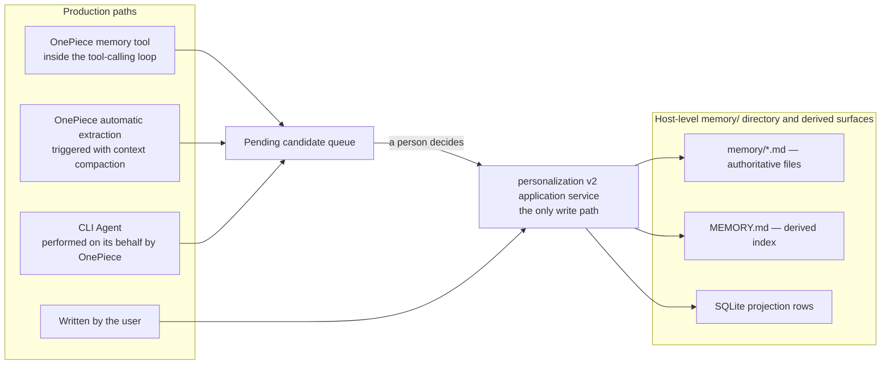
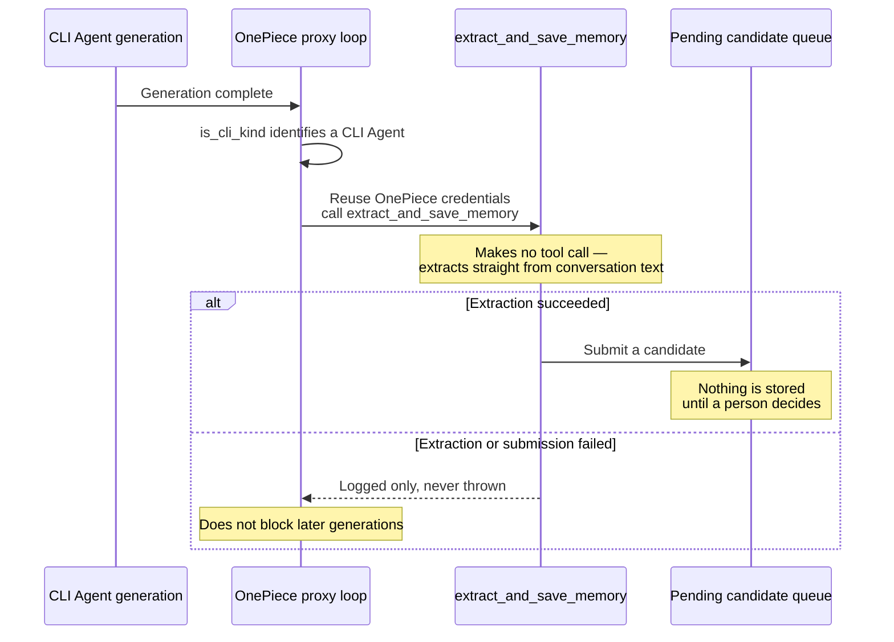

# Cross-session memory

Stored memories are a host-level pool shared by every Agent — OnePiece and all CLI-wrapped Agents (`claude-code`, `codex-cli`, `gemini-cli`, `opencode`, `antigravity-cli`) alike — but sharing is now a **default, not a rule**: each memory carries a scope and an audience. Governance of both lives in [Personalization governance](personalization-governance.md); this chapter covers the persistence half. The recall/search path is covered in [Retrieval and vector search](retrieval.md).

## Shared by default, narrowable per memory

Every memory records the Agent that produced it and the workspace it was produced in. Two of those facts are now load-bearing rather than decorative:

- **Scope** — `global` or one workspace. A workspace-scoped memory is not resolved for a caller that names no workspace.
- **Audience** — every Agent by default, or only the Agent ids named on the record.

Provenance is still recorded separately from both: **"recorded by" is not "readable by"**. A memory one Agent produced can be readable only by another, and neither field is exposed as recall tool input.

A memory saved in a session with no workspace folder is saved as `global` rather than rejected, and is readable from any workspace or none.

## Saving memories

- **OnePiece** exposes a memory tool to its own API tool-calling loop. What that tool produces is a **candidate**, not an active record — automatic paths propose, and a person decides.
- **CLI-wrapped Agents** do not expose this tool, because VaneHub does not control a CLI-wrapped Agent's own internal tool system. They produce candidates through the separate automatic-extraction mechanism, which rides on context compaction.
- **A memory the user writes themselves** is active immediately: the author is a person, so there is nobody left to review it.

Extraction for CLI-wrapped Agents runs through OnePiece's provider, because those CLIs expose no reusable model credentials. With no provider configured for OnePiece, they produce no extraction at all.

## Memory storage and how memories are produced

Memories land on disk as files in a host-level shared `memory/` directory, summarized by a `MEMORY.md` index file. **The file is the authoritative surface**; the SQLite projection row, the `MEMORY.md` index, and the retrieval entry are all derived and rebuildable. See [Personalization governance](personalization-governance.md#memory-which-surface-is-authoritative).

There is now exactly one production write path: the v2 application service in the `personalization` context. The old `FileAgentMemoryStore` is no longer attached to any write port, so the directory has one owner. The single `list_all` it retains is an explicitly named maintenance enumeration, used by the row-store conversion to read the source it is converting. A generic file tool **must not** write into this directory: bypassing the application service is exactly what lets the projection, the index, and the retrieval entry drift apart.

The flow below shows how the three production paths converge on one store. Note that the two automatic paths **stop at the review queue** — only a human decision writes an active record.

CLI-wrapped Agents (`claude-code`, `codex-cli`, `gemini-cli`, `opencode`, `antigravity-cli`) expose no memory-saving tool of their own, because VaneHub AI does not control their internal tool systems. Their memories are extracted on their behalf by OnePiece when a generation ends, reusing OnePiece's existing provider credentials and extraction logic, transparently to the CLI Agent. The sequence below shows that path, whose two load-bearing constraints are that **extraction only submits candidates** and that **every failure is logged and never blocks a generation**.

The `provenance` field on each memory record (`agent_id`, `folder`, `source`, `created_at`) carries **origin**: which Agent produced this memory, in which workspace folder, along which path, and when. It exists for tracing and display filtering and **does not decide who may read it** — that is decided by the separate scope and audience on the record. Treating "who recorded it" as "who may read it" is exactly the equivalence this governance work ends: two memories recorded by the same Agent can perfectly well have different audiences.

## Key types and constants

### The storage model

The memory store is a host-level shared `memory/` directory, not database rows. **The file is the authoritative surface**, with one `{id}.md` file per memory. The id is generated by the store rather than derived from the name — v2 allows duplicate names, and using the name as the filename would make two identically named memories overwrite each other. The `MEMORY.md` index, the SQLite projection rows, and the retrieval entries are derived surfaces rebuilt from the files.

### MemoryMetadata frontmatter

Each memory file's frontmatter parses into `MemoryMetadata`, with fields for `name` (a human-readable display name that may change; **not** the filename — the filename is the immutable `{id}.md` described above), `description` (a summary), `memory_type` (a closed set of four values — `user`, `feedback`, `project`, `reference` — where a missing or unknown value degrades to `untyped` rather than rejecting the write or the read), and `provenance` origin metadata (`agent_id`, `folder`, `source`, `created_at`, plus `migrated_from` in migration cases). Frontmatter is read from a window of at most `MAX_FRONTMATTER_LINES = 30` lines, so a whole body is never parsed as frontmatter.

### Enumeration and production paths

Enumeration after governance is paginated and deliberately **does not reuse the old `MAX_SCANNED_FILES = 200` scan**, which now survives only on the legacy directory reader. Migration, reset, and repair all go through explicitly named maintenance queries, because otherwise a store holding more than 200 memories would be silently truncated. All three automatic production paths submit candidates only:

- **The OnePiece memory tool** — the tool name constant is `REMEMBER_TOOL_NAME = "remember"`, exposed inside OnePiece's own API tool-calling loop. What it produces is a pending candidate, not an active record.
- **OnePiece automatic extraction** — triggered along with context compaction (`extract_memories_accounted`), producing at most `MAX_MEMORY_ACTIONS = 10` memory actions per compaction, truncating beyond that.
- **CLI Agents, performed by OnePiece** — `extract_and_save_memory` reuses the credentials and extraction logic of `ONEPIECE_AGENT_ID = "onepiece"`, makes no tool call, extracts straight from conversation text, and is transparent to the CLI Agent.

The fourth path is the one the user writes themselves: the author is a person, so it enters active memory directly.

### Injection bounds

Memory injection has two budgets, chosen by caller. `ONEPIECE_MEMORY_INDEX_BOUNDS` is `lines: 200, bytes: 12_000`, and an OnePiece caller additionally injects each memory's `body`. `CLI_MEMORY_INDEX_BOUNDS` is `lines: 40, bytes: 3_000`, and a CLI caller injects index lines only, without the `body`. The separation is deliberate: OnePiece's index is assembled once per generation and amortized across that generation's whole tool loop, while a CLI-wrapped Agent's index is prepended to every message handed to a subprocess whose own context budget VaneHub AI neither controls nor measures.

At injection time at most `MAX_SELECTED_MEMORIES = 5` memories are selected. Every failure is logged and never blocks a delivered generation result — memory is an enhancement rather than a requirement, so neither an extraction nor an injection failure should affect the main path.

## Where the design lives

This chapter orients contributors. The authoritative requirements live in the specs.

- [openspec/specs/unified-personalization-governance](../../../openspec/specs/unified-personalization-governance/spec.md) — scope, audience, candidate review, and migration.
- [openspec/specs/agent-cross-session-memory](../../../openspec/specs/agent-cross-session-memory/spec.md) — the pool, provenance, and the saving paths.
- [openspec/specs/retrieval-vector-search](../../../openspec/specs/retrieval-vector-search/spec.md) — the recall tool and degradation.

Memory persistence and governance live in the `personalization` bounded context; recall lives in `retrieval`. See [Native bounded contexts](native-contexts.md).
