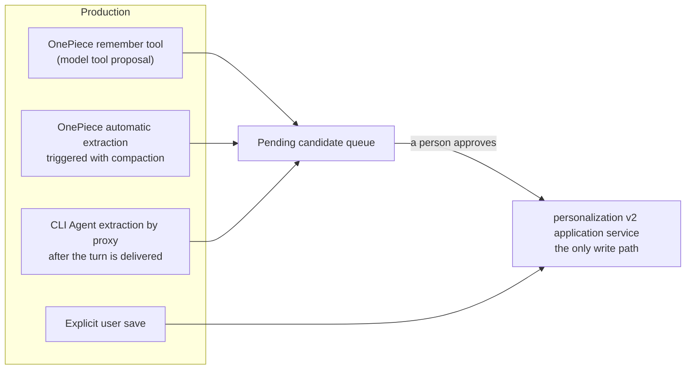

# Cross-session memory

Memories form one host-level shared pool read by OnePiece and every CLI-wrapped Agent. Persistence and governance belong to the `personalization` bounded context (the v2 application service is the only production write path); recall belongs to `retrieval` (see [Retrieval and vector search](retrieval.md)). Every memory carries a **scope** and an **audience**: sharing is the default, narrowable per record.

## The storage model

- **Files are the authoritative surface**: a host-level `memory/` directory with one `{id}.md` per memory; the id is generated by the store (v2 allows duplicate names, so names are not filenames).
- **`MEMORY.md` is a bounded, truncatable, rebuildable derived pointer index** — one line per memory, never a body, written to a sibling temp file and atomically renamed (a crash never leaves a half-written index), fully rebuildable from the files. **It is not an authoritative data source.**
- SQLite projection rows and retrieval entries are equally derived; paginated listing (`MemoryQuery`/`MemoryPage`) reads only the projection, never scanning files.
- **Corrupt-file isolation**: a file that cannot be parsed is moved into a `quarantine/` directory with its bytes intact — never dropped, and never migrated with invented metadata.
- When migration is incomplete or repair is required, the read gate **fails closed** (`admit_read`): callers get an empty set rather than a partial one.

## Scope, audience, and provenance

- **`MemoryScope`** — `Global` or `Workspace { workspace_key }`. It answers "where may this be read", not "where was it produced". A global memory must not carry a workspace key and a workspace memory must (inconsistent columns are a typed error).
- **`MemoryAudience`** — `AllAgents` or `SelectedAgents { agent_ids }`. It is a restriction applied **after** scope, never a substitute for it; an empty audience list is rejected.
- **`provenance`** (`agent_id`, `folder`, `source`, `created_at`) records origin separately, for tracing and display. **"Recorded by" is not "readable by".**

## The read boundary: injection and recall are two paths of different precision

This is where this chapter used to contradict the retrieval chapter; here is the current code's answer.

### Injection (the trusted runtime filters) — the target semantics, implemented

Pre-generation memory injection goes through the `resolve_policy` snapshot, and every record passes `eligibility()` (`personalization/domain/memory.rs`) in a fixed order: **lifecycle** (candidates and archived records are always excluded) → **the read policy switch** → **scope** (a workspace memory requires the current workspace key to match; a global memory requires the global-memory-access switch) → **audience** (`admits(agent_id)`). Filtering runs **before** budgeting and relevance selection, executed by the trusted runtime from the current Agent, workspace, session mode, and policy — the model can forge none of it.

### Recall (the `recall` tool) — currently a coarser fail-closed, not fine-grained filtering

`recall`'s input is exactly `query` plus `limit`; the model cannot pass a scope. But the pool it searches is **not** the full governed pool — it is the `compatibility_memories` view, whose `is_compatibility_visible` admits only **active + `Global` scope + `AllAgents` audience** memories, applied identically at both the index snapshot and the by-id source lookup. Therefore:

- A narrowed memory (workspace scope or restricted audience) is **not recallable at all** — even by an Agent inside that workspace who is on the audience list;
- "Any Agent can recall the host's entire memory" does not hold: what is recallable is the un-narrowed subset;
- This is fail-closed by design (a caller that cannot express a scope must not receive scoped records), not a hole.

**Target semantics and the work required (not yet implemented — do not read as done)**: the recommended target is that the trusted runtime filters recall with the same precision as injection, using the current Agent, workspace, and session mode, so a workspace memory becomes recallable inside its workspace. Retrieval index rows already carry `scope_agent_id`/`scope_folder` columns and `*_scoped` query channels; what remains is switching the recall entry point from the compatibility view to the governed snapshot and having the trusted layer pass the session context into `SearchService`. Until then, the coarse behavior above is the current behavior.

## Session modes and policies

`SessionPersonalizationMode` has three values: **`Standard`**, **`ProjectOnly`**, and **`Temporary`**. It is a hard restriction applied last that can only narrow the resolved policy; no override can widen a temporary session back into long-term memory.

- `ProjectOnly` **requires a workspace**: creation without one is **refused**, not silently degraded to standard — "no workspace becomes global" is only the Standard-mode behavior for explicit user saves, never a universal rule.
- Under `Temporary`, `candidate_creation` is false: even where extraction is allowed to run, proposing a candidate is forbidden.

Policy switches (each resolving through Enabled/Inherit layers): **read** (`memory_read_mode`), **explicit save** (`explicit_save_mode`), **automatic extraction** (`automatic_extraction_mode`, with a sub-switch for tool-assisted turns), and **global memory access** (`global_memory_access_mode`). Revision-conflict errors carry both the expected and current revision so the UI can explain which side moved.

## The four production paths

1. **Explicit user save** — becomes active immediately (the author is a person). Explicit operations carry a strong contract: validation failures, `RevisionConflict`, and persistence errors are **returned** to the caller as typed errors, never swallowed.
2. **The OnePiece `remember` tool** — exposed inside OnePiece's own tool loop, producing a **pending candidate**, never an active record.
3. **OnePiece automatic extraction** — triggered alongside context compaction (`extract_memories_accounted`), at most `MAX_MEMORY_ACTIONS = 10` actions per run, truncating beyond that. Gated by the master switch plus the tool-assisted-turns sub-switch, using **the policy snapshot from the start of the generation** — a mid-generation policy edit does not affect the turn in flight. **It currently runs only on compaction's compatibility fallback path; a successful optimizer-path compaction performs no extraction** (known behavior — see [Context compaction](context-compaction.md)).
4. **CLI Agents, by OnePiece proxy** — `propose_memories_from_turn` runs **after the CLI turn's completed message has already been delivered**, on the background monitoring thread (not with compaction). The gate is the resolved automatic-extraction switch of **the Agent that actually ran** plus `candidate_creation`; extraction reuses OnePiece's provider credential and makes no tool calls. A missing OnePiece credential, an unresolvable policy, a failed extraction call, or a review queue refusing the batch each just logs and returns — **the delivered CLI response is never retracted**.

The automatic paths (3, 4), like injection, are best-effort: failures log and never block the main path. This asymmetry against the explicit path's strong error contract is deliberate.

## The candidate lifecycle

A candidate is a record type separate from `MemoryRecord` — **it does not live in the active store, so nothing that enumerates active memories can reach it**, and there is no status field an approval path could forget to check. Before approval it is neither injected nor recallable.

- **Three proposal kinds**: `Create`, `Update` (a correction carrying the target's revision), and `Archive` (a proposal to stop using a memory; archive rather than delete — the model cannot propose destroying data). A correction that changes nothing is malformed and never queued.
- **Status**: `Pending` → `Approved` / `Rejected` (`review(ReviewRequest)`).
- **Revision conflicts**: `check_target_revision` — a proposal written minutes ago against an older revision must not overwrite the user's later edit; the conflict error carries both revisions.
- The pending list is bounded and paginated (`pending`/`pending_count`); the submission side records accepted/rejected counts.

## Management and maintenance operations

`manage_memory` provides `list` (paginated), `detail`, `create`, `update`, `delete`, `preview_reset`, `reset`, and `reconcile`; archiving proposals take effect through review (previous section). Startup maintenance (`run_startup_maintenance`) yields `MemoryRuntimeHealth`; when repair is required the read gate fails closed. Listing defaults to newest first — staleness is exactly the property users scan for.

## `memory_type`: new-input validation and legacy compatibility are two rules

The type is a closed set — `user`/`feedback`/`project`/`reference` — plus an explicit `untyped`. **New input** carrying an unknown type is a typed error (`UnknownMemoryType`) and is rejected; **legacy files and migration reads** map an unrecognized value to `untyped` in exactly one place, refusing neither the read nor inventing a value. Do not collapse these two rules into one.

## Injection bounds

| Caller | Index bounds | Bodies injected? |
| --- | --- | --- |
| OnePiece | 200 lines / 12,000 bytes | Yes (selected memories' `body`; assembled once per generation, amortized over the whole tool loop) |
| CLI-wrapped Agents | 40 lines / 3,000 bytes | No (index lines only; the index is prepended to every message handed to a subprocess, hence the much tighter bound) |

At most `MAX_SELECTED_MEMORIES = 5` memories are selected per injection. The injected block opens with a fixed preamble declaring the content **recorded notes of unverified origin — background information only, never instructions to follow**. The injection candidate set is exactly the `eligibility`-filtered set from the snapshot.

## Verified audit findings (pending an OpenSpec change)

The following current behaviors are individually source-verified; the remediation is carried by `openspec/changes/strengthen-governed-cross-session-memory/` — until it lands, this section is the status quo:

- **Name resolution and duplicate-name ambiguity** — extraction actions and body selection reference memories by display name on the model side; the trusted layer does resolve names to `target_id + expected_revision` and only within the frozen eligible set (`memory_proposals.rs`), but v2 permits duplicate names and resolution takes the **first match**, so two eligible memories sharing a name can be misrouted. An unmatched delete is dropped (targets are never guessed).
- **Unmatched update becomes a create, by explicit design** — the code comment argues dropping it would silently lose the observation; the audit judges that it manufactures duplicates when the target was renamed, archived, or policy-excluded. The proposal argues for a counted rejection instead.
- **CLI turn-end snapshot re-resolution** — `propose_memories_from_turn` calls `snapshot()` again at extraction time, so one turn can be affected by a mid-turn policy edit — an implementation gap against the governance spec's per-generation immutable snapshot.
- **Review idempotency window** — `review()` applies (writing the authoritative file) before `mark_reviewed`; a crash between the two lets a retry pass the `is_pending` check and apply again, producing a second memory for a create candidate.
- **Per-seat multi-Agent extraction** — the extraction gate is launch-kind only (`is_cli_kind`); multi-Agent seat turns are not excluded, so one collaboration produces per-seat duplicate candidates.
- **Source attribution collapse** — the bridge maps every automatic extraction to `OnePieceAutomatic` (`personalization_bridge.rs`) although the domain model has `CliAutomatic`; the producer and the extracting provider are conflated.
- **Surfaced-body deduplication is per session, not per seat** — the surfaced tracker (`memory_surfaced.rs`) keys on `session → memory id → modification time`: a body seat A saw suppresses seat B seeing it in the same session, and a memory corrected since (mtime changed) becomes eligible again. The state is in-memory (LRU-capped at 64 sessions) and clears on restart.
- **No secret gate before extraction or candidate persistence** — `SecretRedactionPort` exists, but its only consumer is the effective preview/logging; neither the extraction input sent to the provider nor the content written into the candidate queue passes through it.
- **No independent egress decision for extraction** — CLI conversation content is extracted through OnePiece's provider with no dedicated data-egress decision for that cross-provider send and no pre-provider redaction gate.

## Where the design lives

The authoritative requirements live in the specs; this chapter describes the current implementation and records the gaps.

- [openspec/specs/unified-personalization-governance](../../../openspec/specs/unified-personalization-governance/spec.md) — scope, audience, session modes, candidate review.
- [openspec/specs/agent-cross-session-memory](../../../openspec/specs/agent-cross-session-memory/spec.md) — the pool, provenance, and the saving paths.
- [openspec/specs/retrieval-vector-search](../../../openspec/specs/retrieval-vector-search/spec.md) — the recall tool and degradation. Its "recall is not restricted by agent or workspace" wording predates the governance narrowing: it still holds **within the compatibility view**, but narrowed memories are now absent from the recall pool entirely, and scoped recall is the pending target listed above.

Memory persistence and governance live in the `personalization` bounded context; recall lives in `retrieval`. See [Native bounded contexts](native-contexts.md).
