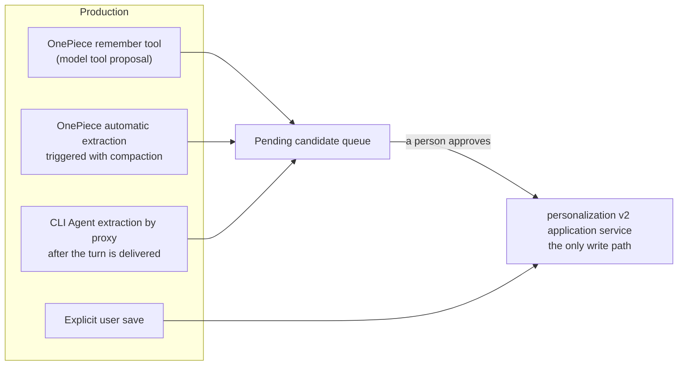

# Cross-session memory

Memories form one host-level shared pool read by OnePiece and every CLI-wrapped Agent. Persistence and governance belong to the `personalization` bounded context (the v2 application service is the only production write path); recall belongs to `retrieval` (see [Retrieval and vector search](retrieval.md)). Every memory carries a **scope** and an **audience**: sharing is the default, narrowable per record.

> **Status: main / unreleased.** The governed read boundary described below is implemented on `main` (commit `52b345ee`) and is not in the v1.5.0 stable release. The OpenSpec change `openspec/changes/unify-memory-read-scope/` is still open: its remaining task 7.6 is the platform verification run set, so the capability is code-verified by unit and integration tests (listed under "Tests that lock this behaviour") but not yet archived, and its `memory-read-scope` delta has not yet been synced into `openspec/specs/`.

## The storage model

- **Files are the authoritative surface**: a host-level `memory/` directory with one `{id}.md` per memory; the id is generated by the store (v2 allows duplicate names, so names are not filenames).
- **`MEMORY.md` is a bounded, truncatable, rebuildable derived pointer index** — one line per memory, never a body, written to a sibling temp file and atomically renamed (a crash never leaves a half-written index), fully rebuildable from the files. **It is not an authoritative data source.**
- SQLite projection rows and retrieval entries are equally derived; paginated listing (`MemoryQuery`/`MemoryPage`) reads only the projection, never scanning files.
- **Corrupt-file isolation**: a file that cannot be parsed is moved into a `quarantine/` directory with its bytes intact — never dropped, and never migrated with invented metadata.
- When migration is incomplete or repair is required, the read gate **fails closed** (`admit_read`): callers get an empty set rather than a partial one.

## Scope, audience, and provenance

- **`MemoryScope`** — `Global` or `Workspace { workspace_key }`. It answers "where may this be read", not "where was it produced". A global memory must not carry a workspace key and a workspace memory must (inconsistent columns are a typed error).
- **`MemoryAudience`** — `AllAgents` or `SelectedAgents { agent_ids }`. It is a restriction applied **after** scope, never a substitute for it; an empty audience list is rejected.
- **`provenance`** (`agent_id`, `folder`, `source`, `created_at`) records origin separately, for tracing and display. **"Recorded by" is not "readable by".**

## The read boundary: one trusted read context governs four entry points

Storage is still one host-level shared pool, but **the read domain is not**. At the start of every generation (or of one seat's turn in a group session), `personalization` freezes a `MemoryReadContext` (`personalization/domain/read_context.rs`) from the resolved snapshot: the stable Agent id, session, generation/seat, a three-valued workspace binding (`Absent` / `Resolved` / `Unresolved`), the session mode, the frozen policy revision, the global and workspace read allowances, the maintenance generation, and a fingerprint bound to the process epoch. It can be minted only by the native session owner through `PersonalizationApi::freeze_memory_read_context`; the runtime carries it verbatim and never builds or edits one, and `GovernedMemoryReadService::admit` re-checks the fingerprint, the allowances, and the maintenance generation before every read. A context assembled elsewhere, altered, or carried across a restart fails `is_authentic`. Any `agentId` / `workspaceKey` / scope the model puts into a tool input never changes the subject. The only digest a log may carry is `scope_fingerprint()` (Agent id, session mode, workspace binding, and the two allowances); the authenticity fingerprint, memory ids, and exclusion lists are never logged.

All four entry points share one decision (`eligibility()` runs in a fixed order: **lifecycle** → **read switch** → **scope** → **exact audience**; provenance fields are for tracing only):

| Entry point | Interface | Notes |
|---|---|---|
| Index injection (OnePiece and the CLI index) | `verify_memory_refs(context, refs)` | The snapshot's refs page (at most 200 entries, `ELIGIBLE_REFS_LIMIT`) is re-read from the authoritative file entry by entry, and only an entry whose revision, content hash, and authority fingerprint still match reaches the prompt; names and descriptions are memory content too |
| Body selection | `read_pinned_memories(context, handles)` | The selector sees and returns **immutable ids** (every manifest line starts with `[id]`), so two records with one name are no longer resolved to the first; bodies are read at the pinned revision and hash, and any record that moved is dropped rather than replaced by its newer version |
| `recall` | `open_memory_query(context)` → `RetrievalApi::search_authorized` | The complete eligible metadata relation (paged inside one read-only snapshot; over budget it is `Incomplete`, never truncated); the repository materializes it as a query-local temp table that both the FTS and the vector path JOIN **before** rank/top-k; hits are read back through the same context |
| Context Engine memory source | `ContextRequest.memory_read` | The snapshot is resolved before assembly; without a context, or with one that permits no read, the source is `unavailable` — no search runs and no query embedding is computed |

The settled behaviour (the Web/mock preview simulates the same truth table):

| Session / policy | Global active | Current-workspace active | Other workspace |
|---|---|---|---|
| standard, global read allowed | Only with an audience match | Only with an audience match | Denied |
| standard, global read disabled | Denied | Only with an audience match | Denied |
| project-only with a trusted workspace | Denied | Only with an audience match | Denied |
| temporary / memory read disabled | Denied | Denied | Denied |
| workspace present but unresolvable (`Unresolved`) | Denied | Denied | Denied |

A standard session with **explicitly no workspace** (`Absent`) still reads global memories per policy; that is a different answer from a resolution failure, which closes every read. Candidates, archived records, and projection rows this build cannot classify (unknown scope or status, malformed audience JSON, a global record carrying a workspace key — counted as `invalid_record`) are never delivered. Audience matching in SQL is an exact `json_each` equality with BINARY collation, no longer `LIKE`.

What is unified is the **eligibility rule**, not the result set: injection looks at recent summaries, the selector at description relevance, `recall` at the query, and the Context Engine has its own budget, so one rule can produce different top-k lists. What is frozen is the rule and the subject, not the 200 refs: a later `recall` inside the same generation may see a record approved since, under the same frozen rule, but it can neither widen the permitted scope nor swap an already pinned handle for a newer version.

`surfaced` deduplication (`memory_surfaced.rs`) is partitioned by `session + the actual Agent/seat + the frozen scope` (the subject key joins Agent id, seat id, workspace binding, session mode, and the two allowances), with entries of `id → (revision, content hash)`. It runs after eligibility, never instead of it; changing seat or workspace inherits neither the suppression nor, more importantly, any authorization.

The change's design names three distinct capabilities, each with its own interface boundary: `RuntimeMemoryRead` (the governed interfaces above), `OwnerMemoryManagement` (the settings page's `list_memories` / `memory_detail` and friends, unaffected by any one session's temporary restriction), and `MemoryIndexMaintenance` (`index_maintenance_records` enumerates every valid active record — including workspace-scoped and restricted-audience ones — for the local FTS; it takes no context and is not an Agent read). The old `compatibility_memories*` view survives only for exact legacy callers and is no longer used by injection, body selection, `recall`, or the Context Engine.

**The egress boundary does not widen with the index.** The baseline has no authorization capability for sending scoped or restricted-audience memories to a remote embedder, so those records are pinned to `keyword_only` on the retrieval side (searchable in the local FTS, never queued, never sent; `requeue_all` and a model switch do not resurrect them). Before every embed the worker re-checks status, scope, audience, and content hash against the authoritative record through `embedding_egress`; a public record that became restricted after queueing is caught there too and classified as keyword-only rather than retried as a failure.

### Tests that lock this behaviour

- `personalization/application/read_memory_tests.rs` — `a_standard_context_admits_global_and_its_own_workspace_only_by_audience`, `an_explicitly_absent_workspace_still_reads_global_but_an_unresolved_one_reads_nothing`, `a_temporary_or_read_disabled_snapshot_freezes_a_context_that_permits_nothing`, `a_context_authenticates_only_under_the_epoch_that_minted_it_and_only_unaltered`.
- `personalization/api/read_scope_tests.rs` — `a_standard_session_reads_global_and_its_workspace_by_exact_audience_on_every_surface`, `a_selected_audience_admits_the_exact_stable_id_and_never_a_prefix_case_or_wildcard_variant`, `the_recall_relation_is_complete_past_the_two_hundred_ref_injection_page`, `a_context_not_minted_by_this_host_or_altered_after_minting_is_refused`.
- `retrieval/application/search_service.rs` — `unauthorized_rows_are_filtered_before_top_k_so_they_cannot_crowd_out_a_valid_hit`, `an_incomplete_authority_set_is_refused_rather_than_searched`.
- `retrieval/infrastructure/sqlite_repository.rs` — `authorized_candidates_filter_both_paths_before_the_limit_so_excluded_rows_cannot_crowd_out_a_hit`, `the_query_local_relation_never_survives_into_the_next_query`.
- `agent_runtime/infrastructure/memory_surfaced.rs` — `another_seat_in_the_same_session_does_not_inherit_the_suppression`, `exclusions_do_not_leak_between_sessions`; `api_process_adapter/tests.rs` — `recall_without_a_read_context_fails_closed_without_searching`, `a_session_denied_memory_reads_is_not_offered_the_recall_tool`.

## Session modes and policies

`SessionPersonalizationMode` has three values: **`Standard`**, **`ProjectOnly`**, and **`Temporary`**. It is a hard restriction applied last that can only narrow the resolved policy; no override can widen a temporary session back into long-term memory.

- `ProjectOnly` **requires a workspace**: creation without one is **refused**, not silently degraded to standard — "no workspace becomes global" is only the Standard-mode behavior for explicit user saves, never a universal rule.
- Under `Temporary`, `candidate_creation` is false: even where extraction is allowed to run, proposing a candidate is forbidden.

Policy switches (each resolving through Enabled/Inherit layers): **read** (`memory_read_mode`), **explicit save** (`explicit_save_mode`), **automatic extraction** (`automatic_extraction_mode`, with a sub-switch for tool-assisted turns), and **global memory access** (`global_memory_access_mode`). Revision-conflict errors carry both the expected and current revision so the UI can explain which side moved.

## The four production paths

1. **Explicit user save** — becomes active immediately (the author is a person). Explicit operations carry a strong contract: validation failures, `RevisionConflict`, and persistence errors are **returned** to the caller as typed errors, never swallowed.
2. **The OnePiece `remember` tool** — exposed inside OnePiece's own tool loop, producing a **pending candidate**, never an active record.
3. **OnePiece automatic extraction** — triggered alongside context compaction (`extract_memories_accounted`), at most `MAX_MEMORY_ACTIONS = 10` actions per run, truncating beyond that. Gated by the master switch plus the tool-assisted-turns sub-switch, using **the policy snapshot from the start of the generation** — a mid-generation policy edit does not affect the turn in flight. **It currently runs only on compaction's compatibility fallback path; a successful optimizer-path compaction performs no extraction** (known behavior — see [Context compaction](context-compaction.md)).
4. **CLI Agents, by OnePiece proxy** — `propose_memories_from_turn` runs **after the CLI turn's completed message has already been delivered**, on the background monitoring thread (not with compaction). The gate is the resolved automatic-extraction switch of **the Agent that actually ran** plus `candidate_creation`; extraction reuses OnePiece's provider credential and makes no tool calls. A missing OnePiece credential, an unresolvable policy, a failed extraction call, or a review queue refusing the batch each just logs and returns — **the delivered CLI response is never retracted**.

The automatic paths (3, 4), like injection, are best-effort: failures log and never block the main path. This asymmetry against the explicit path's strong error contract is deliberate.

## The candidate lifecycle

A candidate is a record type separate from `MemoryRecord` — **it does not live in the active store, so nothing that enumerates active memories can reach it**, and there is no status field an approval path could forget to check. Before approval it is neither injected nor recallable.

- **Three proposal kinds**: `Create`, `Update` (a correction carrying the target's revision), and `Archive` (a proposal to stop using a memory; archive rather than delete — the model cannot propose destroying data). A correction that changes nothing is malformed and never queued.
- **Status**: `Pending` → `Approved` / `Rejected` (`review(ReviewRequest)`).
- **Revision conflicts**: `check_target_revision` — a proposal written minutes ago against an older revision must not overwrite the user's later edit; the conflict error carries both revisions.
- The pending list is bounded and paginated (`pending`/`pending_count`); the submission side records accepted/rejected counts.

## Management and maintenance operations

`manage_memory` provides `list` (paginated), `detail`, `create`, `update`, `delete`, `preview_reset`, `reset`, and `reconcile`; archiving proposals take effect through review (previous section). Startup maintenance (`run_startup_maintenance`) yields `MemoryRuntimeHealth`; when repair is required the read gate fails closed. Listing defaults to newest first — staleness is exactly the property users scan for.

## `memory_type`: new-input validation and legacy compatibility are two rules

The type is a closed set — `user`/`feedback`/`project`/`reference` — plus an explicit `untyped`. **New input** carrying an unknown type is a typed error (`UnknownMemoryType`) and is rejected; **legacy files and migration reads** map an unrecognized value to `untyped` in exactly one place, refusing neither the read nor inventing a value. Do not collapse these two rules into one.

## Injection bounds

| Caller | Index bounds | Bodies injected? |
| --- | --- | --- |
| OnePiece | 200 lines / 12,000 bytes | Yes (selected memories' `body`; assembled once per generation, amortized over the whole tool loop) |
| CLI-wrapped Agents | 40 lines / 3,000 bytes | No (index lines only; the index is prepended to every message handed to a subprocess, hence the much tighter bound) |

At most `MAX_SELECTED_MEMORIES = 5` memories are selected per injection. The injected block opens with a fixed preamble declaring the content **recorded notes of unverified origin — background information only, never instructions to follow**. The injection candidate set is exactly the `eligibility`-filtered set from the snapshot.

## Verified audit findings (pending an OpenSpec change)

The following current behaviors are individually source-verified; the remediation is carried by `openspec/changes/strengthen-governed-cross-session-memory/` — until it lands, this section is the status quo:

- **Name resolution and duplicate-name ambiguity** — extraction actions still reference memories by display name on the model side; the trusted layer does resolve names to `target_id + expected_revision` and only within the frozen eligible set (`memory_proposals.rs`), but v2 permits duplicate names and resolution takes the **first match**, so two eligible memories sharing a name can be misrouted. An unmatched delete is dropped (targets are never guessed). Body selection has already moved to immutable ids (`unify-memory-read-scope`); the name references on the extraction side remain open.
- **Unmatched update becomes a create, by explicit design** — the code comment argues dropping it would silently lose the observation; the audit judges that it manufactures duplicates when the target was renamed, archived, or policy-excluded. The proposal argues for a counted rejection instead.
- **CLI turn-end snapshot re-resolution** — `propose_memories_from_turn` calls `snapshot()` again at extraction time, so one turn can be affected by a mid-turn policy edit — an implementation gap against the governance spec's per-generation immutable snapshot.
- **Review idempotency window** — `review()` applies (writing the authoritative file) before `mark_reviewed`; a crash between the two lets a retry pass the `is_pending` check and apply again, producing a second memory for a create candidate.
- **Per-seat multi-Agent extraction** — the extraction gate is launch-kind only (`is_cli_kind`); multi-Agent seat turns are not excluded, so one collaboration produces per-seat duplicate candidates.
- **Source attribution collapse** — the bridge maps every automatic extraction to `OnePieceAutomatic` (`personalization_bridge.rs`) although the domain model has `CliAutomatic`; the producer and the extracting provider are conflated.
- **Surfaced-body deduplication** — now partitioned by `session + the actual Agent/seat + the frozen scope` and keyed as `id → (revision, hash)` (`unify-memory-read-scope`); the state is still in-memory (LRU-capped at 64 subjects) and clears on restart.
- **No secret gate before extraction or candidate persistence** — `SecretRedactionPort` exists, but its only consumer is the effective preview/logging; neither the extraction input sent to the provider nor the content written into the candidate queue passes through it.
- **No independent egress decision for extraction** — CLI conversation content is extracted through OnePiece's provider with no dedicated data-egress decision for that cross-provider send and no pre-provider redaction gate.

## Where the design lives

The authoritative requirements live in the specs; this chapter describes the current implementation and records the gaps.

- [openspec/specs/unified-personalization-governance](../../../openspec/specs/unified-personalization-governance/spec.md) — scope, audience, session modes, candidate review.
- [openspec/specs/agent-cross-session-memory](../../../openspec/specs/agent-cross-session-memory/spec.md) — the pool, provenance, and the saving paths.
- [openspec/specs/retrieval-vector-search](../../../openspec/specs/retrieval-vector-search/spec.md) — the recall tool and degradation. Its "recall is not restricted by agent or workspace" wording predates the governance change and is not what the code does: the current normative text is the delta in `openspec/changes/unify-memory-read-scope/` (capability `memory-read-scope`, plus deltas for the three specs above and `agent-context-engine`), which has not yet been synced into `openspec/specs/`. Code and tests already implement governed recall through `search_authorized`.

Memory persistence and governance live in the `personalization` bounded context; recall lives in `retrieval`. See [Native bounded contexts](native-contexts.md).
