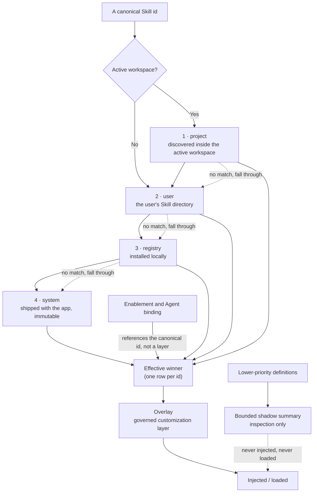

# Effective Skill runtime

The Skill runtime separates management state from the package that supplies instructions. This distinction keeps existing enablement and Agent bindings stable while allowing VaneHub AI to select one effective definition from several storage layers.

## Management scopes and runtime layers

Management scopes answer where state such as enablement, bindings, drift, and deletion intent is managed:

| Scope | Meaning |
| --- | --- |
| `global` | State shared across workspaces |
| `workspace` | State isolated to one canonical workspace |

Runtime layers answer which package supplies content. They resolve in this order:

| Priority | Layer | Content source |
| --- | --- | --- |
| 1 | `project` | A package discovered inside the active workspace |
| 2 | `user` | A package managed under the user's VaneHub AI Skill directory |
| 3 | `registry` | A locally installed package; the provider is present but has no install or network flow yet |
| 4 | `system` | An immutable package shipped with the application |

**The two dotted lines are the point.** The shadow summary is for inspection only — it is **never injected or loaded alongside the winner**. Bindings hang off the canonical id, not a layer, so when a higher layer's definition replaces a lower layer's winner, existing enablement and Agent assignment **follow the effective definition** without needing to be rebound.

The catalog returns one effective row for each canonical Skill id. Lower-priority definitions are retained as bounded shadow summaries for inspection, but they are never injected or loaded alongside the winner. Project definitions are omitted when there is no active workspace.

Bindings continue to reference the canonical Skill id rather than a layer. If a Project or User definition replaces a lower-layer winner, existing enablement and Agent assignment state follows that effective definition.

## Classification and compatibility

`type` and `delivery` are independent metadata fields:

- `role` Skills provide model-readable instructions.
- `utility` Skills declare delegated work that is not executable in this runtime version.
- `eager` Role Skills may be included in an API Agent system prompt when they are enabled, available, bound, and within the existing prompt budgets.
- `on-demand` Role Skills are discovered and loaded through fixed Skill tools.

Legacy `SKILL.md` documents that omit either field retain their previous behavior through an explicit `role` plus `eager` compatibility default. New or edited mutable definitions write both values explicitly. Unknown values make a definition unavailable instead of silently selecting behavior.

## Fixed read-only tools

Native API Agents receive three provider-independent tool definitions:

| Tool | Authority |
| --- | --- |
| `list_skills` | Lists bounded effective metadata without instruction bodies |
| `load_skill` | Loads one enabled, available Role Skill by canonical id or unambiguous alias |
| `read_skill_resource` | Reads one bounded, indexed text resource using a URI and revision returned by `load_skill` |

The tool schemas do not change when the inventory changes. All three remain read-only in normal and Plan modes; dispatch rechecks authorization even if a provider requests an operation that was not offered.

Resources use logical identifiers such as `skill://code-review/references/checklist.md`. The model never receives a host path. A read resolves the current effective definition, verifies the revision and resource index, and rejects absolute paths, parent traversal, hidden components, package escapes, binary data, and oversized content. A winner change makes the previous revision stale and requires another `load_skill` call.

`load_skill` returns at most 12,000 Unicode characters plus a bounded resource index. It replaces `{skill_base_dir}` with the logical package URI. Successful loads update the usage sidecar on a best-effort basis without mutating package content.

## Runtime and UI boundaries

The native `tooling::skills` application service owns resolution, package reads, migration, and usage tracking. Agent Runtime consumes its published API and does not access Skill repositories directly. React components consume `agent-service.ts`; only the Tauri adapter invokes commands, while the Web adapter provides representative outcomes through the same TypeScript contract.

System packages are previewable, enableable, and assignable, but their content cannot be edited or deleted. A mutable higher-layer definition is the explicit customization path. Restoring a shipped Skill clears preserved deletion intent and reveals the current effective winner; it does not create a mutable copy.

An [Overlay](skill-overlay-governance.md) is a separate governed customization layer applied after the effective base package is selected. It does not change the package layer or make an immutable package editable.

## Deferred capabilities

The current contract deliberately does not grant authority for:

- delegated Utility execution or sub-Agent creation;
- execution or dynamic registration of bundled scripts;
- remote registry download, installation, or updates;

These capabilities require separate OpenSpec changes and security boundaries. Their metadata or extension points must not be interpreted as an implemented execution path.
