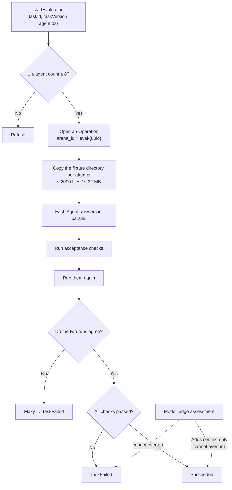

# Evaluation runtime

The Agent evaluation arena: run several Agents against one task and compare pass rate, tokens, and elapsed time. It opens an Operation, so it shares a lifecycle with execution traces, but scoring, samples, and result retention are its own problem domain.

Traces themselves are in [Execution observability](execution-observability.md).

Evaluation and traces share one principle: **record only what can be substantiated, and state honestly how much is actually known**.

## The Agent evaluation arena

Evaluation runs in the same context because at its core it is **one controlled execution plus one deterministic acceptance check**.



### Two rules that cannot be moved

The implementation of `aggregate_verification` nails two things down:

```text
deterministic_passed = all checks passed && !flaky
outcome = if deterministic_passed { Succeeded } else { TaskFailed }
```

- **A disagreement on the repeated check marks the attempt flaky and fails it outright.** `flaky` is derived from "the repeated check's results != the first run's." A lucky one-time pass does not count as a pass.
- **The judge can never overturn a deterministic result.** The judge's conclusion is bounded by `bound_judge` (`confidence` clamped to `0.0..=1.0`, `notes` truncated to 1000 characters, `evidence_ids` truncated to 32 entries) and attached to the result, but `outcome` is decided only by the deterministic expression above. There is a test in the repository specifically named `judge_never_overrides_deterministic_failure_or_flaky_result`.

### Built-in benchmarks and their forbidden patterns

Three manifests are compiled into the binary (`include_str!`), living under `src-tauri/evaluation-fixtures/`:

| Task | Category | Timeout | Verifier profiles | Forbidden pattern |
| --- | --- | --- | --- | --- |
| `fix-null-auth-token` | bugfix | 120s | `npm-test`, `static-files`, `diff-rules` | `eval(` |
| `add-parser-test` | tests | 120s | `npm-test`, `diff-rules` | `.only(` |
| `refactor-search` | refactor | 180s | `cargo-test`, `diff-rules` | `unsafe {` |

**All three forbidden patterns target the same category of cheating**: satisfying the letter of the task while evading its intent. `.only(` is the clearest example — using it to skip the rest of the test suite is enough to turn the tests "all green."

The `diff-rules` profile itself guards against the same thing: `verify_diff_rules` requires the changed paths to be **non-empty, no more than 256 entries, each ≤ 240 bytes, and none escaping the workspace**. An empty diff does not count as passing — claiming to be done while having changed nothing is another form of cheating.

### Isolation

Each attempt copies an independent copy out of the fixture directory, with a copy budget of **2000 files / 32 MB**; exceeding it fails rather than truncates. Evaluation **never touches your real workspace** and never produces a commit.

## Relationship to other contexts

- Every evaluation run is an Operation, and that lifecycle is owned by `operations`.
- Traces and logs for a run are in [Execution observability](execution-observability.md) and [Unified logging](unified-logging.md).
- The user-facing surface is in the user guide's Agent evaluation chapter.

## Where the design lives

This chapter orients contributors; the authoritative requirements live in the capability's specification under `openspec/specs`.
