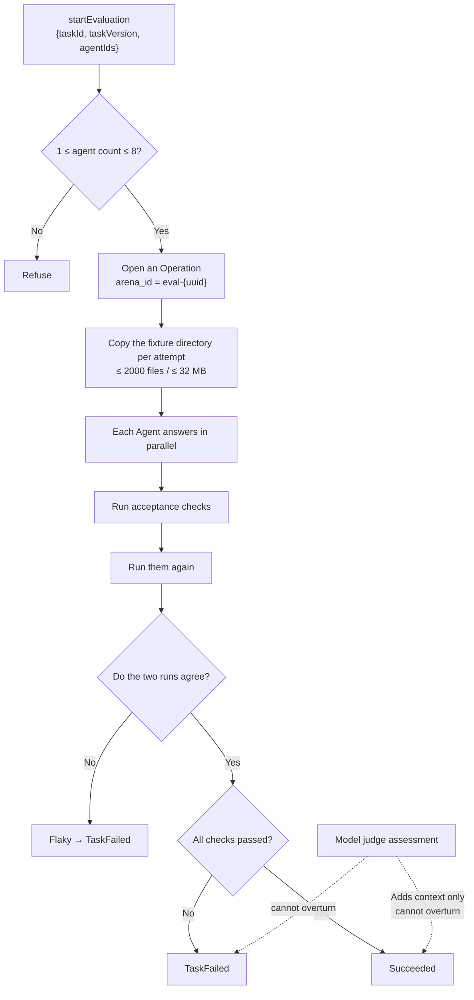

# Execution observability and Agent evaluation

The `execution_observability` context owns two things that look unrelated but share the same root: **the execution trace** (run / span / timeline / OTLP export) and the **Agent evaluation arena**.

They share one principle: **record only what can be substantiated, and state honestly how much is actually known**.

## Execution traces

### Four core types

| Type | What it is |
| --- | --- |
| `ExecutionRun` | One observable execution, holding a trace id and status |
| `ExecutionSpan` | A segment within a run, name capped at 128 characters |
| `ExecutionEvent` | A point-in-time event on a span |
| `ExecutionTimeline` | The timeline view the UI expands |

`ExecutionStatus` has six states: `Accepted`, `Running`, and four terminal states — `Succeeded`, `Failed`, `Cancelled`, `Incomplete` — of which `is_terminal()` recognizes the latter four.

**`Incomplete` is a terminal state, not an intermediate one.** It means the execution ended but the trace was not fully recorded — distinct from "failed": failure is a conclusion about the execution, incompleteness is a conclusion about the observation.

### Fidelity: the trace declares how much it knows about itself

`ExecutionFidelity` has four tiers, and it's the most important design in this context:

| Fidelity | Meaning |
| --- | --- |
| `Native` | A first-hand record the runtime produced itself |
| `Proxied` | Observed through a relay |
| `Inferred` | Inferred from whatever signals were available |
| `Opaque` | What happened in this segment cannot be known |

**Why `Opaque` has to exist**: an external CLI Agent is a black box — VaneHub starts the process and captures its output, but cannot see its internal tool calls. Drawing this as a span tree that looks complete would let a reader assume they're seeing everything. Declaring `Opaque` says "there really is a segment here, but its contents are unknown" — which is more honest than fabricating a node, and more useful than drawing nothing at all.

OnePiece runs over the native API, so its tool calls carry `Native` fidelity and can be expanded layer by layer; this is exactly the observability advantage the [native Agent](onepiece-native-agent.md) has over an external CLI.

### Capture policy and sanitization

`CapturePolicy` has only two tiers: `MetadataOnly` and `RedactedContent`. **There is no "raw content" tier at all** — even at the most detailed capture setting, content is sanitized.

Attributes carry hard ceilings; going over rejects rather than truncates:

| Limit | Value |
| --- | --- |
| Attributes per set | **32** |
| Attribute key length | **128** characters |
| Attribute value length | **256** characters |

The type is `SafeAttributes` / `SafeAttributeValue` — **"safe" is written into the type name itself**: validation happens at construction, not as a sanitization pass before writing to disk. Trying to stuff arbitrarily long text into the trace fails to compile.

### Execution source

`ExecutionSource` distinguishes three originators: `Desktop`, `InstantMessage { connector_id }`, `Scheduled { task_id }`. IM and scheduled tasks carry their own identifiers, so "who triggered this execution" is first-class information in the trace, not something guessed from a timestamp.

## The Agent evaluation arena

Evaluation runs in the same context because at its core it is **one controlled execution plus one deterministic acceptance check**.



### Two rules that cannot be moved

The implementation of `aggregate_verification` nails two things down:

```text
deterministic_passed = all checks passed && !flaky
outcome = if deterministic_passed { Succeeded } else { TaskFailed }
```

- **A disagreement on the repeated check marks the attempt flaky and fails it outright.** `flaky` is derived from "the repeated check's results != the first run's." A lucky one-time pass does not count as a pass.
- **The judge can never overturn a deterministic result.** The judge's conclusion is bounded by `bound_judge` (`confidence` clamped to `0.0..=1.0`, `notes` truncated to 1000 characters, `evidence_ids` truncated to 32 entries) and attached to the result, but `outcome` is decided only by the deterministic expression above. There is a test in the repository specifically named `judge_never_overrides_deterministic_failure_or_flaky_result`.

### Built-in benchmarks and their forbidden patterns

Three manifests are compiled into the binary (`include_str!`), living under `src-tauri/evaluation-fixtures/`:

| Task | Category | Timeout | Verifier profiles | Forbidden pattern |
| --- | --- | --- | --- | --- |
| `fix-null-auth-token` | bugfix | 120s | `npm-test`, `static-files`, `diff-rules` | `eval(` |
| `add-parser-test` | tests | 120s | `npm-test`, `diff-rules` | `.only(` |
| `refactor-search` | refactor | 180s | `cargo-test`, `diff-rules` | `unsafe {` |

**All three forbidden patterns target the same category of cheating**: satisfying the letter of the task while evading its intent. `.only(` is the clearest example — using it to skip the rest of the test suite is enough to turn the tests "all green."

The `diff-rules` profile itself guards against the same thing: `verify_diff_rules` requires the changed paths to be **non-empty, no more than 256 entries, each ≤ 240 bytes, and none escaping the workspace**. An empty diff does not count as passing — claiming to be done while having changed nothing is another form of cheating.

### Isolation

Each attempt copies an independent copy out of the fixture directory, with a copy budget of **2000 files / 32 MB**; exceeding it fails rather than truncates. Evaluation **never touches your real workspace** and never produces a commit.

## Relationship to other contexts

- Unified logging and sanitization rules are covered in [Persistence and unified logging](persistence-and-logging.md); **the trace deliberately carries no log identifiers**, so the two have to be correlated by time.
- Operation lifecycle is owned by `operations`; the evaluation arena opens exactly one Operation.
- The user-facing surfaces are covered in the user guide's chapters on observability and Agent evaluation.

## Where the design lives

This chapter orients contributors; the authoritative requirements live in the corresponding main specs under `openspec/specs`.
