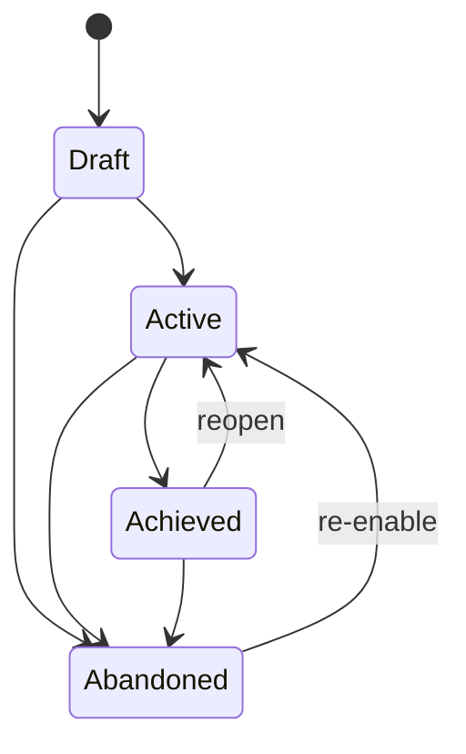
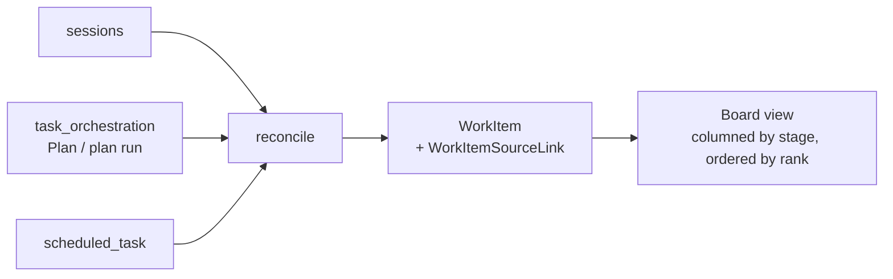

# Goals and the work board

`goals` and `work_board` are two independent contexts, but they solve opposite sides of the same problem: **execution items are scattered everywhere — how do they get tracked in one place**.

- **Goals (`goals`)** — top-down: you declare a goal first, then attach plans, loops, work items, and sessions to it, and its acceptance readiness is **derived** from their completion.
- **Work board (`work_board`)** — bottom-up: existing sessions, plans, and scheduled tasks are **reconciled** into board cards, giving you one view to prioritize across.

## Goals

### Four states and the transitions allowed between them

`GoalStatus`: `Draft`, `Active`, `Achieved`, `Abandoned`. `can_transition_to` lists the allowed edges explicitly:

**Any edge not in the diagram is rejected**; `transition` returns `InvalidTransition { from, to }`. Two things worth noting:

- **`Draft` cannot go straight to `Achieved`.** A goal that never entered Active has nothing to have achieved.
- **Both `Achieved` and `Abandoned` can return to `Active`.** A goal isn't one-shot — discovering loose ends after it was achieved, or picking an abandoned goal back up, are both normal.

### Acceptance needs a readiness computed elsewhere

`accept()` is signed `accept(self, awaiting_acceptance: bool)`, and the comment states it plainly:

> Acceptance needs the derived readiness the caller computed from the goal's children; the aggregate cannot see them itself.

**The aggregate root cannot see its own children.** Readiness is computed by the caller walking the linked objects and passed in; when `awaiting_acceptance` is false, the result is `AcceptanceNotReady` outright. This keeps the aggregate root from holding references to plans or loops, and keeps the derivation logic from scattering into domain objects.

### Five link kinds, only three participate in derivation

`GoalLinkTarget`: `Plan`, `Loop`, `WorkItem`, `Session`, `Run`.

But `participates_in_derivation()` **excludes `Session` and `Run` from derivation**, and the source comment explains why:

> Sessions are linked for navigation only. They have no completion semantics, so counting them would leave every goal permanently short of acceptance.

**A session has no concept of "done."** You can always go back to a session and keep talking; it never becomes "finished." Counting sessions in derivation would leave every goal permanently just short of acceptance — so a session is attached to a goal only as a navigation entry point, and never affects acceptance.

`Run` follows the same logic: one execution is a record of process, not a deliverable.

## The work board

### Five stages, five priorities, four sources

| Dimension | Values |
| --- | --- |
| Stage `stage` | `inbox`, `planned`, `in_progress`, `review`, `done` |
| Priority `priority` | `none`, `low`, `medium`, `high`, `urgent` |
| Source `source_kind` | `session`, `plan`, `plan_run`, `scheduled_task` |

All three are **allowlist-validated** — a value outside the set is rejected outright, rather than stored and left to explode later.

### Idempotent reconciliation

`work_board` doesn't originate work itself — it reconciles what already exists in other contexts into cards. `reconcile` runs once before every list load.

**Reconciliation has to be idempotent**: the same session showing up across repeated reconciliation passes must never turn into multiple cards. A uniqueness constraint on `work_item_links` backstops this at the database layer — a duplicate link is rejected with the message `Source is already linked to a work item.`

### The `available` field admits a source can disappear

`WorkItemSourceLink` carries an `available: bool`. When the source object is deleted, **the card does not disappear with it** — the link is instead marked unavailable.

This matches the trade-off on the goals side: **priority and stage that a user manually sorted shouldn't evaporate just because some underlying session got deleted.**

## How the two divide the work

| | Goals | Work board |
| --- | --- | --- |
| Direction | Top-down declaration | Bottom-up reconciliation |
| Who creates entries | You, explicitly, by linking | Auto-reconciled from existing execution items |
| Completion semantics | Derived from children, human-accepted | Manually dragged through stages |
| Role of a session | Navigation only, excluded from derivation | A valid source |

They can stack: a work item can appear on the board and also be attached to a goal to participate in derivation (`WorkItem` is one of the three link kinds that participate).

## Relationship to other contexts

- Plans and plan runs are owned by `task_orchestration`; see [Loop and Plan runtimes](loop-and-plan-runtime.md).
- Scheduled tasks and sessions are owned by `sessions`.
- The user-facing surfaces are covered in the user guide's chapters on goal management and the todo board.

## Where the design lives

This chapter orients contributors; the authoritative requirements live in the corresponding main specs under `openspec/specs`.
