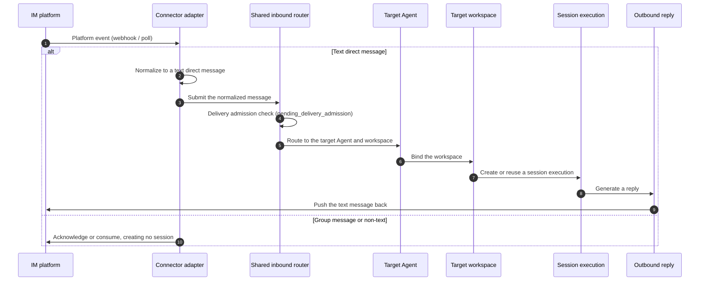

# IM connectors

The native side owns IM connector configuration, credentials, routing, and inbound delivery. Remote-workspace and IM workflow is covered in the user guide; this chapter covers the native design.

## Five built-in connectors

Five independently configurable built-in connectors with stable ids: `feishu`, `telegram`, `dingtalk`, `wecom`, and `weixin`. The connector descriptor list returns all five with localized display metadata, configuration fields, capabilities, and an experimental flag. Personal WeChat (`weixin`) is marked experimental; the other four are not.

## First-version direct-message scope

Each connector accepts text **direct messages** only. Group messages and non-text content are excluded from Agent execution in the first version: a group message is acknowledged or consumed without creating a VaneHub message or Agent generation. A valid text direct message is normalized from its platform event and submitted to the shared inbound router.

## Message flow and routing

The full path an inbound message takes from a platform event to Agent execution looks like this. The first version handles text direct messages only; a group message or non-text content is acknowledged without creating a session.

**Inbound delivery admission**: the router checks `pending_delivery_admission` before creating a session. Each chat has a pending-delivery ceiling of `MAX_PENDING_PER_CHAT = 8`, above which it returns Busy **without blocking** the platform event acknowledgement. The runtime also maintains two global watermarks: a total pending-work ceiling of 64, and an active Agent generation ceiling of 8. Idle lanes are reclaimed so a new routing request can reuse the execution slot.

**The WeChat authorization flow**: the `weixin` connector is marked experimental and acquires credentials through a QR authorization flow. `AuthorizationStatus` has six states — `Waiting` → `Scanned` → `Confirmed`, each able to move to `Expired`, `Error`, or `Cancelled`. Credentials are written to the platform keychain, read through zeroizing reads, and the in-memory copy is zeroed immediately after use.

**The outbound policy**: the first version supports only sending an Agent's generated text result straight back to the originating chat. Inbound routing depends on a default route saved in advance — a default route (target Agent plus workspace) must be configured before a connector is enabled, or a normalized message has nowhere to land.

## Key constants and credentials

Concurrency and watermark control for inbound delivery is carried jointly by `communications/domain/delivery.rs` and `infrastructure/runtime_manager.rs`:

- **`MAX_PENDING_PER_CHAT = 8`** — the maximum pending deliveries for a single chat. Above it the router returns `Busy`, but **does not block** platform event acknowledgement.
- **A total pending-work ceiling of 64** — the cap on outstanding work across all chats; once reached, a new routing request waits for an idle lane.
- **An active Agent generation ceiling of 8** — the cap on concurrently running Agent generations. Idle lanes are reclaimed so a new routing request can reuse the execution slot.
- **Deduplication and checkpoints** — an inbound message is deduplicated through `dedup` and its delivery progress recorded through `checkpoint`, which keeps the path idempotent. Scheduled deduplication is retained in batches of at most 512 rows.
- **The WeChat security context** — per-chat WeChat security context metadata is retained under a bounded ceiling, with coverage for restart, stale refresh, and rollback. `clear` stops the runtime before removing each tracked per-chat security context.

Credentials are held through the platform keyring boundary in `communications/infrastructure/credential_adapter.rs`:

- **Zeroizing reads** — a credential read from the keyring is copied straight into a zeroizing buffer, and the in-memory copy is zeroed immediately after use.
- **Stable account references** — credentials are associated by stable account reference, so renaming a connector does not invalidate them.
- **WeChat authorization migration** — legacy WeChat credentials have a migration and deletion path, and an authorization failure returns a safe error rather than exposing the credential.

## Where the design lives

This chapter orients contributors. The authoritative requirements live in the spec.

- [openspec/specs/im-connector-management](../../../openspec/specs/im-connector-management/spec.md)

IM connectors live in the `communications` bounded context; see [Native bounded contexts](native-contexts.md).
