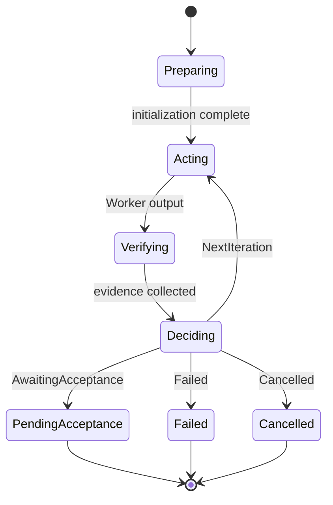

# Loop runtime and session Plan mode

VaneHub has one durable native runtime for autonomous iterative work: the **Loop** runtime. **Plan** is a read-only execution mode inside an eligible OnePiece session; it is not a second durable task-orchestration runtime. The user-facing workflows are covered in the user guide, while this chapter describes the native ownership boundary.

## Background: the Loop Engineering paradigm

The central claim of Loop Engineering is that **you stop writing prompts to a coding Agent sentence by sentence and instead design a loop system the Agent can iterate inside** — replacing the developer as the one issuing instructions with a system built for the job. The developer defines the goal, and the system runs execute → observe → evaluate → correct → execute again until the goal is met.

This is not a new invention. The Evaluator-Optimizer pattern (one model produces, another critiques and corrects) and the Orchestrator-Workers pattern (a lead agent dispatches to sub-agents) from Anthropic's *Building Effective Agents* (2024) are both Agent loop systems. What Loop Engineering adds is a toolchain mature enough to productize and standardize the idea.

**The point is the closed loop, not the automation.** A script that runs a task on a timer is not Loop Engineering; a system that can judge the quality of its own output, decide whether it meets the bar, and choose the next action is. It addresses engineering-infrastructure problems — verification, isolation, memory, cost, stopping conditions — rather than problems of phrasing.

### The six components

A loop that can run unattended has six parts. This is how each maps onto the repository:

| Component | Role | Implementation here |
| --- | --- | --- |
| **Automations** | The loop's heartbeat, deciding when to run (schedule or event trigger plus triage) | Scheduled tasks (see [Scheduled and usage](../../user-guide/en/src/automation.md)) and IM inbound triggers |
| **Worktrees** | Isolated workspaces that keep parallel Agents from colliding | A Loop works in its own Git worktree; remote workspaces do not support worktrees, so Loops do not apply there |
| **Skills** | Project knowledge and coding conventions written once, so the loop does not rediscover them every round | The Skill system (see [Skill management](skill-management.md)) |
| **Plugins / Connectors** | MCP-based connections to real systems — opening a PR, updating a ticket | MCP tools (see [MCP tools and clients](mcp-tools.md)) |
| **Sub-agents** | Separating the one who does the work from the one who checks it — the same person should not set and mark the exam | The Loop's Worker and Verifier roles, with the Verifier judging independently through `VerifierRecommendation` (Pass / Revise / Blocked) |
| **Memory / External state** | External state that carries progress between runs, so the loop remembers | Cross-session memory (see [Cross-session memory](cross-session-memory.md)), plus Loop definitions and iteration state persisted to SQLite |

### Relation to Prompt, Context, and Harness Engineering

The four paradigm shifts in AI engineering methodology stack; they do not replace one another:

| Layer | Concern | Analogy |
| --- | --- | --- |
| **Prompt Engineering** | Phrasing, examples, and reasoning guidance within a single exchange | How you ask |
| **Context Engineering** | What information goes into the context window (retrieval, memory, tool descriptions) | What you let it see |
| **Harness Engineering** | The environment, permissions, sandbox, and tool set the Agent runs in | Where you put it |
| **Loop Engineering** | How the loop runs itself, when it stops, and how results are verified | How the system keeps itself turning |

Prompt Engineering has not gone away — a Loop is made of prompts, and a badly written prompt inside a Loop only produces bad work faster. Loop Engineering is a layer above Prompt, Context, and Harness. **Where it applies**: repetitive tasks with a stable goal that can be judged automatically are good candidates; work whose requirements keep shifting, or whose risk is high, still needs a human steering.

## Loop runtime

A Loop definition is persisted with a stable id, name, enabled state, local Git project path, base branch, goal, acceptance criteria, allowed and protected paths, stable Worker and Verifier Agent ids, structured verification commands, stop limits, version, and timestamps. Loop definitions preserve **stable Agent ids** rather than matching display names.

First-phase scope is constrained: a definition targeting a non-Git project, a remote workspace, a missing Agent, an unsafe path scope, or an invalid limit is rejected without starting an Agent or creating a worktree. The Worker and Verifier roles accept either a CLI-launched Agent or an API Agent with tool-use trust enabled; an API Agent without tool-use trust is rejected.

## OnePiece session Plan mode

An eligible OnePiece session can switch its composer between Plan and Agent modes. Plan mode persists as `executionMode: "plan"` on the session chat configuration and resolves to a read-only effective policy. It keeps read-only exploration tools while excluding shell execution, file writes, effectful MCP tools, and delegated work.

The interactive `exit_plan_mode` request asks the user before a later turn can use Agent mode. Declining leaves the session in Plan mode. Approval changes only the session execution mode; it does not create a Plan definition, PlanRun, task graph, or worktree.

Historical Plan and PlanRun database rows remain available for migration compatibility and audit. The forward retirement migration terminalizes active legacy records and removes Plan-derived Work Board links without deleting recorded history or filesystem worktrees.

## Loop iteration state machine

A Loop run (`LoopRun`) advances through phases (`LoopRunPhase`). Once `Preparing` completes, it enters the `Acting` → `Verifying` → `Deciding` iteration cycle, and the outcome of `Deciding` decides whether to iterate again, terminate as failed, or stop and wait for human acceptance. `Finalizing` is the terminal wind-down phase. The diagram below focuses on the iteration cycle itself and its transition conditions under `decide_loop_iteration()`.

The decision input for `Deciding` is a `LoopDecisionInput` carrying three groups of facts: **whether the required checks passed**, the **Verifier recommendation** (`VerifierRecommendation` = `Pass` / `Revise` / `Blocked`), and an optional hard-stop reason plus user feedback. The order of judgment is fixed.

1. **Hard-stop reasons win** — `GoalMet` → `AwaitingAcceptance`; `UserRejected` and `UserStopped` → `Cancelled`; every other hard-stop reason → `Failed`.
2. **`Blocked` means failed** — a Verifier recommendation of `Blocked` goes straight to `Failed` (`VerifierBlocked`) without looking at check results.
3. **Failing required checks force another iteration** — with `required_checks_passed = false` the outcome is `NextIteration` regardless, and user feedback asking to "accept it as is" does not override it.
4. **A Verifier `Revise` forces another iteration** — even with every required check passing, a Verifier asking for revision still produces `NextIteration`.
5. **All checks passing plus a Verifier `Pass` → awaiting acceptance** — this is the only path to `AwaitingAcceptance`. **A Loop never declares its own success**; it always stops and waits for a human to accept.

### No-progress detection, iteration limits, and the trust contract

A Loop does not spin pointlessly. Every iteration records objective-state fingerprints (`LoopObjectiveFingerprints`) made of three parts: the **diff hash**, the **hash of the failing required-check set**, and the **set of required checks already passing**.

- **No-progress condition** — when two consecutive iterations leave all three fingerprints unchanged (`repeated_diff && repeated_required_check_failures && !has_new_passing_required_evidence`), that iteration counts as making no progress.
- **No-progress limit** — when the consecutive no-progress count reaches `LoopLimits.max_consecutive_no_progress`, the run terminates as failed with `NoProgress`.
- **Iteration limit** — reaching `max_iterations` terminates with `MaxIterations`; exceeding the time budget terminates with `TimeBudget`.
- **Worker and Verifier trust contract** — the Worker and Verifier roles accept two kinds of Agent: a CLI-launched Agent, and an API Agent with **tool-use trust enabled**. An API Agent without tool-use trust is rejected at definition time, without starting an Agent or creating a worktree.

## Key types and constants

The lists below collect the Loop runtime's core types and decision functions for quick reference during implementation. The authoritative semantics remain the prose above and the specs.

### Loop phases and decision outcomes

The `LoopRunPhase` enum, from `loop_engineering.rs`, defines how a `LoopRun` advances:

- `LoopRunPhase::Preparing` — initialization
- `LoopRunPhase::Acting` — Worker execution
- `LoopRunPhase::Verifying` — evidence collection
- `LoopRunPhase::Deciding` — the judgment that follows verification
- `LoopRunPhase::Finalizing` — terminal wind-down

The result of the `Deciding` phase is expressed by the `LoopDecisionOutcome` enum:

- `LoopDecisionOutcome::Failed` — terminate as failed
- `LoopDecisionOutcome::Cancelled` — cancelled
- `LoopDecisionOutcome::NextIteration` — proceed to the next iteration
- `LoopDecisionOutcome::AwaitingAcceptance` — stop and wait for human acceptance

### Verifier recommendation and iteration decision

The `LoopVerifierRecommendation` enum carries three values: `Pass`, `Revise`, and `Blocked`.

`decide_loop_iteration()` judges in the following fixed order, which cannot be swapped:

1. **Hard-stop reason** — `GoalMet` → `AwaitingAcceptance`; `UserRejected` and `UserStopped` → `Cancelled`; every other hard-stop reason → `Failed`
2. **`Blocked` means failed** — a Verifier recommendation of `Blocked` goes straight to `Failed` without looking at check results
3. **Failing required checks → `NextIteration`** — with `required_checks_passed = false` the next iteration is forced, and user feedback asking to accept as-is has no effect
4. **Verifier `Revise` → `NextIteration`** — even with every required check passing
5. **All checks passing plus Verifier `Pass` → `AwaitingAcceptance`** — the only path to awaiting acceptance, because a Loop never declares its own success

### No-progress fingerprints

`LoopObjectiveFingerprints` records three fingerprints per iteration:

- **Diff hash** — the hash of this iteration's diff
- **Failing required-check set hash** — the hash of the required checks that did not pass this iteration
- **Passing required-check set** — the cumulative set of required checks already passing

No progress is judged as `repeated_diff && repeated_required_check_failures && !has_new_passing_required_evidence`, meaning all three fingerprints were unchanged across two consecutive iterations.

### Iteration limits

`LoopLimits` carries five fields, validated on construction:

| Field | Type | Meaning |
| --- | --- | --- |
| `max_iterations` | `u16` | Iteration ceiling, accepted only in the range `1..=20`; reaching it terminates with `MaxIterations` |
| `step_timeout_seconds` | `u64` | Per-step time budget |
| `total_timeout_seconds` | `u64` | Whole-run time budget; exceeding it terminates with `TimeBudget` |
| `max_consecutive_runtime_errors` | `u16` | Consecutive runtime-error ceiling |
| `max_consecutive_no_progress` | `u16` | Consecutive no-progress ceiling; reaching it terminates as failed with `NoProgress` |

### Worker and Verifier trust contract

The Worker and Verifier roles accept two kinds of Agent: a CLI-launched Agent, and an API Agent with **tool-use trust enabled**. An API Agent without tool-use trust is rejected at definition time, without starting an Agent or creating a worktree.

## Where the design lives

This chapter orients contributors. The authoritative requirements live in the specs.

- [openspec/specs/loop-engineering-runtime](../../../openspec/specs/loop-engineering-runtime/spec.md) — durable Loop definitions and the Worker/Verifier trust contract.
- [openspec/specs/session-chat-configuration](../../../openspec/specs/session-chat-configuration/spec.md) — persisted OnePiece session Plan mode.
- [openspec/specs/agent-plan-exit-request](../../../openspec/specs/agent-plan-exit-request/spec.md) — interactive Plan-mode exit behavior.

Loop execution lives in the `agent_runtime` bounded context. OnePiece Plan mode is owned by the `sessions` and `agent_runtime` boundaries; see [Native bounded contexts](native-contexts.md).
