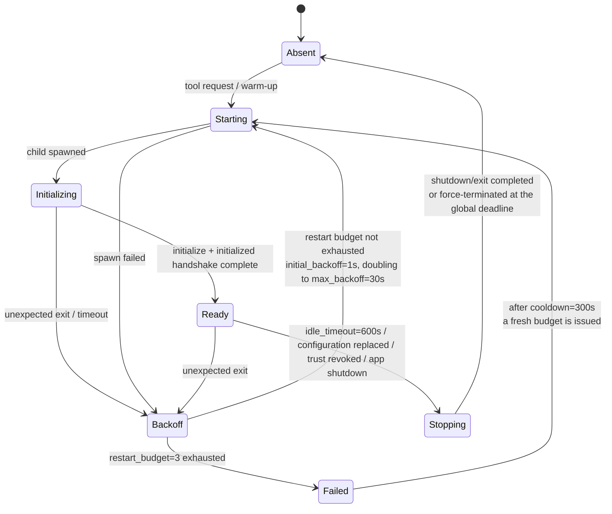
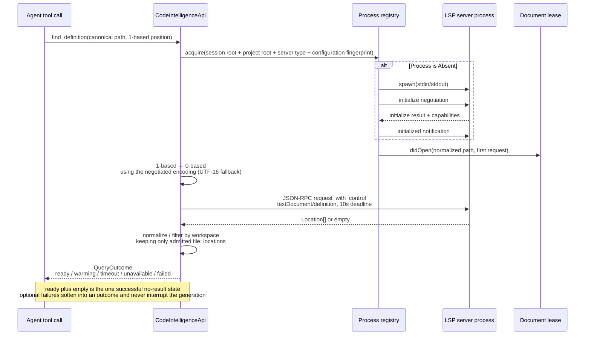

# LSP code intelligence

The native LSP foundation is a separately owned, desktop-only bounded context. It supplies live semantic code intelligence to the native API Agent without making the persistent Tree-sitter code index a process or configuration dependency.

## Operational baseline

The first implementation supports only these server families:

| Language family | Executable | Fixed startup behavior | Root markers |
| --- | --- | --- | --- |
| Rust | `rust-analyzer` | stdio LSP | nearest `Cargo.toml` |
| TypeScript/JavaScript | `typescript-language-server` | VaneHub appends `--stdio` | nearest `tsconfig.json`, `jsconfig.json`, or `package.json` |
| Java | `java` running `jdtls`'s launcher jar (installable by VaneHub AI) | resolved argument template, stdio LSP | nearest `pom.xml`, `build.gradle`, `build.gradle.kts`, or `settings.gradle` |

Install a standard rustup-managed Rust server with:

```bash
rustup component add rust-analyzer
rustup component add rust-src
```

Install the TypeScript server and its TypeScript runtime with:

```bash
npm install -g typescript-language-server typescript
```

Use the upstream [rust-analyzer binary guide](https://rust-analyzer.github.io/book/rust_analyzer_binary.html) and [TypeScript Language Server repository](https://github.com/typescript-language-server/typescript-language-server#installing) when platform packaging or prerequisites differ.

In **Settings > Agent Configurations**, enable the master switch and a language, confirm discovery or provide an absolute executable override, save a bounded initialization-options object, run the isolated server test, and explicitly trust the canonical local workspace. Every switch and trust record defaults to disabled. Code-index enablement is not LSP trust.

## Ownership and boundaries

The main native ownership is under `src-tauri/src/contexts/code_intelligence/`:

| Layer | Responsibility |
| --- | --- |
| `domain/` | The language registry, the validated language id, trust, configuration, process states, capabilities, versions, normalized locations, diagnostics, and fail-soft outcomes |
| `application/` | Repository and native environment ports |
| `infrastructure/` | Discovery, project roots, process registry, JSON-RPC, framing, initialize negotiation, document leases, diagnostics, normalization, server testing, shutdown, and unified diagnostics |
| `api.rs` | The only cross-context code-intelligence facade |

### The language registry

`domain/registry.rs` holds `LANGUAGE_DEFINITIONS`, one entry per supported language, following the `CLI_TOOL_DEFINITIONS` pattern in `contexts/tooling/cli`. Each entry declares the language id, the server id, candidate executable names in preference order, default startup arguments, project-root markers, extension-to-`languageId` mappings, platform applicability, and the minimal project the isolated server test builds.

A marker may name a path inside the candidate directory rather than a file directly in it, which is how C/C++ finds `build/compile_commands.json` without a second detection mechanism. Marker order is not meaningful: any one of a language's markers identifies a root, and the nearest ancestor holding any of them wins, so which one matched changes nothing observable.

An entry may set `requires_root_marker`. Detection then refuses instead of falling back to the session workspace root, and the failure carries its own reason code. Only C/C++ sets it, because `clangd` without a compilation database assumes default flags and answers confidently wrong, which is worse than answering unavailable. The distinction is deliberate at the boundary too: discovery still reports `clangd` as available, because it is — the workspace is what cannot be served.

Adding a language means adding one entry plus its locale strings. Nothing else enumerates the set: discovery, project-root detection, document admission, server testing, configuration defaults, the command DTOs, and the settings page all derive it. `registry_tests.rs` fails a build whose entry is missing any of that data, and asserts that ids and extensions are unique — extension lookup returns the first match, so a contested extension would resolve by declaration order and route a file to the wrong server.

There is no `LanguageFamily` or `ServerKind` enum. A language is `Language = &'static LanguageDefinition`: one `Copy` reference carrying both its own id and its server's, so the two cannot disagree. `LspLanguageId` is the owned validated form, used only where a value crosses storage or the wire and no `'static` reference exists yet. `resolve_language` turns such a value back into a reference, and returns `None` for an id this build does not register — which is an ordinary case, not an error, because storage no longer constrains the id set.

The table is compile-time on purpose. Every entry needs a fixture project and root-detection rules that only code can supply, so a user-declared language would be a row the runtime cannot serve.

`agent_runtime` owns the consumer-side `AgentCodeIntelligencePort` and `AgentWorkspaceMutationPort` contracts. Bootstrap adapts these ports to `CodeIntelligenceApi`; Agent code must not import code-intelligence infrastructure. Retrieval is reached independently through its public `CodeIndexApi` for targeted mutation reconciliation.

The frontend follows the same service boundary as the rest of the application:

```text
React settings components
  -> AgentService
    -> tauri-agent-client.ts -> registered Tauri commands -> CodeIntelligenceApi
    -> web-agent-client.ts   -> deterministic in-memory Web/mock adapter
```

React components must not call `invoke()` directly. Web/mock code must not import native filesystem or process adapters and must not claim that a real server was launched.

The frontend holds no copy of the language set. `LspLanguageId` is an opaque string, and `get_lsp_configuration` carries a descriptor list the settings page renders one card from. The contract validator therefore cannot check a language against a known set; it checks the id's shape against the same `[a-z0-9_]{1,64}` rule the backend enforces, and cross-checks that every configured language is described in the same response. Web/mock mode has no backend registry to ask, so `web-lsp-client.ts` carries a mirror table; adding a language there is a data edit.

## Process and protocol lifecycle

Processes are keyed by canonical session root, detected project root, server kind, and configuration fingerprint. Nested projects can therefore use independent instances of the same server.

```text
absent -> starting -> initializing -> ready -> stopping -> absent
                    \-> backoff -> starting
                    \-> failed
```

- Tool requests start an eligible server on demand; bounded language inventory may prewarm it.
- `ready` means the `initialize`/`initialized` handshake completed. It does not mean background server indexing has finished.
- Unexpected exit fails pending requests, clears document and diagnostic state, and enters bounded exponential backoff.
- Exhausting the restart budget enters `failed` until the cooldown path permits a fresh budget.
- A ready process with no active request or document lease closes after ten minutes.
- Configuration replacement and trust revocation use the same draining stop path.
- Application shutdown stops servers concurrently, attempts `shutdown` then `exit`, and force-terminates remaining process trees under the global deadline.

Transport is bounded JSON-RPC 2.0 over child stdin/stdout. `Content-Length` headers, frames, stderr capture, queues, pending requests, concurrent requests, server notifications, and normalized output all have hard limits. Server-to-client workspace edits are rejected by this read-only foundation.

## Documents, positions, and diagnostics

Disk content is authoritative. Before a semantic request, document admission canonicalizes a normalized relative path and rejects absolute, traversal, hidden, non-file, binary, invalid UTF-8, oversized, and symlink-escaping targets. VaneHub does not maintain unsaved editor buffers.

The first request sends `didOpen`. A changed disk snapshot increments its version and sends negotiated full or single-contiguous incremental `didChange`; idle or stopped leases send `didClose`. Exact Agent writes invalidate matching leases immediately. Shell, Git, and external-editor changes are detected on the next requested disk read rather than by a filesystem watcher.

Agent coordinates and normalized result ranges are 1-based. Protocol coordinates are 0-based and use the negotiated encoding, with UTF-16 as the fallback. Diagnostic notifications replace a per-document versioned snapshot; current empty, stale, warming, timeout, unavailable, and failed states remain distinct.

## Agent tools and hard limits

The provider-neutral catalog conditionally exposes nine read-only tools in normal and Plan Mode generations:

| Tool | Protocol method or source | Bound |
| --- | --- | --- |
| `find_definition` | `textDocument/definition` | 20 accepted locations |
| `find_references` | `textDocument/references` | 50 accepted locations, deterministic order |
| `get_hover` | `textDocument/hover` | bounded signature, documentation, and serialized output |
| `get_diagnostics` | `textDocument/publishDiagnostics` cache | bounded count and message content |
| `find_type_definition` | `textDocument/typeDefinition` | 20 accepted locations |
| `find_implementations` | `textDocument/implementation` | 20 accepted locations |
| `find_workspace_symbols` | `workspace/symbol` | 50 accepted symbols |
| `get_document_symbols` | `textDocument/documentSymbol` | 200 accepted symbols, depth 8 |
| `find_call_hierarchy` | `textDocument/prepareCallHierarchy` then `callHierarchy/incomingCalls` or `outgoingCalls` | 50 relations, 20 sites each, **one** 10s budget for the whole exchange |

**Tools are appended, never inserted.** A provider caches the tool-definition prefix, so reordering the entries that came before costs every eligible session its prompt cache — and nothing in the diff would say so, because the names would all still be there. `the_first_four_code_intelligence_tools_keep_their_declaration_order` fails if that prefix moves.

Call hierarchy is three requests presented as one tool, and it carries **one** deadline rather than the single-request budget per step. Two steps at the per-request budget would let a slow server take twice as long as any other tool while every individual request still looked healthy. Preparation resolving several items follows the first and returns `ready` with `call_hierarchy_items_not_followed`; following all of them would multiply the request count by an amount the server chooses.

`find_workspace_symbols` names a document without being scoped to it. The path selects the server — which is to say the project root — because LSP has no notion of "the repository" and one repository can hold several projects. It is also the only method with no document lease: it skips admission entirely, so it can run without opening a file, and it reports no document version because there is none to report.

Negotiated capabilities are carried as a list over `SemanticMethod::ALL`, one entry per method this build implements, with a `supported` flag. Absent and `supported: false` are different facts: absent means the client does not implement the method at all, and only the second is something a user can fix by changing servers. `SemanticMethod::ALL` is append-only for the same reason as the catalog — its order is what the settings card renders.

Workspace scope always comes from the current session. Models cannot select a workspace, root, server path, or URI scheme. Only admitted `file:` locations inside the canonical workspace survive normalization.

Every outcome uses `ready`, `warming`, `timeout`, `unavailable`, or `failed` rather than turning optional intelligence failure into an Agent-generation failure. `ready` plus an empty result is the only successful no-result state. Count-bearing results retain accepted totals, returned counts, filtering, stale, and truncation metadata.

## Tree-sitter retrieval and LSP

These capabilities solve different problems and remain independently owned:

| Concern | Tree-sitter `search_code` | Live LSP |
| --- | --- | --- |
| Owner | `retrieval` | `code_intelligence` |
| State | Persistent manifests, chunks, symbols, FTS, and optional vectors | Ephemeral process, documents, capabilities, and diagnostics |
| Query shape | Text or semantic retrieval over a workspace index | Exact document position or diagnostic document |
| Semantic depth | Syntax structure and optional embedding similarity | Compiler/language-server definitions, references, types, and diagnostics |
| Activation | Per-workspace index configuration | Master switch, language switch, executable, local session, and explicit trust |
| Availability | Works without a language server | Works without a persistent code index |

Successful Agent file writes publish one best-effort mutation signal. Bootstrap invalidates the LSP lease and offers the normalized path to the bounded, coalescing code-index queue. Neither downstream failure changes a successful file-tool result.

## Persistence and logging

SQLite owns the disabled-by-default host configuration and canonical-workspace trust records. Executable, resolved startup arguments, initialization options, and trust revision contribute to the configuration fingerprint so stale processes cannot serve new requests. Argument boundaries are part of that fingerprint: concatenating would let `["ab"]` and `["a", "b"]` hash alike and leave a server running under a command line the user changed.

`lsp_language_configurations` does not constrain which language ids may exist — migration 86 dropped that `CHECK` constraint by rebuilding the table. A row naming a language this build does not register is therefore reachable, by downgrading. Loading skips such a row and leaves it untouched: rejecting it would make the application unbootable over a language it merely cannot serve, and deleting it would silently discard the user's settings across a downgrade-then-upgrade cycle.

`startup_arguments_json` is nullable, and the distinction matters. `NULL` means "use the registry default"; a JSON array, including an empty one, is the user's explicit choice. Collapsing them would strip `--stdio` from the TypeScript server whenever someone cleared the field.

Lifecycle and protocol diagnostics use unified logging. Safe metadata includes server/language identity, lifecycle transition, method category, duration, counts, restart attempt, timeout/cancellation category, exit code, and safe workspace identity. Never persist raw protocol payloads, source or hover content, diagnostic messages, stderr, environment values, executable arguments, credentials, or private absolute paths.

## Extension limits

Rust, TypeScript/JavaScript, Go, Python, C/C++, and Java are registered. Adding Go, Python, and C/C++ cost five registry entries' worth of data, three fixture projects, five locale strings, and one new resolver flag — and no frontend change at all, which is the property the registry was built for.

Java did not fit that shape, so the registry gained one. A `LaunchShape` field decides what the other fields mean: under `Executable` — what the first five declare — `executables` names the server and a manual override is an absolute executable file. Under `Interpreter` it names the *interpreter*, the server lives in an argument template, and an override is the install **directory**.

The template's placeholders are enum variants rather than strings, so an unresolved one is a case the compiler knows about instead of a substitution that quietly failed. Three of them are resolved late: the launcher by matching a declared prefix and suffix in one declared directory, the configuration directory by platform *and architecture*, and the data directory from a hash of the canonical workspace root.

**The configuration directory is not architecture-neutral.** Eclipse ships `config_mac` beside `config_mac_arm` and `config_linux` beside `config_linux_arm` because each `config.ini` names an OSGi launcher fragment built for one architecture, and a fragment for the wrong one does not attach. Windows declares no ARM variant because only a `win32.x86_64` fragment is published. Resolution prefers the host architecture's directory and falls back to the platform's when the archive does not ship one, so an older `jdtls` still resolves rather than failing closed on a directory its publisher never created.

The architecture used is **this process's**, standing in for the JVM's. The configuration that actually matters is the one the user's JVM can load, and asking it would mean spawning the JVM during discovery — which discovery deliberately never does, and which `discovery_uses_native_location_without_starting_the_server` pins. Where the two disagree the install-directory override is the escape hatch; where they agree, which is every ordinary machine, the answer is right — and the operating-system-only answer it replaced was wrong on every ARM host.

Two rules are worth stating because their opposites look reasonable:

- **Several matching launchers is a refusal, not a choice.** Picking the newest would start a server whose version the settings page cannot name. The match is also not recursive — a launcher three levels down is not the layout the entry describes.
- **A user's startup arguments append to the template rather than replacing it.** Everywhere else configured arguments replace the registry default, because clearing the field has to mean something. The template is not a default; one a user can replace is one they can replace with something that does not start a server.

The per-workspace data directory is derived rather than recorded — there is no table to keep in step with trust, and the only way to reach a workspace's directory is to already have its canonical root. It is removed when trust is revoked, after the processes stop, because a running server holds its index open. Not on idle shutdown: that index is what makes the next start fast.

The settings card learns what an override means from a descriptor field, never from the language id. A second interpreter-shaped language must need no frontend change, and `lsp-configuration-section.test.tsx` asserts that with a language that is deliberately not Java.

### Managed installation

A registry entry may declare a **distribution**: where its server can be fetched from and under what bounds. The declaration is `managed_install`'s own types — `RetrievalPolicy`, `ArtifactIntegrity`, `PlatformArtifact`, `ExtractionLimits` — rather than a second vocabulary that would describe the same download twice and eventually disagree with itself. Java declares one; the other five do not, and a language with no declaration has no install action and unchanged discovery.

Three rules hold this together:

- **Every archive format goes through one guard.** `ExtractionGuard::admit` owns containment and the limits; `extract_zip` and `extract_tar_gz` differ only in how they enumerate entries. Neither may touch the destination except through `admit`. A third adapter that reimplements the checks is a spec violation, not untidiness — the check that matters is `grep` finding one `starts_with(destination)`, not two. The guard also refuses any entry that is not a regular file or a directory, because a link's containment cannot be decided when it is written: it resolves at use, and one pointing inside the destination today points outside it after something else moves.
- **Discovery precedence is override, then managed install, then unavailable.** Installing must not retarget a user who already named a directory, and uninstall removes only `<app data>/lsp/<language id>/install`. `server_discovery_tests.rs` asserts both directions with both present on disk, which is the only arrangement where a wrong precedence starts a server instead of failing visibly.
- **The bytes are not verified, and the UI says so before the click.** `ArtifactIntegrity::Unverified` is a declared state rather than an omission, so a distribution that could carry a digest and does not is visible in review. What is enforced is the allow-listed host, HTTPS with no redirect off the list, and download and extraction ceilings.

The install copies out of the guard's directory rather than renaming it: the guard owns that directory through a `TempDir` that removes it on drop, and renaming it away would leave the handle removing a path the install now depends on. The copy lands in `install.incoming` **beside** the live install, which is then swapped in by rename. Copying straight over the destination would mean deleting a working install and spending the length of a 50 MB copy in a state where a disk-full or permission error leaves the language with nothing — a reinstall that fails would be strictly worse than never pressing the button. The only gap is now between two renames, and a failed second rename puts the original back. That copy-failure path is not covered by a test: making `fs::copy` fail portably needs a fault-injection seam the module does not have, so it is narrowed by construction rather than pinned.

The frontend takes the install action from `descriptor.distribution`, never from a language id — the same rule the override control follows, asserted the same way, with a language that is deliberately not Java. Web/mock mode rejects rather than simulating: an adapter that reports a successful download with no filesystem behind it is the one surface where the button appears to work and does not.

The foundation also intentionally excludes remote workspaces, version selection and upgrade for managed servers (`latest` is fetched, nothing records what a newer one would be), formatting, completion, rename, code actions, workspace edits, filesystem watching, unsaved buffers, and persistent LSP enrichment. Call hierarchy and type definitions were on that list until `expand-lsp-read-only-methods`; they are read-only, so they moved into scope rather than staying excluded. Type *hierarchy* (`typeHierarchy/supertypes`) is still out. Do not expose a new mutating method merely by adding it to the catalog; it requires a separate OpenSpec change, permission analysis, Plan Mode treatment, protocol limits, and workspace-isolation tests.

LSP does not standardize portable server memory or indexed-file counts, so the status contract must keep these metrics unsupported rather than inventing them.

## Troubleshooting and verification

- **Discovery fails:** compare the executable visible to the desktop process with the interactive shell, then test an absolute override. Never silently fall back when a configured override is invalid.
- **Spawn fails:** check runtime dependencies and executable permissions without logging environment or arguments.
- **Initialize fails or times out:** inspect the isolated test phase and safe reason; malformed capabilities must fail closed and cleanup must still run.
- **Backoff or restart exhaustion:** inspect the process-registry snapshot and rate-limited safe diagnostics. Fix the cause before resetting trust or configuration.
- **Stale diagnostics:** verify the local document version and wait only within the bounded query deadline for a replacement publication.
- **Tools are absent:** verify desktop runtime, local workspace, master/language switches, executable discovery, explicit trust, supported file language, and catalog eligibility.
- **A returned location disappears:** check URI scheme, canonical containment, document admission, position conversion, and result caps before suspecting transport loss.

Useful focused native checks include:

```bash
cargo test --manifest-path src-tauri/Cargo.toml --lib contexts::code_intelligence
cargo test --manifest-path src-tauri/Cargo.toml --test architecture
cargo clippy --workspace --all-targets -- -D warnings
```

Frontend adapter, component, and Web/mock behavior are covered by Vitest; the documented settings flow is covered by the LSP Playwright scenario. Run the repository-wide validation commands from `AGENTS.md` before submission.

## Process state machine and request sequence

`ProcessState` is the finite state machine of a single server process. `absent` is both the initial and terminal state; `starting` means the child has been spawned but the `initialize` handshake has not finished; `ready` means the handshake completed, which does not imply background indexing has finished; `stopping` is the draining stop path; and `backoff` and `failed` are the bounded recovery paths after an unexpected exit. The state machine's parameters come from `LifecyclePolicy` defaults.



- `restart_budget = 3`, `initial_backoff = 1s`, `max_backoff = 30s`, `cooldown = 300s`, `idle_timeout = 600s`.
- A `ready` process with no active request and no document lease is shut down after ten minutes.
- Once the restart budget is exhausted the process enters `failed` and cannot reach `starting` again until the `cooldown` path issues a fresh budget.
- Configuration replacement and trust revocation both use the same draining `stopping` path.

The end-to-end sequence of one `find_definition` looks like this. Document leases, protocol coordinate conversion, and the bounded request deadline are the three parts worth attention.



- **Coordinate conversion** — Agent coordinates and result ranges are 1-based while protocol coordinates are 0-based. The encoding follows the `initialize` negotiation result, falling back to UTF-16.
- **Request deadline** — `request_with_control` puts a 10s deadline on a single JSON-RPC request, and a timeout is classified as a `timeout` soft failure rather than thrown at the Agent.
- **Workspace filtering** — returned locations are normalized and then filtered against the current session's workspace. The model cannot choose the workspace, the root, the server path, or the URI scheme.

## Why this is safe

LSP is a read-only foundation, and its safety comes from four gates together rather than any single check:

1. **A read-only tool catalog** — all nine tools are read-only, including the later type-definition, implementation, symbol-search, and call-hierarchy additions. Server-to-client workspace edits such as `workspace/applyEdit` are refused outright by this read-only foundation.
2. **Session workspace scoping** — the workspace always comes from the current session, and only admitted `file:` locations inside the canonical workspace survive normalization.
3. **Disk is authoritative** — VaneHub AI maintains no unsaved editor buffer. Disk content is authoritative, and an Agent's precise write immediately invalidates the matching lease.
4. **Four-phase isolated testing** — a server test runs `Discovery → Spawn → Initialize → Cleanup`, a malformed capability must fail closed, and cleanup still has to run.

The authoritative definitions of the process, protocol, and permission boundaries live in the relevant specs under `openspec/specs/`, with the owning layer in `src-tauri/src/contexts/code_intelligence/`.

## Key types and constants

LSP runtime process management lives in `code_intelligence/infrastructure/process_registry.rs`, with the protocol layer in `initialize_negotiation.rs`, `json_rpc_actor.rs`, and `lsp_framing.rs`:

- **`ProcessState`** — `Absent`, `Starting`, `Initializing`, `Ready`, `Stopping`, `Backoff`, `Failed`, with `is_warming()` covering Starting and Initializing and `is_terminal()` covering Failed.
- **`LifecyclePolicy` defaults** — `restart_budget = 3`, `initial_backoff = 1s`, `max_backoff = 30s` (exponential doubling), `cooldown = 300s`, and `idle_timeout = 600s`, which shuts down a Ready process after ten minutes with no request and no lease.
- **Capability negotiation** in `initialize_negotiation.rs` — `initialize_and_notify()` sends `initialize` then `initialized`; `build_initialize_params()` declares position encoding (defaulting to UTF-16), `workDoneProgress`, configuration, and definition, references, hover, and `publishDiagnostics`; `negotiate_initialize_result()` selects the encoding and normalizes the sync mode (None, Full, or Incremental). When a server does not support a method the request is **not sent** and the outcome is unavailable.
- **Position conversion** — `PositionConverter.agent_to_lsp` converts 1-based Agent coordinates to 0-based LSP coordinates using the negotiated encoding, and an out-of-range position becomes `invalid_position` without a request being sent.
- **Request control** — `JsonRpcRequestControl::standard` applies a 10s deadline per request plus a 250ms cleanup grace. Timeout and cancellation are distinguished, `ActorCommand::Cancel` sends `$/cancelRequest`, and out-of-order responses are matched by id.
- **Diagnostics cache** — `DiagnosticsCache` caches per document version, and `get_diagnostics` waits through `diagnostics.wait_for_current(uri, version, Ready, 9s)`, distinguishing ready, stale, timeout, and unavailable. Related locations with external URIs are filtered out.
- **Frame boundaries** — `lsp_framing.rs` enforces a hard `Content-Length` ceiling and kills the process when it is exceeded.
- **Server-to-client requests** — `lsp_server_requests.rs` handles `workspace/configuration` and capability register and unregister. **`workspace/applyEdit` is refused**, because the foundation is read-only.
- **Diagnostic logging** — `lsp_diagnostics.rs` defines `LspDiagnosticKind` (Lifecycle, Timeout, Cancellation, Crash, Restart, DiagnosticsCount, ProtocolLimit, Shutdown), and `record()` is rate-limited and records safe metadata only, never persisting payloads, source, hover text, diagnostic text, stderr, environment, or absolute paths.
- **Isolated testing** — `server_test.rs` defines `ServerTestPhase` (Discovery → Spawn → Initialize → Cleanup) and runs a full initialize / initialized / shutdown / exit against a `tempfile::TempDir`, with a 64KB stderr ceiling and a minimum 100ms timeout. The minimal project's files come from the registry entry's `fixture_files`.
- **The language registry** — `domain/registry.rs` holds `LANGUAGE_DEFINITIONS` and the three `Option` lookups `definition()`, `definition_for_extension()`, and `definition_for_server()`, with `Language = &'static LanguageDefinition`.
- **Language ids** — `domain/language_id.rs` defines `LspLanguageId`, restricted to `[a-z0-9_]` and at most 64 characters. `new()` validates external input, while `trusted()` is for registry literals only (guarded by a debug assertion) and its call site is registered in the architecture test's audit list.
- **Startup argument limits** — `domain/configuration.rs` sets `MAX_STARTUP_ARGUMENTS = 32` and `MAX_STARTUP_ARGUMENT_BYTES = 4KiB`, and rejects embedded NUL bytes, because the platform would otherwise truncate or reject them at hand-off when the reason can no longer be reported.
