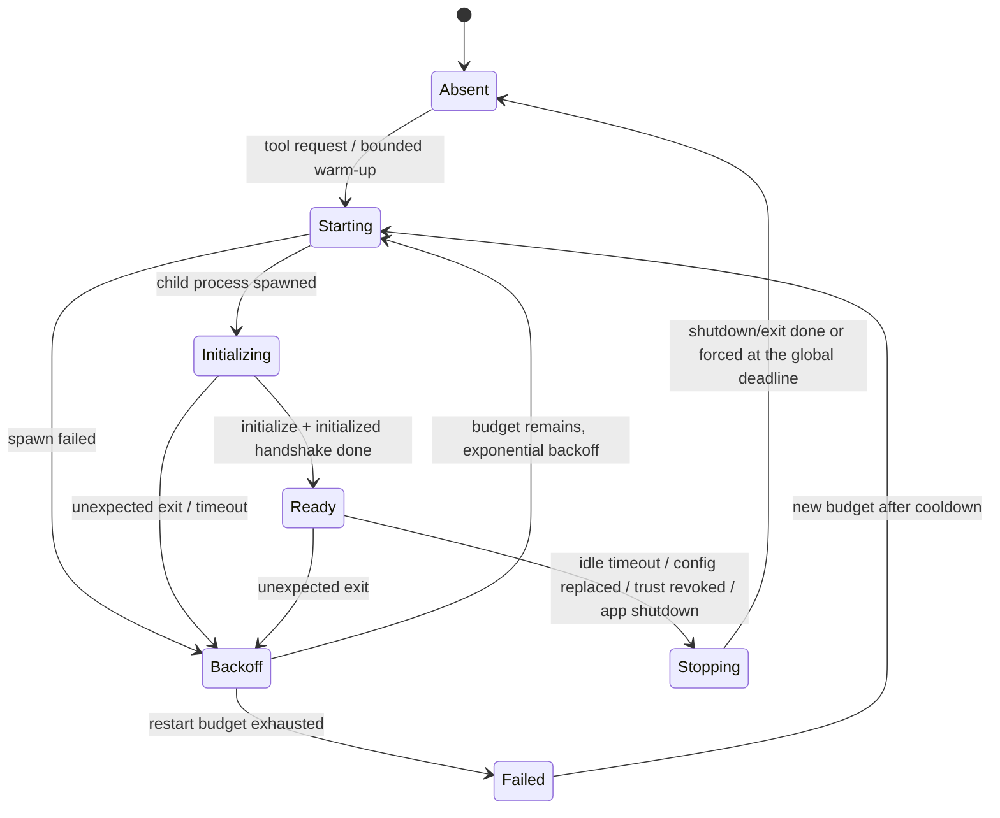

# LSP code intelligence

The native LSP foundation is an independently owned, **desktop-only** bounded context (`code_intelligence`): language-server discovery, installation, launch, and JSON-RPC all happen only in the desktop runtime; Web/mock carries only contracts, status display, and test simulation. It gives native API Agents live semantic code intelligence without making the persistent Tree-sitter code index a process or configuration dependency.

## The support matrix

The single authoritative definition is `LANGUAGE_DEFINITIONS` in `domain/registry.rs`. The table below is derived from it — when changing language support, the registry is the source of truth; do not copy this list anywhere else:

| Language family (id) | Server | Launch shape | Extensions → languageId | Project root markers | Platforms | Language-specific constraints |
| --- | --- | --- | --- | --- | --- | --- |
| Rust (`rust`) | `rust-analyzer` | Executable, no default args | `rs → rust` | `Cargo.toml` | All | Typically installed as a rustup component |
| TypeScript/JavaScript (`typescript_javascript`) | `typescript-language-server` | Executable, appends `--stdio` | `ts/tsx/js/mjs/cjs/jsx →` respective ids | `tsconfig.json`, `jsconfig.json`, `package.json` | All | Requires a TypeScript runtime (npm package) |
| Go (`go`) | `gopls` | Executable, no default args | `go → go` | `go.mod` | All | — |
| Python (`python`) | `pyright` | Executable, appends `--stdio` | `py/pyi → python` | `pyproject.toml`, `setup.py`, `setup.cfg`, `requirements.txt` | All | Executable candidates in preference order: `basedpyright-langserver` before `pyright-langserver` |
| C/C++ (`cpp`) | `clangd` | Executable, no default args | `c/h → c`; `cpp/cc/cxx/hpp/hh/hxx → cpp` (`h` is undecidable from the extension; the conservative `c` is used and clangd infers the dialect from the compilation database) | `compile_commands.json`, `build/compile_commands.json` (a marker may be a relative path **inside** a candidate directory) | All | **`requires_root_marker = true`**: with no compilation database, probing **refuses** rather than falling back to the session root — clangd would answer confidently and wrongly under assumed flags, worse than "unavailable". Discovery still reports clangd available; it is the workspace it cannot serve |
| Java (`java`) | `jdtls` | **Interpreter**: `executables` names the `java` interpreter, the server lives in the argument template, and a manual override is an install **directory**, not an executable | `java → java` | `pom.xml`, `build.gradle`, `build.gradle.kts`, `settings.gradle` | All | Without project metadata jdtls degrades to single-file analysis (unlike clangd, still worth serving, hence `requires_root_marker = false`); the only language declaring a managed-install distribution |

What is actually callable at runtime still passes initialize negotiation (below); the matrix only answers "what this build registers".

In **Settings → Agent Configurations**: enable the master switch and a language, confirm discovery or provide an absolute-path executable override, save a bounded initialization-options object, run the isolated server test, and explicitly trust the canonical local workspace. Every switch and trust record defaults to disabled; enabling code indexing is not LSP trust.

## The security boundary

Read-only behavior is enforced by several gates together:

1. **A read-only tool catalog** — all nine tools are read-only; server-to-client workspace edits (`workspace/applyEdit` and friends) are rejected by the client outright.
2. **Session workspace scoping** — the workspace always comes from the current session; only admitted `file:` locations inside the canonical workspace survive normalization. The model cannot choose a workspace, root, server path, or URI scheme.
3. **Disk is authoritative** — no unsaved editor buffers; a precise Agent write immediately invalidates the matching document lease.
4. **The isolated server test** — Discovery → Spawn → Initialize → Cleanup; malformed capabilities must fail closed, and cleanup still runs.

**But be explicit: none of this sandboxes the language-server process.** The Agent only gets read-only tools and the client rejects edits, while the language server itself remains a **third-party process** on the user's machine — an ordinary child process, no seccomp, no privilege drop. It can read workspace files, dependencies, compilation databases, configuration, and toolchain information, and can do whatever its author shipped. **Workspace trust therefore governs the decision to run third-party language tooling against a workspace at all**, not merely the prevention of writes.

### Supply-chain limitations of managed installs (recorded prominently)

A registry entry may declare a distribution; currently only Java does. Its download constraints: an exact host allowlist (`download.eclipse.org`), HTTPS with the allowlist re-checked on every redirect hop, a download byte ceiling and deadline, and bounded extraction (total-byte and entry-count caps, link-type entries rejected). **The bytes themselves are not integrity-verified**:

- `ArtifactIntegrity::Unverified` is an explicitly declared state — Eclipse publishes a `latest` snapshot tarball, and no digest stays valid across releases;
- There is **no pinned immutable version** (it fetches `latest` and nothing records which version was installed), **no SHA-256 or signature verification, no publisher-identity check, no install manifest, no current-version display, and no upgrade or rollback policy**;
- HTTPS plus a host allowlist **is not artifact integrity verification** — the install surface says so before the user clicks.

Discovery priority is fixed: **manual override → managed install → unavailable**. Installing never redirects a user who already set a directory; uninstalling removes only the app-data install directory. Installation extracts into an isolated guard directory, copies to `install.incoming` beside the live install, and swaps via rename — a failed second rename swaps the original back. **Web/mock refuses install actions** (throwing that a desktop runtime is required) rather than simulating success.

## Ownership and boundaries

| Layer | Responsibility |
| --- | --- |
| `domain/` | The language registry, validated language ids, trust, configuration, process state, capabilities, versions, normalized locations, diagnostics, soft-failure outcomes |
| `application/` | Repository and native-environment ports |
| `infrastructure/` | Discovery, project roots, the process registry, JSON-RPC, framing, initialize negotiation, document leases, diagnostics, normalization, the server test, managed install, shutdown, unified diagnostics |
| `api.rs` | The only cross-context code-intelligence facade |

The registry is **compile-time**: each entry needs a fixture project and root-probing rules only code can provide. There is no `LanguageFamily` or `ServerKind` enum — a language is `Language = &'static LanguageDefinition`; `LspLanguageId` is the owned, validated form for values crossing storage or the wire (`[a-z0-9_]{1,64}`), and an id unregistered in the current build resolves to `None` as an ordinary branch, not an error. Discovery, root probing, document admission, the server test, configuration defaults, command DTOs, and the settings page all derive from the registry; nothing else enumerates the set.

`agent_runtime` owns the consumer-side port contracts; bootstrap adapts them onto `CodeIntelligenceApi`; Agent code must not import code-intelligence infrastructure. The frontend follows the standard service boundary (components → `AgentService` → the Tauri/Web adapters); React components never call `invoke()` directly.

**The React presentation layer keeps no language business branches**: `get_lsp_configuration` carries a descriptor list and the settings page renders per descriptor (what "override" means and whether an install action exists come from descriptor fields, never from the language id). The contract validator holds no "known language set" — it validates id shape and cross-checks that every configured language has a descriptor. **Web/mock has no backend registry to ask, so it carries a bounded mirror table of its own** (currently representative entries for the Executable shape and the Interpreter/install-directory shape); adding a language there is a data edit, and frontend/backend drift is caught by the adapter conformance tests.

## Process and protocol lifecycle

Processes are keyed by **canonical session root + detected project root + server type + configuration fingerprint**:

- **Monorepos / multiple project roots** — nested projects inside one session workspace each hit their nearest ancestor marker and get **independent instances** of the same server;
- **Root or configuration changes** — a new request under a new key starts a new process; the old one drains or idles out — configuration replacement and trust revocation share the same draining stop path;
- Marker order carries no meaning: any marker identifies a root alone, and the nearest ancestor wins.



`LifecyclePolicy` defaults: `restart_budget = 3`, `initial_backoff = 1s` doubling to `max_backoff = 30s`, `cooldown = 300s`, `idle_timeout = 600s` (a Ready process with no active requests and no document leases closes after ten minutes). An unexpected exit fails pending requests and clears document and diagnostic state. App shutdown stops servers concurrently and force-kills remaining process trees at a global deadline.

**`ready` means only that the process started and the `initialize`/`initialized` handshake completed — not that the server finished indexing the workspace.** A freshly ready server may still answer queries with warming emptiness; the `warming` outcome state exists for exactly this.

The transport is bounded JSON-RPC 2.0 over the child's stdin/stdout: `Content-Length` framing with a hard cap (an over-cap frame is a framing error that tears the transport down into the unexpected-exit recovery path), stderr capture, queues, pending and concurrent requests, server notifications, and normalized output are all bounded.

## Documents, positions, and diagnostics

Disk content is authoritative. Document admission before a semantic request normalizes a relative path and rejects absolute, traversing, hidden, non-file, binary, invalid-UTF-8, oversized, and symlink-escaping targets. The first request sends `didOpen`; a changed disk snapshot bumps the version and sends the negotiated full or incremental `didChange`; idle or stopping leases send `didClose`. Shell, Git, and external-editor changes are detected on the next requested disk read, not by a filesystem watcher.

**Coordinates and URIs**: Agent-side coordinates and normalized result ranges are 1-based; protocol coordinates are 0-based, converted under the negotiated encoding with **UTF-16 as the fallback**; an out-of-bounds position sends no request and returns `invalid_position`. All returned locations are URI-normalized and filtered to the current session workspace, keeping only admitted `file:` locations.

Diagnostics notifications replace per-document versioned snapshots; empty, stale, warming, timeout, unavailable, and failed states stay distinct; related locations under external URIs are filtered.

## Agent tools and hard limits

Nine read-only tools are conditionally exposed in normal and Plan Mode generations:

| Tool | Protocol method or source | Bound |
| --- | --- | --- |
| `find_definition` | `textDocument/definition` | 20 accepted locations |
| `find_references` | `textDocument/references` | 50 accepted locations, deterministic order |
| `get_hover` | `textDocument/hover` | Bounded signature, docs, serialized output |
| `get_diagnostics` | `textDocument/publishDiagnostics` cache | Bounded count and message content |
| `find_type_definition` | `textDocument/typeDefinition` | 20 accepted locations |
| `find_implementations` | `textDocument/implementation` | 20 accepted locations |
| `find_workspace_symbols` | `workspace/symbol` | 50 accepted symbols; empty queries refused |
| `get_document_symbols` | `textDocument/documentSymbol` | 200 accepted symbols, depth 8 |
| `find_call_hierarchy` | `textDocument/prepareCallHierarchy` + incoming/outgoing | 50 relations, 20 call sites each, **one** 10-second budget for the whole exchange |

- **The tool catalog is append-only, never insert-in-front** — providers cache the tool-definition prefix, and reordering forfeits prompt cache for every eligible session; an architecture test pins the declaration order.
- **Call hierarchy shares one deadline** for its whole exchange rather than a per-request budget; when the prepare step resolves several items only the first is followed, reported in metadata.
- **`find_workspace_symbols`**: the named document only selects the server (i.e., the project root — LSP has no "repository" concept, and one repository can hold several projects). It is the only method with no document lease or admission, so it runs without opening any file and reports no document version. **Its results are not exempt**: every returned URI and location is still normalized, restricted to the trusted workspace (out-of-workspace matches are dropped and counted as filtered), and capped.
- **Capability negotiation**: whether hover, definition, references, workspace symbols, and the rest may be called follows the server capabilities returned by initialize — an unsupported method **sends no request** and returns `unavailable`. Negotiated capabilities travel as the `SemanticMethod::ALL` list; "absent" (the client never implemented it) and `supported: false` (fixable by switching servers) are different things. That list is append-only too; its order is the settings-card render order.
- Every result uses `ready`/`warming`/`timeout`/`unavailable`/`failed` rather than turning an optional intelligence failure into an Agent generation failure; `ready` plus empty results is the only success-without-results state. Counted results keep accepted totals, returned counts, filtering, staleness, and truncation metadata.
- A single JSON-RPC request has a 10-second deadline; timeouts soften to `timeout`; cancellation sends `$/cancelRequest`; out-of-order responses match by id.

## Persistence and logging

SQLite holds the default-disabled host configuration and canonical workspace trust records. The executable, **the resolved startup arguments including argument boundaries**, initialization options, and the trust revision together form the configuration fingerprint — plain concatenation would hash `["ab"]` and `["a","b"]` identically.

Two storage semantics that are easy to get backwards:

- The language-configuration table **no longer constrains** the language-id set (the historical `CHECK` constraint was dropped in a migration), so "a stored row naming a language unregistered in this build" is reachable (a downgrade produces it). Loading **skips the row and preserves it**: rejecting would keep the app from starting over a language it merely cannot serve; deleting would lose user settings across a downgrade-upgrade round trip.
- `startup_arguments_json` is nullable and the distinction matters: `NULL` means "use the registry default"; a JSON array (including an empty one) is the user's explicit choice. Merging the two would strip `--stdio` from the TypeScript server the moment a user clears the input.
- **Interpreter-shape startup arguments append after the template rather than replacing it**: the template is not a default — a replaceable template is a template replaceable with one that cannot start the server. Template placeholders are enum variants; the launcher resolves lazily by declared prefix/suffix match inside a declared directory (multiple matches are a refusal, not a choice; matching does not recurse), the configuration directory resolves by platform **and host architecture** (falling back to the platform directory when the architecture one is absent), and the per-workspace data directory is **derived** from the canonical root's hash rather than recorded — deleted when trust is revoked and the process has stopped, kept on idle shutdown (that index is what makes the next start fast).

Lifecycle and protocol diagnostics use the unified log with safe metadata only: server/language identifiers, lifecycle transitions, method categories, durations, counts, restart attempts, timeout/cancellation categories, exit codes, and safe workspace identifiers. **Never persisted**: raw protocol payloads, source or hover content, diagnostic messages, stderr, environment variables, executable arguments, credentials, or private absolute paths.

## Tree-sitter retrieval and LSP

The two capabilities solve different problems and stay independently owned:

| Concern | Tree-sitter `search_code` | Live LSP |
| --- | --- | --- |
| Ownership | `retrieval` | `code_intelligence` |
| State | Persistent manifests, chunks, symbols, FTS, optional vectors | Ephemeral processes, documents, capabilities, diagnostics |
| Query shape | Text or semantic search over the workspace index | Precise document positions or a diagnosed document |
| Semantic depth | Syntax structure plus optional embedding similarity | Compiler/language-server definitions, references, types, diagnostics |
| Activation | Per-workspace index configuration | Master switch, language switch, executable, local session, explicit trust |
| Availability | Works with no language server | Works with no persistent code index |

A successful Agent file write publishes a best-effort change signal: bootstrap invalidates LSP leases and hands the normalized paths to the bounded, coalescing code-index queue; a downstream failure never changes a successful file-tool result.

## Scope exclusions

Deliberately excluded: remote workspaces; managed-server version selection and upgrades; formatting, completion, rename, code actions, workspace edits; filesystem watching; unsaved buffers; type **hierarchy** (`typeHierarchy/supertypes`). Exposing any mutating method needs its own OpenSpec change, permission analysis, Plan Mode handling, protocol limits, and workspace-isolation tests. LSP standardizes no portable server-memory or indexed-file-count metrics, so the status contract keeps them unsupported rather than fabricating them.

## Troubleshooting and verification

- **Discovery fails** — compare the executables visible to the desktop process against an interactive shell, then test an absolute override; an invalid override never falls back silently.
- **Launch fails** — check runtime dependencies and executable permissions without logging the environment or arguments.
- **initialize fails or times out** — check the isolated-test phase and the safe reason; malformed capabilities must fail closed.
- **Backoff or restart exhaustion** — check the process-registry snapshot and rate-limited safe diagnostics; fix the cause before resetting trust or configuration.
- **Stale diagnostics** — verify the local document version and wait only within the bounded query deadline.
- **Tools missing** — verify the desktop runtime, a local workspace, the master/language switches, executable discovery, explicit trust, the file's language, and directory eligibility.
- **Returned locations disappear** — check URI scheme, canonical containment, document admission, position conversion, and result caps before suspecting transport loss.

Focused native checks:

```bash
cargo test --manifest-path src-tauri/Cargo.toml --lib contexts::code_intelligence
cargo clippy --workspace --all-targets -- -D warnings
```

Frontend adapters and Web/mock behavior are covered by Vitest; the documented settings flow by the LSP Playwright scenario. Run the repository-level verification in `AGENTS.md` before committing.

## Where the design lives

- [openspec/specs/lsp-code-intelligence](../../../openspec/specs/lsp-code-intelligence/spec.md) — the read-only tools, bounded results, soft-failure semantics.
- [openspec/specs/lsp-server-management](../../../openspec/specs/lsp-server-management/spec.md) — discovery, trust, processes, protocol, documents, shutdown.

The owning layer lives in `src-tauri/src/contexts/code_intelligence/`.
