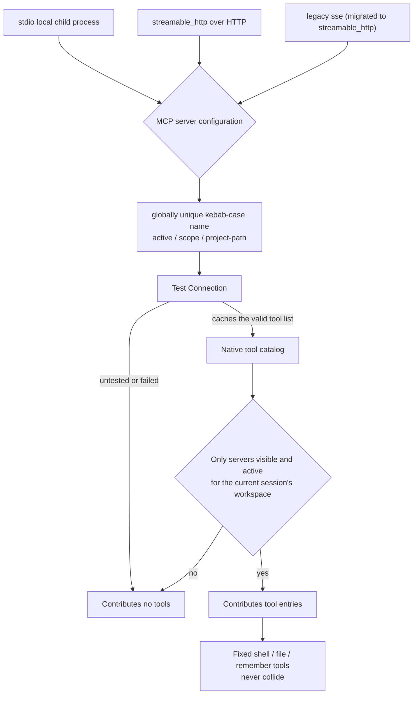

# MCP tools and clients

VaneHub integrates Model Context Protocol (MCP) servers in two layers: client configuration/management, and exposure of a server's tools in the native Agent tool catalog.

## Background: the MCP protocol

MCP (Model Context Protocol) is Anthropic's standardized protocol for the question of how an AI model connects to external data sources and tools. The usual analogy is USB-C for AI: before MCP, every AI application wiring itself to Slack, GitHub, or a database wrote its own glue code — the M×N problem. MCP turns that into M+N, because a tool vendor implements an MCP server once and any MCP-capable client can connect to it.

### The core architecture: host, client, server

- **Host** — the application running the LLM, which is VaneHub AI here. It manages interaction and permissions, creates and maintains client instances, and aggregates several servers' capabilities before handing them to the LLM.
- **Client** — the connection manager inside the host, holding a **one-to-one** session with a single server and owning protocol handshake, capability negotiation, and message exchange.
- **Server** — the side exposing capabilities, usually a separate process, offering functionality through standardized primitives. The message format is JSON-RPC 2.0.

### The three primitives a server exposes

| Primitive | Controlled by | Analogy | Example |
| --- | --- | --- | --- |
| **Tools** | The model, which decides when to call | A function in function calling | `create_issue`, `query_database` |
| **Resources** | The application, which decides when to read and inject into context | A read-only data source | File content, schemas, structured API data |
| **Prompts** | The user, who triggers explicitly | A preset prompt template or slash command | `/summarize-pr` |

"Who controls the timing of a call" is a design principle the MCP specification states explicitly: tools are the model's judgment, resources are the application layer's decision about what context to inject, and prompts are triggered by the user.

### Transport types

- **stdio** — the server starts as a local child process and the host communicates over stdin and stdout (`relay_stdio` and `bounded_stdio` here). Latency is low and no network is needed, but it only runs locally, which suits filesystem, local Git, and local database servers.
- **Streamable HTTP** — the server is deployed independently as an HTTP service with SSE streaming support. It is the newer specification's consolidation of the earlier "HTTP+SSE" approach, suits remote and cloud services, and requires handling authentication.

### How MCP relates to function calling and Skills

The three layer and cooperate rather than exclude one another (see the three-layer table in [Skill management](skill-management.md)):

- **Function calling** is the protocol layer — the model emits a structured call intent.
- **MCP** is the connection layer — it standardizes who is called, how they are discovered, and how they are connected. The tools a server exposes are converted into function-calling tool schemas when passed to the model.
- **Skills** are the knowledge layer — they teach the model how to think and act, and a Skill can direct a model in using the tools a particular MCP server exposes.

In one sentence: **function calling is the mechanism by which a model emits a call intent, MCP is the protocol layer that routes that intent to a real tool and standardizes how tools are plugged in, and a Skill teaches the model when to call and what conventions to follow.**

## Server configuration model

An MCP server configuration has a globally unique kebab-case name; an explicit transport type (`stdio`, legacy `sse`, or `streamable_http`); transport-specific fields; description; active flag; scope; and project-path metadata. Unknown transport values are rejected — they are never silently reinterpreted as `stdio`. Historical `sse` rows are transactionally migrated to `streamable_http` so their previously effective protocol behavior is preserved.

## Tools in the native catalog

Alongside the fixed `shell`/`file`/`remember` tools, the native tool catalog includes bounded entries exposed by MCP servers that are **visible and active** for the current session's workspace folder. The catalog uses each server's most recently cached valid tool list from a "Test Connection" result — not a live connection made at catalog-build time. Consequences:

- An untested or failed server contributes no tools.
- An inactive or out-of-scope server contributes no tools.
- MCP catalog names never collide with or shadow the fixed `shell`/`file`/`remember` tools.
- A catalog lookup failure degrades gracefully: the generation proceeds with only the fixed catalog rather than failing.

## Transports and the relay

The full path from an MCP server's configuration into the native tool catalog looks like this. All three transports normalize to one configuration model at the entrance, and only tools cached by a "Test Connection" ever reach the catalog.

**The relay**: VaneHub AI can act as a proxy between a CLI and an MCP server, marked by `RELAY_FLAG` = `--vanehub-mcp-relay`. Only Claude Code and Codex CLI take the relay path. Gemini CLI, OpenCode, and Antigravity CLI configure MCP independently, and their MCP calls do not enter VaneHub AI's execution trace. The relay filesystem is isolated by `PrivateRelayDirectory` to prevent cross-session and cross-Agent interference.

**Catalog degradation**: an untested or failed server contributes no tools, and so does an inactive server or one outside the current session's scope. MCP catalog names never collide with or shadow the fixed `shell`, `file`, and `remember` tools. When the catalog lookup itself fails, degradation is graceful — the generation proceeds with only the fixed catalog rather than failing the whole request.

## Key constants and transports

The MCP infrastructure lives in `tooling/mcp/infrastructure/`, implemented across the `relay_*.rs` modules:

- **Three transports** — `stdio` (a local child process with bounded reads and writes through `bounded_stdio`), `streamable_http` (over HTTP, through the streamable HTTP protocol module), and legacy `sse` (transactionally migrated to `streamable_http` through the `relay_legacy_sse*` modules, preserving its previously effective protocol behavior). An unknown transport value is rejected and never silently reinterpreted as `stdio`.
- **The relay flag** `RELAY_FLAG = "--vanehub-mcp-relay"` in `relay.rs` — only Claude Code and Codex CLI take the relay path, where VaneHub AI proxies JSON-RPC between the CLI and the MCP server. Gemini CLI, OpenCode, and Antigravity CLI configure MCP independently and their MCP calls stay out of VaneHub AI's execution trace.
- **`PrivateRelayDirectory`**, from `platform::private_relay_fs` — the isolated relay filesystem directory that prevents cross-session and cross-Agent interference. Startup scavenges stale directories through `PrivateRelayDirectory::scavenge_stale()`.
- **JSON-RPC frame parsing** in `relay_jsonrpc.rs` — `parse_json_rpc_frame` parses a frame, and `JsonRpcFrame` and `JsonRpcId` handle request-response pairing.
- **Failure observation** in `relay_failure.rs` — relay failures are classified as `RelayFailure`, and the relay observer records diagnostic events such as `mcp_relay_enabled` and `mcp_relay_terminated`, carrying safe metadata only.
- **The configuration model** — an MCP server configuration has a globally unique kebab-case name, an explicit transport type, transport-specific fields, an active flag, a scope, and project-path metadata. Catalog construction uses each server's most recently cached valid tool list from a "Test Connection" result, **not a live connection opened at catalog-build time**.

## One architecture for CLI Agents and OnePiece

MCP configuration and the catalog are **managed uniformly** — one server configuration model (kebab-case name, transport, active flag, scope, project path) applies to every Agent. The shared parts are:

- **One MCP server configuration**, independent of the consumer. A server is configured once, and every server that is visible and active for the current session's workspace contributes tools.
- **One Test Connection cache** — catalog construction uses each server's most recently cached valid tool list rather than opening a live connection.
- **One catalog degradation rule** — an untested, failed, inactive, or out-of-scope server contributes no tools, and when the lookup fails every consumer degrades gracefully to the fixed tools alone.

The difference is the **transport path**, because a CLI process and OnePiece have different runtime shapes:

| Dimension | Claude Code / Codex CLI | Gemini CLI / OpenCode / Antigravity CLI | OnePiece native Agent |
| --- | --- | --- | --- |
| Uses the relay | **Yes** (`RELAY_FLAG` = `--vanehub-mcp-relay`) — VaneHub AI proxies JSON-RPC between the CLI and the MCP server | No — each configures MCP independently | Included directly through the native tool catalog |
| Enters the execution trace | Relayed calls do enter VaneHub AI's execution trace | **No** — a black box | Native fidelity, expandable layer by layer in a trace |
| Filesystem isolation | Relay files isolated by `PrivateRelayDirectory` | Managed by each CLI itself | The same catalog space as the fixed tools |

**Managing MCP statistically** applies to the relay path: relay failures are classified as `RelayFailure`, and the relay observer records diagnostic events such as `mcp_relay_enabled` and `mcp_relay_terminated`. Non-relayed CLIs and OnePiece both obey the same constraint that a catalog name never collides with or shadows the fixed `shell`, `file`, and `remember` tools.

## Where the design lives

This chapter orients contributors. The authoritative requirements live in the specs.

- [openspec/specs/mcp-client-management](../../../openspec/specs/mcp-client-management/spec.md) — configuration model, transports, migration.
- [openspec/specs/agent-mcp-tools](../../../openspec/specs/agent-mcp-tools/spec.md) — MCP-sourced tools in the native catalog.

MCP configuration lives in the `tooling` bounded context; see [Native bounded contexts](native-contexts.md).
