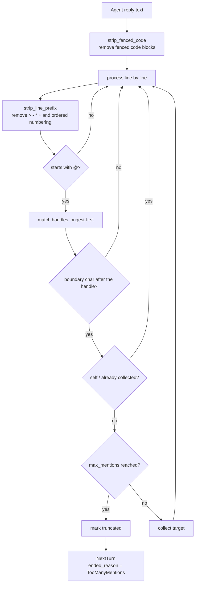

# Multi-Agent group chat

A multi-Agent session composes several Agents into one shared thread. The design replaces an earlier "multi-agent coordination" model (archived under `2026-08-06-remove-multi-agent-coordination`) with seat-based group chat.

The authoritative requirements — seat assignment, mid-session seat changes, turn routing, and presence — live in [openspec/specs/multi-agent-group-chat](../../../openspec/specs/multi-agent-group-chat/spec.md). This chapter explains how they are met and where. For the user-facing workflow, see the user guide.

## Why Multi-Agent at all

A single Agent hits a ceiling on complex work in three ways: **context overload**, where one Agent plans, executes, and verifies from a bloated prompt with diluted attention; **capability coupling**, where a generalist Agent cannot reach expert level on every subtask; and **no fault isolation**, where a single point of failure takes the whole chain down. A multi-Agent system addresses these through **role specialization** and **fault isolation**.

### Single-Agent versus Multi-Agent

| Dimension | Single Agent | Multi-Agent |
| --- | --- | --- |
| Context management | One prompt carries every responsibility and bloats easily | Each Agent's context is independent, with clear responsibility boundaries |
| Capability depth | Generalist | Prompt, model, and tool set can be tailored per subtask |
| Parallelism | Inherently serial | Fan-out can run in parallel, shortening overall latency |
| Fault isolation | A single point of failure affects everything | Failures are isolated to one Agent or branch |
| Debuggability | Logic is centralized and simpler | Needs additional observability through traces and logs |
| Cost | Low per-call cost | More calls and more turns raise both tokens and latency |
| Failure recovery | Usually a whole retry | The failing sub-step can be retried or degraded on its own |

### Common misconceptions

- **That Multi-Agent always beats single-Agent** — coordination overhead and consistency problems can cancel out the gains of specialization, and on simple tasks a single Agent is usually faster and cheaper.
- **That more Agents is better** — each added Agent grows the communication paths and potential failure points non-linearly.
- **That Multi-Agent substitutes for good prompt design** — with a well-designed single-Agent prompt, many tasks that look like they need several Agents do not.

### Choosing an approach

| Situation | Recommendation |
| --- | --- |
| Simple task with a low latency budget | Single Agent |
| Complex task with fixed steps | Single Agent plus a structured, step-by-step prompt |
| Task decomposable into independent subtasks | Multi-Agent (parallel) |
| Quality needs iterative improvement | Multi-Agent (reviewer) |
| Multiple perspectives need arguing out | Multi-Agent (debate) |
| The system will keep gaining new capabilities | Multi-Agent (hierarchical or supervisor) |

VaneHub AI's Multi-Agent group chat uses the **Swarm (peer handoff)** model — no central dispatcher, with seats routing autonomously between themselves through `@` handoffs. See [Seats, not positions](#seats-not-positions) and [Handoff parsing](#handoff-parsing) below.

## Seats, not positions

A multi-Agent session is composed of **seats**. Each seat pairs one expert role with one Agent, so a role is reusable across sessions and an Agent may play different roles in different sessions. Seat identity is stable and not derived from array position, so seats can be added to and removed from a running session while preserving identity and history for every participant that has joined. A newly added seat becomes routable from the next turn and receives the preceding thread within its context budget.

The data model is one struct (`src-tauri/src/contexts/sessions/domain/session_seat.rs:19-27`):

```rust,ignore
pub(crate) struct SessionSeat {
    pub(crate) seat_id: String,
    pub(crate) agent_id: String,
    /// `None` for a plain single-Agent session, which has no role assigned.
    pub(crate) role_id: Option<String>,
    pub(crate) role_snapshot: Option<SessionSeatRoleSnapshot>,
    pub(crate) joined_at: String,
    pub(crate) left_at: Option<String>,
}
```

**Seats live in a JSON column rather than a join table**, and the reason is stated at the top of the file (`session_seat.rs:1-5`): `SESSION_SELECT` is the hot path for listing, searching, and reading, and adding a join there for a feature most sessions never use would make every read pay for it.

**Corrupt data degrades to a single seat rather than erroring** (`decode_seats` at `session_seat.rs:60-65`): seats were added to a table that already held data, so sessions that predate seats — or whose column was written badly — must still open. A cosmetic problem should not become a lost session.

A single-Agent session's seat has `role_id` of `None` (`session_seat.rs:22-23`), derives no handle, and takes no part in handoffs. Group chat is a superset of a single-Agent session.

## Handle derivation

Handles are generated from the role name (`derive_mentions` at `src-tauri/src/contexts/agent_runtime/domain/seat_roster.rs:69-88`), by three rules:

| Rule | Handling | Reason |
|---|---|---|
| Whitespace collapses to `-` | `代码 审查` → `代码-审查` | The handle is typed after `@`, and whitespace would truncate the token |
| Empty-name fallback | The nth seat → `席位n` | It must remain addressable when the role name is missing |
| Collision suffix | A second `评审` → `评审-2` | Two reviewers in one session is a reasonable line-up; a collision should be distinguished, not rejected |

## Handoff parsing

`parse_handoff_mentions` (`src-tauri/src/contexts/agent_runtime/domain/seat_turn.rs:139-183`) is the most carefully built piece of this design, and every rule guards against something that really goes wrong:



**1. An `@` inside a fenced code block does not count** (`strip_fenced_code` at `seat_turn.rs:120-133`). An Agent pasting sample code containing `@reviewer` should not trigger a handoff.

**2. Quote and list markers do not affect recognition** (`strip_line_prefix` at `seat_turn.rs:46-67`): `>`, `-`, `*`, `+`, and ordered-list numbering are stripped — an Agent writing a checklist is still addressing someone.

**3. Longer handles match first** (`seat_turn.rs:145-147`): if both `opus` and `opus-45` exist, the shorter would match first and swallow the longer. Sorting descending removes the ambiguity; the tests verify it with the handle set `["架构师", "代码审查", "实现者", "opus", "opus-45"]` (`seat_turn.rs:258`).

**4. A boundary character must follow the handle** (`is_boundary` at `seat_turn.rs:80-117`): `@opus45` must not match `opus`. Boundary characters cover both Latin and CJK punctuation.

**5. Self-mentions and duplicates are skipped** (`seat_turn.rs:169-170`): an Agent cannot hand the turn to itself, and naming the same target twice counts once.

### Chain depth limits

`next_turn_targets` checks depth before parsing (`seat_turn.rs:190-205`). The limit exists because Agents mention each other autonomously; without it, two Agents could ping-pong forever. When it fires, the reason is surfaced explicitly rather than letting the chain stop quietly.

The constants live at `src-tauri/src/contexts/agent_runtime/application/seat_turn.rs:29-30`:

| Constant | Value | What it governs |
|---|---|---|
| `MAX_CHAIN_DEPTH` | 15 | How many hops one handoff chain may take |
| `MAX_MENTIONS_PER_REPLY` | 2 | How many seats one reply may mention |

Two forced termination reasons (`ChainEndReason` at `seat_turn.rs:11-14`): `TooManyMentions` and `MaxDepth`. **A normal ending is not a failure** (`NextTurn` at `seat_turn.rs:18-23`): an `ended_reason` of `None` means the chain ran out of mentions. Conflating the two would make every normal ending look like an error.

### Where a user message goes

The human addresses a seat the same way the Agents address each other. `route_user_message`
(`seat_turn.rs`, next to `next_turn_targets`) resolves the first turn of a round in three steps:
a line-leading `@handle` dispatches that seat; an unaddressed message continues with whoever last
held the turn; a thread nobody has spoken in yet goes to the first seat. One target only — a
person naming two seats is asking for two rounds, and the second would start against a thread the
first has already moved on from. The same parser rules apply as for Agent handoffs, so a mid-line
or fenced `@` from the human does not address anyone either.

**The addressed seat answers with its own Agent, not the session's.** The session's `agent_id`
mirrors the first seat, so `send_message_internal` builds the turn's configuration around the
routed seat's Agent (`seat_chat_configuration`); invoking the mirrored Agent would answer as one
participant under another's name. Until 2026-08, `initial_seat_turn_context` unconditionally took
`roster.first()` — every user message was answered by seat one and the frontend's
`routeUserMessage` had no caller. The desktop suite below is what caught it.

### Message attribution is by stable seat id

`start_generation` stamps each assistant row with `speaker_seat_id` and deliberately leaves the
numeric `seat_index` null; the index survives only as read-side compatibility for rows written
before migration 59. Anything resolving a live thread's speakers must go through `seat_speaker`
(`application/seat_turn.rs`), which prefers the stable id and falls back to the index. A reader
keyed on `seat_index` alone sees every live message as unattributed — that exact fault once made
`seat_turn_prompt` label every teammate's turn as the human's in the next seat's context, and it
survived unit tests because the fixture filled both fields where production fills one.

## Handing back to a human

The handle is the `USER_MENTION` constant at `seat_turn.rs:42`. Three intents (`HumanHandoffIntent` at `seat_turn.rs:28-32`) are decided by the word after it (`parse_human_handoff` at `seat_turn.rs:212-229`, case-insensitive), and each produces a different turn effect (`HumanHandoffEffect` at `seat_turn.rs:36-40`):

| Intent | `turn_holder_is_human` | `round_complete` | `starts_waiting` |
|---|---|---|---|
| `Fyi` | `false` | `false` | `false` |
| `Handoff` | `true` | `false` | `true` |
| `Done` | `true` | `true` | `false` |

**A bare mention defaults to `Fyi`**, and the comment states why (`seat_turn.rs:208-211`): an intentless mention is informational, not blocking. Blocking by default would punish the Agent for mentioning a human at all, and it would learn to stop. **Only `handoff` interrupts** (`apply_human_handoff` at `seat_turn.rs:233-251`).

```rust,ignore
const USER_MENTION: &str = "@用户";
```

**This constant is not localized**, and the frontend carries the same literal (`src/services/human-handoff.ts:10`). Handing back to a human requires that exact string in every interface language, while the intent keywords are English. It is a mirrored implementation with no shared source of truth: both copies must change together.

## Seat briefing

Every seat receives a roster before it speaks (`SeatBriefingEntry` at `seat_roster.rs:32-40`), carrying `mention`, `role_name`, `agent_name`, `model_family`, `responsibility`, and `instruction`.

**This briefing is the only channel through which an Agent learns the collaboration rules** (`build_seat_briefing` at `seat_roster.rs:146-199`), so it is worded as behavior rather than documentation: an Agent that does not know the line-start rule will write a mention mid-sentence, and a mid-sentence mention does not route. `responsibility` comes from the expert role and is required — it is what other Agents use to judge who to hand the turn to.

## Model-family determination

Four families (`ModelFamily` at `seat_roster.rs:12-17`): `anthropic`, `openai`, `google`, `unknown`. The enum mirrors the frontend's `src/services/model-family.ts`.

Stable ids take priority (`family_by_agent_id` at `seat_roster.rs:91-104`), because they do not drift the way display text does:

| Agent id | Model family |
|---|---|
| `claude-code` | `Anthropic` |
| `codex-cli` | `OpenAi` |
| `gemini-cli` | `Google` |
| `antigravity-cli` | `Google` |
| `opencode` | `Unknown` |

**`opencode` is explicitly `Unknown` rather than a guess** (`seat_roster.rs:99-101`): it drives whatever model the user configured, so it has no fixed family, and claiming one would build the cross-family review check on a false premise. An expert role's `require_different_family` depends on this. `normalize_model_family` (`seat_roster.rs:107-134`) resolves by stable id first, then the provider display text, then the endpoint type.

## Context delivery

Two modes (`SeatContextMode` at `seat_roster.rs:51-55`). `Resume` injects nothing because that Agent's own session already holds the history; `Inject` supplies the prior shared thread.

`build_seat_context` (`seat_roster.rs:210-240`) keeps the most recent turns within a **character** budget rather than a byte budget, because these threads are predominantly Chinese. The latest exchange is what the seat is being asked to act on; the oldest can usually be recovered from the project itself.

## Mirrored implementation

Routing exists both in the native layer (`agent_runtime/domain/seat_turn.rs`) and in the frontend (`src/services/mention-routing.ts`, `human-handoff.ts`). The native copy exists because sessions can run with no UI — IM connectors and scheduled tasks start sessions headlessly, and routing built in the frontend would never reach them (file header at `seat_turn.rs:1-5`). Both must be updated together when a routing rule changes.

## Verifying a change to this design

Group chat has a dedicated end-to-end suite at `tests/e2e/multi-agent-session.spec.ts`:

| Spec | What it covers |
|---|---|
| `the multi-Agent mode is offered and composes a line-up` | Multi-Agent mode and the default seats |
| `a seat can be added and removed before the session is created` | Adding and removing members before creation |
| `a multi-seat session shows its seats and switches a seat-scoped tab` | Seat display and seat-scoped views |
| `a running shared session exposes roster presence...` | The member strip, runtime add/remove, and `@` completion |
| `a single-Agent session offers no seat switcher` | Single-Agent regression protection |

Run one spec, watch the browser, or open a trace after a failure:

```powershell
npx playwright test tests/e2e/multi-agent-session.spec.ts --grep "running shared session"
npx playwright test tests/e2e/multi-agent-session.spec.ts --headed
npx playwright show-trace test-results\<failing-spec-directory>\trace.zip
```

The user guide's [group chat collaboration case](../../user-guide/en/src/multi-agent-testing-tutorial.md) walks the same ground manually, and its checkpoints map onto these specs. Beyond them, a change here runs the repository's full verification set — see [Testing, packaging, and release](testing-and-release.md).

**Web/mock verifies the interface, seat changes, and `@` completion, but starts no CLI.** Real Agent replies and automatic handoff require the Tauri desktop runtime.

## Live desktop verification (WebdriverIO)

The desktop suite under `tests/desktop/specs/` runs the real Tauri client with real installed
CLIs (this host: claude-code, codex-cli, opencode) and is where the routing and attribution
defects above were found and proven fixed. Six specs cover group chat, at increasing depth:

| Spec | What it proves live |
|---|---|
| `domain-multi-agent.e2e.mjs` | A seated role yields an addressable handle; one Agent's reply relays the turn to another |
| `domain-multi-agent-routing.e2e.mjs` | Human routing by mention, last-holder fallback, a three-seat chain (human → seat → seat), a claude+codex+opencode trio each answering its own mention, and the departed-seat fallback |
| `domain-multi-agent-business.e2e.mjs` | One real coding task through 架构师 → 实现者 → 代码审查 across three heterogeneous CLIs: the implementer's file lands in the session repository, the reviewer reads it, `@用户 done` closes the round |
| `domain-multi-agent-project.e2e.mjs` | A three-file project through TWO relay rounds: the review sends work back and the implementer takes a second turn on the same thread (chain depth 3, re-dispatch of an already-spoken seat). The correctness judge is `python3 -m unittest` run by the harness, never the Agent's own claim |
| `domain-multi-agent-human-decision.e2e.mjs` | A blocking `@用户 handoff` stops the round — including suppressing the teammate that the same reply names — and an unaddressed human answer resumes it with the seat that asked |
| `ui-multi-agent.e2e.mjs` | The same runtime driven through the DOM: the members pane grows the roster by one seat (backend-verified, role included), typing `@` offers every seat, picking one with the pointer routes the send, and the reply bubble paints that seat's role label and colour dot |

Conventions these specs settled on, learned from failing runs:

- **Assert on dispatch, not on the reply text.** The assistant row is written with its
  `speakerSeatId` before the provider is invoked, so the row is the routing verdict; waiting on
  model output measures a provider's mood instead.
- **Address turns by ordinal once any seat can speak twice** — "the seat's row" stops
  identifying a turn in a multi-round thread.
- **Mandated relays are asserted as the thread's prefix, not its entirety.** Agents own the
  tail: one honest run had the implementer voluntarily hand its rework back for a second review,
  which is the collaboration working.
- **A provider declining an instruction is reported as `BLOCKED`, never failed** — the suite
  cannot hold a model to an instruction, only observe it.
- **A pause is an absence, so assert it over a window, not at an instant.** The coordinator polls
  terminals every 200ms, so a round that failed to stop dispatches within a second or two; the
  human-decision spec watches for thirty seconds of silence, which makes the absence evidence
  rather than luck.
- **Preserve evidence on failure**: a failed flow keeps its session in the run's isolated
  database instead of deleting it in `after`. `VANEHUB_DESKTOP_KEEP_SESSIONS=1` keeps every
  session even on success, so a person can open the test client against the run's
  `VANEHUB_APP_DATA_DIR` (plus `VANEHUB_CLI_CONFIG_HOME`) and inspect the threads by eye.

Two WebKitGTK driver quirks worth knowing before writing more UI cases: `selectByVisibleText`
clicks the option without firing `change`, so React state keeps the old value while the DOM shows
the new one (dispatch a real `change` through the prototype value setter instead); and
`list_agents` races CLI detection for a few seconds after boot, so gate on availability rather
than asking once.

## What live verification established about the environment

These are properties of hosts and permission templates, not defects in the routing — but a group
chat that is expected to *act* runs into all of them:

- **A seat turn is headless, so `standard` templates dead-end.** `standard` means
  ask-before-acting, and nobody is at the prompt: claude-code under `permissionMode=default`
  declines writes outright. Acting seats need `trusted`.
- **claude-code's `trusted` and `yolo` both project to `acceptEdits`** — file edits are
  auto-approved, shell commands are not. A claude seat asked to run its own tests will,
  correctly, halt the round with a line-leading `@用户 handoff`; command approval belongs to the
  permission-hook relay, which an isolated test run deliberately does not install. Design tasks
  so the harness runs the verification commands.
- **codex-cli's `workspace-write` sandbox cannot start where unprivileged user namespaces are
  restricted** (`kernel.apparmor_restrict_unprivileged_userns=1`, the Ubuntu 24.04+ default):
  bwrap fails with `loopback: Failed RTM_NEWADDR: Operation not permitted`, and both `standard`
  and `trusted` map codex to `workspace-write`, so no assignable template lets a codex seat write
  on such a host — silently. Seat codex where its work is words until that gap has a diagnostic.
- **CLI global configuration is normal user state and must not leak from tests.** Assigning
  claude-code a template installs the permission hook into `~/.claude/settings.json`; an e2e run
  once wrote the user's real file, where the hook outlived the test app and blocked every later
  tool call against a dead approval server. `VANEHUB_CLI_CONFIG_HOME` (honoured by
  `NativeCliGlobalConfigAdapter`, supplied by the desktop run context) now isolates those writes
  the way `VANEHUB_APP_DATA_DIR` isolates the database.

## Why there is no orchestrator

Group chat is deliberately decentralized: the spec's "No dispatch control is offered" requirement
places routing with the Agents and with mentions, and coordination is carried by protocol —
line-leading `@` handoffs, the two-mention and depth-15 bounds, and the three `@用户` intents.
The `seat_turn_coordinator` is infrastructure (the thread that drives turns serially), and
`loop_orchestrator` belongs to the Loop runtime — neither is an orchestrator seat.

How the industry's multi-agent patterns map onto this design:

| Pattern | Representatives | Mechanism | Distance from VaneHub |
|---|---|---|---|
| Decentralized handoff | OpenAI Swarm / Agents SDK handoffs | An Agent finishing its turn explicitly passes control to the next | **This is what VaneHub is** — `@` is the handoff |
| Centralized supervisor | LangGraph supervisor pattern, CrewAI hierarchical (manager agent) | One manager node receives every output, picks the next executor each round, and converges the result | Would break the current no-dispatch-control requirement |
| Speaker selection | AutoGen GroupChat (a manager picks the next speaker by LLM or round-robin) | Weak orchestration: chooses who talks, gives no instructions | In between the two |
| Orchestrator–worker | Anthropic's multi-agent research system, Claude Code subagent dispatch | The orchestrator decomposes a task, fans workers out **in parallel**, joins results; workers do not talk to each other | Farthest away: VaneHub seats are deliberately serial, because a later seat must read what earlier seats produced |
| SOP pipeline | MetaGPT | Fixed roles pass artifacts through a fixed sequence of stages | The 架构师 → 实现者 → 代码审查 convention is a soft SOP already |

The rough industry experience: central orchestration pays off for **parallel research and
retrieval** shapes (Anthropic's research system is the canonical case), while **sequential
collaboration** — code, where each hand depends on the previous hand's artifact — favors handoff:
simpler, linear in tokens, and the thread stays legible to the human. The recurring costs of a
central orchestrator: it becomes a single point of failure (one confused turn derails the whole
round), every hop adds a model round trip (latency and cost roughly double), and on long tasks
the orchestrator's own context balloons.

The recommendation this chapter records is to stay with handoff and take three steps in order:

1. **Zero change, works today: an "orchestrator" as a custom expert role.** Its responsibility
   and instruction say decompose → dispatch one `@` at a time → verify the artifact → `@用户
   done`. It holds no runtime privilege — the same mention rules, depth bound, and two-mention
   truncation apply — and the live project-flow spec already shows a plain 架构师 role carrying
   exactly this light orchestration, with rounds converging naturally and even a voluntary extra
   review loop. For serial work this covers most of what an orchestrator is for.
2. **Small protocol additions, worth doing.** `MAX_MENTIONS_PER_REPLY=2` executes serially, but
   there is no join semantics — no "when both are done, come back to me". A lightweight
   return-to-sender rule (a dispatched seat that names nobody hands the turn back to whoever
   dispatched it) is a one-line routing extension that stays decentralized. The paused →
   human-decides → round-resumes half of the `@用户 handoff` path was the other gap here, and
   `domain-multi-agent-human-decision.e2e.mjs` closed it; join semantics remain open.
3. **Only on real evidence, consider a supervisor.** The trigger should be observed failures of
   the protocol — chains repeatedly spinning into the depth limit, humans constantly rescuing
   rounds by hand, or genuinely parallel task shapes (multi-repository research). That is an
   architecture change, not a new role: it starts with an OpenSpec proposal revising the
   no-dispatch-control requirement, and must answer what happens to a round when the
   orchestrator itself fails.

## Runtime shapes of a seat's Agent

A seat in a group chat can be bound to a built-in CLI Agent or to the OnePiece native Agent. Their runtime shapes differ, but both are covered by the same seat, handoff, and briefing mechanisms:

| Dimension | Built-in CLI Agent seat | OnePiece native Agent seat |
| --- | --- | --- |
| How it starts | Through the Agent Terminal as a PTY child process, with VaneHub AI starting and managing the CLI process | Calls the provider over HTTP inside the application, starting no external process |
| Context delivery | `Resume` or `Inject` mode, keeping recent turns within a character budget | The same `Resume` and `Inject` mechanism, with the system prompt assembled through `AgentSkillPort` and the context engine |
| Observability | The CLI's internals are a black box, so traces stop at the boundary (opaque fidelity) | Native fidelity, with tool calls expandable layer by layer in a trace |
| Model-family determination | `claude-code` → Anthropic, `codex-cli` → OpenAI, `gemini-cli` and `antigravity-cli` → Google, `opencode` → Unknown | Determined by the provider of its active Profile |

The seat briefing (`build_seat_briefing`) treats both shapes identically: before speaking, every seat receives the same roster — handles, role names, Agent names, model families, responsibilities, and instructions — and the responsibility field is mandatory. Handoff parsing (`parse_handoff_mentions`) is likewise uniform, keyed only on a line-leading `@` mention in the reply text, and does not branch on Agent shape. **Web/mock verifies the interface, seat changes, and `@` completion only, and starts no CLI** — real Agent replies and automatic handoff require the Tauri desktop runtime.

## Index of main code locations

| Concern | Location |
|---|---|
| Seat data model | `src-tauri/src/contexts/sessions/domain/session_seat.rs:19-27` |
| Seat JSON encoding/decoding, including degradation | `session_seat.rs:35` (`encode_seats`), `:65` (`decode_seats`) |
| Handle derivation | `src-tauri/src/contexts/agent_runtime/domain/seat_roster.rs:69-88` |
| Handoff parsing (the five defenses) | `src-tauri/src/contexts/agent_runtime/domain/seat_turn.rs:139-183` |
| Chain depth limit | `seat_turn.rs:190-205` (`next_turn_targets`) |
| User-message routing | Native `route_user_message` in `domain/seat_turn.rs`; web/mock `webRoutedSeatId` in `src/services/web-session-seat-client.ts` |
| Live-thread speaker resolution | `seat_speaker` in `src-tauri/src/contexts/agent_runtime/application/seat_turn.rs` |
| Chain limit constants | `src-tauri/src/contexts/agent_runtime/application/seat_turn.rs:29-30` |
| Handing back to a human | `seat_turn.rs:212-229` (parsing), `:233-251` (effects) |
| The user-mention literal | Native `seat_turn.rs:42`; frontend `src/services/human-handoff.ts:10` |
| Seat briefing generation | `seat_roster.rs:146-199` (`build_seat_briefing`) |
| Model-family determination | `seat_roster.rs:91-104`, `:107-134` |
| Context delivery | `seat_roster.rs:210-240` (`build_seat_context`) |
| Frontend seat assignment | `src/main-layout/session-seat-assignment.tsx` |
| Frontend `@` completion | `src/components/chat/SeatMentionCompletion.tsx` |
| Frontend turn status bar | `src/components/chat/TurnStatusBar.tsx` |

The native execution path sits in the `agent_runtime` bounded context described in [Native bounded contexts](native-contexts.md).
