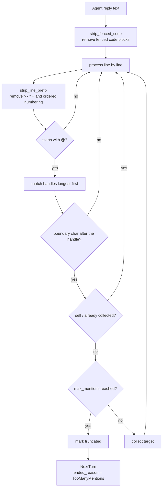

# Multi-Agent group chat

A multi-Agent session composes several Agents into one shared thread. The design replaces an earlier "multi-agent coordination" model (archived under `2026-08-06-remove-multi-agent-coordination`) with seat-based group chat.

The authoritative requirements — seat assignment, mid-session seat changes, turn routing, and presence — live in [openspec/specs/multi-agent-group-chat](../../../openspec/specs/multi-agent-group-chat/spec.md). This chapter explains how they are met and where. For the user-facing workflow, see the user guide.

## Seats, not positions

A multi-Agent session is composed of **seats**. Each seat pairs one expert role with one Agent, so a role is reusable across sessions and an Agent may play different roles in different sessions. Seat identity is stable and not derived from array position, so seats can be added to and removed from a running session while preserving identity and history for every participant that has joined. A newly added seat becomes routable from the next turn and receives the preceding thread within its context budget.

The data model is one struct (`src-tauri/src/contexts/sessions/domain/session_seat.rs:19-27`):

```rust,ignore
pub(crate) struct SessionSeat {
    pub(crate) seat_id: String,
    pub(crate) agent_id: String,
    /// `None` for a plain single-Agent session, which has no role assigned.
    pub(crate) role_id: Option<String>,
    pub(crate) role_snapshot: Option<SessionSeatRoleSnapshot>,
    pub(crate) joined_at: String,
    pub(crate) left_at: Option<String>,
}
```

**Seats live in a JSON column rather than a join table**, and the reason is stated at the top of the file (`session_seat.rs:1-5`): `SESSION_SELECT` is the hot path for listing, searching, and reading, and adding a join there for a feature most sessions never use would make every read pay for it.

**Corrupt data degrades to a single seat rather than erroring** (`decode_seats` at `session_seat.rs:60-65`): seats were added to a table that already held data, so sessions that predate seats — or whose column was written badly — must still open. A cosmetic problem should not become a lost session.

A single-Agent session's seat has `role_id` of `None` (`session_seat.rs:22-23`), derives no handle, and takes no part in handoffs. Group chat is a superset of a single-Agent session.

## Handle derivation

Handles are generated from the role name (`derive_mentions` at `src-tauri/src/contexts/agent_runtime/domain/seat_roster.rs:69-88`), by three rules:

| Rule | Handling | Reason |
|---|---|---|
| Whitespace collapses to `-` | `代码 审查` → `代码-审查` | The handle is typed after `@`, and whitespace would truncate the token |
| Empty-name fallback | The nth seat → `席位n` | It must remain addressable when the role name is missing |
| Collision suffix | A second `评审` → `评审-2` | Two reviewers in one session is a reasonable line-up; a collision should be distinguished, not rejected |

## Handoff parsing

`parse_handoff_mentions` (`src-tauri/src/contexts/agent_runtime/domain/seat_turn.rs:139-183`) is the most carefully built piece of this design, and every rule guards against something that really goes wrong:



**1. An `@` inside a fenced code block does not count** (`strip_fenced_code` at `seat_turn.rs:120-133`). An Agent pasting sample code containing `@reviewer` should not trigger a handoff.

**2. Quote and list markers do not affect recognition** (`strip_line_prefix` at `seat_turn.rs:46-67`): `>`, `-`, `*`, `+`, and ordered-list numbering are stripped — an Agent writing a checklist is still addressing someone.

**3. Longer handles match first** (`seat_turn.rs:145-147`): if both `opus` and `opus-45` exist, the shorter would match first and swallow the longer. Sorting descending removes the ambiguity; the tests verify it with the handle set `["架构师", "代码审查", "实现者", "opus", "opus-45"]` (`seat_turn.rs:258`).

**4. A boundary character must follow the handle** (`is_boundary` at `seat_turn.rs:80-117`): `@opus45` must not match `opus`. Boundary characters cover both Latin and CJK punctuation.

**5. Self-mentions and duplicates are skipped** (`seat_turn.rs:169-170`): an Agent cannot hand the turn to itself, and naming the same target twice counts once.

### Chain depth limits

`next_turn_targets` checks depth before parsing (`seat_turn.rs:190-205`). The limit exists because Agents mention each other autonomously; without it, two Agents could ping-pong forever. When it fires, the reason is surfaced explicitly rather than letting the chain stop quietly.

The constants live at `src-tauri/src/contexts/agent_runtime/application/seat_turn.rs:29-30`:

| Constant | Value | What it governs |
|---|---|---|
| `MAX_CHAIN_DEPTH` | 15 | How many hops one handoff chain may take |
| `MAX_MENTIONS_PER_REPLY` | 2 | How many seats one reply may mention |

Two forced termination reasons (`ChainEndReason` at `seat_turn.rs:11-14`): `TooManyMentions` and `MaxDepth`. **A normal ending is not a failure** (`NextTurn` at `seat_turn.rs:18-23`): an `ended_reason` of `None` means the chain ran out of mentions. Conflating the two would make every normal ending look like an error.

## Handing back to a human

The handle is the `USER_MENTION` constant at `seat_turn.rs:42`. Three intents (`HumanHandoffIntent` at `seat_turn.rs:28-32`) are decided by the word after it (`parse_human_handoff` at `seat_turn.rs:212-229`, case-insensitive), and each produces a different turn effect (`HumanHandoffEffect` at `seat_turn.rs:36-40`):

| Intent | `turn_holder_is_human` | `round_complete` | `starts_waiting` |
|---|---|---|---|
| `Fyi` | `false` | `false` | `false` |
| `Handoff` | `true` | `false` | `true` |
| `Done` | `true` | `true` | `false` |

**A bare mention defaults to `Fyi`**, and the comment states why (`seat_turn.rs:208-211`): an intentless mention is informational, not blocking. Blocking by default would punish the Agent for mentioning a human at all, and it would learn to stop. **Only `handoff` interrupts** (`apply_human_handoff` at `seat_turn.rs:233-251`).

```rust,ignore
const USER_MENTION: &str = "@用户";
```

**This constant is not localized**, and the frontend carries the same literal (`src/services/human-handoff.ts:10`). Handing back to a human requires that exact string in every interface language, while the intent keywords are English. It is a mirrored implementation with no shared source of truth: both copies must change together.

## Seat briefing

Every seat receives a roster before it speaks (`SeatBriefingEntry` at `seat_roster.rs:32-40`), carrying `mention`, `role_name`, `agent_name`, `model_family`, `responsibility`, and `instruction`.

**This briefing is the only channel through which an Agent learns the collaboration rules** (`build_seat_briefing` at `seat_roster.rs:146-199`), so it is worded as behavior rather than documentation: an Agent that does not know the line-start rule will write a mention mid-sentence, and a mid-sentence mention does not route. `responsibility` comes from the expert role and is required — it is what other Agents use to judge who to hand the turn to.

## Model-family determination

Four families (`ModelFamily` at `seat_roster.rs:12-17`): `anthropic`, `openai`, `google`, `unknown`. The enum mirrors the frontend's `src/services/model-family.ts`.

Stable ids take priority (`family_by_agent_id` at `seat_roster.rs:91-104`), because they do not drift the way display text does:

| Agent id | Model family |
|---|---|
| `claude-code` | `Anthropic` |
| `codex-cli` | `OpenAi` |
| `gemini-cli` | `Google` |
| `antigravity-cli` | `Google` |
| `opencode` | `Unknown` |

**`opencode` is explicitly `Unknown` rather than a guess** (`seat_roster.rs:99-101`): it drives whatever model the user configured, so it has no fixed family, and claiming one would build the cross-family review check on a false premise. An expert role's `require_different_family` depends on this. `normalize_model_family` (`seat_roster.rs:107-134`) resolves by stable id first, then the provider display text, then the endpoint type.

## Context delivery

Two modes (`SeatContextMode` at `seat_roster.rs:51-55`). `Resume` injects nothing because that Agent's own session already holds the history; `Inject` supplies the prior shared thread.

`build_seat_context` (`seat_roster.rs:210-240`) keeps the most recent turns within a **character** budget rather than a byte budget, because these threads are predominantly Chinese. The latest exchange is what the seat is being asked to act on; the oldest can usually be recovered from the project itself.

## Mirrored implementation

Routing exists both in the native layer (`agent_runtime/domain/seat_turn.rs`) and in the frontend (`src/services/mention-routing.ts`, `human-handoff.ts`). The native copy exists because sessions can run with no UI — IM connectors and scheduled tasks start sessions headlessly, and routing built in the frontend would never reach them (file header at `seat_turn.rs:1-5`). Both must be updated together when a routing rule changes.

## Verifying a change to this design

Group chat has a dedicated end-to-end suite at `tests/e2e/multi-agent-session.spec.ts`:

| Spec | What it covers |
|---|---|
| `the multi-Agent mode is offered and composes a line-up` | Multi-Agent mode and the default seats |
| `a seat can be added and removed before the session is created` | Adding and removing members before creation |
| `a multi-seat session shows its seats and switches a seat-scoped tab` | Seat display and seat-scoped views |
| `a running shared session exposes roster presence...` | The member strip, runtime add/remove, and `@` completion |
| `a single-Agent session offers no seat switcher` | Single-Agent regression protection |

Run one spec, watch the browser, or open a trace after a failure:

```powershell
npx playwright test tests/e2e/multi-agent-session.spec.ts --grep "running shared session"
npx playwright test tests/e2e/multi-agent-session.spec.ts --headed
npx playwright show-trace test-results\<failing-spec-directory>\trace.zip
```

The user guide's [group chat collaboration case](../../user-guide/en/src/multi-agent-testing-tutorial.md) walks the same ground manually, and its checkpoints map onto these specs. Beyond them, a change here runs the repository's full verification set — see [Testing, packaging, and release](testing-and-release.md).

**Web/mock verifies the interface, seat changes, and `@` completion, but starts no CLI.** Real Agent replies and automatic handoff require the Tauri desktop runtime.

## Index of main code locations

| Concern | Location |
|---|---|
| Seat data model | `src-tauri/src/contexts/sessions/domain/session_seat.rs:19-27` |
| Seat JSON encoding/decoding, including degradation | `session_seat.rs:35` (`encode_seats`), `:65` (`decode_seats`) |
| Handle derivation | `src-tauri/src/contexts/agent_runtime/domain/seat_roster.rs:69-88` |
| Handoff parsing (the five defenses) | `src-tauri/src/contexts/agent_runtime/domain/seat_turn.rs:139-183` |
| Chain depth limit | `seat_turn.rs:190-205` (`next_turn_targets`) |
| Chain limit constants | `src-tauri/src/contexts/agent_runtime/application/seat_turn.rs:29-30` |
| Handing back to a human | `seat_turn.rs:212-229` (parsing), `:233-251` (effects) |
| The user-mention literal | Native `seat_turn.rs:42`; frontend `src/services/human-handoff.ts:10` |
| Seat briefing generation | `seat_roster.rs:146-199` (`build_seat_briefing`) |
| Model-family determination | `seat_roster.rs:91-104`, `:107-134` |
| Context delivery | `seat_roster.rs:210-240` (`build_seat_context`) |
| Frontend seat assignment | `src/main-layout/session-seat-assignment.tsx` |
| Frontend `@` completion | `src/components/chat/SeatMentionCompletion.tsx` |
| Frontend turn status bar | `src/components/chat/TurnStatusBar.tsx` |

The native execution path sits in the `agent_runtime` bounded context described in [Native bounded contexts](native-contexts.md).
