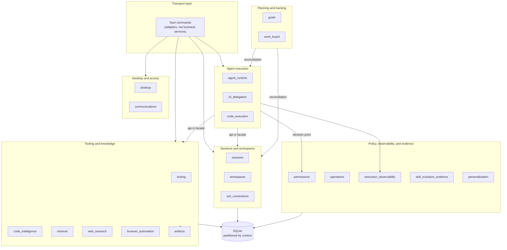

# Native bounded contexts

Native code is organized by **ownership**, not by UI page. Where a feature shows up on screen and who owns its code are two different questions.

`src-tauri/src/contexts/` currently holds **20 contexts**. The table below is the complete map — **the directory listing and the table must match one-for-one**; `npm run docs:links:check` compares them, and adding a context without adding its row here fails validation outright.

The diagram only draws **call direction** between contexts, not specific commands. The point: every cross-context arrow lands on the other side's `api.rs` facade — none points directly at another context's repository.

## The complete map

### Agent execution

| Context | Owns | Chapter |
| --- | --- | --- |
| `agent_runtime` | Agent registry, interaction modes, provider invocation, workflow state, and generation lifecycle | [Agent lifecycle](agent-lifecycle.md) |
| `cli_delegation` | Delegated CLI invocation for Claude Code and Codex: protocol handling, readiness, scheduling, circuit breaking, restart recovery, and the changeset capture/review/seal/apply pipeline | [CLI delegation](cli-delegation.md) |
| `code_execution` | Sandboxed code runtimes, the runtime catalog, execution workspaces, and readiness | [Extended tool contexts](extended-tool-contexts.md) |

### Sessions and workspaces

| Context | Owns | Chapter |
| --- | --- | --- |
| `sessions` | Sessions, messages, categories, chat configuration, export, maintenance, scheduled tasks, and usage records/read models | [Session recovery](session-recovery.md) |
| `workspaces` | Local/remote projects, worktrees, bounded file/Git inspection, and session shell lifecycle | [Terminal and PTY runtime](terminal-runtime.md) |
| `ssh_connections` | SSH connection profiles, host-key trust, credential loading, and the pooled remote runtime | [SSH connections and the remote runtime](ssh-connections.md) |

### Tooling and knowledge

| Context | Owns | Chapter |
| --- | --- | --- |
| `tooling` | CLI lifecycle, and the MCP, SDK, extension, plugin integration, Skill, Skill tool, and Prompt Hook subdomains | [CLI lifecycle](cli-lifecycle.md), [Skill management](skill-management.md), [MCP tools](mcp-tools.md) |
| `code_intelligence` | LSP server configuration, discovery, workspace trust, negotiated capabilities, and normalized diagnostics/hover/locations | [LSP code intelligence](lsp-code-intelligence.md) |
| `retrieval` | Retrieval configuration, embedding models, code and document indexing, index status, and search | [Retrieval and vector search](retrieval.md) |
| `web_research` | Guarded URL admission, public-URL resolution, fetching, extraction, binary artifact handling, and search | [Extended tool contexts](extended-tool-contexts.md) |
| `browser_automation` | Browser sidecar protocol, session and action policy, operation lifecycle, and artifact handoff | [Extended tool contexts](extended-tool-contexts.md) |
| `artifacts` | Content-addressed artifact blobs: media type and size validation, deduplication, and store capacity policy | [Extended tool contexts](extended-tool-contexts.md) |
| `local_media` | Local OCR, microphone capture and whole-utterance transcription, speech synthesis/playback, engine profiles and readiness, Python worker supervision, and ephemeral media lifecycle | [Local media runtime](local-media-runtime.md) |

### Policy, observability, and evidence

| Context | Owns | Chapter |
| --- | --- | --- |
| `permissions` | Permission policy evaluation, approval brokering, risk classification, and the Claude Code hook wait registry | [Permission model](permission-model.md) |
| `operations` | Observable task lifecycle and unified diagnostic/operation logging contracts | [Persistence and unified logging](persistence-and-logging.md) |
| `execution_observability` | Execution runs, spans, timelines, capture policy, and OTLP export settings | [Execution observability and Agent evaluation](execution-observability.md) |
| `skill_evolution_evidence` | Evidence envelopes, extraction, sanitization, attribution, feedback state, and encrypted evidence storage | [Skill evolution evidence](skill-evolution-evidence.md) |
| `personalization` | Layered instruction policy, governed memory records and candidates, effective-personalization resolution, and memory maintenance | [Cross-session memory](cross-session-memory.md) |

### Planning and tracking

| Context | Owns | Chapter |
| --- | --- | --- |
| `goals` | Goal aggregates, links to loops, work items, and sessions, legacy Plan-link display, derived acceptance readiness, and human acceptance transitions | [Goals and the work board](goals-and-work-board.md) |
| `work_board` | Work items, their stages and priorities, and idempotent reconciliation of sessions and scheduled tasks into cards | [Goals and the work board](goals-and-work-board.md) |

### Desktop and access

| Context | Owns | Chapter |
| --- | --- | --- |
| `desktop` | App settings, startup, data/log directory actions, floating assistant, and window/tray lifecycle | [Runtime and service boundaries](runtime-boundaries.md) |
| `communications` | IM connector configuration, credentials, protocol adapters, routing, and delivery lifecycle | [IM connectors](im-connectors.md) |

## How contexts talk to each other

Every context publishes an `api.rs` facade for in-process consumers. Three rules:

- **Cross-context calls default to the synchronous application API.** Explicit events are used only when a completed action needs an independently handled downstream reaction.
- **No context reaches directly into another context's storage or infrastructure.** When `agent_runtime` consumes `sessions`, it only goes through the facade `sessions` publishes in `api.rs`, never its repository.
- **Bootstrap modules compose concrete dependencies at the application edge**; a context itself never knows another context's implementation types.

`retrieval` is a textbook example of this rule: it owns the persistent code-index workspace identity and consumes workspace roots at the composition edge, but **never imports the `workspaces` repository**.

Tauri commands are **transport adapters, not business services**. Cross-command error values are mapped to safe strings or explicit transport error DTOs.

## Primary facades and owned tables

This table covers only the eight earliest-established contexts, whose table structure has stayed the most stable. For the rest, the generated [native API reference](native-api-reference.md) is authoritative.

| Context | Primary capability published by `api.rs` | Key owned SQLite tables (partitioned by migration) |
| --- | --- | --- |
| `agent_runtime` | Agent query, workflow, readiness, launch, messaging, stop; Loop runtime and session Plan safety; seat handoff; code-intelligence ports | `expert_roles`, `onepiece_provider_profiles`, `hybrid_model_routing_rules` |
| `sessions` | Create/query/search/switch/rename/pin/archive/delete, categories, chat configuration, message persistence/composition, export, usage, maintenance | Session/message/category/configuration/usage tables |
| `workspaces` | Project/history/worktree, bounded queries, shell lifecycle | Projections over existing tables |
| `tooling` | CLI parameters, MCP management, SDK, extensions, plugins, Skill, Prompt Hook | Each subdomain's own tables |
| `communications` | Connector management, runtime, routing, binding, deduplication, WeChat authorization | Connector/routing/binding/dedup/checkpoint tables |
| `desktop` | Settings/environment, floating assistant, lifecycle | Settings/floating repository tables |
| `operations` | Observable operations, unified diagnostic/operation logging contract | Operation/log correlation tables |
| `retrieval` | Memory retrieval, code search, index coordination, embedding confirmation | Memory files, code manifest/chunk/symbol/vector |

## Retrieval and workspace code

`retrieval` owns the persistent code-index workspace identity, configuration, file manifests, chunks, symbols, vectors, and bounded local audit records. `agent_runtime` consumes only the typed code-retrieval port and supplies the current session folder; **the model cannot provide a workspace id or folder to `search_code`**.

The native worker performs metadata-first reconciliation and reads or parses only new or changed files. Tree-sitter grammars, chunking queries, and redaction policy share one version marker (`CODE_INDEX_VERSION`). Workspace-code embedding is gated by an explicit confirmation tied to workspace id, generation, provider profile, and model. FTS remains workspace-scoped and available before confirmation; **vectors from another workspace or model are never candidates**.

Native diagnostics use the unified logging port and contain only safe ids, phases, counts, durations, model ids, and reason categories. Normalized relative paths remain only in the bounded SQLite audit table. Raw code, search queries, credentials, detected secret values, absolute paths, and provider bodies are excluded from code-index diagnostics and telemetry.

## Authoritative source

The ownership descriptions in this table share their source with the Bounded contexts table in [`openspec/project.md`](../../../openspec/project.md), which CI enforces against `src-tauri/src/contexts/`. For the full implemented context and command inventory, read [`src-tauri/ARCHITECTURE.md`](../reference/native-architecture.md) alongside the generated [native API reference](native-api-reference.md).
