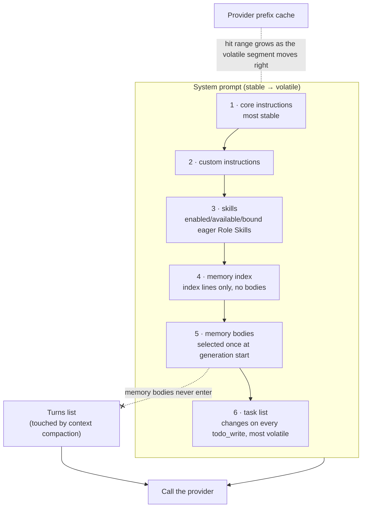
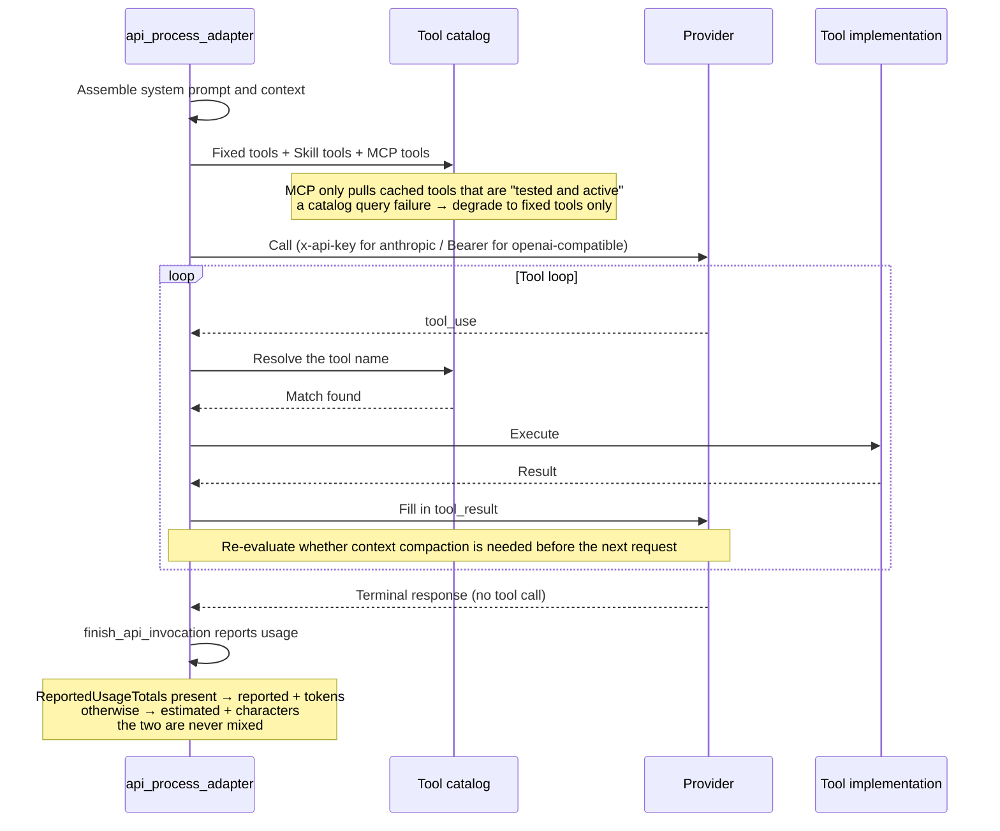

# OnePiece native Agent

OnePiece is VaneHub's built-in first-party Agent. Unlike CLI-backed Agents, it runs entirely through the native API runtime: `launch_kind = api`, `agent_origin = builtin`, reserved stable id `onepiece`. It is seeded into the registry on first launch and stays visible even before any provider configuration or credential exists.

## Identity and lifecycle

The OnePiece identity is owned by the registry, not by provider configuration. It is separated from multiple named catalog-backed upstream-provider **Profiles**, each securing its own credentials independently. At most one Profile is explicitly active for runtime generation at a time. Profile creation must select a reviewed endpoint type owned by the chosen provider — arbitrary provider identity, interface format, or Base URL are not accepted from the user.

## The provider catalog and Profile lifecycle

OnePiece's provider catalog is a single source of truth — the frontend JSON `src/config/onepiece-provider-catalog.json` is embedded directly into the binary on the Rust side via `include_str!` (`onepiece_provider_catalog.rs`); a parse failure panics.

- **Catalog structure** — `catalogVersion: 3`, 25 providers. `category` is `official` only for `anthropic` and `openai`; the other 23 (including openrouter, deepseek, zhipu-glm, kimi, siliconflow, and others) are `common`. Each provider entry carries `id`/`displayName`/`defaultModelId`/`fallbackModels`/`apiKeyUrl`/`docsUrl`/`defaultEndpointType`/`endpoints`.
- **Endpoint fields** — `baseUrl`/`interfaceFormat` (`anthropic` | `openai-compatible`)/`authStrategy` (`x-api-key` | `bearer`)/`source`/`modelDiscovery`.
- **Model discovery strategy** — `modelDiscovery.strategy` has four values: `anthropic`, `openai` (the vast majority), `openai-array` (Together AI only), `catalog` (reserved for runtime use). Discovery first injects the catalog's static models (`fallbackModels` + the profile model), then pulls live models per the strategy, filtering out non-chat models (`is_chat_model`, excluding keywords like embedding/embed-/rerank/tts/audio/image), capped at 1000; the live response body is capped at 2MB (`MAX_RESPONSE_BYTES`), and a failed live discovery falls back to the catalog with `warning: "live-unavailable"`.

### The Profile data structure

`OnePieceProviderProfile` fields: `id`/`name`/`sourceProviderId`/`sourceEndpointType`/`sourcePresetVersion`/`provider`/`modelId`/`interfaceFormat`/`baseUrl`/`active`/`credentialPresent`. A Profile's scoped credential key is `onepiece-profile:{profile_id}`. The `onepiece_provider_profiles` table hard-binds `agent_id = 'onepiece'` (a CHECK constraint), and a **partial unique index** `UNIQUE(agent_id) WHERE active=1` guarantees at the database layer that at most one profile is active at any given moment.

### Lifecycle and credential rollback

Creating, activating, and deleting a Profile all carry two-way credential rollback:

- **Saving a catalog profile** — the new id takes the form `onepiece-profile-{uuid}`; an existing profile cannot change its source provider/endpoint; the first profile is auto-activated (`previous.active || existing.is_empty()`); credential value priority is transient key > scoped legacy credential > runtime credential when active; a DB write failure rolls back the scoped credential.
- **Activation** — the target profile must exist; when `authentication_mode != "required"`, activation proceeds directly, and when required with no key present it is refused; the currently active profile's runtime credential is first written back to its scoped key (to avoid losing it), then the target's scoped credential is written to `onepiece`, and a failure rolls back the runtime credential.
- **Deletion** — the scoped credential is deleted; if the profile was active, the `onepiece` credential is also deleted; a DB deletion failure restores both.
- **Reset** — clears the `agents.onepiece` row and deletes the `onepiece` credential **plus every profile's scoped credential**.

### Credential validation (an actual call, once, before saving)

`validate_onepiece_provider_credential` fires one minimal-cost probe before saving: `max_tokens=1` / `max_output_tokens=1`, a body of just "Reply OK.", a 15s timeout, redirects disabled; the probe reads only the HTTP status code, never the response body. HTTP status classification: 2xx → Valid; 401/403 → InvalidCredential; 400/404/405/409/415/422 → ConfigurationRejected; 429 → RateLimited; 5xx → ProviderUnavailable; everything else → Inconclusive. The `discover` and `validate` commands are wrapped in `spawn_blocking` (the underlying HTTP client is blocking).

### Custom Profile validation

`EndpointProfileSnapshot::new()` validates: base_url normalization (trailing slash stripped, `@`/whitespace/control characters disallowed); **only `openai-compatible` is accepted**; timeout range `100..=120_000`ms; a Local endpoint must be loopback (`localhost|127.0.0.1|[::1]`); runtime kind and privacy must match; Required must carry a credential, None must not; context capacity `1_024..=10_000_000`. The error enum is `ProviderProfileError`.

## The OnePiece runtime call flow

OnePiece is the only Agent that calls a provider directly over HTTP inside the application, without going through an external CLI. One complete generation proceeds through these stages in `api_process_adapter.rs`: assemble the system prompt and context → call the provider → process streamed output → the tool-use loop → completion.

### Context assembly and the system prompt

The system prompt is assembled in **stable-first, volatile-last** order to take advantage of the provider's prefix cache — a volatile segment placed later doesn't invalidate the stable prefix ahead of it.

**Both design constraints are hidden in the ordering**: the task list sits last because it changes on every `todo_write`, and placing it earlier would invalidate the entire prefix ahead of it; memory bodies are selected once at generation start rather than reselected on every tool round-trip, for the same reason — keeping the system prompt from changing every round. And memory bodies **only ever enter the system prompt, never the turns list**, so that context compaction can never touch them.

`resolve_system_prompt_with_settings` assembles, in order:

1. **core instructions** — the core instructions (most stable).
2. **custom instructions** — the user's personalization instructions.
3. **skills** — instructions for enabled, available, bound eager Role Skills (see below).
4. **memory index** — index lines for cross-session memory (each line formatted like `- [type] [name] - description`, where name is the memory pointer), without bodies.
5. **memory bodies** — bodies injected after a relevance selection (see below); degrades to index-only on failure.
6. **task list** — the current session's task list (most volatile, changing on every `todo_write`, hence placed last).

Memory injection bounds are governed by `ONEPIECE_MEMORY_INDEX_BOUNDS` (lines:200, bytes:12000) and `CLI_MEMORY_INDEX_BOUNDS` (lines:40, bytes:3000). **Memory bodies only ever enter the system prompt, never the turns list** — otherwise compaction would touch memory content; bodies are also selected only once at generation start (not on every tool round-trip), to avoid the system prompt changing every round and defeating the prefix cache.

`ContextBudget` (`context_engine.rs`) allocates the context budget: `total` minus `reserved_system`/`reserved_task`/`reserved_recent_turns`/`reserve` yields `evidence_budget`; different sources are rate-limited proportionally (Memory = 1/4, WorkspaceChange = 1/5).

### Goals / the task list

OnePiece carries lightweight goal tracking through the **task list**. The task list is session-scoped, updates on every `todo_write`, and is injected as the last segment of the system prompt (most volatile). The task list and [Loop Engineering](loop-and-plan-runtime.md) are two different mechanisms: the task list is a lightweight in-session to-do, while Loop is goal-driven iteration across many rounds.

### Using Skills

OnePiece consumes the Skill system through `AgentSkillPort` — the same system is **managed uniformly** with CLI Agents (see [Skill management](skill-management.md) and [Effective Skill runtime](effective-skill-runtime.md)). How Skills act on OnePiece:

- **Eager Role Skills** — injected directly into OnePiece's system prompt (segment 3 in the assembly order above) when enabled, available, bound, and within the prompt budget.
- **On-demand Role Skills** — discovered and loaded through three fixed read-only tools: `list_skills`, `load_skill` (loads by canonical id or alias, returning at most 12,000 characters plus a resource index), `read_skill_resource` (reads by logical URI, such as `skill://code-review/references/checklist.md`).
- **Resources are addressed with logical identifiers**; the model never receives a host path. A winner change makes the previous `load_skill` revision stale.
- **The effective view comes from overlay governance** — once the base package is selected, Overlays (System/User/Project) are replayed in order to produce the final effective instructions; OnePiece always consumes this governed snapshot.

### Using MCP

OnePiece's tool catalog layers MCP tools on top of the fixed native tools — sharing the same MCP configuration and relay architecture as CLI Agents (see [MCP tools and clients](mcp-tools.md)). For an MCP server visible to and active in the current session's workspace, the tools cached from its most recent "Test Connection" become bounded entries in OnePiece's tool catalog. A server that's untested, failed testing, inactive, or out of scope contributes no tools; a catalog query failure degrades gracefully to fixed tools only. MCP tool names never collide with the fixed `shell`/`file`/`remember` tools.

### Calling the LLM and the tool loop

OnePiece calls the provider according to the active Profile's resolved `interface_format`:

- **`anthropic`** — the Anthropic Messages API, authenticated with `x-api-key` + `anthropic-version`.
- **`openai-compatible`** — the OpenAI Chat Completions or Responses API, authenticated with `Bearer`.

The tool loop runs across multiple rounds: the model returns `tool_use` → the runtime resolves the tool name and looks it up in the catalog (fixed tools / Skill tools / MCP tools) → executes it → fills in `tool_result` → the model continues, until it returns a terminal response with no tool call. `finish_api_invocation` reports usage on completion (writes `reported`+`tokens` when `ReportedUsageTotals` is present, otherwise `estimated`+`characters` — the two are never mixed). OnePiece's tool calls carry native fidelity and can be expanded layer by layer in the execution trace — this is its observability advantage over an external CLI, which is a black box.

## Where the design lives

This chapter orients contributors. The authoritative requirements — stable identity, registry seeding, reserved-id collision handling, the Profile lifecycle, and the provider-directory contract — live in the spec.

- [openspec/specs/onepiece-native-agent](../../../openspec/specs/onepiece-native-agent/spec.md)

The provider directory shared with CLI Agent configuration and the native API runtime are covered in [Runtime and service boundaries](runtime-boundaries.md) and [Native bounded contexts](native-contexts.md).
